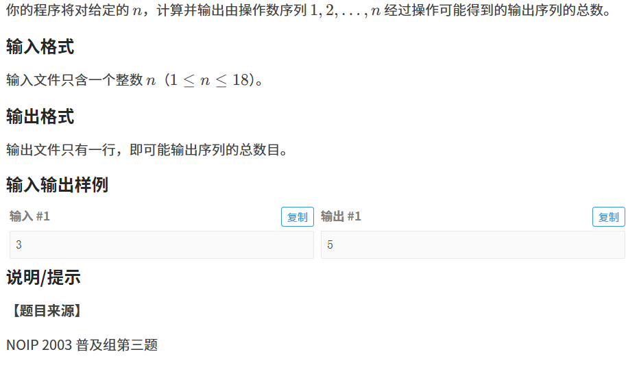
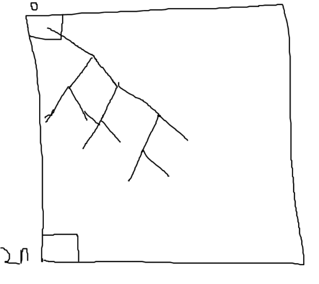

# 洛谷p1030，求先序排列，DFS

这题是一个dfs经典题型

```c++
#include<iostream>
#include<cstring>
using namespace std;

char a[10];
char b[10];

int find(char u){
	for(int i = 0; i < 10; i++){
		if(a[i] == u)return i;
	}
}

void dfs(int l1, int r1, int l2, int r2){
	int u = find(b[r2]);
	cout << b[r2];
	if(u > l1)dfs(l1, u - 1, l2, u - l1 + l2 - 1);//确定两个数组的左右边界
	if(u < r1)dfs(u + 1, r1, u - l1 + l2, r2 - 1);
}

int main(){
	cin >> a;
	cin >> b;
	int lenth = strlen(a);
	dfs(0, lenth - 1, 0, lenth - 1);
}
```

# 洛谷p1036，选数，DFS

```c++
#include<iostream>
#include<unordered_map>
#include<cmath>
using namespace std;

int n, k;
int a[30];
bool st[30];
int ans;
unordered_map<long long, int> map;

bool check2(){
	long long sum = 0;
	for(int i = 0; i < n; i++){
		if(st[i])sum += (i + 1) * pow(7, i);//这里哈希一下
	}
	if(!map.count(sum)){
		map[sum] = 1;
		return true;
	}
	return false;
}

bool check1(int u){
	for(int i = 2; i < u; i++){
		if(u % i == 0)return false;
	}
	return true;
}

void dfs(int step, int sum, int p){
	if(step >= k){
		if(check2() && check1(sum)){
			ans++;
		}
		return ;
	}
	for(int i = p; i < n; i++){//p是用来减少搜索的
		if(st[i])continue;
		st[i] = true;
		dfs(step + 1, sum + a[i], i);
		st[i] = false;
	}
}

int main()
{
	cin >> n >> k;
	for(int i = 0; i < n; i++){
		cin >> a[i];
	}
	dfs(0, 0, 0);
	cout << ans;
	return 0;
}
```

# p1294，高手去散步，DFS，回溯

```c++
#include<iostream>
#include<algorithm>
#include<cstring>
using namespace std;
const int N = 2010;
long long ans;
int n, m;
bool st[30];

int h[N], e[N], ne[N], d[N], idx;
void add(int a, int b, int w){
	e[idx] = b, ne[idx] = h[a], d[idx] = w, h[a] = idx++;
}

void dfs(int u, long long sum){
	st[u] = true;
	for(int i = h[u]; i != -1; i = ne[i]){
		int j = e[i];
		if(st[j])continue;
		dfs(j, sum + d[i]);
	}
	ans = max(ans, sum);
	st[u] = false;//这里一定要回溯，不然就算回去了标记也还在
}

int main()
{
	memset(h, -1, sizeof h);
	cin >> n >> m;
	for(int i = 0 ;i < m; i++){
		int a, b, c;
		cin >> a >> b >> c;
		add(a, b, c);
		add(b, a, c);
	}
	for(int i = 1; i <= n; i++){
		dfs(i, 0);
	}
	cout << ans;
	return 0;
}
```

# 完全二叉树的层序遍历


直接用后续遍历的方式读取a数组，并储存在b数组里

```c++
#include<iostream>
using namespace std;
const int N = 1e5 + 10;
int n, m;
int a[N], b[N], idx = 1;

void dfs(int u){
	if(u <= n){
		dfs(u * 2);
		dfs(u * 2 + 1);
		b[u] = a[idx++];
	}
}

int main()
{
	cin >> n;
	for(int i = 1; i <= n; i++)cin >> a[i];
	dfs(1);
	for(int i = 1; i <= n; i++){
		if(i != 1)cout << ' ';
		cout << b[i];
	}	
	return 0;
}
```

# P1044 栈（记忆化DFS  or  DP）



```c++
#include<iostream>
using namespace std;

int n;

int dfs(int k, int m)
{
    int sum = 0;
    if(k == 2 * n){
        if(m == 1)return 1;
        return 0;
    }
    if(m > 0)sum += dfs(k + 1, m - 1);
    if(m < n)sum += dfs(k + 1, m + 1);
    return sum;
}

int main()
{
    cin >> n;
    cout << dfs(1, 0);
    return 0;
}
```

上面这个做法会超时，但是加上**记忆化搜索**就不会了

```c++
#include<iostream>
using namespace std;

int n;
int f[100][100];

int dfs(int k, int m)
{
	int sum = 0;
	if(k == 2 * n){
		if(m == 1)return 1;
		return 0;
	}
	if(f[k][m] != 0)return f[k][m];
	
	if(m > 0)sum += dfs(k + 1, m - 1);
	if(m < n)sum += dfs(k + 1, m + 1);
	
	f[k][m] = sum;
	return sum;
}

int main()
{
	cin >> n;
	cout << dfs(1, 0);	
	return 0;
}
```

**下面这个做法是DP**：

**$dp[i][j]$**表示的状态是 第 i 次操作后，栈里含存储 j 个数，的可能的个数（就是说有几条路径能走到这个状态）

如果有 n 个数就会有 ，n 次入栈，n 次出栈，总操作次数是 2 * n

**总结：相当于从$dp[0][0]$走到$dp[2 * n][0]$的路径的总数，每次走有两个选择      1.向下向左       2.向下向右**



```c++
#include<iostream>
using namespace std;

int dp[40][20];

int main()
{
	int n;
	cin >> n;
	dp[0][0] = 1;//路径起点
	for(int i = 1; i <= 2 * n; i++){
		for(int j = 0; j <= n; j++){
			if(j == 0)dp[i][j] = dp[i - 1][j + 1];//特判
			else if(j == n)dp[i][j] = dp[i - 1][j - 1];//特判
			else dp[i][j] = dp[i - 1][j + 1] + dp[i - 1][j - 1];//可能是前一个状态出栈后变成现在这个状态，也可能是前一个状态入栈后变成现在这个状态
		}
	}
	cout << dp[2 * n][0];//当栈为空时，所有数均出栈
	return 0;
}
```


# P1049 装箱问题（DP  or  DFS）

**DFS解法：**

```c++
#include<iostream>
#include<algorithm>
using namespace std;

int w[50];
int v, n;
int ans = 0x3f3f3f3f;

void dfs(int u, int m)
{
	if(u > n){
		ans = min(ans, m);
		return ;
	}
	if(m >= w[u])dfs(u + 1, m - w[u]);
	dfs(u + 1, m);	
}

int main()
{
	cin >> v >> n;
	for(int i = 1; i <= n; i++)cin >> w[i];
	dfs(1, v);
	cout << ans;
	return 0;
}
```

**DP解法：**将体积看成价值，就变成了体积和价值一样的物品，就变成了求解在一定体积下可以装的最大价值，就是01背包

```c++
#include<iostream>
using namespace std;

int v, n;
int dp[20010];

int main()
{
	cin >> v >> n;
	for(int i = 1; i <= n; i++){
		int x;
		cin >> x;
		for(int j = v; j >= x; j--)dp[j] = max(dp[j], dp[j - x] + x);
	}
	cout << v - dp[v];
	return 0;
}
```

**模拟退火算法（偶然看到）：**


# P1060 开心的金明（DP）

```c++
#include<iostream>
#include<algorithm>
using namespace std;

int n, m;
int dp[30010];

int main()
{
	cin >> n >> m;
	for(int i = 1; i <= m; i++){
		int x, y;
		cin >> x >> y;
		for(int j = n; j >= x; j--){
			dp[j] = max(dp[j], dp[j - x] + x * y);
		}
	}
	cout << dp[n];
	return 0;
}
```

# P1077 摆花（DFS+记忆化搜索  or  DP）

**DFS+记忆化搜索：**

```c++
#include<iostream>
#include<algorithm>
using namespace std;

long long res[110][110][110];
int a[110];

int n, m;
int dfs(int u, int w, int cnt)
{
	int sum = 0;
	if(w == 0){
		if(u <= n){
			return 1;
		}
		return 0;
	}
	if(res[u][w][cnt] != 0)return res[u][w][cnt];
	if(cnt < a[u])sum += dfs(u, w - 1, cnt + 1) % (int)(1e6 + 7);//这里一定要记得取模，不然要爆int
	if(u < n)sum += dfs(u + 1, w, 0) % (int)(1e6 + 7);
	res[u][w][cnt] = sum;
	return sum;
}

int main()
{
	cin >> n >> m;
	for(int i = 1; i <= n; i++)cin >> a[i];
	cout << dfs(1, m, 0) % (int)(1e6 + 7);
	return 0;
}
```

**DP：**设定状态**dp[i]\[j]**为前 i 种花，一共摆了 j 盆；

```c++
#include<iostream>
#include<algorithm>
using namespace std;
const int mod = 1e6 + 7;

int dp[110][110];

int main()
{
	int n, m;
	cin >> n >> m;
	dp[0][0] = 1;
	for(int i = 1; i <= n; i++){
		int x;
		cin >> x;
		for(int k = 0; k <= m; k++){
			for(int j = 0; j <= min(k, x); j++){
				dp[i][k] = (dp[i][k] + dp[i - 1][k - j]) % mod;
			}
		}
	}
	cout << dp[n][m];
	return 0;
}
```

# 蓝桥，砝码称重（DP）

```c++
#include<iostream>
#include<algorithm>
#include<cmath>
using namespace std;
const int N = 200010;

int dp[110][N];//状态为前i个物品是否能凑出j的重量

int main()
{
	int n;
	cin >> n;
	dp[0][0] = 1;
	for(int i = 1; i <= n; i++){
		int x;
		cin >> x;
		for(int j = N / 2; j >= 0; j--){
			dp[i][j] = dp[i - 1][j] || dp[i - 1][abs(j - x)] || dp[i - 1][j + x];//状态转移方程
		}
	}
	int ans;
	for(int i = 1; i <= N / 2; i++){
		if(dp[n][i])ans++;
	}
	cout << ans;
	return 0;
}
```

# B3637最长上升子序列（DP）

dp[i]表示的状态为以第 i 个数结尾的的最长上升子序列

```c++
#include<iostream>
using namespace std;

int dp[5010];
int a[5010];

int main()
{
	int n;
	cin >> n;
	int ans = 0;
	for(int i = 1; i <= n; i++){
		cin >> a[i];
		dp[i] = 1;
		for(int j = 1; j < i; j++){
			if(a[i] > a[j])dp[i] = max(dp[i], dp[j] + 1);//求出最大的dp[i]
		}
		ans = max(ans, dp[i]);//更新答案
	}
	cout << ans;
	return 0;
}
```

# P1020 导弹拦截（DP）（贪心）

```c++
#include<iostream>
#include<vector>
#include<algorithm>
using namespace std;

int a[100010];
int dp[100010];
char str[600010];
int n;

int main()
{
    //文件结束符结尾，scanf 会返回-1，-1 取反就是 0
	while(~scanf("%d",&a[++n]));--n;
    
//如果一行是'\n'结尾，就用下面这个
//	fgets(str, 600009, stdin);
//	int sum = 0;
//	for(int i = 0; str[i] != '\n'; i++){
//		if(str[i] == ' ')a[++n] = sum, sum = 0;
//		else sum = sum * 10 + str[i] - '0';
//	}
//	a[++n] = sum;
    
    
	//DP加二分，求 最长单调不增子序列，和求 最长单调递增子序列Ⅱ 是一样的做法
	dp[0] = 0x3f3f3f3f;
	int len = 0;
	for(int i = 1; i <= n; i++){
		int l = 0, r = len;
		int ans = 0;
		while(l <= r){
			int mid = l + r >> 1;
			if(dp[mid] >= a[i]){
				ans = mid;
				l = mid + 1;
			}
			else r = mid - 1;
		}
		len = max(len, ans + 1);
		dp[ans + 1] = a[i];
	}
	cout << len << endl;
	
	//这里是贪心，每次循环看res里有无数是大于a[i]，若有将大于等于a[i]的res中最小的res[cnt] = a[i];
    //若res里没有大于a[i]的，就res.push_back(a[i]);
    //总结：每个子序列也是单调不增
	vector<int> res;
	for(int i = 1; i <= n; i++){
		int cnt = -1;
		int check = 1;
		for(int j = 0; j < res.size(); j++){
			if(res[j] >= a[i]){
				check = 0;
				if(cnt == -1 || res[j] < res[cnt])cnt = j;
			}
		}
		if(check)res.push_back(a[i]);
		else res[cnt] = a[i];
	}
	cout << res.size();
	return 0;
}
```

这里还有个 **$Dilworth定理$** ：将一个序列剖成若干个单调不升子序列的最小个数等于该序列最长上升子序列的个数）

**SO**， 第二问的贪心还可以转变为求**最长上升子序列**：

```c++
	memset(dp, 0, sizeof dp);
	len = 0;
	for(int i = 1; i <= n; i++){
		int l = 0, r = len;
		int ans = 0;
		while(l <= r){
			int mid = l + r >> 1;
			if(dp[mid] < a[i]){
				ans = mid;
				l = mid + 1;
			}
			else r = mid - 1;
		}
		len = max(len, ans + 1);
		dp[ans + 1] = a[i];
	}
	cout << len;
```

# 蓝桥2024省赛B组6题数字接龙（DFS）

```c++
#include<iostream>
#include<cstring>
using namespace std;

int n, k;

int arr[10][10];
bool st[10][10];
int ans[110];
int list[110];

int dx[8] = {-1, -1, 0, 1, 1, 1, 0, -1};
int dy[8] = {0, 1, 1, 1, 0, -1, -1, -1};

bool check(){
	for(int i = 0; i < n * n - 1; i++){
		if(ans[i] > list[i])return true;
		else if(ans[i] < list[i])return false;
	}
	return false;
}

void dfs(int x, int y, int cnt){
//	cout << x << ' ' << y << ' ' << sum << ' ' << cnt << endl;
	if(x < 0 || y < 0 || x >= n || y >= n)return ;
	if(st[x][y] == true)return ;
	if(x == n - 1 && y == n - 1 && cnt == n * n - 1){
		//cout << "djskl;aas";
		if(check()){
			for(int i = 0; i < n * n - 1; i++)ans[i] = list[i];
		}
		return ;
	}
	if(cnt >= n * n - 1)return ;
	st[x][y] = true;
	for(int i = 0; i < 8; i++){
		if(i == 1 || i == 3 || i == 5 || i == 7){
			if(!st[x + dx[i]][y] || !st[x][y + dy[i]]){
				if((arr[x][y] == k - 1 && arr[x + dx[i]][y + dy[i]] == 0) || arr[x + dx[i]][y + dy[i]] - 1 == arr[x][y]){//这里代码有错误，记得修改
					list[cnt] = i;
					dfs(x + dx[i], y + dy[i], cnt + 1);
				}
			}
		}
		else {
			if((arr[x][y] == k - 1 && arr[x + dx[i]][y + dy[i]] == 0) || arr[x + dx[i]][y + dy[i]] - 1 == arr[x][y]){
				list[cnt] = i;
				dfs(x + dx[i], y + dy[i], cnt + 1);
			}
		}
	}
	st[x][y] = false;
}

int main()
{
	memset(ans, 0x3f, sizeof ans);
	cin >> n >> k;
	for(int i = 0; i < n; i++){
		for(int j = 0; j < n; j++){
			cin >> arr[i][j];
		}
	}
	dfs(0, 0, 0);
	if(ans[0] == 0x3f3f3f3f)cout << -1;
	else for(int i = 0; i < n * n - 1; i++)cout << ans[i];
	return 0;
}
```

