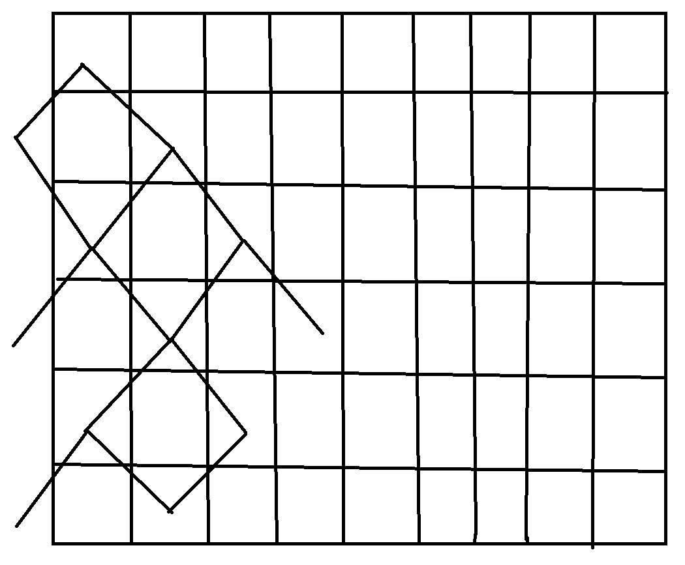
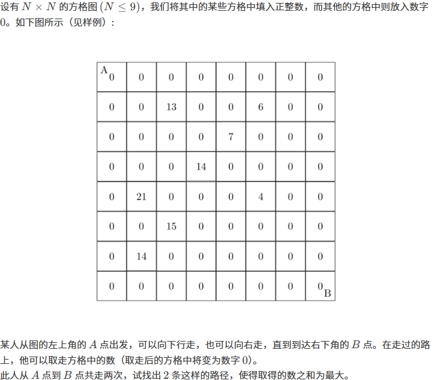
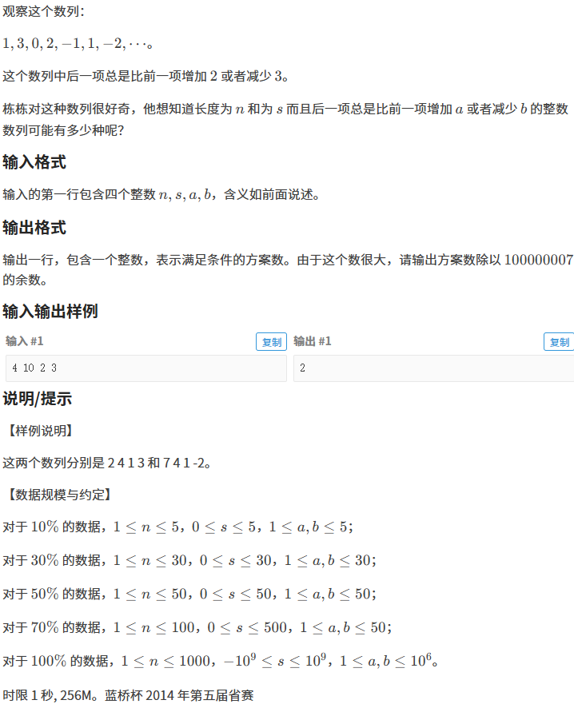

# 洛谷p1030，求先序排列，DFS

这题是一个dfs经典题型

```c++
#include<iostream>
#include<cstring>
using namespace std;

char a[10];
char b[10];

int find(char u){
	for(int i = 0; i < 10; i++){
		if(a[i] == u)return i;
	}
}

void dfs(int l1, int r1, int l2, int r2){
	int u = find(b[r2]);
	cout << b[r2];
	if(u > l1)dfs(l1, u - 1, l2, u - l1 + l2 - 1);//确定两个数组的左右边界
	if(u < r1)dfs(u + 1, r1, u - l1 + l2, r2 - 1);
}

int main(){
	cin >> a;
	cin >> b;
	int lenth = strlen(a);
	dfs(0, lenth - 1, 0, lenth - 1);
}
```

# 洛谷p1036，选数，DFS

```c++
#include<iostream>
#include<unordered_map>
#include<cmath>
using namespace std;

int n, k;
int a[30];
bool st[30];
int ans;
unordered_map<long long, int> map;

bool check2(){
	long long sum = 0;
	for(int i = 0; i < n; i++){
		if(st[i])sum += (i + 1) * pow(7, i);//这里哈希一下
	}
	if(!map.count(sum)){
		map[sum] = 1;
		return true;
	}
	return false;
}

bool check1(int u){
	for(int i = 2; i < u; i++){
		if(u % i == 0)return false;
	}
	return true;
}

void dfs(int step, int sum, int p){
	if(step >= k){
		if(check2() && check1(sum)){
			ans++;
		}
		return ;
	}
	for(int i = p; i < n; i++){//p是用来减少搜索的
		if(st[i])continue;
		st[i] = true;
		dfs(step + 1, sum + a[i], i);
		st[i] = false;
	}
}

int main()
{
	cin >> n >> k;
	for(int i = 0; i < n; i++){
		cin >> a[i];
	}
	dfs(0, 0, 0);
	cout << ans;
	return 0;
}
```

# p1294，高手去散步，DFS，回溯

```c++
#include<iostream>
#include<algorithm>
#include<cstring>
using namespace std;
const int N = 2010;
long long ans;
int n, m;
bool st[30];

int h[N], e[N], ne[N], d[N], idx;
void add(int a, int b, int w){
	e[idx] = b, ne[idx] = h[a], d[idx] = w, h[a] = idx++;
}

void dfs(int u, long long sum){
	st[u] = true;
	for(int i = h[u]; i != -1; i = ne[i]){
		int j = e[i];
		if(st[j])continue;
		dfs(j, sum + d[i]);
	}
	ans = max(ans, sum);
	st[u] = false;//这里一定要回溯，不然就算回去了标记也还在
}

int main()
{
	memset(h, -1, sizeof h);
	cin >> n >> m;
	for(int i = 0 ;i < m; i++){
		int a, b, c;
		cin >> a >> b >> c;
		add(a, b, c);
		add(b, a, c);
	}
	for(int i = 1; i <= n; i++){
		dfs(i, 0);
	}
	cout << ans;
	return 0;
}
```

# 完全二叉树的层序遍历


直接用后续遍历的方式读取a数组，并储存在b数组里

```c++
#include<iostream>
using namespace std;
const int N = 1e5 + 10;
int n, m;
int a[N], b[N], idx = 1;

void dfs(int u){
	if(u <= n){
		dfs(u * 2);
		dfs(u * 2 + 1);
		b[u] = a[idx++];
	}
}

int main()
{
	cin >> n;
	for(int i = 1; i <= n; i++)cin >> a[i];
	dfs(1);
	for(int i = 1; i <= n; i++){
		if(i != 1)cout << ' ';
		cout << b[i];
	}	
	return 0;
}
```

# P1044 栈（记忆化DFS  or  DP）


```c++
#include<iostream>
using namespace std;

int n;

int dfs(int k, int m)
{
    int sum = 0;
    if(k == 2 * n){
        if(m == 1)return 1;
        return 0;
    }
    if(m > 0)sum += dfs(k + 1, m - 1);
    if(m < n)sum += dfs(k + 1, m + 1);
    return sum;
}

int main()
{
    cin >> n;
    cout << dfs(1, 0);
    return 0;
}
```

上面这个做法会超时，但是加上**记忆化搜索**就不会了

```c++
#include<iostream>
using namespace std;

int n;
int f[100][100];

int dfs(int k, int m)
{
	int sum = 0;
	if(k == 2 * n){
		if(m == 1)return 1;
		return 0;
	}
	if(f[k][m] != 0)return f[k][m];
	
	if(m > 0)sum += dfs(k + 1, m - 1);
	if(m < n)sum += dfs(k + 1, m + 1);
	
	f[k][m] = sum;
	return sum;
}

int main()
{
	cin >> n;
	cout << dfs(1, 0);	
	return 0;
}
```

**下面这个做法是DP**：

**$dp[i][j]$**表示的状态是 第 i 次操作后，栈里含存储 j 个数，的可能的个数（就是说有几条路径能走到这个状态）

如果有 n 个数就会有 ，n 次入栈，n 次出栈，总操作次数是 2 * n

**总结：相当于从$dp[0][0]$走到$dp[2 * n][0]$的路径的总数，每次走有两个选择      1.向下向左       2.向下向右**


```c++
#include<iostream>
using namespace std;

int dp[40][20];

int main()
{
	int n;
	cin >> n;
	dp[0][0] = 1;//路径起点
	for(int i = 1; i <= 2 * n; i++){
		for(int j = 0; j <= n; j++){
			if(j == 0)dp[i][j] = dp[i - 1][j + 1];//特判
			else if(j == n)dp[i][j] = dp[i - 1][j - 1];//特判
			else dp[i][j] = dp[i - 1][j + 1] + dp[i - 1][j - 1];//可能是前一个状态出栈后变成现在这个状态，也可能是前一个状态入栈后变成现在这个状态
		}
	}
	cout << dp[2 * n][0];//当栈为空时，所有数均出栈
	return 0;
}
```


# P1049 装箱问题（DP  or  DFS）

**DFS解法：**

```c++
#include<iostream>
#include<algorithm>
using namespace std;

int w[50];
int v, n;
int ans = 0x3f3f3f3f;

void dfs(int u, int m)
{
	if(u > n){
		ans = min(ans, m);
		return ;
	}
	if(m >= w[u])dfs(u + 1, m - w[u]);
	dfs(u + 1, m);	
}

int main()
{
	cin >> v >> n;
	for(int i = 1; i <= n; i++)cin >> w[i];
	dfs(1, v);
	cout << ans;
	return 0;
}
```

**DP解法：**将体积看成价值，就变成了体积和价值一样的物品，就变成了求解在一定体积下可以装的最大价值，就是01背包

```c++
#include<iostream>
using namespace std;

int v, n;
int dp[20010];

int main()
{
	cin >> v >> n;
	for(int i = 1; i <= n; i++){
		int x;
		cin >> x;
		for(int j = v; j >= x; j--)dp[j] = max(dp[j], dp[j - x] + x);
	}
	cout << v - dp[v];
	return 0;
}
```

**模拟退火算法（偶然看到）：**


# P1060 开心的金明（DP）

```c++
#include<iostream>
#include<algorithm>
using namespace std;

int n, m;
int dp[30010];

int main()
{
	cin >> n >> m;
	for(int i = 1; i <= m; i++){
		int x, y;
		cin >> x >> y;
		for(int j = n; j >= x; j--){
			dp[j] = max(dp[j], dp[j - x] + x * y);
		}
	}
	cout << dp[n];
	return 0;
}
```

# P1077 摆花（DFS+记忆化搜索  or  DP）

**DFS+记忆化搜索：**

```c++
#include<iostream>
#include<algorithm>
using namespace std;

long long res[110][110][110];
int a[110];

int n, m;
int dfs(int u, int w, int cnt)
{
	int sum = 0;
	if(w == 0){
		if(u <= n){
			return 1;
		}
		return 0;
	}
	if(res[u][w][cnt] != 0)return res[u][w][cnt];
	if(cnt < a[u])sum += dfs(u, w - 1, cnt + 1) % (int)(1e6 + 7);//这里一定要记得取模，不然要爆int
	if(u < n)sum += dfs(u + 1, w, 0) % (int)(1e6 + 7);
	res[u][w][cnt] = sum;
	return sum;
}

int main()
{
	cin >> n >> m;
	for(int i = 1; i <= n; i++)cin >> a[i];
	cout << dfs(1, m, 0) % (int)(1e6 + 7);
	return 0;
}
```

**DP：**设定状态**dp[i]\[j]**为前 i 种花，一共摆了 j 盆；

```c++
#include<iostream>
#include<algorithm>
using namespace std;
const int mod = 1e6 + 7;

int dp[110][110];

int main()
{
	int n, m;
	cin >> n >> m;
	dp[0][0] = 1;
	for(int i = 1; i <= n; i++){
		int x;
		cin >> x;
		for(int k = 0; k <= m; k++){
			for(int j = 0; j <= min(k, x); j++){
				dp[i][k] = (dp[i][k] + dp[i - 1][k - j]) % mod;
			}
		}
	}
	cout << dp[n][m];
	return 0;
}
```

# 蓝桥，砝码称重（DP）

```c++
#include<iostream>
#include<algorithm>
#include<cmath>
using namespace std;
const int N = 200010;

int dp[110][N];//状态为前i个物品是否能凑出j的重量

int main()
{
	int n;
	cin >> n;
	dp[0][0] = 1;
	for(int i = 1; i <= n; i++){
		int x;
		cin >> x;
		for(int j = N / 2; j >= 0; j--){
			dp[i][j] = dp[i - 1][j] || dp[i - 1][abs(j - x)] || dp[i - 1][j + x];//状态转移方程
		}
	}
	int ans;
	for(int i = 1; i <= N / 2; i++){
		if(dp[n][i])ans++;
	}
	cout << ans;
	return 0;
}
```

# B3637最长上升子序列（DP）

dp[i]表示的状态为以第 i 个数结尾的的最长上升子序列

```c++
#include<iostream>
using namespace std;

int dp[5010];
int a[5010];

int main()
{
	int n;
	cin >> n;
	int ans = 0;
	for(int i = 1; i <= n; i++){
		cin >> a[i];
		dp[i] = 1;
		for(int j = 1; j < i; j++){
			if(a[i] > a[j])dp[i] = max(dp[i], dp[j] + 1);//求出最大的dp[i]
		}
		ans = max(ans, dp[i]);//更新答案
	}
	cout << ans;
	return 0;
}
```

# P1020 导弹拦截（DP）（贪心）

```c++
#include<iostream>
#include<vector>
#include<algorithm>
using namespace std;

int a[100010];
int dp[100010];
char str[600010];
int n;

int main()
{
    //文件结束符结尾，scanf 会返回-1，-1 取反就是 0
	while(~scanf("%d",&a[++n]));--n;
    
//如果一行是'\n'结尾，就用下面这个
//	fgets(str, 600009, stdin);
//	int sum = 0;
//	for(int i = 0; str[i] != '\n'; i++){
//		if(str[i] == ' ')a[++n] = sum, sum = 0;
//		else sum = sum * 10 + str[i] - '0';
//	}
//	a[++n] = sum;
    
    
	//DP加二分，求 最长单调不增子序列，和求 最长单调递增子序列Ⅱ 是一样的做法
	dp[0] = 0x3f3f3f3f;
	int len = 0;
	for(int i = 1; i <= n; i++){
		int l = 0, r = len;
		int ans = 0;
		while(l <= r){
			int mid = l + r >> 1;
			if(dp[mid] >= a[i]){
				ans = mid;
				l = mid + 1;
			}
			else r = mid - 1;
		}
		len = max(len, ans + 1);
		dp[ans + 1] = a[i];
	}
	cout << len << endl;
	
	//这里是贪心，每次循环看res里有无数是大于a[i]，若有将大于等于a[i]的res中最小的res[cnt] = a[i];
    //若res里没有大于a[i]的，就res.push_back(a[i]);
    //总结：每个子序列也是单调不增
	vector<int> res;
	for(int i = 1; i <= n; i++){
		int cnt = -1;
		int check = 1;
		for(int j = 0; j < res.size(); j++){
			if(res[j] >= a[i]){
				check = 0;
				if(cnt == -1 || res[j] < res[cnt])cnt = j;
			}
		}
		if(check)res.push_back(a[i]);
		else res[cnt] = a[i];
	}
	cout << res.size();
	return 0;
}
```

这里还有个 **$Dilworth定理$** ：将一个序列剖成若干个单调不升子序列的最小个数等于该序列最长上升子序列的个数）

**SO**， 第二问的贪心还可以转变为求**最长上升子序列**：

```c++
	memset(dp, 0, sizeof dp);
	len = 0;
	for(int i = 1; i <= n; i++){
		int l = 0, r = len;
		int ans = 0;
		while(l <= r){
			int mid = l + r >> 1;
			if(dp[mid] < a[i]){
				ans = mid;
				l = mid + 1;
			}
			else r = mid - 1;
		}
		len = max(len, ans + 1);
		dp[ans + 1] = a[i];
	}
	cout << len;
```

# 蓝桥2024省赛B组6题数字接龙（DFS）

```c++
#include<iostream>
#include<cstring>
#include<vector>
using namespace std;

typedef pair<int, int> PII;
typedef pair<PII, PII> PPP;
vector<PPP> res;

int n, k;

int arr[10][10];
bool st[10][10];
int ans[110];
int list[110];

int dx[8] = {-1, -1, 0, 1, 1, 1, 0, -1};
int dy[8] = {0, 1, 1, 1, 0, -1, -1, -1};


bool check(){
	for(int i = 0; i < n * n - 1; i++){
		if(ans[i] > list[i])return true;
		else if(ans[i] < list[i])return false;
	}
	return false;
} 

void dfs(int x, int y, int cnt){
	if(x < 0 || y < 0 || x >= n || y >= n)return ;
	if(st[x][y] == true)return ;
	if(x == n - 1 && y == n - 1 && cnt == n * n - 1){
		if(check()){
			for(int i = 0; i < n * n - 1; i++)ans[i] = list[i];
		}
		return ;
	}
	if(cnt >= n * n - 1)return ;
	st[x][y] = true;
	for(int i = 0; i < 8; i++){
		if(i == 1 || i == 3 || i == 5 || i == 7){
			
			int ppp = 1;
			for(int u = 0; u < res.size(); u++){
				int a1 = res[u].first.first;
				int b1 = res[u].first.second;
				int a2 = res[u].second.first;
				int b2 = res[u].second.second;
				if((a1 == x + dx[i] && b1 == y && a2 == x && b2 == y + dy[i]) || (a2 == x + dx[i] && b2 == y && a1 == x && b1 == y + dy[i]))ppp = 0;
			}
			
			if(ppp){
				if((arr[x][y] == k - 1 && arr[x + dx[i]][y + dy[i]] == 0) || arr[x + dx[i]][y + dy[i]] - 1 == arr[x][y]){//这里代码有错误，记得修改
					res.push_back({{x, y}, {x + dx[i], y + dy[i]}});
					list[cnt] = i;
					dfs(x + dx[i], y + dy[i], cnt + 1);
					res.pop_back();
				}
			}
		}
		else {
			if((arr[x][y] == k - 1 && arr[x + dx[i]][y + dy[i]] == 0) || arr[x + dx[i]][y + dy[i]] - 1 == arr[x][y]){
				list[cnt] = i;
				dfs(x + dx[i], y + dy[i], cnt + 1);
			}
		}
	}
	st[x][y] = false;
}

int main()
{
	memset(ans, 0x3f, sizeof ans);
	cin >> n >> k;
	for(int i = 0; i < n; i++){
		for(int j = 0; j < n; j++){
			cin >> arr[i][j];
		}
	}
	dfs(0, 0, 0);
	if(ans[0] == 0x3f3f3f3f)cout << -1;
	else for(int i = 0; i < n * n - 1; i++)cout << ans[i];
	return 0;
}
```

2025青云杯小霍学姐（堆）

```c++
#include<iostream>
#include<queue>
#include<algorithm>
using namespace std;
typedef pair<int, int> PII;
PII arr[100010];
int main()
{
    int n;
    cin >> n;
    int p = 0;
    for(int i = 0; i < n; i++){
        int a, b;
        cin >> a >> b;
        arr[i] = {b, a};
        p = max(p, b);
    }
    sort(arr, arr + n, greater<PII>());
    
    priority_queue<int> heap;
    int k = 0;
    int sum = 0;
	for(int i = p; i >= 1; i--){
        for(; arr[k].first >= i; k++)heap.push(arr[k].second);
        if(heap.size()){
        	sum += heap.top();
        	heap.pop();
		}
	}
    cout << sum;
    return 0;
}
```

# 牛客周赛 Round 87 D题（DP）

```c++
#include<iostream>
#include<algorithm>
#include<cstring>
using namespace std;

long long a[200010];
long long dp[200010];

int main()
{
    int t;
    cin >> t;
    while(t--){
        int n;
        cin >> n;
        memset(a, 0, sizeof a);
        for(int i = 1; i <= n; i++)cin >> a[i];
        memset(dp, 0, sizeof dp);
        for(int i = 1; i <= n; i++){
            dp[i] = dp[i - 1] + a[i];
            if(i >= 2)dp[i] = max(dp[i], dp[i - 2]);
            if(i >= 3)dp[i] = max(dp[i], dp[i - 3]);
        }
        cout << dp[n] << endl;
    }
    return 0;
}
```

# P1057 传球游戏（记忆化DFS）（DP）

**记忆化DFS**：搞不懂为什么有一个测试点超时

```c++
#include<iostream>
using namespace std;

int n, m;
int st[100][100];

int dfs(int step, int p){
	int sum = 0;
	
	if(p == 0){
		if(step == 1)return 1;
		return 0;
	}
	if(st[step][p] != 0)return st[step][p];
	if(step == 1){
		sum += dfs(step + 1, p - 1);
		sum += dfs(n, p - 1);
	}
	else if(step == n){
		sum += dfs(1, p - 1);
		sum += dfs(step - 1, p - 1);
	}
	else {
		sum += dfs(step + 1, p - 1);
		sum += dfs(step - 1, p - 1);
	}
	st[step][p] = sum;
	return sum;
}

int main()
{
	cin >> n >> m;
	cout << dfs(1, m);
	return 0;
}
```

DP：



换一个角度思考，图论，从$(1, 1)$走到$(m + 1, 1)$一共走了**m**步，每次操作1.向下向左 2.向下向右

```c++
#include<iostream>
using namespace std;

int dp[100][100];

int main()
{
	int n, m;
	cin >> n >> m;
	dp[1][1] = 1;//起点赋值
	for(int i = 2; i <= m + 1; i++){
		for(int j = 1; j <= n; j++){
			if(j == 1){
				dp[i][j] = dp[i - 1][n] + dp[i - 1][j + 1];
			}
			else if(j == n){
				dp[i][j] = dp[i - 1][j - 1] + dp[i - 1][1];
			}
			else {
				dp[i][j] = dp[i - 1][j - 1] + dp[i - 1][j + 1];
			}
		}
	}
	cout << dp[m + 1][1];
	return 0;
}
```

# P1004方格取数（DFS减枝）（DP）



**DFP减枝**：

两个人同时从$(1, 1)$出发，每次走有四种情况，当两个人走到一起时减枝，因为走到一起不会更大

```c++
#include<iostream>
using namespace std;

int n;
int arr[20][20];
int ans;

void dfs(int x1, int y1, int x2, int y2, int sum){
	if(x1 > n || y1 > n || x2 > n || y2 > n)return ;
	if(x1 == n && y1 == n && x2 == n && y2 == n){
		if(sum > ans)ans = sum;
		return ;
	}
	if(x1 == x2 && y1 == y2 && x1 != 1)return ;
	int a, b;
	
	a = arr[x1 + 1][y1];
	arr[x1 + 1][y1] = 0;
	b = arr[x2 + 1][y2];
	arr[x2 + 1][y2] = 0;
	dfs(x1 + 1, y1, x2 + 1, y2, sum + a + b);
	arr[x2 + 1][y2] = b;
	arr[x1 + 1][y1] = a;
	
	a = arr[x1][y1 + 1];
	arr[x1][y1 + 1] = 0;
	b = arr[x2][y2 + 1];
	arr[x2][y2 + 1] = 0;
	dfs(x1, y1 + 1, x2, y2 + 1, sum + a + b);
	arr[x2][y2 + 1] = b;
	arr[x1][y1 + 1] = a;
	
	
	a = arr[x1 + 1][y1];
	arr[x1 + 1][y1] = 0;
	b = arr[x2][y2 + 1];
	arr[x2][y2 + 1] = 0;
	dfs(x1 + 1, y1, x2, y2 + 1, sum + a + b);
	arr[x2][y2 + 1] = b;
	arr[x1 + 1][y1] = a;
	
	
	a = arr[x1][y1 + 1];
	arr[x1][y1 + 1] = 0;
	b = arr[x2 + 1][y2];
	arr[x2 + 1][y2] = 0;
	dfs(x1, y1 + 1, x2 + 1, y2, sum + a + b);
	arr[x2 + 1][y2] = b;
	arr[x1][y1 + 1] = a;
}

int main()
{
	cin >> n;
	int a, b, c;
	do{
		cin >> a >> b >> c;
		arr[a][b] = c;
	}while(a != 0 || b != 0 || c != 0);
	int m = arr[1][1];
	arr[1][1] = 0;
	dfs(1, 1, 1, 1, m);
	cout << ans;
	return 0;
}
```

**四维DP**：

```c++
#include<iostream>
#include<algorithm>
using namespace std;

int dp[20][20][20][20];
int arr[20][20];

int main()
{
	int n;
	cin >> n;
	int a, b, c;
	do{
		cin >> a >> b >> c;
		arr[a][b] = c;
	}while(a != 0 || b != 0 || c != 0);
	for(int i = 1; i <= n; i++){
		for(int j = 1; j <= n; j++){
			for(int p = 1; p <= n; p++){
				for(int q = 1; q <= n; q++){
					int u = max(dp[i - 1][j][p - 1][q], dp[i - 1][j][p][q - 1]);
					int v = max(dp[i][j - 1][p - 1][q], dp[i][j - 1][p][q - 1]);
					dp[i][j][p][q] = max(u, v);
					if(i == p && j == q)continue;//两个路线不能相交
					dp[i][j][p][q] += arr[i][j] + arr[p][q];//因为两个路线都不可能再走过这个点，所以不需要使这个点等于0
				}
			}
		}	
	}
	cout << dp[n][n][n][n] + arr[1][1] + arr[n][n];//加上起点和终点，因为前面不允许相交
	return 0;
}
```

# P8613蓝桥杯 小朋友排队（逆序对）

求每个数前面比他大的和后面比他小的

```c++
#include<iostream>
using namespace std;

typedef pair<int, int> PII;
PII a[100010];
PII b[100010];
long long s[100010];

void merge(int l, int r){
	if(l >= r)return ;
	int mid = l + r >> 1;
	merge(l, mid);
	merge(mid + 1, r);
	int p = l, q = mid + 1;
	int k = l;
	while(p <= mid && q <= r){
		if(a[p].first <= a[q].first){
			s[a[p].second] += q - 1 - mid;
			b[k++] = a[p++]; 
		}
		else {
			s[a[q].second] += mid - p + 1;
			b[k++] = a[q++];
		}
	}
	while(p <= mid){
		s[a[p].second] += q - 1 - mid;
		b[k++] = a[p++]; 
	}
	while(q <= r)b[k++] = a[q++];
	for(int i = l; i <= r; i++){
		a[i] = b[i];
	}
}

int main()
{
	int n;
	cin >> n;
	for(int i = 0; i < n; i++){
		int x;
		cin >> x;
		a[i] = {x, i};
	}
	merge(0, n - 1);
	long long sum = 0;
	for(int i = 0; i < n; i++){ 
		sum += s[i] * (s[i] + 1) / 2;
	}
	cout << sum;
	return 0;
}
```

# P8611 蓝桥杯，蚂蚁感冒

重点，各个蚂蚁的位置大小排序不会发生变化

```c++
#include<iostream>
#include<cmath>
using namespace std;
int main()
{
	int n;
	cin >> n;
	int x;
	cin >> x;
	int l = 0, r = 0;
	for(int i = 1; i < n; i++){
		int y;
		cin >> y;
		if(y > 0 && abs(y) < abs(x))l++;
		if(y < 0 && abs(y) > abs(x))r++;
	}
	if(x > 0 && r > 0)cout << l + r + 1;
	else if(x < 0 && l > 0)cout << l + r + 1;
	else cout << 1;
	return 0;
}
```

# P8612 蓝桥杯， 地宫取宝

$dp[i][j][p][q]$表示的状态是：走到 [i]\[j] 这个格子装了 p 个宝物最大价值的宝物的价值为 q 的方案数

```c++
#include<iostream>
using namespace std;
const long long mod = 1e9 + 7;

int a[100][100];

long long dp[100][100][20][20]; 

int main()
{
	int n, m, k;
	cin >> n >> m >> k;
	for(int i = 1; i <= n; i++){
		for(int j = 1; j <= m; j++){
			cin >> a[i][j];
			a[i][j]++; 
		}
	}
	dp[1][1][0][0] = 1;
	dp[1][1][1][a[1][1]] = 1;
	for(int i = 1; i <= n; i++){
		for(int j = 1; j <= m; j++){
			if(i == 1 && j == 1)continue;
			for(int p = 0; p <= k; p++){
				for(int q = 0; q <= 13; q++){
					long long &val = dp[i][j][p][q];
					val = (val + dp[i - 1][j][p][q]) % mod;
					val = (val + dp[i][j - 1][p][q]) % mod;
					if(p > 0 && q == a[i][j]){
						for(int c = 0; c < q; c++){
							val = (val + dp[i - 1][j][p - 1][c]) % mod;
							val = (val + dp[i][j - 1][p - 1][c]) % mod;
						}
					}
				}
			}
		}
	}
	long long sum = 0;
	for(int i = 0; i <= 13; i++)sum = (sum + dp[n][m][k][i]) % mod;
	cout << sum;
	return 0;
} 
```

# P8614 蓝桥杯 波动数列



n 等于 1000， 适合用DP

**先来个数学推导**：

设$p_i$为 **a** 或者 **-b**

$a_1 + a_2 + a_3 +...+ a_n = s$

$(a_1) + (a_1 + p_1) + (a_1 + p_1 + p_2) +...+ (a_1 + p_1 + p_2 +...+ p_{n - 1}) = s$

$n * a_1 + (n - 1) * p_1 + (n - 2) * p_2 +...+ p_{n - 1} = s$

令$m = (n - 1) * p_1 + (n - 2) * p_2 +...+ p_{n - 1}$

$(n * a_1) \% n + m \% n = s \% n$

所以$m\%n = s\%n$

因为每个 $p_i$ 有两种情况，所以用DP

**上代码**：

```c++
#include<iostream>
using namespace std;
const int MOD = 1e8 + 7;

int dp[1010][1010];
int n, s, a, b;

int mod(int x){
	if(x < 0){
		return (n - (-x) % n) % n; 
	}
	return x % n;
	
}

int main()
{
	cin >> n >> s >> a >> b;
	if(s < 0)s = n - (-s) % n;
	else s %= n; 
	a %= n;
	b %= n;
	dp[0][0] = 1;
	for(int i = 1; i < n; i++){
		for(int j = 0; j < n; j++){
			dp[i][j] = (dp[i - 1][mod(j - i * a)] + dp[i - 1][mod(j + i * b)]) % MOD;
		}	
	}
	int ans = 0;
	for(int i = 0; i < n; i++){
		if((s - i + 100 * n) % n == 0)ans = (ans + dp[n - 1][i]) % MOD;
	}
	cout << ans;
	return 0;
}
```

# P8625 蓝桥杯 生命之树（最大连通分量）

```c++
#include<iostream>
#include<algorithm>
#include<cstring>
using namespace std;
const int N = 200010;

int n;
int a[N];
long long dp[N];
int h[N], e[N], ne[N], idx;

void add(int a, int b){e[idx] = b, ne[idx] = h[a], h[a] = idx++;}


void dfs(int u, int father){
	dp[u] = a[u];
	int t = 0;
	for(int i = h[u]; i != -1; i = ne[i]){
		int j = e[i];
		if(j == father)continue;//如果a[father] < 0那必然不加上a[father]，如果a[father] >= 0,dp[u]也不用加上a[father]，因为dp[father]已经加上a[father]再加上了dp[u]
		dfs(j, u);
		dp[u] += max(dp[j], 0ll);
	}
}

int main()
{
	memset(h, -1, sizeof h);
	cin >> n;
	for(int i = 1; i <= n; i++)cin >> a[i];
	for(int i = 1; i < n; i++){
		int p, q;
		cin >> p >> q;
		add(p, q);
		add(q, p);
	} 
	dfs(1, 0);
	long long ans = 0;
	for(int i = 1; i <= n; i++){
		ans = max(ans, dp[i]);
	}
	cout << ans;
	return 0;
}
```

# P8637 蓝桥杯 交换瓶子

贪心的思想，遇到一个不对的就把不对的与对的位置上的数交换

```c++
#include<iostream>
using namespace std;

int a[10010];
int main()
{
	int n;
	cin >> n;
	for(int i = 1; i <= n; i++)cin >> a[i];
	bool check = true;
	int ans = 0;
	while(check){
		check = false;
		for(int i = 1; i <= n; i++){
			if(a[i] != i){
				check = true;
				int t = a[i];
				a[i] = a[t];
				a[t] = t;	
				ans++;
			}
		}
	}
	cout << ans;
	return 0;	
} 
```

# P8638 蓝桥杯 密码脱落

我们要添加的字符少，就要求出字符串里最长的回文序列（注意：回文序列不是回文串，他们可以分开）的长度

把字符串翻转过来，求最长公共子序列就是最长回文序列，字符串中不能配对的就是脱落了一个的


```c++
#include<iostream>
#include<algorithm>
using namespace std;

string a;
char b[1010];
int dp[1010][1010];

int main()
{
	string a;
	cin >> a;
	for(int i = 0; i < a.size(); i++){
		b[i] = a[a.size() - i - 1];
	}
	for(int i = 1; i <= a.size(); i++){
		for(int j = 1; j <= a.size(); j++){
			dp[i][j] = max(dp[i - 1][j], dp[i][j - 1]);
			if(a[i - 1] == b[j - 1])dp[i][j] = max(dp[i][j], dp[i - 1][j - 1] + 1);
		}
	}
	cout << (int)a.size() - dp[a.size()][a.size()];
	return 0;
 } 
```

# P8646 蓝桥杯 包子凑数

**（题解是错的，但是可以骗分）**

**用的DP来找到一定范围内可以组成的数**

```c++
#include<iostream>
using namespace std;

int a[1000];
bool dp[1000010]; 

int main()
{
	int n;
	cin >> n;
	int check = 1;
	for(int i = 1; i <= n; i++){
		cin >> a[i];
		if(a[i] % 2)check = 0;
	}
	if(check){
		cout << "INF";
		return 0;
	}
	dp[0] = true;
	for(int i = 1; i <= n; i++){
		for(int j = a[i]; j <= 1000000; j++){
			dp[j] = dp[j - a[i]] || dp[j];
		}
	}
	int ans = 0;
	for(int i = 1; i <= 1000000; i++){
		if(!dp[i])ans++;
	}
	cout << ans;
	return 0;
}
```

# P8649 蓝桥杯 K倍区间

**先把前缀和对K取余，然后再统计余数为 x 的个数，然后这些余数为 x 的前缀经握手原则形成的组合就是K倍区间的数目，然后在将多个不同的 x 形成的组合加起来就是ans **

```c++
#include<iostream>
#include<algorithm>
#include<cmath>
#include<map>
using namespace std;

int a[100010];
map<int, int> mp;

int main()
{
	int n, k;
	cin >> n >> k;
	long long ans = 0;
	for(int i = 1; i <= n; i++){
		cin >> a[i];
		a[i] = (a[i] + a[i - 1]) % k;
		mp[a[i]]++;
		if(a[i] == 0)ans++;
	}
	for(pair<int, int> u : mp){
		
		long long t = u.second;
		ans += (t - 1) * t / 2;
	}
	cout << ans;
	return 0;
}
```

# PTA 天梯赛 L1-006连续因子

```c++
#include<iostream>
#include<cmath>
using namespace std;
int main()
{
	int n;
	cin >> n;
	int tail = 0;
	int len = 0;
	for(int i = 2; i <= sqrt(n); i++){//这里的开方很巧妙，使时间复杂度直降
		int j = i;
		int replace = n;
		int num = 0;
		while(replace % j == 0){
			replace /= j;
			num++;
			j++;
		}
		if(num > len){
			len = num;
			tail = i;
		}
	}
	if(len == 0){
		cout << 1 << endl << n;
		return 0;
	}
	cout << len << endl;
	for(int i = tail; i <= tail + len - 1; i++){
		if(i != tail)cout << '*';
		cout << i;
	}
	return 0;
}
```

# 天梯赛L2-001 紧急救援

**DFS最后一个测试点超时**

```c++
#include<iostream>
#include<algorithm>
#include<cstring>
using namespace std;
const int N = 510;

int num[N];
int n, m, s, d;

int h[N * N], ne[N * N], e[N * N], w[N * N], idx;

void add(int a, int b, int c){
	e[idx] = b, w[idx] = c, ne[idx] = h[a], h[a] = idx++;
}

bool st[N];
int ans[N];
int sum1 = 1e9;
int res1;
int step1;
int cnt;
int list[N];

void dfs(int u, int sum, int step, int res){
	res += num[u];
	
	list[step] = u;
	
	if(u == d){
		if(sum < sum1){
			cnt = 1;
			res1 = res;
			sum1 = sum;
			for(int i = 0; i <= step; i++)ans[i] = list[i];
			step1 = step;
		}
		else if(sum == sum1){
			if(res > res1){
				res1 = res;
				cnt++;
				for(int i = 0; i <= step; i++)ans[i] = list[i];
				step1 = step;
			}
			else cnt++;
		}
		return ;
	}
	
	st[u] = true; 
	for(int i = h[u]; i != -1; i = ne[i]){
		int j = e[i]; 
		if(st[j])continue;
		dfs(j, sum + w[i], step + 1, res);
	}
	
	st[u] = false;
}

int main()
{
	memset(h, -1, sizeof h);
	cin >> n >> m >> s >> d;
	for(int i = 0; i < n; i++)cin >> num[i];
	for(int i = 0; i < m; i++){
		int a, b, c;
		cin >> a >> b >> c;
		add(a, b, c);
		add(b, a, c);
	}
	
	dfs(s, 0, 0, 0);
	
	cout << cnt << ' ' << res1 << endl;
	for(int i = 0; i <= step1; i++){
		if(i != 0)cout << ' ';
		cout << ans[i];
	}
	
	return 0;
}
```

**正确做法dijkstra**

**质变质变，dijkstra加路径搜索，以后可以用这个代替DFS**

```c++
#include<iostream>
#include<algorithm>
#include<cstring>
#include<queue>
using namespace std;
const int N = 510;
typedef pair<int, int> PII;

int num[N];
int dist[N];
bool st[N];
int n, m, s, d;

int cnt[N];
int sum[N];


int h[N * N], ne[N * N], e[N * N], w[N * N], idx;//存储图

int pre[N];//存储单链表 

void add(int a, int b, int c){
	e[idx] = b, w[idx] = c, ne[idx] = h[a], h[a] = idx++;
}


void dfs(int u){
	if(u == s){
		cout << u;
		return ;
	}
	dfs(pre[u]);
	cout << ' ' << u;
}


void dijkstra(){
	priority_queue<PII, vector<PII>, greater<PII>> heap;
	heap.push({0, s});
	memset(dist, 0x3f, sizeof dist);
	dist[s] = 0;
	cnt[s] = 1;
	sum[s] = num[s];
	while(heap.size()){
		int u = heap.top().second;
		heap.pop();
		
		if(st[u])continue;
        st[u] = true;
		
		for(int i = h[u]; i != -1 ;i = ne[i]){
			int j = e[i];
			if(dist[j] > dist[u] + w[i]){
				
				cnt[j] = cnt[u];//更新路径条数 
				
				sum[j] = num[j] + sum[u];//更新人员人数  
				
				pre[j] = u;//更新前驱节点
				
				dist[j] = dist[u] + w[i];
				heap.push({dist[j], j});
			}
			else if(dist[j] == dist[u] + w[i]){
                
				cnt[j] += cnt[u];//更新路径条数
                
				if(sum[j] < num[j] + sum[u]){
					sum[j] = num[j] + sum[u];//更新人员人数
					pre[j] = u;//更新前驱节点
				}
			}
		}
		
	}
	cout << cnt[d] << ' ' << sum[d] << endl;
	dfs(d);
}

int main()
{
	memset(h, -1, sizeof h);
	cin >> n >> m >> s >> d;
	for(int i = 0; i < n; i++)cin >> num[i];
	for(int i = 0; i < m; i++){
		int a, b, c;
		cin >> a >> b >> c;
		add(a, b, c);
		add(b, a, c);
	}
	
	dijkstra();
	
	return 0;
}
```

# P2296 寻找道路 (DFS/BFS/dijkstra)

**dijkstra解法**

先用逆向图dfs，把没用的点排除

```c++
#include<iostream>
#include<cstring>
#include<algorithm>
#include<queue>
using namespace std;
const int N = 2e5 + 10;

typedef pair<int, int> PII;

int n, m;
int s, t;
int dist[N];
bool st[N];
bool st1[N];


int h[N], ne[N], e[N], idx;

//存储正向图 
void add(int a, int b){
	e[idx] = b, ne[idx] = h[a], h[a] = idx++;
}


int h1[N], ne1[N], e1[N], idx1;

//逆向图 
void add1(int a, int b){
	e1[idx1] = b, ne1[idx1] = h1[a], h1[a] = idx1++;
}


void dfs(int u){
	if(!st1[u])return ;
	st1[u] = false;
	for(int i = h1[u]; i != -1; i = ne1[i]){
		int j = e1[i];
		dfs(j);
	}
}

int dijkstra(){
	memset(dist, 0x3f, sizeof dist);
	priority_queue<PII, vector<PII>, greater<PII>> heap;
	dist[s] = 0;
	heap.push({0, s});
	
	
	for(int i = 1; i <= n; i++)st1[i] = true;
	dfs(t);
	
	for(int i = 1; i <= n; i++){
		if(!st1[i])continue;
		st[i] = true;
		for(int j = h1[i]; j != -1; j = ne1[j]){
			int k = e1[j];
			st[k] = true;
		}
	}
	while(heap.size()){
		int u = heap.top().second;
		heap.pop();
		if(st[u])continue;
		for(int i = h[u]; i != -1; i = ne[i]){
			int j = e[i];
			if(dist[j] > dist[u] + 1){
				dist[j] = dist[u] + 1;
				heap.push({dist[j], j});
			}
		}
	}
	
	if(dist[t] == 0x3f3f3f3f)return -1;
	return dist[t];
}

int main()
{
	memset(h, -1, sizeof h);
	memset(h1, -1, sizeof h1);
	cin >> n >> m;
	for(int i = 0; i < m; i++){
		int a, b;
		cin >> a >> b;
		if(a == b)continue;
		add(a, b);
		add1(b, a);
	}
	cin >> s >> t;
	cout << dijkstra();
	return 0;
 } 
```

# 天梯赛 L2-004 这是二叉搜索树吗

**递归判断的同时建树**

```c++
#include<iostream>
#include<cstring>
using namespace std;

int a[1010];
bool block = false;
int n;

int leftt[1010], rightt[1010];

void dfs(int u){
	if(leftt[u] != -1)dfs(leftt[u]);
	if(rightt[u] != -1)dfs(rightt[u]);
	cout << a[u];
	if(u != 0)cout << ' ';
}


void find(int l, int r, bool check){
	if(l >= r)return ;
	int l1 = l + 1;
	int r1 = r;
	if(check){
		while(l1 <= r && a[l1] < a[l])l1++;
		while(r1 > l && a[r1] >= a[l])r1--;
	}
	else {
		while(r1 > l && a[r1] < a[l])r1--;
		while(l1 <= r && a[l1] >= a[l])l1++;
	}
	if(l1 - r1 != 1){
		block = true;
		return ;
	}
	find(l + 1, r1, check);
	find(l1, r, check);
	leftt[l] = l + 1;
	if(l1 <= r && l1 != l + 1)rightt[l] = l1;
}

int main()
{
	memset(leftt, -1, sizeof leftt);
	memset(rightt, -1, sizeof rightt);
	cin >> n;
	for(int i = 0; i < n; i++)cin >> a[i];
	bool check;
	if(a[1] < a[0])check = true;
	else check = false;
	find(0, n - 1, check);
	if(block){
		cout << "NO";
		return 0;
	}
	cout << "YES\n";
	dfs(0); 
	return 0;
}
```

# 天梯赛 L2-005 集合相似度

**map也可以用数组储存多组map，map<int, int> mp[51];**

```c++
#include<iostream>
#include<map>
#include<algorithm>
using namespace std;


vector<vector<int>> nums;

int main()
{
	vector<int> pre;
	nums.push_back(pre);
	
	int n;
	cin >> n;
	map<int, int> mp[51];
	for(int i = 1; i <= n; i++){
		int m;
		cin >> m;
		vector<int> vec;
		for(int j = 0; j < m; j++){
			int x;
			scanf("%d", &x);
			if(mp[i].count(x))continue;
			mp[i][x]++;
			vec.push_back(x);
		}
		nums.push_back(vec);
	} 
	int k;
	cin >> k;
	for(int i = 0; i < k; i++){
		int a, b;
		cin >> a >> b;
		int cnt1 = nums[a].size() + nums[b].size();
		int cnt2 = 0;
		for(int x : nums[a]){
			if(mp[b].count(x) != 0)cnt2++;//这里一定要用mp.count();，因为用mp[b][x]会插入一个数0，会变慢，而且随着map存储的键值对增多时间也会增多，map是红黑树实现，查找时间复杂度是O(logn)
		}
		cnt1 -= cnt2;
		double ans = 0;
		if(cnt2 != 0)ans = 100.0 * cnt2 / cnt1; 
		printf("%.2lf%\n", ans);
	}
	return 0;
}
```

# 天梯赛 L2-007 家庭房产

**还没看，明天再看，不想看了**

```c++
#include<bits/stdc++.h>
using namespace std;
int n,co;
const int N = 1e4+10;
struct edge{
    int a,b;
}e[N];
bool st[N];
int fa[N],peo[N],avgs[N],avga[N];

int find(int x)
{
    if(fa[x]!=x) fa[x]=find(fa[x]);
    return fa[x];
}

void unionf(int a,int b)
{
	int faa=find(a),fbb=find(b);
	if(faa!=fbb)
	{
		fa[max(faa,fbb)]=min(faa,fbb);     //把id号较小的那个人设定为父亲
		peo[min(faa,fbb)]+=peo[max(faa,fbb)];    //把人数加到较小id的人数那里
		avgs[min(faa,fbb)]+=avgs[max(faa,fbb)];  //把房屋数量加到较小id的人数那里
		avga[min(faa,fbb)]+=avga[max(faa,fbb)];  //把房屋面积加到较小id的人数那里
	}
}
struct family{
	int id,cnt,avgs,avga;
	
	bool operator < (family x)
	{
		if(x.cnt*avga==cnt*x.avga)
		{
			return id<x.id;
		}
		return x.cnt*avga>cnt*x.avga;
	}
};
int main()
{
	for(int i=0;i<N;i++) fa[i]=i,peo[i]=1;
    cin>>n;
    int id,father,mother,k;
    for(int i=0;i<n;i++)
    {
        cin>>id>>father>>mother>>k;
        if(father!=-1) e[co++]={id,father};
        if(mother!=-1) e[co++]={id,mother};
        st[id]=true; //有的人可能只有一个人，需要特殊标记
		int kid;
        for(int j=0;j<k;j++)
        {
            cin>>kid;
            e[co++]={id,kid};
        }
        cin>>avgs[id]>>avga[id];
    }
    for(int i=0;i<co;i++)
    {
        int a=e[i].a,b=e[i].b;
    	st[a]=st[b]=true;
		unionf(a,b);
    }
    vector<family> ans;
    for(int i=0;i<N;i++)
    {
    	if(st[i] && fa[i]==i)       //这个人真实存在并且父亲结点是自己，就加进去
    		ans.push_back({i,peo[i],avgs[i],avga[i]});
	}
	sort(ans.begin(),ans.end());
	cout<<ans.size()<<endl;
	for(auto t:ans) printf("%04d %d %.3lf %.3lf\n",t.id,t.cnt,(double)t.avgs/t.cnt,(double)t.avga/t.cnt);
    return 0;
}
```

# 天梯赛 L2-010 排座位

**并查集**：因为朋友的朋友的朋友的.........朋友也是朋友

```c++
#include<iostream>
#include<map>
#include<algorithm>
#include<cstring>
using namespace std;
const int N = 10010;

int h[N], e[N], w[N], ne[N], idx;

void add(int a, int b, int c){
	e[idx] = b, ne[idx] = h[a], w[idx] = c, h[a] = idx++;
}

int father[N];

int find(int x){
	if(x != father[x])father[x] = find(father[x]);
	return father[x];
} 

int st[110];

int main()
{
	memset(h, -1, sizeof h);
	int n, m, k;
	cin >> n >> m >> k;
	for(int i = 1; i <= n; i++)father[i] = i;
	for(int i = 1; i <= m; i++){
		int a, b, c;
		cin >> a >> b >> c;
		add(a, b, c);
		add(b, a, c);
		if(c == 1){
			int r1 = find(a);
			int r2 = find(b);
			father[r1] = r2;
		}
	}
	
	while(k--){
		int a, b;
		cin >> a >> b;
		memset(st, 0, sizeof st);
		int check1 = 0;
		int check2 = 0;
		for(int i = h[a]; i != -1; i = ne[i]){
			int j = e[i];
			if(j == b)check1 = w[i];
			st[j] = w[i];
		}
		int r1 = find(a);
		int r2 = find(b);
		
		if(r1 == r2 && check1 == 0)check1 = 1;
		if(r1 == r2)check2 = 1;
		
		if(check1 == 1 || check1 == 0 && check2 == 1){
			cout << "No problem\n";
		}
		else if(check1 == 0){
			cout << "OK\n";
		}
		else if(check1 == -1 && check2 == 1){
			cout << "OK but...\n";
		}
		else if(check1 == -1 && check2 == 0){
			cout << "No way\n";
		}
	}
	
	return 0;
}
```

