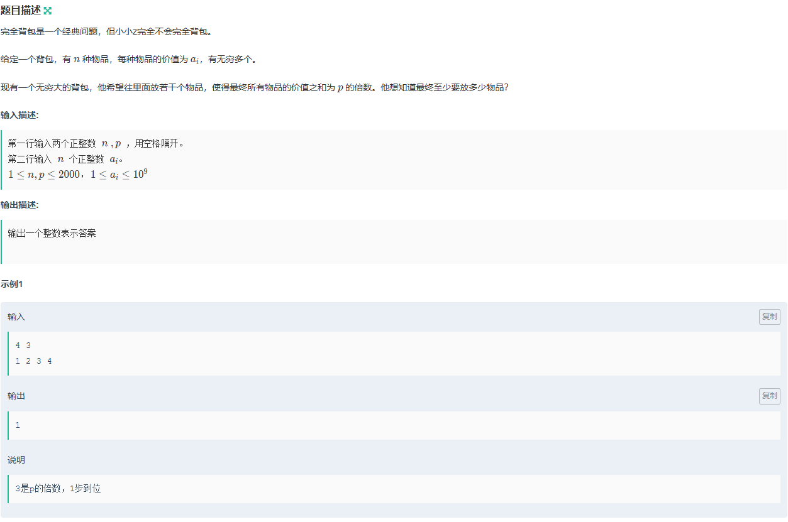
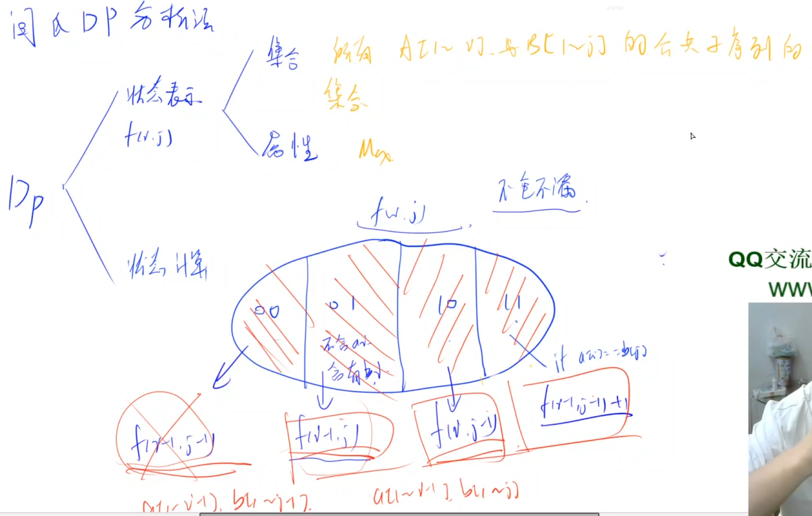
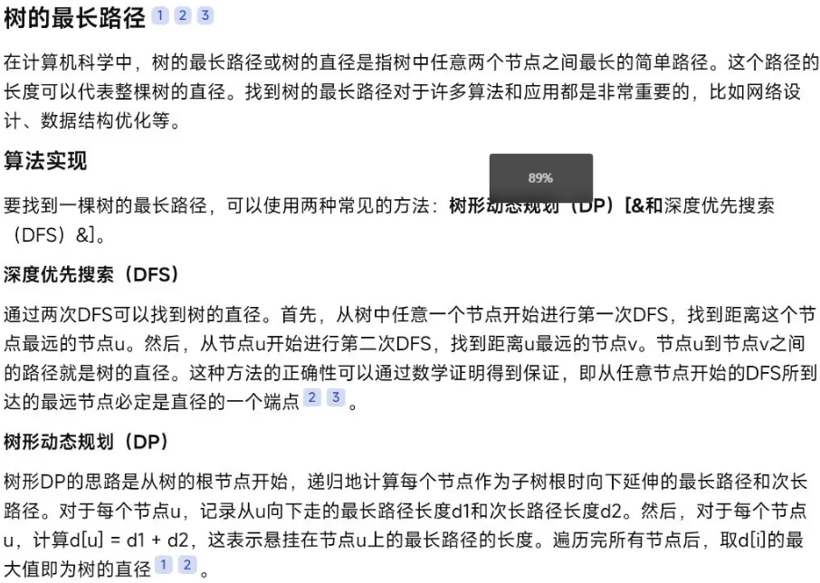
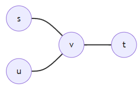
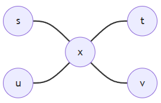
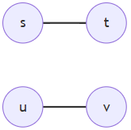
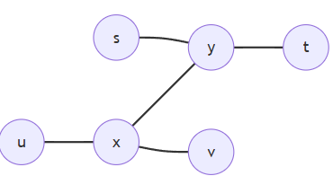

[TOC]

# ***基础排序***

### 快排：

分治思想

```c++
#include<iostream>
using namespace std; 
int a[100010];

void quickly_sort(int l, int r);


int main()
{
	int n;
	cin >> n;
	for(int i = 0; i < n; i++){
		cin >> a[i];
	}
	quickly_sort(0, n - 1);
	for(int i = 0; i < n; i++){
		cout << a[i] << ' ';
	}
	return 0;
}

void quickly_sort(int l, int r)
{
	if(l >= r)return ;
	int ll = l, rr = r;
	int m = a[l];
	int check = 0;
	while(ll < rr){
		if(check == 0){
			if(a[rr] <= m){
				a[ll] = a[rr];
				ll++;
				check = 1;
			}
			else rr--;
		}
		else {
			if(a[ll] > m){
				a[rr] = a[ll];
				rr--;
				check = 0;
			}
			else ll++;
		}
	}
	a[ll] = m;
	quickly_sort(l, ll - 1);
	quickly_sort(rr + 1, r);
}
```

### 归并排序数逆序对：

```c++
#include<iostream>
using namespace std;
int a[100010];
int b[100010];
int o;

void merge_sort(int l, int r);


int main()
{
	int n;
	cin >> n;
	for(int i = 0; i < n; i++){
		cin >> a[i];
	}
	merge_sort(0, n - 1);
	for(int i = 0; i < n; i++){
		cout << a[i] << ' ';
	}
	cout << endl << o;
	
	return 0;
}

void merge_sort(int l, int r)
{
	if(l >= r)return ;
	int mid = l + r >> 1;
	merge_sort(l, mid);
	merge_sort(mid + 1, r);
	int p = l, q = mid + 1;
	int k = 0;
	while(p <= mid && q <= r){
		if(a[p] <= a[q])b[k++] = a[p++];
		else {
			b[k++] = a[q++];
			o += mid + 1 - p;
		}
	}
	while(p <= mid){
		b[k++] = a[p++];
	}
	while(q <= r)b[k++] = a[q++];
	for(int i = l, j = 0; i <= r; i++, j++){
		a[i] = b[j];
	}
}


```

### 二分法求有序数的位置：

例如：1 2 4 6 7 7 7 7 8 9

找7，二分找边界 <= 7 可找到左边的 7， 找边界 >= 7 可找到右边的 7

```c++
#include<iostream>
using namespace std;
int a[100010];
int main()
{
	int n, m;
	cin >> n >> m;
	for(int i = 0; i < n; i++){
		cin >> a[i];
	}
	while(m--){
		int x;
		cin >> x;
		int l = 0, r = n - 1;
		while(l < r){
			int mid = l + r >> 1;
			if(a[mid] >= x)r = mid;
			else l = mid + 1;
		}
		if(a[l] != x)cout << "-1 -1" <<endl;
		else {
			cout << l << ' ';
			int l = 0, r = n - 1;
			while(l < r){
				int mid = l + r + 1 >> 1;
				if(a[mid] <= x)l = mid;
				else r = mid - 1;
			}
			cout << l << endl;
		}
	
	}
	
	return 0;
}
```

### 二分答案例题

##### p2440


```c++
#include<iostream>
using namespace std;
int a[1000010];

bool f(int x, int n, int k);


int main()
{
	int n, k;
	cin >> n >> k;
	for(int i = 0; i < n; i++){
		cin >> a[i];
	}
	int l = 0;
	int r = 1e+8 + 1;
	int mid;
	while(l < r){
		mid = l + r >> 1;
		if(f(mid, n, k))l = mid + 1;
		else r = mid - 1;
	}
	if(l == 0)cout << 0;
	else cout << l - 1;//while中的最后一步肯定是l = mid + 1, 又不理解了就自己画图想想;
	
}


bool f(int x, int n, int k)
{
	int sum = 0;
	for(int i = 0; i < n; i++){
		sum += a[i] / x;
	}
	return sum >= k;
}
```

##### p2678


这道题如果要使用暴力搜索直接求解会严重超时。实际上，我们可以发现，这个所谓的最短跳跃距离显然不能超过一个范围，而这个范围题目上已经给了出来。也就是说，答案是有一个确定的范围限制的，我们就可以考虑一种另外的方法去解决——枚举答案，并去验证答案是否可行。

实际上，枚举答案有时候也会超时。这就好比说你要从一本英汉词典上查一个单词，你从头到尾一页一页的翻着找，这样找可以保证一定能找到，但是最坏情况你要把整本词典都翻一遍，那就麻烦了。

有什么改进的方法吗？当然有。

考虑把这个词典从中间分开，看一下中间那一页的主要单词都是啥，然后去判断我要找的单词应该在左半部分还是右半部分，再去那一部分考虑怎么找就好了。同样的，在另一部分也是要进行划分并且判断的操作。这样一直进行下去，便能很快的找到答案，而且根本不需要翻过整个词典来。

可以证明，如果一页一页的找，最多要找n次，但是用这个方法，最多找floor(log2n)次。

我们把这个方法叫做“二分答案”。顾名思义，它用二分的方法枚举答案，并且枚举时判断这个答案是否可行。但是，二分并不是在所有情况下都是可用的，使用二分需要满足两个条件。一个是有界，一个是单调。

二分答案应该是在一个单调闭区间上进行的。也就是说，二分答案最后得到的答案应该是一个确定值，而不是像搜索那样会出现多解。二分一般用来解决最优解问题。刚才我们说单调性，那么这个单调性应该体现在哪里呢？

可以这样想，在一个区间上，有很多数，这些数可能是我们这些问题的解，换句话说，这里有很多不合法的解，也有很多合法的解。我们只考虑合法解，并称之为可行解。考虑所有可行解，我们肯定是要从这些可行解中找到一个最好的作为我们的答案， 这个答案我们称之为最优解。

最优解一定可行，但可行解不一定最优。我们假设整个序列具有单调性，且一个数x为可行解，那么一般的，所有的x'(x'<x)都是可行解。并且，如果有一个数y是非法解，那么一般的，所有的y'(y'>y)都是非法解。

那么什么时候适用二分答案呢？注意到题面：使得选手们在比赛过程中的最短跳跃距离尽可能长。如果题目规定了有“最大值最小”或者“最小值最大”的东西，那么这个东西应该就满足二分答案的有界性（显然）和单调性（能看出来）。

那就好办了。我们二分跳跃距离，然后把这个跳跃距离“认为”是最短的跳跃距离，然后去以这个距离为标准移石头。使用一个judge判断这个解是不是可行解。如果这个解是可行解，那么有可能会有比这更优的解，那么我们就去它的右边二分。为什么去右边？答案是，这个区间是**递增**的 ，而我们求的是最短跳跃距离的**最大值**，显然再右边的值肯定比左边大，那么我们就有可能找到比这更优的解，直到找不到，那么最后找到的解就有理由认为是区间内最优解。反过来，如果二分到的这个解是一个非法解，我们就不可能再去右边找了。因为性质，右边的解一定全都是非法解。那么我们就应该去左边找解。整个过程看起来很像递归，实际上，这个过程可以递归写， 也可以写成非递归形式，我个人比较喜欢使用非递归形式。

下一个问题，这个judge怎么实现呢？judge函数每个题有每个题的写法，但大体上的思想应该都是一样的——想办法检测这个解是不是合法。拿这个题来说，我们去判断如果以这个距离为最短跳跃距离需要移走多少块石头，先不必考虑限制移走多少块，等全部拿完再把拿走的数量和限制进行比对，如果超出限制，那么这就是一个非法解，反之就是一个合法解，很好理解吧。

可以去模拟这个跳石头的过程。开始你在i(i=0)位置，我在跳下一步的时候去判断我这个当前跳跃的距离，如果这个跳跃距离比二分出来的mid小，**那这就是一个不合法的石头，应该移走。**为什么？我们二分的是最短跳跃距离，已经是最短了，如果跳跃距离比最短更短岂不是显然不合法，是这样的吧。移走之后要怎么做？先把计数器加上1，再考虑向前跳啊。去看移走之后的下一块石头，再次判断跳过去的距离，如果这次的跳跃距离比最短的长，那么这样跳是完全可以的，我们就跳过去，继续判断，如果跳过去的距离不合法就再拿走，这样不断进行这个操作，直到i = n+1，为啥是n+1？河中间有n块石头，显然终点在n+1处。（这里千万要注意不要把n认为是终点，实际上从n还要跳一步才能到终点）。

模拟完这个过程，我们查看计数器的值，这个值代表的含义是我们以mid作为答案需要移走的石头数量，然后判断这个数量 是不是超了就行。如果超了就返回false，不超就返回true。

整道题我已经说完了。。。如果实在难以理解，请看代码。

```c++
#include <iostream>
#include <cstdio>
#include <cstring>
#include <cctype>
#define maxn 500010
using namespace std;
int d,n,m;
int a[maxn];
int l,r,mid,ans;
inline int read(){//我喜欢快读
    int num = 0;
    char c;
    bool flag = false;
    while ((c = getchar()) == ' ' || c == '\n' || c == '\r');
        if (c == '-') flag = true;
    else
        num = c - '0';
    while (isdigit(c = getchar()))
    num = num * 10 + c - '0';
    return (flag ? -1 : 1) * num;
}

bool judge(int x){//judge函数，x代表当前二分出来的答案
    int tot = 0;//tot代表计数器，记录以当前答案需要移走的实际石头数
    int i = 0;//i代表下一块石头的编号
    int now = 0;//now代表模拟跳石头的人当前在什么位置
    while (i < n+1){//千万注意不是n，n不是终点，n+1才是
        i++;
        if (a[i] - a[now] < x)//判断距离，看二者之间的距离算差值就好
            tot++;//判定成功，把这块石头拿走，继续考虑下一块石头
        else
            now = i;//判定失败，这块石头不用拿走，我们就跳过去，再考虑下一块
    }
    if (tot > m)
        return false;
    else
        return true;
}

int main(){
    d = read();//d代表总长度，也就是右边界
    n = read();//n块石头
    m = read();//限制移走m块，思考的时候可别被这个m限制
    for (int i=1;i<=n;i++)
        a[i] = read();
    a[n+1] = d;//敲黑板划重点，再强调一遍，n不是终点
    l = 1;//l和r分别代表二分的左边界和右边界
    r = d;
    while (l <= r){//非递归式二分正常向写法，可理解为一般框架
        mid = (l+r) / 2;//这再看不出是啥意思可以退群了
        if (judge(mid)){//带入judge函数判断当前解是不是可行解
            ans = mid;
            l = mid + 1;//走到这里，看来是可行解，我们尝试看看是不是有更好的可行解
        }
        else
            r = mid - 1;//噫，你找了个非法解，赶紧回到左半边看看有没有可行解
    }
    cout << ans << endl;//最后的ans绝对是最优解
    return 0;
}
```

##### 双重二分（ACM新生赛）


```c++
#include<iostream>
#include<algorithm>
using namespace std;

int a[100010];
int n;
int k;

bool check(int mid);

int main()
{
    int t;
    cin >> t;
    while(t--){
        cin >> n;
        for(int i = 1; i <= n; i++)scanf("%d", &a[i]);
        //排好序
        sort(a + 1, a + n + 1);
        cin >> k;
        //二分答案，最终会是其中一个大雪球的值，不会是一个不存在的大雪球，因为边界问题
        int l = a[1] + a[2], r = a[n - 1] + a[n];
        int o;//记录答案
        while(l <= r){
            int mid = l + r >> 1;
            if(check(mid)){
                l= mid + 1;
                o = mid;  
            }
            else r = mid - 1;
        }
        cout << o << endl;
    }
    return 0;
}

bool check(int mid)
{
    int res = 0;//记录有多少个比 mid 小的数
    for(int i = 1; i < n; i++){
        int u = 0;//记录小于 mid 的组合数的下标
        int ll = i + 1, rr = n;//如果 l 到 r 这个区间里使得a[i] + a[m] < mid 的数，u 就会等于初始化的值
        while(ll <= rr){
            int m = ll + rr >> 1;
            if(a[i] + a[m] <= mid){
                u = m;
                ll = m + 1;
            }
            else rr = m - 1;
        }
        if(u > i)res += u - i;//u > i 防止重复，u - i 因为是从 i + 1 到 u
    }
    return res + 1 <= k;
}
```

### 双指针算法

```c++
//一般双指针做法
for(int i = 0, j = 0; i < n; i++){
	while(j < i && check(i, j))i++;
	
	//每道题目的具体逻辑
}
```

```c++
//一般暴力
for(int i = 0; i < n; i++){
	for(int j = 0; j < n; j++){
		
	}
}
```

核心思想：将暴力算法O(n2)优化到O(n)

### 区间合并例题：


```c++
#include<iostream>
#include<algorithm>
#include<vector>
using namespace std;
typedef pair<int, int> PII;
vector<PII> all;

bool mycmp(PII& a, PII& b);


int main()
{
	int n;
	cin >> n;
	for (int i = 0; i < n; i++) {
		int x, y;
		cin >> x >> y;
		all.push_back({ x, y });
	}
	sort(all.begin(), all.end(), mycmp);
	int cnt = 1;
	int r = all[0].second;
	for (int i = 1; i < n; i++) {
		if (all[i].first > r) {
			cnt++;
			r = all[i].second;
		}
		else {
			if (all[i].second > r)r = all[i].second;
		}
	}
	cout << cnt;
	return 0;
}

bool mycmp(PII &a, PII &b)
{
	if (a.first < b.first)return 1;
	else return 0;
}
```

### 区间和例题


```c++
#include<iostream>
using namespace std;
int a[100010];
int b[100010];
int c[100010];
int d[100010];
int s[100010];
void merge_sort(int l, int r);

int main()
{
    int n, m;
    cin >> n >> m;
    for(int i = 0; i < n; i++){
        cin >> a[i] >> b[i];
    }
    merge_sort(0, n - 1);
    int k = 1;
    c[0] = -1e+9 - 10;
    for(int i = 0; i < n; i++){
        c[k] = a[i];
        s[k] = b[i] + s[k - 1];
        while(a[i] == a[i + 1]){
            s[k] += b[++i];
        }
        k++;
    }
    c[k] = 1e+9 + 10;
    for(int i = 0; i < m; i++){
        int l, r;
        cin >> l >> r;
        int x = 0;
		int y = k; 
        int ll = 0, rr = k;
        while(ll <= rr){
            int mid = ll + rr >> 1;
            if(c[mid] < l)ll = mid + 1;
            else {
                x = mid;
                rr = mid - 1;
            }
        }
        ll = 0, rr = k;
        while(ll <= rr){
            int mid = ll + rr >> 1;
            if(c[mid] <= r){
                y = mid;
                ll = mid + 1;
            }
            else rr = mid - 1;
        }
        cout << s[y] - s[x - 1] << endl;
    }
    return 0;
}

void merge_sort(int l, int r)
{
    if(l >= r)return;
    int mid = l + r >> 1;
    merge_sort(l, mid);
    merge_sort(mid + 1, r);
    int p = l, q = mid + 1;
    int k = 0;
    while(p <= mid && q <= r){
        if(a[p] <= a[q]){
            c[k] = a[p];
            d[k] = b[p];
            k++;
            p++;
        }
        else {
            c[k] = a[q];
            d[k] = b[q];
            k++;
            q++;
        }
        
    }
    while(p <= mid){
        c[k] = a[p];
        d[k] = b[p];
        k++;
        p++;
    }
    while(q <= r){
        c[k] = a[q];
        d[k] = b[q];
        k++;
        q++;
    }
    for(int i = l, j = 0; i <= r; i++, j++){
        a[i] = c[j];
        b[i] = d[j];
    }
}
```

### 差分例题


```c++
#include<iostream>
using namespace std;
int a[5000010];
int b[5000010];
int main()
{
	int n, p;
	cin >> n >> p;
	for(int i = 1; i <= n; i++){
		cin >> a[i];
	}
	for(int i = 1; i < n; i++){
		b[i] = a[i + 1] - a[i];
	}
	for(int i = 0; i < p; i++){
		int x, y, z;
		cin >> x >> y >> z;
		b[x - 1] += z;
		b[y] -= z;
	}
	int sum = 0;
	int min = b[0];
	for(int i = 0; i < n; i++){
		sum += b[i];
		if(sum < min)min = sum;
	}
	cout << min + a[1];
	return 0;
}
```

### 快速幂


```c++
#include<iostream>
using namespace std;
int main()
{
	unsigned long long sum = 1;
	unsigned long long a, b, p;
	cin >> a >> b >> p;
	unsigned long long a1 = a % p, b1 = b;
	while(b1 > 0){
		if(b1 % 2 == 1)sum *= a1;
		a1 *= a1;//a最大2^31,a*a 最大2^62不会溢出unsigne long long
		a1 %= p;
		b1 >>= 1;
		sum %= p;//这里防止溢出，因为每溢出一次就会减少1 ,例如unsigned char 255+1 = 0;
	}
	printf("%lld^%lld mod %lld=%lld", a, b, p, sum % p);
	return 0;
 } 
```

# ***数据结构***

### KMP字符串模板

```c++
#include<iostream>
using namespace std;

const int N = 1000010;
char p[N], s[N];
int ne[N];

int main()
{
    int n, m;
    cin >> n >> p + 1 >> m >> s + 1;
    //求ne数组
    for(int i = 2, j = 0; i <= n; i++){
        while(j && p[i] != p[j + 1])j = ne[j];
        if(p[i] == p[j + 1])j++;
        ne[i] = j;
    }
    for(int i = 1, j = 0; i <= m; i++){
        while(j && s[i] != p[j + 1])j = ne[j];
        if(s[i] == p[j + 1])j++;
        if(j == n){
            cout << i - n << ' ';
            j = ne[j];
        }
    }
    return 0;
}
```

### trie字符串统计

##### 结构体实现

```c++
#include <iostream>
#include <string>
#include <vector>
#define ALPHABET_SIZE 26

using namespace std;

typedef struct Node {
    int count = 0; // Number of times the string has been inserted
    struct Node* next[ALPHABET_SIZE] = {nullptr}; // Pointers to the next nodes
}Node;

Node* root = new Node(); // Initialize the root of the trie

void add(const string& str);
int query(const string& str);
void cleanup(Node* node); // Function to free memory

int main() {
    int n;
    cin >> n;
    string command, str;

    for (int i = 0; i < n; i++) {
        cin >> command >> str; // Read command and string
        if (command[0] == 'I') {
            add(str); // Insert string
        } else if (command[0] == 'Q') {
            cout << query(str) << endl; // Query string count
        }
    }

    cleanup(root); // Free allocated memory
    return 0;
}

void add(const string& str) {
    Node* p = root;
    for (char ch : str) {
        int index = ch - 'a'; // Calculate index for the character
        if (!(p->next[index])) {
            p->next[index] = new Node(); // Create a new node if it doesn't exist
        }
        p = p->next[index]; // Move to the next node
    }
    (p->count)++; // Increment the count for the string
}

int query(const string& str) {
    Node* p = root;
    for (char ch : str) {
        int index = ch - 'a'; // Calculate index for the character
        if (p->next[index] == nullptr) {
            return 0; // If the node doesn't exist, return 0
        }
        p = p->next[index]; // Move to the next node
    }
    return p->count; // Return the count of the string
}

void cleanup(Node* node) {
    for (int i = 0; i < ALPHABET_SIZE; i++) {
        if (node->next[i] != nullptr) {
            cleanup(node->next[i]); // Recursively free child nodes
        }
    }
    delete node; // Free the current node
}

```

##### 数组实现

```c++
#include<iostream>
#include<string>
#define N 100010
using namespace std;


int son[N][26], memory[N];//me[N]数组来记录第index节点上有没有字符串结尾
string str, k;
int idx;

void add(const string &str);

int query(const string &str);

int main()
{
	int n;
	cin >> n;
	for(int i = 0; i < n; i++){
		cin >> k >> str;
		if(k[0] == 'I')
		{
			add(str);
		}
		else {
			cout << query(str) << endl;
			
		}
	}
	return 0;
}

void add(const string &str)
{
	int p = 0;
	for(char ch : str){
		int t = ch - 'a';
		if(!son[p][t]){
			son[p][t] = ++idx;
		}
		p = son[p][t];
	}
	memory[p]++;
}

int query(const string &str)
{
	int p = 0;
	for(char ch : str){
		int t = ch - 'a';
		if(!son[p][t])return 0;
		p = son[p][t];
	}
	return memory[p];

}
```

### 并查集（路径压缩，按秩合并）

```c++
#include<iostream>
#define N 100010
using namespace std;

int father[N], ranks[N];

void init(int n);

int find(int x);

void merge(int x, int y);

int main()
{
    int n, m;
    cin >> n >> m;
    init(n);
    for(int i = 0; i < m; i++){
        int x, y;
        char c[2];
        scanf("%s%d", c, &x);
        if(*c == 'C'){
            scanf("%d", &y);
            int rootx = find(x);
            int rooty = find(y);
            if(rootx != rooty)merge(rootx, rooty);
        }
        else if(*c == 'Q' && *(c + 1) == '1'){
            scanf("%d", &y);
            int rootx = find(x);
            int rooty = find(y);
            if(rootx == rooty)puts("Yes");
            else puts("No");
        }
        else{
            int rootx = find(x);
            printf("%d\n", ranks[rootx]);
        }
    }
    return 0;
}

void init(int n)
{
    for(int i = 0; i < n; i++){
        father[i] = i;
        ranks[i] = 1;
    }
}

int find(int x)
{
    if(father[x] != x)father[x] = find(father[x]);
    return father[x];
}

void merge(int x, int y)
{
    if(ranks[x] < ranks[y]){
        father[x] = y;
        ranks[y] += ranks[x];
    }
    else if(ranks[x] > ranks[y]){
        father[y] = x;
        ranks[x] += ranks[y];
    }
    else {
        father[x] = y;
        ranks[y] += ranks[x];
    }
}
```

##### 食物链

```c++
#include<iostream>
#include<cmath>
#define N 100010
using namespace std;

int n, m;
int p[N], d[N];

void init(int n);

int find(int x);

int main()
{
    cin >> n >> m;
    init(n);
    int res = 0;
    while(m--){
        int t, x, y;
        scanf("%d%d%d", &t, &x, &y);
        if(x > n || y > n)res++;
        else {
            int rootx = find(x), rooty = find(y);
            if(t == 1){
                 if(rootx == rooty && (d[x] - d[y]) % 3)res++;
                 else if(rootx != rooty){
                    p[rootx] = rooty;
                    d[rootx] = d[y] - d[x];
                 }
            }
            else {
                if(rootx == rooty && (d[x] - d[y] - 1) % 3)res++;
                else if(rootx != rooty){
                    p[rootx] = rooty;
                    d[rootx] = d[y] - d[x] + 1;
                }
            }
        }
    }
    cout << res;
    return 0;
}

void init(int n)
{
    for(int i = 0; i <= n; i++){
        p[i] = i;
    }
}

int find(int x)
{
    if(p[x] != x){ 
        int t = find(p[x]);
        d[x] += d[p[x]];
        p[x] = t;

    }
    return p[x];
}
```

### 堆

```c++
#include<iostream>
#include<algorithm>
#define N 100010
using namespace std;

int n, m;
int h[N], sizee;

void down(int u);

int main()
{
    scanf("%d%d", &n, &m);
    for(int i = 1; i <= n; i++)scanf("%d", &h[i]);
    sizee = n;
    for(int i = n / 2; i; i--)down(i);
    while(m--){
        printf("%d ", h[1]);
        h[1] = h[sizee];
        sizee--;
        down(1);
    }
    return 0;
}

void down(int u)
{
    int t = u;
    if(u * 2 <= sizee && h[u * 2] < h[t])t = u * 2;
    if(u * 2 + 1 <= sizee && h[u * 2 + 1] < h[t])t = u * 2 + 1;
    if(u != t){
        swap(h[u], h[t]);
        down(t);
    }
}
```

##### 模拟堆


```c++
#include<iostream>
#include<algorithm>
#include<cstring>
#define N 100010
using namespace std;

int h[N], ph[N], hp[N], cnt;

void heap_swap(int a, int b);

void down(int u);

void up(int u);

int main()
{
    int n, m = 0;
    cin >> n;
    while(n--){
        char op[5];
        int k, x;
        scanf("%s", op);
        if(!strcmp(op, "I")){
            scanf("%d", &x);
            cnt++;
            m++;
            ph[m] = cnt, hp[cnt] = m;
            h[cnt] = x;
            up(cnt);
        }
        else if(!strcmp(op, "PM"))printf("%d\n", h[1]);
        else if(!strcmp(op, "DM")){
            heap_swap(1, cnt);
            cnt--;
            down(1);
        }
        else if(!strcmp(op, "D")){
            scanf("%d", &k);
            k = ph[k];
            heap_swap(k, cnt);
            cnt--;
            up(k);
            down(k);
        }
        else {
            scanf("%d%d", &k, &x);
            k = ph[k];
            h[k] = x;
            up(k);
            down(k);
        }
    }
    return 0;
}

void heap_swap(int a, int b)
{
    swap(ph[hp[a]], ph[hp[b]]);
    swap(hp[a], hp[b]);
    swap(h[a], h[b]);
}

void down(int u)
{
    int t = u;
    if(u * 2 <= cnt && h[u * 2] < h[t])t = u * 2;
    if(u * 2 + 1 <= cnt && h[u * 2 + 1] < h[t])t = u * 2 + 1;
    if(u != t){
        heap_swap(u, t);
        down(t);
    }
}

void up(int u)
{
    while(u / 2 && h[u] < h[u / 2]){
        heap_swap(u, u / 2);
        u >>= 1;
    }
}
```

##### 手搓堆，快读p1801

```c++
#include<iostream>
#include<algorithm>
using namespace std;
int s[200010];

typedef struct big_queue{
    int a[200010];
    int size = 0;

    void add(int x)
    {
        a[++size] = x;
        up(size);
    }

    void pop()
    {
        a[1] = a[size--];
        down(1);
    }

    int top()
    {
        return a[1];
    }

    void down(int u)
    {
        int t = u;
        if(u * 2 <= size && a[u * 2] > a[t])t = u * 2;
        if(u * 2 + 1 <= size && a[u * 2 + 1] > a[t])t = u * 2 + 1;
        if(t != u){
            swap(a[t], a[u]);
            down(t);
        }
    }

    void up(int u)
    {
        while(u / 2 && a[u] > a[u / 2]){
            swap(a[u], a[u / 2]);
            u >>= 1;
        }
    }
}big_queue;

typedef struct small_queue{
    int a[200010];
    int size = 0;

    void add(int x)
    {
        a[++size] = x;
        up(size);
    }

    void pop()
    {
        a[1] = a[size--];
        down(1);
    }

    int top()
    {
        return a[1];
    }

    void down(int u)
    {
        int t = u;
        if(u * 2 <= size && a[u * 2] < a[t])t = u * 2;
        if(u * 2 + 1 <= size && a[u * 2 + 1] < a[t])t = u * 2 + 1;
        if(t != u){
            swap(a[t], a[u]);
            down(t);
        }
    }

    void up(int u)
    {
        while(u / 2 && a[u] < a[u / 2]){
            swap(a[u], a[u / 2]);
            u >>= 1;
        }
    }
}small_queue;

big_queue big;
small_queue small;

int readInt();

int main()
{
    int m, n;
    cin >> m >> n;
    for(int i = 1; i <= m; i++){
        s[i] = readInt();
    }
    
    
    //用大小堆实现，每次添加读到x，就循环把s数组里的放到大根堆里，然后再取出大根堆里的堆顶，push到小根堆里，结束循环后，输出小根堆的堆顶，然后把小根堆的堆顶push到大根堆，这样每次询问就有一个当时的小根堆的最小值储存在大根堆，然后每次添加的时候，是先添加到大根堆，然后取出大根堆的最大值，就是说最小的那 p - 1 个数就不会被取出，所以小根堆里的堆顶就是第 p 小的值
    int k = 0;
    for(int i = 1; i <= n; i++){
        int x;
        x = readInt();
        while(k < x){
            k++;
            big.add(s[k]);
            small.add(big.top());
            big.pop();
        }
        printf("%d\n", small.top());
        big.add(small.top());
        small.pop();
    }
    return 0;
}

int readInt()
{
    int x = 0, f = 1;
    char ch = getchar();
    while(ch > '9' || ch < '0'){
        if(ch == '-')f = -1;
        ch = getchar();
    }

    while(ch <= '9' && ch >= '0'){
        x = x * 10 + ch - '0';
        ch = getchar();
    }
    return x * f;
}
```

##### 堆p1631

```c++
#include<iostream>
#include<queue>
using namespace std;

typedef struct three{
    int num;
    int p1;
    int q1;
}TH;

struct ennsmall{
    bool operator()(TH x, TH y)
    {
        return x.num > y.num;
    }
};

priority_queue<TH, vector<TH>, ennsmall> small;

int a[100010], b[100010];

int main()
{
    int n;
    cin >> n;
    for(int i = 0; i < n; i++){
        cin >> a[i];
    }
    for(int i = 0; i < n; i++){
        cin >> b[i];
    }
    for(int i = 0; i < n; i++){
        small.push({a[i] + b[0], i, 0});
    }
    int sum = n;
    while(sum--){
        printf("%d ", small.top().num);
        int p = small.top().p1;
        int q = small.top().q1;
        small.pop();
        small.push({a[p] + b[q + 1], p, q + 1});
    }

    return 0;
}
```


### 哈希表

##### 拉链法


每一个h[ ]里的元素，相当于一个链表的头节点

```c++
#include<iostream>
#define N 100003
using namespace std;

int h[N];
int p[3 * N], nextt[3 * N], idx = N + 1;

void init();

void insert(int x);

bool query(int x);

int main()
{
    init();
    int n;
    cin >> n;
    while(n--){
        char c[3];
        int x;
        scanf("%s%d", c, &x);
        if(*c == 'I'){
            insert(x);
        }
        else {
            if(query(x))puts("Yes");
            else puts("No");
        }

    }
    return 0;
}

void init()
{
    for(int i = 0; i < N; i++){
        h[i] = -1;
    }
}

void insert(int x)
{
    int replace = x;
    if(x < 0){
        replace = -replace;
    }
    int k = replace % N;
    int tail = h[k];
    if(tail == -1){
        h[k] = idx;
        p[idx] = x;
        nextt[idx] = -1;
        idx++;
    }
    else {
        while(nextt[tail] != -1){
            tail = nextt[tail];
        }
        nextt[tail] = idx;
        p[idx] = x;
        nextt[idx] = -1;
        idx++;
    }

}

bool query(int x)
{
    int replace = x;
    if(x < 0){
        replace = -replace;
    }
    int k = replace % N;
    int tail = h[k];
    while(tail != -1){
        if(p[tail] == x)return 1;
        tail = nextt[tail];
    }
    return 0;
}
```

##### 开放寻址法


先取模，然后再那个点先后寻找到一个没被使用过的点（先给数组初始化为 1e+9 + 10，一个不会出现的元素)

```c++
#include<iostream>
#define N 100003
using namespace std;

int h[4 * N];

void init();

void insert(int x);

int query(int x);

int main()
{
    init();
    int n;
    cin >> n;
    while(n--){
        char c[3];
        int x;
        scanf("%s%d", c, &x);
        if(*c == 'I'){
            insert(x);
        }
        else {
            if(query(x))puts("Yes");
            else puts("No");
        }
    }
    return 0;
}

void init()
{
    for(int i = 0; i < 4 * N; i++){
        h[i] = 1e+9 + 10;
    }
}

void insert(int x)
{
    int replace = x;
    if(x < 0)replace = -replace;
    int k = replace % N * 2;
    int tail = k;
    while(h[tail] != 1e+9 + 10){
        tail++;
    }
    h[tail] = x;
}

int query(int x)
{
    int replace = x;
    if(x < 0)replace = -replace;
    int k = replace % N * 2;
    int tail = k;
    while(h[tail] != 1e+9 + 10){
        if(h[tail] == x)return 1;
        tail++;
    }
    return 0;
}
```

##### 字符串哈希

用unsigned long long就不用取模，也不担心溢出，溢出就相当于取模

```c++
#include<iostream>
#define N 100010
#define P 13331
using namespace std;
typedef unsigned long long ull;

int n, m;
char str[N];
ull h[N], p[N];

ull get(int l, int r);

int main()
{
    scanf("%d%d%s", &n, &m, str + 1);
    p[0] = 1;
    for(int i = 1; i <= n; i++){
        p[i] = p[i - 1] * P;
        h[i] = h[i - 1] * P + str[i];
    }
    while(m--){
        int l1, r1, l2, r2;
        scanf("%d%d%d%d", &l1, &r1, &l2, &r2);
        if(get(l1, r1) == get(l2, r2))puts("Yes");
        else puts("No");
    }
    return 0;
}

ull get(int l, int r)
{
    return h[r] - h[l - 1] * p[r - l + 1];
}

```

### DFS

##### 全排列

```c++
#include<iostream>
#define N 100010
using namespace std;

int a[N];
int book[N];

void dfs(int n, int step);

int main()
{
    int n;
    cin >> n;
    dfs(n, 0);
    return 0;
}

void dfs(int n, int step)
{
    if(step == n){
        for(int i = 0; i < n; i++){
            cout << a[i] << ' ';
        }
        cout << endl;
        return ;
    }
    for(int i = 1; i <= n; i++){
        if(book[i] == 0){
            book[i] = 1;
            a[step] = i;
            dfs(n, step + 1); 
            book[i] = 0;
        }
    }
}
```

##### N皇后

```c++
#include<iostream>
#define N 100
using namespace std;

int a[N][N];

bool check(int n);

void dfs(int n, int step);

int main()
{
    int n;
    cin >> n;
    dfs(n, 1);
    return 0;
}

bool check(int n)
{
    int cc = 1;
    for(int i = 1; i <= n; i++){
        for(int j = 1; j <= n; j++){
            if(a[i][j] == 1){
                for(int m = i + 1; m <= n; m++){
                    if(a[m][j] == 1){
                        cc = 0;
                        break;
                    }
                }
                for(int m = j + 1; m <= n; m++){
                    if(a[i][m] == 1){
                        cc = 0;
                        break;
                    }
                }
                for(int p = i + 1, q = j + 1; p <= n && q <= n; p++, q++){
                    if(a[p][q] == 1){
                        cc = 0;
                        break;
                    }
                }
                for(int p = i + 1, q = j - 1; p <= n && q >= 1; p++, q--){
                    if(a[p][q] == 1){
                        cc = 0;
                        break;
                    }
                }
            }
            if(!cc)break;
        }
        if(!cc)break;
    }
    return cc;
}

void dfs(int n, int step)
{
    if(step > n){
        for(int i = 1; i <= n; i++){
            for(int j = 1; j <= n; j++){
                if(a[i][j] == 1)printf("Q");
                else printf(".");
            }
            printf("\n");
        }
        printf("\n");
        return ;
    }
    for(int i = 1; i <= n; i++){
        a[step][i] = 1;
        if(check(n)){
            dfs(n, step + 1);
        }
        a[step][i] = 0;
    }
}
```

##### 最优解（ACM）新生赛


```c++
#include<iostream>
#include<vector>
using namespace std;

typedef pair<int, int> PII;
int a[100];
int t;
int n, m;

int res = 100000;

void dfs(int step, vector<PII>& b);

int main()
{
    cin >> t;
    while(t--){
        cin >> n >> m;
        for(int i = 1; i <= n; i++)cin >> a[i];
        vector<PII> b;
        for(int i = 0; i < m; i++){
            int x, y;
            cin >> x >> y;
            b.push_back({x, y});
        }
        res = 100000;
        dfs(0, b);
        cout << res << endl;
    }
    return 0;
}

void dfs(int step, vector<PII>& b)
{
    if(step >= m){
        int sum = 0;
        for(int i = 2; i <= n; i++){
            if(a[i] > a[1])sum++;
        }
        sum++;
        if(res > sum)res = sum;//更新最优解
        return ;
    }
        a[b[step].first] += 3;
        dfs(step + 1, b);
        a[b[step].first] -= 3;//回溯

        a[b[step].second] += 3;
        dfs(step + 1, b);
        a[b[step].second] -= 3;//回溯
        
        a[b[step].first]++;
        a[b[step].second]++;
        dfs(step + 1, b);
        a[b[step].first]--;//回溯
        a[b[step].second]--;//回溯
}
```

### 表达式求值

```c++
#include <iostream>
#include <cstring>
#include <algorithm>
#include <stack>
#include <unordered_map>

using namespace std;

stack<int> num;
stack<char> op;

void eval();

int main()
{
    unordered_map<char, int> pr{{'+', 1}, {'-', 1}, {'*', 2}, {'/', 2}};
    string str;
    cin >> str;
    for (int i = 0; i < str.size(); i ++ )
    {
        auto c = str[i];
        if (isdigit(c))
        {
            int x = 0, j = i;
            while (j < str.size() && isdigit(str[j]))
                x = x * 10 + str[j ++ ] - '0';
            i = j - 1;
            num.push(x);
        }
        else if (c == '(') op.push(c);
        else if (c == ')')
        {
            while (op.top() != '(') eval();
            op.pop();
        }
        else
        {
            while (op.size() && op.top() != '(' && pr[op.top()] >= pr[c]) eval();
            op.push(c);
        }
    }
    while (op.size()) eval();
    cout << num.top() << endl;
    return 0;
}    

void eval()
{
    auto b = num.top(); num.pop();
    auto a = num.top(); num.pop();
    auto c = op.top(); op.pop();
    int x;
    if (c == '+') x = a + b;
    else if (c == '-') x = a - b;
    else if (c == '*') x = a * b;
    else x = a / b;
    num.push(x);
}
```

### 栈

##### 洛谷p2058（栈）

```c++
#include<iostream>
using namespace std;

int times[1000100], cataloge[1000100], num[1000100];
int r;
int l;
int sum;

int main()
{
    int n;
    cin >> n;
    while(n--){
        int t, k;
        cin >> t >> k;
        while(k--){
            int x;
            cin >> x;
            times[r] = t;
            num[r] = x;
            if(!cataloge[num[r]])sum++;
            cataloge[num[r]]++;
            while(times[r] - times[l] >= 86400){
                if(!--cataloge[num[l++]])sum--;
            }
            r++;
        }
        cout << sum << endl;

    }
    return 0;
}
```

##### p5788（单调栈）

```c++
#include<iostream>
#include<stack>
using namespace std;

typedef pair<int, int> PII;
stack<PII> a;
int b[3000010];

int main()
{
    int n;
    cin >> n;
    for(int i = 1; i <= n; i++){
        int x;
        cin >> x;
        while(!a.empty() && x > a.top().first){
            b[a.top().second] = i;
            a.pop();
        }
        a.push({x, i});
    }
    for(int i = 1; i <= n; i++){
        cout << b[i] << ' ';
    }
    return 0;
}
```

##### 最大矩形面积（ACM新生赛）


```c++
#include<iostream>
#include<stack>
#include<algorithm>
using namespace std;
 
int n;
int sum;
int a[100020];
stack<int> s;
 
int main()
{
    cin >> n;
    for(int i = 1; i <= n; i++)cin >> a[i];
    s.push(0);//首尾添加 0 方便处理
    for(int i = 1; i <= n + 1; i++){
        if(a[i] >= a[s.top()])s.push(i);//使栈单调不减
        else {//如果出现减小，则前面的最大值可以确定
            int t = -1;
            while(a[s.top()] > a[i]){
                t = s.top();
                sum = max(sum, a[s.top()] * (i - s.top()));//更新最大值
                s.pop();
            }
            if(t != -1)a[t] = a[i];//使前面的数等于a[i]，不然计算a[i]高度的时候会漏掉前面的
            s.push(t);
            s.push(i);
        }
    }
    cout << sum;
    return 0; 
}
```

### 滑动窗口（记录下标）

```c++
#include <iostream>

using namespace std;

const int N = 1000010;

int a[N], q[N];

int main()
{
    int n, k;
    scanf("%d%d", &n, &k);
    for (int i = 0; i < n; i ++ ) scanf("%d", &a[i]);

    int hh = 0, tt = -1;
    for (int i = 0; i < n; i ++ )
    {
        if (hh <= tt && i - k + 1 > q[hh]) hh ++ ;

        while (hh <= tt && a[q[tt]] >= a[i]) tt -- ;
        q[ ++ tt] = i;

        if (i >= k - 1) printf("%d ", a[q[hh]]);
    }

    puts("");

    hh = 0, tt = -1;
    for (int i = 0; i < n; i ++ )
    {
        if (hh <= tt && i - k + 1 > q[hh]) hh ++ ;

        while (hh <= tt && a[q[tt]] <= a[i]) tt -- ;
        q[ ++ tt] = i;

        if (i >= k - 1) printf("%d ", a[q[hh]]);
    }

    puts("");

    return 0;
}
```

### 洛谷p2661（做崩溃了，学完图论再战）

```c++
#include <iostream>
#include <cstdio>
using namespace std;
const int N = 200010;
int n, fa[N], ans = 0x3f3f3f3f;
int get (int x, int &cnt) {  
    cnt ++;
    if (fa[x] == x) return x;
    else return get(fa[x], cnt);
}
int main () {
    scanf("%d", &n);
    for (int i = 1; i <= n; i ++)
        fa[i] = i;
    for (int i = 1; i <= n; i ++) {
        int cnt = 0, f;
        scanf("%d", &f);
        if (get(f, cnt) == i) {
            ans = min(ans, cnt);  
        }else
        	fa[i] = f;
    }
    printf("%d", ans);
    return 0;
}
```

### BFS

#### 八数码

```c++
#include<iostream>
#include<queue>
#include<unordered_map>
using namespace std;

int bfs(string start)
{
    string end = "12345678x";
    queue<string> q;
    unordered_map<string, int> d;
    q.push(start);
    d[start] = 0;

    //状态转移
    int dx[4] = {-1, 0, 1, 0};
    int dy[4] = {0, 1, 0, -1};

    while(q.size()){
        auto t = q.front();
        q.pop();

        int distance = d[t];

        if(t == end)return distance;

        //状态转移
        int k = t.find('x');
        int x = k / 3, y = k % 3;

        for(int i = 0; i < 4; i++){
            int a = x + dx[i], b = y + dy[i];
            if(a >= 0 && a < 3 && b >= 0 && b < 3){
                swap(t[k], t[a * 3 + b]);
                if(!d.count(t)){
                    q.push(t);
                    d[t] = distance + 1;
                }
                swap(t[k], t[a * 3 + b]);

            }
        }
    }

    return -1;
}


int main()
{
    string start;
    for(int i = 0; i < 9; i++){
        char c;
        cin >> c;
        start += c;
    }

    cout << bfs(start) << endl;
    return 0;
}
```

### 图论邻接表

#### 存储图


#### 数的重心（图的DFS）


```c++
#include<cstring>
#include<iostream>
#include<algorithm>

using namespace std;
const int N = 200010, M = N * 2;

int n;
int h[N], e[M], ne[M], idx;//邻接表
bool st[N];
int ans = N;

void add(int a, int b)
{
    e[idx] = b, ne[idx] = h[a], h[a] = idx++;
    //每一个新的数都直接插到头节点后面，而不是从后面接着连接
}

int dfs(int u)
{
    st[u] = true;//记录已经遍历过
    int res = 0, sum = 1;//sum = 1，表示点自己是一个点
    for(int i = h[u]; i != -1; i = ne[i]){
        int j = e[i];
        if(!st[j]){
            int k = dfs(j);
            sum += k;//自己的 1 加上子树的就是连通的总的
            res = max(res, k);//去掉这个点，就是看这个点的子树的最大和总的除去这个点比较大小
        }
    }
    res = max(n - sum, res);//去掉当前点的最大连通块的点数
    ans = min(res, ans);//更新最小的最大连通块

    return sum;

}

int main()
{
    memset(h, -1, sizeof(h));//全部的头节点初始化为0
    cin >> n;
    for(int i = 0; i < n - 1; i++){
        int x, y;
        cin >> x >> y;
        add(x, y), add(y, x);//无向图就是双向图
    }
    dfs(1);//从任意点出发
    cout << ans;
    return 0;
}
```

### 图中点的层次（图的BFS）


```c++
#include<iostream>
#include<algorithm>
#include<cstring>
#include<queue>
#include<unordered_map>
using namespace std;

const int N = 100010, M = 2 * N;

int h[N], e[M], ne[M], idx;//h[]数组都是是头节点，e[]是储存的值，ne[]储存的下一个节点的下标
bool st[N];//记录是否走过
int n, m;

void add(int a, int b)
{
    e[idx] = b, ne[idx] = h[a], h[a] = idx++;//常用的储存图的邻接表（单项）
}

int bfs()
{
    int t = 1;
    queue<int> q;
    unordered_map<int, int> d;//记录离开始节点的距离
    d[t] = 0;
    q.push(t);；//BFS用队列
    while(q.size()){
        t = q.front();
        q.pop();
        int distance = d[t];
        
        if(t == n)return distance;//搜到了就返回

        for(int i = h[t]; i != -1; i = ne[i]){
            int x = e[i];
            if(st[x])continue;//走过的点不能再走
            st[x] = true;
            q.push(x);
            d[x] = distance + 1;//记录距离
        }
    }
    return -1;
}


int main()
{
    memset(h, -1, sizeof(h));
    cin >> n >> m;
    for(int i = 0; i < m; i++){
        int a, b;
        cin >> a >> b;
        if(a == b)continue;//自己指自己的不记录
        int check = 1;
        for(int i = h[a]; i != -1; i = ne[i]){//重复的不记录
            int x = e[i];
            if(x == b){
                check = 0;
                break;
            }
        }
        if(check)add(a, b);
    }
    cout << bfs();
    return 0;
}
```

### 有向图的拓扑排序


入度：自己被指向的箭头数量

出度：自己指向其他点的箭头数量

queue，入队入读为 0 的点，因为没有其他点指向自己了，可以排到前面

```c++
#include<iostream>
#include<algorithm>
#include<queue>
#include<cstring>
using namespace std;

const int N = 100010;

int n, m;
int h[N], e[N], ne[N], idx;
int d[N];//表示那个数的入度
int sum;//表示总的入队点数
int line[N];//储存拓扑序列

void add(int a, int b)
{
    e[idx] = b, ne[idx] = h[a], h[a] = idx++;
}

bool topsort()
{
    queue<int> q;
    for(int i = 1; i <= n; i++){
        if(!d[i]){
            q.push(i);
            line[++sum] = i;

        }
    }
    while(q.size()){
        int t = q.front();
        q.pop();

        for(int i = h[t]; i != -1; i = ne[i]){
            int j = e[i];
            d[j]--;
            if(d[j] == 0){
                q.push(j);
                line[++sum] = j;
            }
        }
    }

    return sum == n;

}

int main()
{
    cin >> n >> m;
    memset(h, -1, sizeof(h));

    for(int i = 0; i < m; i++){
        int a, b;
        cin >> a >> b;
        add(a, b);
        d[b]++;//b 的入度加加
    }

    if(topsort()){
        for(int i = 1; i <= n; i++){
            cout << line[i] << ' ';
        }
    }
    else cout << -1;
    return 0;
}
```

### Dijkstra求最短路


```c++
//用 DFS 的话会超时
#include<iostream>
#include<cstring>
#include<algorithm>
using namespace std;

const int N = 510;
bool st[N];

int h[N], e[N * N], ne[N * N], idx;
int dist[N * N];

int n, m;

int sum = 100000;

void add(int a, int b, int c)
{
    dist[idx] = c, e[idx] = b, ne[idx] = h[a], h[a] = idx++;
}

void dfs(int u, int d)
{
    if(u == n){
        sum = min(sum, d);//更新答案
        return ;
    }
    for(int i = h[u]; i != -1; i = ne[i]){
        int t = e[i];
        if(!st[t]){
            st[t] = true;//记录走过没有
            dfs(t, dist[i] + d);
            st[t] = false;//回溯
        }
    }
}

int readint()//快读
{
    int j = 1, sum = 0;
    char c = getchar();
    while(c > '9' || c < '0'){
        if(c == '-')j = -1;
        c = getchar();
    }
    while(c >= '0' && c <= '9'){
        sum = sum * 10 + c - '0';
        c = getchar();
    }
    return sum * j;
}

int main()
{
    memset(h, -1, sizeof(h));
    cin >> n >> m;
    while(m--){
        int x, y, z;
        x = readint();
        y = readint();
        z = readint();
        if(x == y)continue;
        int check = 1;
        for(int i = h[x]; i != -1; i = ne[i]){
            int t = e[i];
            if(t == y)dist[i] = min(dist[i], z);
            continue;
        }
        if(check)add(x, y, z);
    }
    dfs(1, 0);
    if(sum == 100000)cout << -1;
    else cout << sum;
    return 0;
}

//上面是DFS也能做，但是会超时

//下面是模板做法
//不懂了可以画图模拟一遍，第一次懂是靠画图模拟

#include <cstring>
#include <iostream>
#include <algorithm>

using namespace std;

const int N = 510;

int n, m;
int g[N][N];//记录路径长度
int dist[N];//记录从 1 到 n 的最短路径
bool st[N];//记录是否已经是从 1 到 t 的最短路径

int dijkstra()
{
    memset(dist, 0x3f, sizeof dist);//初始化为一个很大的数
    dist[1] = 0;//1 到 1 的距离为 0

    for (int i = 0; i < n - 1; i ++ )
    {
        int t = -1;
        for (int j = 1; j <= n; j ++ )
            if (!st[j] && (t == -1 || dist[t] > dist[j]))
                //选取一个没被用过的已确定的最短路，也可能是初始话的那个值，但是这样的话就代表没有路通向n
                t = j;

        for (int j = 1; j <= n; j ++ )
            dist[j] = min(dist[j], dist[t] + g[t][j]);//给全部最短路更新一下

        st[t] = true;//标记用过的最短路
    }

    if (dist[n] == 0x3f3f3f3f) return -1;//没变代表没路通向 n
    return dist[n];
}

int main()
{
    scanf("%d%d", &n, &m);

    memset(g, 0x3f, sizeof g);
    //memset赋值是一个字节一个字节的赋值，所以一个 int 类型就是0x3f3f3f3f的大小
    while (m -- )
    {
        int a, b, c;
        scanf("%d%d%d", &a, &b, &c);

        g[a][b] = min(g[a][b], c);
    }

    printf("%d\n", dijkstra());

    return 0;
}

//下面是堆优化得dijkstra算法
#include<iostream>
#include<algorithm>
#include<cstring>
#include<queue>
using namespace std;

typedef pair<int, int> PII;

int n, m;
const int N = 150010;
int h[N], w[N], ne[N], e[N], idx;
bool st[N];
int dist[N];

void add(int a, int b, int c)
{
    e[idx] = b, ne[idx] = h[a], w[idx] = c, h[a] = idx++;
}

int dijkstra()
{
    memset(dist, 0x3f, sizeof(dist));
    dist[1] = 0;
    priority_queue<PII, vector<PII>, greater<PII> > heap;//堆可以优化寻找每次最小dist距离的步骤
    heap.push({0, 1});

    while(heap.size()){
        int u = heap.top().second;
        heap.pop();

        if(st[u])continue;
        st[u] = true;

        for(int i = h[u]; i != -1; i = ne[i]){
            int j = e[i];
            if(dist[j] > dist[u] + w[i]){
                dist[j] = dist[u] + w[i];
                heap.push({dist[j], j});
            }
        }
    }
    if(0x3f3f3f3f == dist[n])return -1;
    return dist[n];
}

int main()
{
    memset(h, -1, sizeof(h));
    cin >> n >> m;
    while(m--){
        int a, b, c;
        cin >> a >> b >> c;
        if(a == b)continue;
        add(a, b, c);
    }

    cout << dijkstra();
    return 0;
}
```


### 有边数限制的最短路


```c++
#include<iostream>
#include<algorithm>
#include<cstring>
using namespace std;

const int N = 510, M = 10010;
int dist[N];
int backup[N];//备份
int n, m, k;

struct Edge{
    int a, b, c;
}edge[M];

void bellman_ford()
{
    memset(dist, 0x3f, sizeof dist);//初始化
    dist[1] = 0;//初始化
    for(int i = 0; i < k; i++){
        memcpy(backup, dist, sizeof dist);//备份，防止一连串的更新，保证每次只会多更新一条边
        for(int j = 0; j < m; j++){
            int a = edge[j].a;
            int b = edge[j].b;
            int c = edge[j].c;
            dist[b] = min(dist[b], backup[a] + c);
            //这里的min里面不能用backup[b]，因为存在重边，下一次遇到还是用的原来的backup，dist可能又会被改成0x3f3f3f3f
        }
    }
    if(dist[n] > 0x3f3f3f3f / 2)cout << "impossible";
    //因为存在负权边，不能直接等于， 根据数据，全是负数最大500 * 10000也小于0x3f3f3f3f / 2
    else cout << dist[n];
}

int main()
{
    cin >> n >> m >> k;
    for(int i = 0; i < m; i++){
        int a, b, c;
        cin >> a >> b >> c;
        edge[i] = {a, b, c};
    }
    bellman_ford();
    return 0;
}
```

### spfa算法

```c++
//有重边，负权边，自环可用，正常为O(m), 最坏为O(mn)
//一般堆优化的dijkstra为O((m + n)logn)
#include<iostream>
#include<queue>
#include<algorithm>
#include<cstring>
using namespace std;

const int N = 100010;
int n, m;

int h[N], ne[N], e[N], w[N], idx;
int dist[N];
bool st[N];

void add(int a, int b, int c)
{
    e[idx] = b, ne[idx] = h[a], w[idx] = c, h[a] = idx++;
}

void spfa()
{
    memset(dist, 0x3f, sizeof dist);
    dist[1] = 0;
    queue<int> q;
    q.push(1);
    st[1] = true;
    while(q.size()){
        int t = q.front();
        q.pop();
        st[t] = false;

        for(int i = h[t]; i != -1; i = ne[i]){
            int j = e[i];
            if(dist[j] > dist[t] + w[i]){
                dist[j] = dist[t] + w[i];
                if(st[j])continue;
                st[j] = true;
                q.push(j);
            }
        }
    }
    if(dist[n] == 0x3f3f3f3f)cout << "impossible";
    else cout << dist[n];
}

int main()
{
    memset(h, -1, sizeof h);
    cin >> n >> m;  
    while(m--){
        int a, b, c;
        cin >> a >> b >> c;
        if(a == b)continue;
        add(a, b, c);
    }

    spfa();

    return 0;
}
```

### spfa算法求负权边

```c++
#include<iostream>
#include<queue>
#include<cstring>
#include<algorithm>
using namespace std;

const int N = 100010;
int h[N], e[N], ne[N], w[N], idx;
int dist[N];
int cnt[N];//储存边的数量
bool st[N];

int n, m;


void add(int a, int b, int c)
{
    e[idx] = b, ne[idx] = h[a], w[idx] = c, h[a] = idx++;
}

void spfa()
{
    queue<int> q;
    for(int i = 1; i <= n; i++){//要把全部点都添加进去为了遍历每一条边
        st[i] = true;
        q.push(i);
    }

    while(q.size()){
        int t = q.front();
        q.pop();
        st[t] = false;
        for(int i = h[t]; i != -1; i = ne[i]){
            int j = e[i];
            if(dist[j] > dist[t] + w[i]){
                dist[j] = dist[t] + w[i];
                cnt[j] = cnt[t] + 1;
                if(cnt[j] >= n){//边数大于了n，就说明有负权边
                    cout << "Yes";
                    return ;
                }
                if(st[j])continue;
                st[j] = true;
                q.push(j);

            }
        }
    }
    cout << "No";
}


int main()
{
    memset(h, -1, sizeof h);
    cin >> n >> m;
    while(m--){
        int a, b, c;
        cin >> a >> b >> c;
        add(a, b, c);
    }

    spfa();

    return 0;
    
}
```


# ***动态规划dp***

### 背包问题

##### 01背包问题

递推的思想

```c++
#include<iostream>
#include<algorithm>
using namespace std;

int f[1010][1010];
int v[1010], w[1010];

int main()
{
    int n, m;
    cin >> n >> m;

    for(int i = 1; i <= n; i++)cin >> v[i] >> w[i];

    for(int i = 1; i <= n; i++){
        for(int j = 0; j <= m; j++){
            if(j >= v[i]){
                f[i][j] = max(f[i - 1][j], f[i - 1][j - v[i]] + w[i]);
            }
            else f[i][j] = f[i - 1][j];
        }
    }
    int res = 0;
    for(int i = 0; i <= m; i++)res = max(f[n][i], res);
    cout << res;
    return 0;
}
```

```c++
//优化：一维数组记录
#include<iostream>
#include<algorithm>
#define N 1010
using namespace std;

int n, m;
int v[N], w[N];
int f[N];

int main()
{
    cin >> n >> m;
    for(int i = 1 ;i <= n; i++)cin >> v[i] >> w[i];
    for(int i = 1; i <= n; i++){
        for(int j = m; j >= v[i]; j--){
           f[j] = max(f[j], f[j - v[i]] + w[i]);
        }
    }
        cout << f[m];
    return 0;
}
```

```c++
//优化：边输入边计算
#include<iostream>
#include<algorithm>
using namespace std;

int n, m;
int f[1010];

int main()
{
    cin >> n >> m;
    for(int i = 1; i <= n; i++){
        int v, w;
        cin >> v >> w;
        //同一个物品只能装一次，所以从大到小，大的j减去v后变成小的j，确保小的j是上一个i的最优解
        //实现递归
        for(int j = m; j >= v; j--)f[j] = max(f[j], f[j - v] + w);
    }
    cout << f[m];
    return 0;
}
```

##### 完全背包问题

```c++
#include<iostream>
#include<algorithm>
#define N 1010
using namespace std;

int n, m;
int f[N];

int main()
{
    cin >> n >> m;
    for(int i = 1; i <= n; i++){
        int v, w;
        cin >> v >> w;
        //同一个物品可以一直装，所以从小到大，大的j减去了v后变小，要确保小的j是被装过这个物品的，就可以实现再装一个相同的物品
        //实现递归
        for(int j = v; j <= m; j++)f[j] = max(f[j], f[j - v] + w);
    }    
    cout << f[m];
    return 0;
}
```

##### 完全背包变式



```c++
#include<iostream>
#include<algorithm>
#include<cstring>
using namespace std;

int a[2010];
int dp[2010];
int n, p;

int main()
{
    cin >> n >> p;
    for(int i = 0; i < n; i++)cin >> a[i];
    for(int i = 0; i < n; i++)if((a[i] = a[i] % p) == 0){cout << 1;return 0;}
    memset(dp, 0x3f, sizeof dp);
    for(int i = 0; i < n; i++){
        dp[a[i]] = min(dp[a[i]], 1);
    }
    for(int i = 0; i < n; i++){
        for(int j = 0; j < p; j++){
            if(dp[j] != 0x3f3f3f3f){
                int t = (j + a[i]) % p;
                dp[t] = min(dp[t], dp[j] + 1);
            }
        }
    }
    cout << dp[0];
    return 0;
}
```

##### 多重背包问题Ⅰ

**相当于01背包的变式**，所以 j 应该从大到小遍历，这样就可以只使用一维数组

```c++
#include<iostream>
#include<algorithm>
using namespace std;

int dp[110];

int main()
{
	int n, v;
	cin >> n >> v;
	for(int i = 1; i <= n; i++){
		int a, b, c;
		cin >> a >> b >> c;
		for(int j = v; j >= 0; j--){
			for(int k = 1; k * a <= min(c * a, j); k++){
				dp[j] = max(dp[j], dp[j - k * a] + k * b);
			}
		}
	}
	cout << dp[v];
	return 0;
}
```

##### 多重背包Ⅱ

将每个物品的个数的压缩一下，常规来说，有**7**个相同的物品我们需要执行**7**次装与不装，但是下面可以优化一下

比如1 ~ 7：我们可以用 1 1 1 1 1 1 1 表示，也可以用 1 2 4 表示

所以1 ~ 10：我们可以用1 2 4 3 表示

时间复杂度就从 $n^3$ 变成了 $n^2log(n)$  

```c++
#include<iostream>
#include<cstring>
#include<algorithm>
#include<vector>
using namespace std;
const int N = 2010;
int n, m;
int dp[N];

typedef struct Good{
	int v, w;
}Good;

int main()
{
	cin >> n >> m;
	vector<Good> goods;
	for(int i = 0; i < n; i++){
		int v, w, s;
		cin >> v >> w >> s;
		for(int k = 1; k <= s; k *= 2){
			s -= k;
			goods.push_back({v * k, w * k});
		}
		if(s > 0)goods.push_back({s * v, s * w});//存在数组里
	}
	for(int i = 0; i < goods.size(); i++){//相当于01背包
		for(int j = m; j >= goods[i].v; j--){
			dp[j] = max(dp[j], dp[j - goods[i].v] + goods[i].w);
		}
	}
	cout << dp[m];
	return 0;
}
```

##### 分组背包问题（01背包变式）

针对每一组只能选一个，我们可以**三重for循环**

第一重：组数

第二重：背包大小

第三重：组内各个数

这样就可以每经过一组数据，不同容量背包装的价值只会优化一遍

每经过一组会进行 s 次决策，不选、选第一个、选第二个、选第三个、. . . . . . 、选第 s 个

```c++
#include<iostream>
#include<algorithm>
using namespace std;

int v[110];
int w[110];
int dp[110];

int main()
{
	int n, m;
	cin >> n >> m;
	for(int i = 1; i <= n; i++){//组数
		int s;
		cin >> s;
		for(int j = 1; j <= s; j++)cin >> v[j] >> w[j];//读取组内各个数
		for(int j = m; j >= 0; j--){//每一组优化一次背包大小
			for(int k = 1; k <= s; k++){//选取一个
				if(v[k] <= j)dp[j] = max(dp[j], dp[j - v[k]] + w[k]);
			}
		}
	}
	cout << dp[m];
	return 0;
}
```

### 线性DP

##### 数字三角形

```c++
#include<iostream>
#include<algorithm>
using namespace std;

int dp[510];//dp[j]表示的状态为 从顶点走到第 i 行，第 j 个数的最大和

int main()
{
	int n;
	cin >> n;
	for(int i = 1; i <= n; i++){
		for(int j = i; j >= 1; j--){
			int x;
			cin >> x;
			if(j == i)dp[j] = dp[j - 1] + x;//因为有负数，所以要分情况
			else if(j == 1)dp[j] = dp[j] + 1;
			else dp[j] = max(dp[j - 1] + x, dp[j] + x);
		}
	}	
	int ans = -0x3f3f3f3f;
	for(int i = 1; i <= n; i++)ans = max(ans, dp[i]);
	cout << ans;
	return 0;
}
```

##### 最长上升子序列Ⅰ

```c++
#include<iostream>
#include<algorithm>
using namespace std;

int a[1010];
int dp[1010];

int main()
{
	int n;
	cin >> n;
	int ans = 0;
	for(int i = 1; i <= n; i++){
		cin >> a[i];
		dp[i] = 1;
		for(int j = 1; j < i; j++){
			if(a[i] > a[j])dp[i] = max(dp[j] + 1, dp[i]);
		}
		ans = max(ans, dp[i]);
	}
	cout << ans;
	return 0;
}
```

##### 最长上升子序列Ⅱ

用二分辅助DP，使得时间复杂度为$O(n log(n))$

状态 $dp[j]$ 表示的状态为长度为 $j$ 的上升子序列的最后一个数的大小

维护，每次循环二分找到小于$a[i]$的最大的$dp[ans]$，

如果$len$等于$ans$，长度$len$就加一。

因为$dp[]$序列是单调递增的，所以$dp[ans + 1] > a[i]$，所以优化：$dp[ans + 1] = a[i]$。

```c++
#include<iostream>
#include<algorithm>
using namespace std;
const int N = 100010;
int dp[N];
int a[N];

int main()
{
	int n;
	cin >> n;
	for(int i = 1; i <= n; i++)cin >> a[i];
	int len = 0;
	dp[0] = -2e9;
	for(int i = 1; i <= n; i++){
		int l = 0, r = len;
		int ans = 0;
		while(l <= r){
			int mid = l + r >> 1;
			if(dp[mid] < a[i]){
				l = mid + 1;
				ans = mid;
			}
			else r = mid - 1;
		}
		len = max(len, ans + 1);
		dp[ans + 1] = a[i];
	}
	cout << len;
	return 0;
}
```

##### 最长公共子序列

$dp[i][j]$表示的状态为$a[1 ... n]$和$b[1...m]$组合的最长公共子序列

**$dp[i][j]$包含四个集合**:

* **不包含$a[i]$，不包含$b[i]$**：$dp[i - 1][j - 1]$

* **包含$a[i]$，不包含$b[j]$**：$dp[i][j - 1]$（注：这个表示了两个情况的最大值1.包含$a[i]$不包含$b[j]$，2.不包含$a[i]$不包含$b[j]$）

* **不包含$a[i]$，包含$b[j]$**：$dp[i - 1][j]$（注：这个表示了两个情况的最大值1.不包含$a[i]$包含$b[j]$，2.不包含$a[i]$不包含$b[j]$）
* **包含$a[i]$，包含$b[i]$**：$dp[i - 1][j - 1] + 1$

后三个集合都包含了$dp[i - 1][j - 1]$

所以求最大值不用再和$dp[i - 1][j - 1]$比较



```c++
#include<iostream>
#include<algorithm>
using namespace std;

string a, b;
int dp[1010][1010];

int main()
{
    int n, m;
    cin >> n >> m;
    cin >> a >> b;
    int k = 1;
    for(int i = 1; i <= n; i++){
        for(int j = 1; j <= m; j++){
        	dp[i][j] = max(dp[i - 1][j], dp[i][j - 1]);
        	if(a[i - 1] == b[j - 1])dp[i][j] = max(dp[i - 1][j - 1] + 1, dp[i][j]);
		}
    } 
    cout << dp[n][m];
    return 0;
}
```

##### 最短编辑距离

$dp[i][j]$表示的状态为：a前面 i 个数变为b 前面 j 个数的最短的编辑次数

对于字符串a， b有三种编辑方式：

1. 删除a一个元素：$dp[i][j] = dp[i - 1][j] + 1$
2. 增加a一个元素：$dp[i][j] = dp[i][j - 1] + 1$
3. 改变a一个元素：$dp[i][j] = dp[i - 1][j - 1] + 1$

```c++
#include<iostream>
#include<algorithm>
using namespace std;

int dp[1010][1010];
char a[1010];
char b[1010];

int main()
{
	int n, m;
	cin >> n;
	cin >> a + 1;
	cin >> m;
	cin >> b + 1;
	for(int i = 0; i <= n; i++)dp[i][0] = i;//初始化边界
	for(int i = 0; i <= m; i++)dp[0][i] = i;
	for(int i = 1; i <= n; i++){
		for(int j = 1; j <= m; j++){
			dp[i][j] = min(dp[i - 1][j] + 1, dp[i][j - 1] + 1);
			if(a[i] == b[j])dp[i][j] = min(dp[i - 1][j - 1], dp[i][j]);
			else dp[i][j] = min(dp[i - 1][j - 1] + 1, dp[i][j]);
		}
	}
	cout << dp[n][m];
	return 0;
}
```


# LCM和GCD的关系

$LCM(A, B) == \frac{(A * B)}{GCD(A, B)}$
所以：$LCM(A, B, C) = LCM(LCM(A, B), C)$
				  $= LCM(\frac{A * B}{GCD(A, B)}, C);$
				 $ = \frac{\frac{A * B}{GCD(A, B)}* C}{GCD(\frac{A * B}{GCD(A, B)}, C)}$

因为:

$A = P_1^{x_1} * P_2^{x_2} *....* P_n^{x_n}$

$B = P_1^{y_1} * P_2^{y_2} *....* P_n^{y_n}$

$C = P_1^{z_1} * P_2^{z_2} *....* P_n^{z_n}$

因为：

$GCD(A, B) = P_1^{min(x_1, y_1)} * P_2^{min(x_2, y_2)} *....* P_n^{min(x_n, y_n)}$

所以：

$LCM(A, B) = P_1^{x_1 + y_1 - min(x_1, y_1)} * P_2^{x_2 + y_2 - min(x_2, y_2)} *....* P_n^{x_n + y_n - min(x_n, y_n)}$

所以：

$GCD(\frac{(A * B)}{GCD(A, B)}, C) = P_1^{min(x_1 + y_1 - min(x_1, y_1), z_1)} * P_2^{min(x_2 + y_2 - min(x_2, y_2), z_2)} *....* P_n^{min(x_n + y_n - min(x_n, y_n), z_n)}$

因为：

$min(x_i + y_i - min(x_i, y_i), z_i) = min(x_i, z_i) + min(y_i, z_i) - min(x_i, y_i, z_i)$

$GCD(\frac{(A * B)}{GCD(A, B)}, C) = \frac{GCD(A, C) * GCD(B, C)}{GCD(A, B, C)}$

$LCM(A, B, C) = \frac{\frac{(A * B)}{GCD(A, B)} * C}{GCD(\frac{(A * B)}{GCD(A, B)}, C)}$ 

​      					    $= \frac{\frac{A * B * C}{GCD(A, B)}}{\frac{GCD(A, C) * GCD(B, C)}{GCD(A, B, C)}}$

​							  $= \frac{A * B * C * GCD(A, B, C)}{GCD(A, B) * GCD(A, C) * GCD(B, C)}$


# 树的直径（树的最长路径）



**这里解释的是DFS**

**求法**：

1. 从树上任取一点$u$，使用DFS/BFS找到离该点最远的点，即直径的端点之一$s$
2. 再对$s$使用一次DFS/BFS， 求得直径的另一端点

**证明**：

我们可以从反证法证明算法的正确性，首先证明**距任意点最远的点一定是直径的端点之一**。一棵树的直径是客观存在的，我们不妨设数的直径s --> t， 任取一点 u ， 假设我们通过DFS/BFS求得的最远点为 v ，那么会有两种情况：

1. v 为直径s --> t上（除去s、t）一点
2. v 为直径s --> t外一点

对于第一种情况，

显然 v 并不是 u 的最远点，原因是$max{dist(s, v), dist(v, t)} + dist(u, v) > dist(u, v)$，与我们 v 距 s 最远的前提相矛盾。

对于第二种情况，我们还可以将其分为两种情况：

1. s --> t 和 u --> v 相交
2. s --> t 和 u --> v 不相交

对于**相交**的情况，我们设相交的节点为 x （严谨的说是两条路径重叠的任意一点）

此时有

因为$dist(u, v) > dist(u, t)$

所以$dist(u, x) + dist(x, v) > dist(u, x) > dist(x, t)$

所以$dist(x, v) > dist(x, t)$

所以$dist(v, s) > dist(t, s)$

因为s -- > t 是直径（最长路径），所以矛盾

对于**不相交**的情况

互不相交，但由于是树，所以一定存在 u --> t，

此时有

因为$dist(u, v) > dist(u, t)$

所以$dist(u, x) + dist(x, v) > dist(u, x) + dist(x, y) + dist(y, t)$

所以$dist(x, v) > dist(x, y) + dist(y, t)$

所以$dist(x, v) + dist(x, y) + dist(y, s) > 2 * dist(x, y) + dist(y, t) + dist(y + s)$

所以$dist(s, v) > dist(s, t) + 2 * dist(x, y)$

因为 s --> t 是直径（最长路径）， 所以矛盾

**由此得证**

例题：P8602 蓝桥杯，大臣的旅费

```c++
#include<iostream>
#include<algorithm>
#include<cstring>
using namespace std;
const int N = 100010;
int h[N], e[N], ne[N], w[N], idx;

void add(int a, int b, int c){
    e[idx] = b, w[idx] = c, ne[idx] = h[a], h[a] = idx++;
}

long long ans;
int place;
bool st[N];

void dfs(int u, int sum){
    st[u] = true;
    for(int i = h[u]; i != -1; i = ne[i]){
        if(st[e[i]])continue;
        dfs(e[i], sum + w[i]);
    }
    if(sum > ans){
        ans = sum;
        place = u;
    }
    st[u] = false;
}

int main(){
    memset(h, -1, sizeof h);
    int n;
    cin >> n;
    for(int i = 0; i < n - 1; i++){
        int a, b, c;
        cin >> a >> b >> c;
        add(a, b, c);
        add(b, a, c);
    }    
    dfs(1, 0);
    ans = 0;
    dfs(place, 0);
    cout << ans * 10 + (ans + 1) * ans / 2;
    return 0;
}
```

