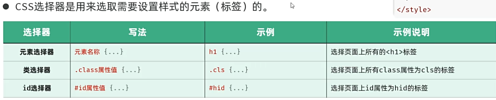
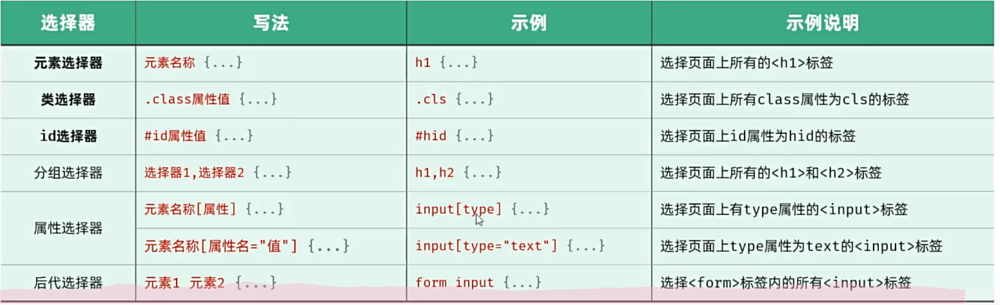
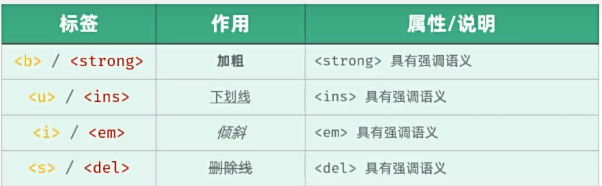
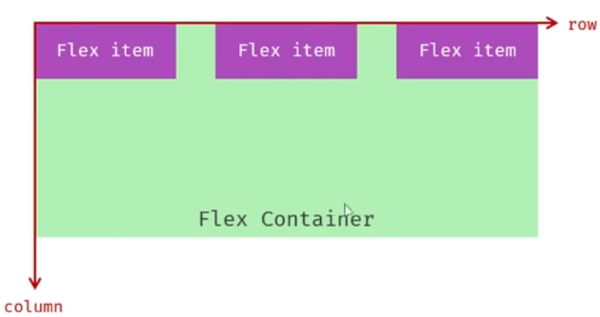
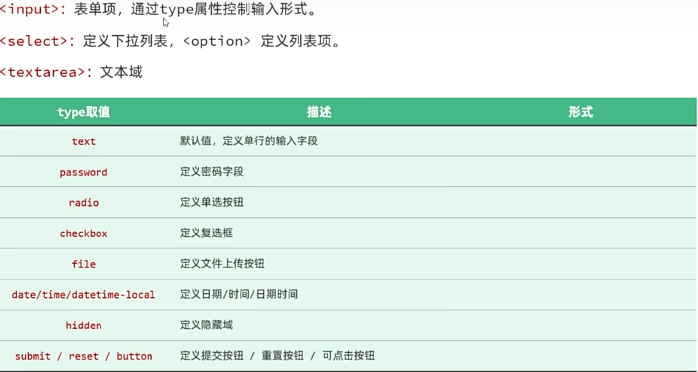

# 开始

# 主体结构

```html
<!-- 声明文档的类型为html -->
<!DOCTYPE html>
<html lang="en">
<head>
    <!-- 指定字符集 -->
    <meta charset="UTF-8">
    <!-- 设置网页在移动设备上的显示宽度及缩放比例 -->
    <meta name="viewport" content="width=device-width, initial-scale=1.0">
    <title>Document</title>
</head>
<body>
    
</body>
</html>
```

# 内容

### \<a>标签，超链接

```html
<!DOCTYPE html>
<html lang="en">
<head>
    <meta charset="UTF-8">
    <meta name="viewport" content="width=device-width, initial-scale=1.0">
    <title>狼与香辛料</title>
</head>
<body>
    <h1>狼与香辛料</h1>
    <!--
        a是一个超链接标签
        href：表示的是链接地址
        target：打开方式
            _blank：新窗口打开
            _self：本窗口打开（默认）
    -->
    <a href = "https://www.bing.com/search?q=%E7%8B%BC%E4%B8%8E%E9%A6%99%E8%BE%9B%E6%96%99&form=ANNTH1&refig=68079015812d4a09bbd6eb5c8ba609d3&pc=CNNDDB&ucpdpc=UCPD&adppc=EdgeStart" target = _blank>狼与香辛料</a>

</body>
</html>
```

### css样式


```html
<!DOCTYPE html>
<html lang="zh">
<head>
    <meta charset="UTF-8">
    <meta name="viewport" content="width=device-width, initial-scale=1.0">
    <title>狼与香辛料</title>

    <!-- 通过link标签引入.css文件，在后面的body里，可以之间调用.css文件里定义的类 -->
    <link rel="stylesheet" href="color.css">

    <!-- 所有body里面的span标签里默认就是这个颜色 -->
    <style>
         span{
            color:aqua;
        } 
    </style>
    
</head>
<body>
    <h1>狼与香辛料</h1>
    <p><a href = "https://www.bing.com/search?q=%E7%8B%BC%E4%B8%8E%E9%A6%99%E8%BE%9B%E6%96%99&form=ANNTH1&refig=68079015812d4a09bbd6eb5c8ba609d3&pc=CNNDDB&ucpdpc=UCPD&adppc=EdgeStart" target = "_blank">狼与香辛料</a><p>
    
	<!-- 行内样式 -->    
    <span style = "color:blueviolet;">2025.4.22</span>
    
    <!-- 内部样式 -->
    <p><span>222</span></p>
    
    <!-- 外部样式 -->
    <h2 class = "op">111</h2>
    
   

</body>
</html>
```

### CSS选择器



```html
<!--也是上述的三种用法：句中，内部，外部-->
<!DOCTYPE html>
<html lang="zh">
<head>
    <meta charset="UTF-8">
    <meta name="viewport" content="width=device-width, initial-scale=1.0">
    <title>狼与香辛料</title>

    <link rel="stylesheet" href="css/color.css">

    <style>
         span{
            color:aqua;
        } 
        .app{
            color:#ff0000;
        }
        #time{
            color:chartreuse;
        }
    </style>
</head>
<body>
    <h1>狼与香辛料</h1>
    <p>

        <a href = "https://www.bing.com/search?q=%E7%8B%BC%E4%B8%8E%E9%A6%99%E8%BE%9B%E6%96%99&form=ANNTH1&refig=68079015812d4a09bbd6eb5c8ba609d3&pc=CNNDDB&ucpdpc=UCPD&adppc=EdgeStart" target = "_blank">狼与香辛料</a>
    
        <span id = "time">2025.4.22</span>
    </p>
    <p>
        
    </p>
    <span>666</span>
    <span class = "app">777</span>

</body>
</html>
```



### video标签

```html
<!--video标签的属性
        src：视频地址
        controls：显示播放控件
        autoplay：自动播放
        width：视频宽度（建议：宽度和高度只设置一个即可，另一个会等比例缩放）
        height：视频高度
            单位：
                px：像素
                %：百分比（相对于父元素的百分比）
    -->
<video src = "video/news.mp4" controls width = "80%"></video>
```

### img标签

```html
 <!--img标签属性
        src：图片的访问地址
            1.绝对路径
                1.1绝对的磁盘路径：C:\Users\Administrator\Desktop\img\1.gif（不推荐）
                1.2绝对的URL（网络）路径：https://tv.cctv.com/img/1.gif
            2.相对路径
                2.1相对的磁盘路径：\img\1.gif
                2.2相对的URL路径：/img/1.gif
                    描述：
                        （1）./当前目录(可以省略)
                        （2）../上一级目录
        alt：图片描述
        width：图片宽度
        height：图片高度
    -->
    </img>
```

### b和strong标签

**加粗**

### &nbfp

实体空格

### p标签



段落

```html
<style>
	p{
            /*行高*/
            line-height:2;/*两倍行高*/
            /*首行缩进*/
            text-indent:2em;/*缩进两个字符*/
        }
</style>
```

# 整体布局

### div

```html
<style>
	.content-container{
            width:70%;
            margin:0 auto;
            padding:20px;
            box-sizing:border-box;
        }
</style>
<body>
    <div class = "content-container">
        <!--内容-->
    </div>
</body>
```

### 盒子模型

* 盒子：页面中所有的元素（标签），可以看作是一个**盒子**，由盒子将页面元素包含在一个矩形区域内，通过盒子的视角更方便进行页面布局
* 盒子模型组成：
* * 内容区域（content）
  * 内边距区域（padding）
  * 边框区域（border）
  * 外边距区域（margin）


**布局标签**：网页开发中，会使用$div$和$span$这两个没有语义的布局标签。

**特点**：

		1.  \<div>标签：一行只显示一个（独占一行），默认宽度是父元素的宽度，高度默认由内容撑开，可以设置宽高（width，height）
		1.  \<span>标签：一行可以显示多个，宽度和高度默认由内容撑开，不可设置宽高（width，height）

### flex布局

* **flex**是**flexible Box**的缩写，意为“弹性布局”，是一种一维的布局模式。flex布局可以为元素之间提供强大的空间布局和对其能力
* 通过给父容器添加flex的相关属性，来控制子元素的位置和排列方式




### 表单标签



```html
<!DOCTYPE html>
<html lang="en">
<head>
    <meta charset="UTF-8">
    <meta name="viewport" content="width=device-width, initial-scale=1.0">
    <title>Document</title>
</head>
<body>
    <!-- form表单：
            action：表单数据提交的url地址 
                get:默认，表单数据会出现在url后面，形式：/save?name=Tom&age=18
                    特点：
                        1.如果表单中包含了隐私数据，get方式并不安全，不推荐使用该方式
                        2.在浏览器中get请求的大小是有限制的，不适合提交大数据量的表单
                post:表单数据会在消息体/请求体中提交到服务器
                    特点：
                        1.安全。
                        2.请求大小没有限制
        注意：表单项要想能够采集数据，必须得设置name属性，表示当前表单项的名字
    -->
    <form action="/save" methord="get">
        姓名：<input type="text" name="name">
        年龄：<input type="text" name="age">
        <input type="submit" value="提交">
    </form>
</body>
</html>
```

### table表格

```html
<table>
            <thead>
                <tr>
                    <th>姓名</th>
                    <th>性别</th>
                    <th>头像</th>
                    <th>职位</th>
                    <th>入职时间</th>
                    <th>最后操作时间</th>
                    <th>操作</th>
                </tr>
            </thead>
            <tbody>
                <tr>
                    <td>徐绮</td>
                    <td>男</td>
                    <td></td>
                    <td>班主任</td>
                    <td>2020-01-01</td>
                    <td>2023-07-22 12:00:00</td>
                    <td class="action-buttons">
                        <button>编辑</button>
                        <button class="delete">删除</button>
                    </td>
                </tr>
                <tr>
                    <td>徐绮</td>
                    <td>女</td>
                    <td></td>
                    <td>讲师</td>
                    <td>2021-02-15</td>
                    <td>2023-07-22 13:00:00</td>
                    <td class="action-buttons">
                        <button>编辑</button>
                        <button class="delete">删除</button>
                    </td>
                </tr>
                <tr>
                    <td>angel beats</td>
                    <td>男</td>
                    <td></td>
                    <td>学工主管</td>
                    <td>2019-03-10</td>
                    <td>2023-07-22 14:00:00</td>
                    <td class="action-buttons">
                        <button>编辑</button>
                        <button class="delete">删除</button>
                    </td>
                </tr>
            </tbody>
        </table>
```

# JavaScript

### JS引入方式

* 内部脚本：将JS代码定义在HTML页面中
* * JavaScript代码必须位于**\<script>\</script>**标签之间
  * 在HTNL文档中，可以在任意地方，放置任意数量的**\<script>**
  * 一般会把脚本至于**\<body>**元素的底部，**$可改善显示速度$**

* 外部脚本：将JS代码定义在外部JS文件中，然后引入到HTML页面中

### JS三种输出方式

```javascript
<script>
    let op = 333;//定义变量
	const ow = 22;//定义常量
    alert(op);//弹出警告框
    console.log(op);//输出到控制台
    document.write(op);//直接输出到body区域，在页面当中显示（不常用）
   </script>
```

### JS的数据类型

* JavaScript的数据类型分为：基本数据类型和引用数据类型（对象）
* 基本数据类型：
* * number：数字（整数、小数、NaN（Not a Number））
  * boolean：布尔。
  * null：对象为空。
  * undefined：当声明的变量未初始化时，该变量的默认值时 undefined
  * string：字符串、单引号、双引号、反引号，推荐使用单引号

### 函数

* 定义：JavaScript中函数通过function关键字进行定义，语法为：

```javascript
function functionName(参数1, 参数2){
    //代码
}
function add(a, b){
    return a + b;
}
```

**匿名函数**：

函数表达式：

```javascript
let add = function(a, b){
	return a + b
}
```

箭头函数：

```javascript
let add = (a, b) => {
	return a + b;
}
```

**对象**：


```javascript
let user = {
    name:  'Tom',
    age: 18,
    gender: '男',
    sing: () => {//注意：箭头函数中，this并不指向当前对象 - 指向的是当前对象的父级
        alert(this.name + 'angel beats');
    }
}
```

```html
<script>
    var name = 'Anin';
    let user = {
      name:  'Tom',
      age: 18,
      gender: '男',
      sing: () => {//注意：箭头函数中，this并不指向当前对象 - 指向的是当前对象的父级
        alert(this.name + 'angel beats');
      }
    }
    user.sing();//输出为 Aninangel beats
   </script>
```

### json

* 概念：JavaScript Object Notation，JavaScript对象标记法（JS对象标记法书写的文本）
* 由于其语法简单，层次结构鲜明，现多用于作为数据载体， 在网络中进行数据传输

**JS对象**

```javascript
{
	name: 'Tom',
	age: 20,
	gender: '男'
}
```

**json文本**

```json
{
	"name": "tom",
	"age": 20,
	"gender": "男"
}
```

```js
// 假设这是从服务器获取的 JSON 字符串
const jsonString = '{"name": "张三", "age": 25, "email": "zhangsan@example.com", "skills": ["JavaScript", "HTML", "CSS"]}';

// 解析 JSON 字符串为 JavaScript 对象
const data = JSON.parse(jsonString);

// 使用解析后的数据
console.log(data.name); // 输出: 张三
console.log(data.age);  // 输出: 25
console.log(data.email); // 输出: zhangsan@example.com
console.log(data.skills); // 输出: ["JavaScript", "HTML", "CSS"]


// 将 JavaScript 对象转换为 JSON 字符串
const jsonString = JSON.stringify(data);

// 输出 JSON 字符串
console.log(jsonString); // 输出: {"name":"张三","age":25,"email":"zhangsan@example.com","skills":["JavaScript","HTML","CSS"]}
```


### DOM

* 概念：Document Object Model 文档对象模型
* 将标记语言的各个组成部分封装为对应的对象：
* * Document：整个文档对象
  * Element：元素对象
  * Attribute：属性对象
  * Text：文本对象
  * Comment：注释对象

* JavaScript 通过DOM，就能对HTML进行操作：
* * 改变 HTML 元素的内容
  * 改变 HTML 元素的样式（CSS）
  * 对 HTML DOM 时间做出反应
  * 添加和删除 HTML 元素

### DOM操作

* DOM操作核心思想：将网页中所有的元素当作对象来处理。（标签的所有属性在该对象上都可以找到）
* 操作步骤：
* * 获取要操作的DOM元素对象
  * 操作DOM对象的属性或方法

* 获取DOM对象
* * 根据CSS选择器来获取DOM元素，获取匹配到的第一个元素：document.querySelector('选择器')
  * 根据CSS选择器来获取DOM元素，获取匹配到的所有元素：document.querySelectorAll('选择器')，注意：得到的是一个NodeLIst节点集合，是一个伪数组（有长度、有索引的数组）

```javascript
//1.修改第一个h1标签中的文本内容
    //1.1获取DOM对象

    //let h1 = document.querySelector('h1');
    //h1.innerHTML = '修改后的文档';
    let hs = document.querySelectorAll('h1');
    hs[2].innerHTML = '9999';

    //1.2调用DOM对象中属性或方法
```

# 什么是事件？什么是事件监听？

* 事件：HTML事件是放生在HTML元素上的“事情”。比如：
* * 按钮被点击
  * 鼠标移到元素上
  * 按下键盘按钮
* 事件监听：JavaScript可以在事件触发时，就立即调用一个函数做出响应，也被称为**事件绑定**和**注册事件**

### 事件监听

* 语法：事件源 .addEventListener('事件类型', 事件触发执行的函数);
* 事件监听三要素
* * 事件源：哪个DOM元素触发了事件，要获取DOM元素
  * 事件类型：用什么方式触发，比如：鼠标单击 click
  * 事件触发执行的函数：要做什么事

```html
<script>
    // 事件监听 - addEventListener（可以多次绑定同一事件）
    document.querySelector('#btn1').addEventListener('click', () => {
      console.log('试试就试试');
    });
    document.querySelector('#btn1').addEventListener('click', () => {
      console.log('试试就试试111111');
    });

    //事件绑定-早期写法 - onclick（如果多次绑定同一事件，覆盖）
    document.querySelector('#btn2').onclick = () => {
      console.log('歪比吧卜');
    }
    document.querySelector('#btn2').onclick = () => {
      console.log('歪比吧卜2222');
    }
  </script>
```

### 事件监听能够实现的原因

在程序没有显示编写无限循环的情况下，移动鼠标时能够实时读入数据并触发监听事件，只要依赖于操作系统和编程语言提供的事件驱动机制。这种机制通过异步方式处理输入，而不是通过轮询来检测变化。

* **事件驱动机制的工作原理**：

操作系统和浏览器会维护一个事件队列(Event Queue)，所有外部输入（如鼠标移动、键盘按键、网络请求等）都会被转换为事件放入队列中。程序通过**事件循环**（Event Loop）不断从队列中取出事件，并分发给对应的函数（监听器）

操作系统对**外部信息的输入的检测**是依赖硬件中断来触发操作，而不是主动循环检查

### 常见的事件


### JS的封装

```html
<!DOCTYPE html>
<html lang="en">

<head>
    <meta charset="UTF-8">
    <meta http-equiv="X-UA-Compatible" content="IE=edge">
    <meta name="viewport" content="width=device-width, initial-scale=1.0">
    <title>JS-事件-常见事件</title>
</head>

<body>
    <form action="" style="text-align: center;">
        <input type="text" name="username" id="username">
        <input type="text" name="age" id="age">
        <input id="b1" type="submit" value="提交">
        <input id="b2" type="button" value="单击事件">
    </form>

    <br><br><br>

    <table width="800px" border="1" cellspacing="0" align="center">
        <tr>
            <th>学号</th>
            <th>姓名</th>
            <th>分数</th>
            <th>评语</th>
        </tr>
        <tr align="center">
            <td>001</td>
            <td>张三</td>
            <td>90</td>
            <td>很优秀</td>
        </tr>
        <tr align="center" id="last">
            <td>002</td>
            <td>李四</td>
            <td>92</td>
            <td>优秀</td>
        </tr>
    </table>
    <script src="./js/utils.js"></script>
    <script src="./js/eventDemo.js"></script><!--通过引入多个js文件，这样所有的js文件都是全局，一个js文件可以调用另一个js文件里的函数-->
</body>

</html>
```

也可以使用模块化js

```js
import { printlog } from "./utils.js";
```

```js
export function printlog(msg){
    console.log(msg);
}
```

然后再html里面引入js时声明一下是模块类型

```html
<script src="./js/eventDemo.js" type="module"></script>
```

# Vue.js


