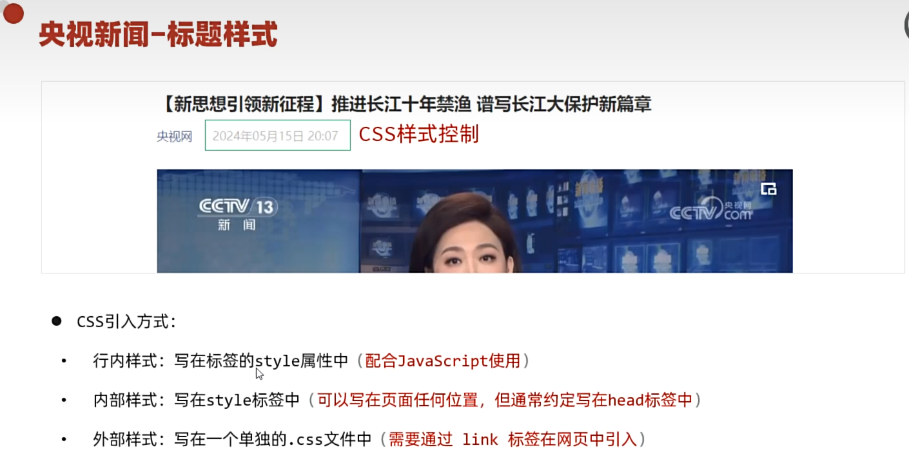
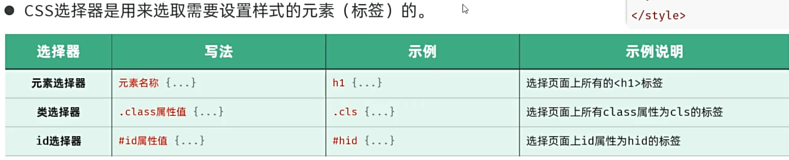
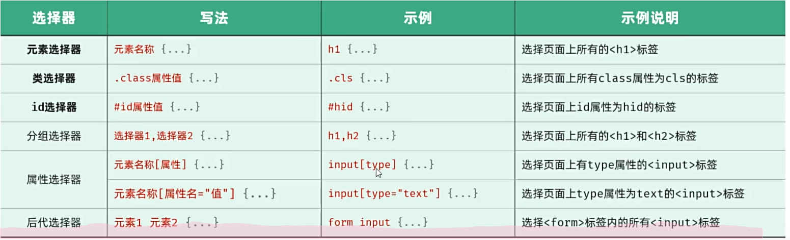
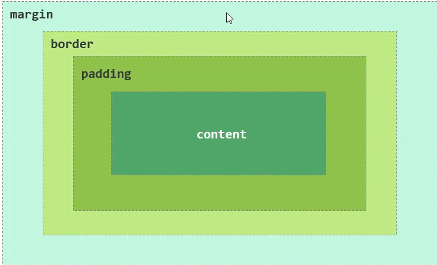
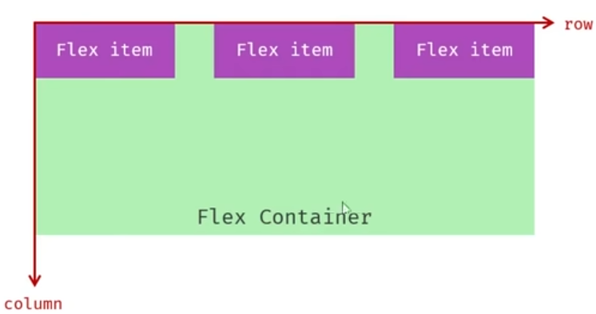

# 开始

# 主体结构

```html
<!-- 声明文档的类型为html -->
<!DOCTYPE html>
<html lang="en">
<head>
    <!-- 指定字符集 -->
    <meta charset="UTF-8">
    <!-- 设置网页在移动设备上的显示宽度及缩放比例 -->
    <meta name="viewport" content="width=device-width, initial-scale=1.0">
    <title>Document</title>
</head>
<body>
    
</body>
</html>
```

# 内容

### \<a>标签，超链接

```html
<!DOCTYPE html>
<html lang="en">
<head>
    <meta charset="UTF-8">
    <meta name="viewport" content="width=device-width, initial-scale=1.0">
    <title>狼与香辛料</title>
</head>
<body>
    <h1>狼与香辛料</h1>
    <!--
        a是一个超链接标签
        href：表示的是链接地址
        target：打开方式
            _blank：新窗口打开
            _self：本窗口打开（默认）
    -->
    <a href = "https://www.bing.com/search?q=%E7%8B%BC%E4%B8%8E%E9%A6%99%E8%BE%9B%E6%96%99&form=ANNTH1&refig=68079015812d4a09bbd6eb5c8ba609d3&pc=CNNDDB&ucpdpc=UCPD&adppc=EdgeStart" target = _blank>狼与香辛料</a>

</body>
</html>
```

### css样式



```html
<!DOCTYPE html>
<html lang="zh">
<head>
    <meta charset="UTF-8">
    <meta name="viewport" content="width=device-width, initial-scale=1.0">
    <title>狼与香辛料</title>

    <!-- 通过link标签引入.css文件，在后面的body里，可以之间调用.css文件里定义的类 -->
    <link rel="stylesheet" href="color.css">

    <!-- 所有body里面的span标签里默认就是这个颜色 -->
    <style>
         span{
            color:aqua;
        } 
    </style>
    
</head>
<body>
    <h1>狼与香辛料</h1>
    <p><a href = "https://www.bing.com/search?q=%E7%8B%BC%E4%B8%8E%E9%A6%99%E8%BE%9B%E6%96%99&form=ANNTH1&refig=68079015812d4a09bbd6eb5c8ba609d3&pc=CNNDDB&ucpdpc=UCPD&adppc=EdgeStart" target = "_blank">狼与香辛料</a><p>
    
	<!-- 行内样式 -->    
    <span style = "color:blueviolet;">2025.4.22</span>
    
    <!-- 内部样式 -->
    <p><span>222</span></p>
    
    <!-- 外部样式 -->
    <h2 class = "op">111</h2>
    
   

</body>
</html>
```

### CSS选择器



```html
<!--也是上述的三种用法：句中，内部，外部-->
<!DOCTYPE html>
<html lang="zh">
<head>
    <meta charset="UTF-8">
    <meta name="viewport" content="width=device-width, initial-scale=1.0">
    <title>狼与香辛料</title>

    <link rel="stylesheet" href="css/color.css">

    <style>
         span{
            color:aqua;
        } 
        .app{
            color:#ff0000;
        }
        #time{
            color:chartreuse;
        }
    </style>
</head>
<body>
    <h1>狼与香辛料</h1>
    <p>

        <a href = "https://www.bing.com/search?q=%E7%8B%BC%E4%B8%8E%E9%A6%99%E8%BE%9B%E6%96%99&form=ANNTH1&refig=68079015812d4a09bbd6eb5c8ba609d3&pc=CNNDDB&ucpdpc=UCPD&adppc=EdgeStart" target = "_blank">狼与香辛料</a>
    
        <span id = "time">2025.4.22</span>
    </p>
    <p>
        
    </p>
    <span>666</span>
    <span class = "app">777</span>

</body>
</html>
```



### video标签

```html
<!--video标签的属性
        src：视频地址
        controls：显示播放控件
        autoplay：自动播放
        width：视频宽度（建议：宽度和高度只设置一个即可，另一个会等比例缩放）
        height：视频高度
            单位：
                px：像素
                %：百分比（相对于父元素的百分比）
    -->
<video src = "video/news.mp4" controls width = "80%"></video>
```

### img标签

```html
 <!--img标签属性
        src：图片的访问地址
            1.绝对路径
                1.1绝对的磁盘路径：C:\Users\Administrator\Desktop\img\1.gif（不推荐）
                1.2绝对的URL（网络）路径：https://tv.cctv.com/img/1.gif
            2.相对路径
                2.1相对的磁盘路径：\img\1.gif
                2.2相对的URL路径：/img/1.gif
                    描述：
                        （1）./当前目录(可以省略)
                        （2）../上一级目录
        alt：图片描述
        width：图片宽度
        height：图片高度
    -->
    </img>
```

### b和strong标签

**加粗**

### &nbfp

实体空格

### p标签


段落

```html
<style>
	p{
            /*行高*/
            line-height:2;/*两倍行高*/
            /*首行缩进*/
            text-indent:2em;/*缩进两个字符*/
        }
</style>
```

# 整体布局

### div

```html
<style>
	.content-container{
            width:70%;
            margin:0 auto;
            padding:20px;
            box-sizing:border-box;
        }
</style>
<body>
    <div class = "content-container">
        <!--内容-->
    </div>
</body>
```

### 盒子模型

* 盒子：页面中所有的元素（标签），可以看作是一个**盒子**，由盒子将页面元素包含在一个矩形区域内，通过盒子的视角更方便进行页面布局
* 盒子模型组成：
* * 内容区域（content）
  * 内边距区域（padding）
  * 边框区域（border）
  * 外边距区域（margin）



**布局标签**：网页开发中，会使用$div$和$span$这两个没有语义的布局标签。

**特点**：

		1.  \<div>标签：一行只显示一个（独占一行），默认宽度是父元素的宽度，高度默认由内容撑开，可以设置宽高（width，height）
		1.  \<span>标签：一行可以显示多个，宽度和高度默认由内容撑开，不可设置宽高（width，height）

### flex布局

* **flex**是**flexible Box**的缩写，意为“弹性布局”，是一种一维的布局模式。flex布局可以为元素之间提供强大的空间布局和对其能力
* 通过给父容器添加flex的相关属性，来控制子元素的位置和排列方式


