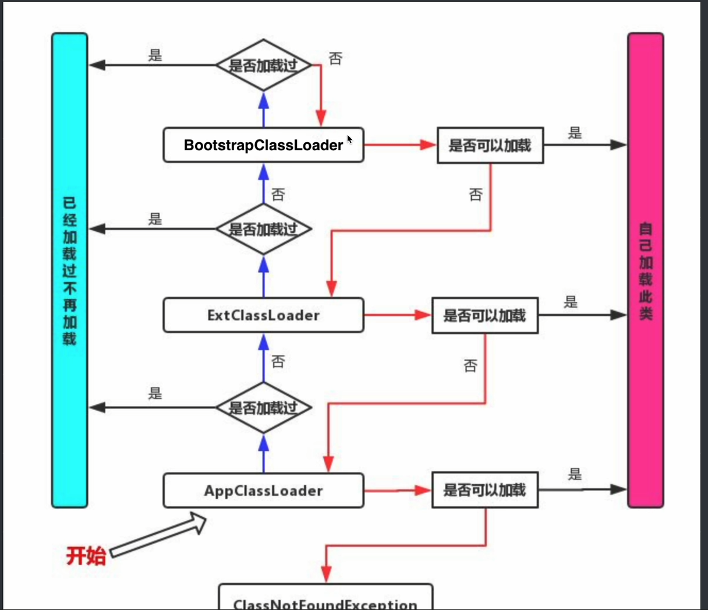

# JAVA数组

```java
int[] a = new int[5];
int[] b = new int[]{1, 2, 3, 4, 5, };
int[] b = {1, 2, 3, 4, 5, };


public static void equals(int[] a, int[] b){//这里的参数是引用类型，直接指向的外面的原本的数组，不会复制后传入
     int check = 0;
        for(int i = 0; i < 5; i++){
            if(a[i] != b[i]){
                check = 1;
                break;
            }
        }
        if(check == 1){
            System.out.println("false");
        }
        else {
            System.out.println("true");
        }
}


final int[] arr = new int[]{1, 2, 3, 4, 5};
arr[0] = 100;//这样是可以修改的
arr = new int[5];//这样是不行的，因为arr之前加了final，使arr不能改变指向的地址

```

# 可变长参数

```java
public class Main{
    public static void main(String[] args){
        text("1", "2", "3", "4");
    }
    public static void text(String... str){//相当于传入的是可变长数组，str的使用方式和数组是一样的
        for(String i : str){
            System.out.println(i);
        }
    }
}
```

# 字符串

```java
String str = "yaolei";//一旦定义出来的了不可以修改，只能重新指向一个新的字符串实例


//这里定义的时候两个字符串相同a1和a2指向的是同一个对象，为了优化效率，地址是一样的
String a1 = "zzx";
String a2 = "zzx";


//但是这样new出来的是指向的两个不同的对象，地址不一样
String a3 = new String("zzx");
String a4 = new String("zzx");

String c = a4.substring(0, 3);//裁剪 0 到 2 的字符,并储存在c中

String str = "yao lei";
String[] p = str.split(" ");//以空格作为分割，分割成多个字符串，储存在字符串数组里面，进行判断分割的那个字符串不会被储存

char[] pp = str.toCharArray();//字符串类转换成char数组

char ppp = str.charAt(3);//获取单个字符

String pi = str.toUpperCase();//全部转换成大写字母

String pj = str.toLowerCase();//全部转换成小写字母

system.out.println(str.startsWith("HE"));//判断是否以"HE"开头

int index = str.indexOf("hhh");//查找字符串"hhh"的出现位置，若出现返回下标，若无返回-1

int index1 = str.lastIndexOf("y");//查找最后一次出现的位置，返回下标，若没出现返回-1

boolean st = str.isEmpty();//判断字符串是否为空串，若空返回true， 非空返回false

String hhh = str.replace("hello", "Hi");//将字符串指定的一串字符替换为另一串字符，若“hello”不存在则不替换，替换是替换所有的，例：有3个替换3个
```


# StringBuilder类

StringBuilder类， 是专门用于构造字符串的，可以对字符串进行拼接，裁剪等操作，他像一个字符串编辑器，弥补了字符串不能修改的不足

```java
public class Main{
    public static void main(String[] args){
       StringBuilder builder = new StringBuilder();//开始创建时，什么都没有
       builder.append("AAA");//我们可以使用append方法来将字符串拼接到后面
       builder.append("BBB");
       builder.delete(0, 2);//删除0到1的字符
       builder.replace(0, 2, "Zouzixi");//替换0到1的字符为指定字符串
       //因为StringBuilder类的函数会返回它本身，所以也可以用下面这种方法写：
       /*
       builder
       			.append("AAA")
       			.append("BBB")
       			.delete(0, 2)
       			.replace(0, 2, "Zouzixi");
       */
       System.out.println(builder.toString()); //当我们字符串编辑完成后，可以使用toString来转换为字符串
    }
}
```


```java
String a = "yqolei";
Integer b = 20;
String c = a + b;//b会自动调用b.toString();
System.out.println(c);//输出会是yaolei20
```


编译时会进行优化

原代码：

```java
public class Main{
    public static void main(String[] args){
        String a = "yqolei";
        String c = "zouzixi" + "yaolei";//这里
        System.out.println(c);
    }
}
```

编译后代码：

```java
//
// Source code recreated from a .class file by IntelliJ IDEA
// (powered by FernFlower decompiler)
//

public class Main {
    public Main() {
    }

    public static void main(String[] args) {
        String a = "yqolei";
        String c = "zouzixiyaolei";//这里
        System.out.println(c);
    }
}

```

# 正则表达式

```java
String str = "oooa";
System.out.println(str.matches(O*a+));//这里输出的是true
```

//正则表达式的描述字符

| 字符  |                             描述                             |
| ----- | :----------------------------------------------------------: |
| *     | 匹配前面的子表达式零次或多次。例：zo*能匹配"z"以及"zoo"。\*等价于{0,}。 |
| +     | 匹配前面的表达式一次或多次。例：zo+能匹配"zo"以及"zoo"，但不能匹配"z"。+等价于{1,}。 |
| ?     | 匹配前面的子表达式零次或一次。例：do(es)?可以匹配"do"、"does"、"doxy"中的"do"。?等价于{0,1}。 |
| {n}   | n是一个非负整数。匹配确定的n次。例：o(2)不能匹配"Bob"中的o，但能匹配"food"中的两个o。 |
| {n,}  | n是一个非负整数。至少匹配n次。例：o{2,}不能匹配"Bob"中的o，但能匹配"foooood"中所有的o。o{1,}等价于o+。o{0,}则等价于o*。 |
| {n,m} | m和n均为非负整数，其中n <= m。最少匹配n次且最多匹配m次。例：o{1, 3}将匹配"foooooood"中的前三个o。o{0,1}等价于o？。注意逗号和两个数之间不能有空格。 |

如果我们想要表示一个范围内的字符，可以使用方括号：

```java
public static void main(String[] args){
	String str = "abcabccaa";
	System.oout.println(str.matches("[abc]*"));//表示abc这几个字符可以出现0 ~ n 次
}
```

对于普通字符来说，我们可以下面的方式实现多种字符匹配：

|  字符  |                             描述                             |
| :----: | :----------------------------------------------------------: |
| [ABC]  | 比配[...]中的所有字符，例：[aeiou]匹配字符串"google runoob taobao"中的e o u a 字母。 |
| [^ABC] | 匹配除了[...]中的所有字符，例：\[^aeiou]匹配字符串"google runoob taobao"中除了e o u a 字母的所有字母。 |
| [A-Z]  | [A-Z]表示一个区间，匹配所有大写字母，[a-z]表示所有小写字母。 |
|   .    |    匹配除换行符(\n、\r)之外的任何单个字符，相当于\[^\n\r]    |
| [\s\S] | 匹配所有。\s是匹配所有空白符，包括换行，\S非空白符，不包括换行 |
|   \w   |          匹配字母、数字、下划线。等价于[A-Za-z0-9_]          |

# HashMap

```java
import java.util.Map;
import java.util.HashMap;

public class Main{
    public static void main(String[] args){
        Map<String, Integer> hashmap = new HashMap<>();
        
        hashmap.put("yaolei", 1234);//插入，如果已有键会使新插入的覆盖以前的
        
        hashmap.get("yaolei");//通过键寻找值，若查找不到则返回nul
        
        hashmap.remove("yaolei");//通过键移除键值对，若找不到键返回null
        
        Set<String> keyset = hashmap.keySet();//这个函数返回一个包含所有键的集合，这个函数的返回值是Set接口类型
        boolean st = keyset.contains("zouzixi");//判断这个键是否出现过
        for(String key : keyset){
            System.out.println(key);
        }
        
    }
}
```

# Set与Map

Set是用来存储唯一的元素集合，Map是用来建立键值对应关系

Set可以去重，Map可以查找

例如电话：

如果只需要存储不重复的号码，用Set\<String>

如果需要存储(姓名-号码)对应关系，用Map<String, String>

# 类

1. 外部类：public:所有地方，protected：类的内部和同一包中的类，private：类的内部
2. 内部类：public：所有，static：他是属于类的不属于实例，可以调用外部类的静态方法和静态成员，不可以访问非静态
3. 局部类：写在局部的类，只在局部起作用，例如：写在方法里面的类
4. 接口：必须全是抽象方法和静态常量（满足定义跨继承体系的行为，支持多继承，满足定义API规范）
5. 抽象类：可以有抽象方法也可以有具体方法，成员变量也可以是三种类型（多个子类共享代码，满足控制继承体系的结构，满足提供基础实现）

### 匿名内部类

可以直接创一个接口的全部抽象方法实现，或者抽象类的特定抽象方法实现

##### 抽象类的匿名内部类：

```java
package com.dash;

public abstract class Test{
    public int age;
    public abstract void test();
}
```

```java

import com.dash.Test;

public class Main{
    public static void main(String[] args){
        Test test = new Test(){//创建的时候加个大括号将选定抽象方法实现，这个就是匿名内部类，底层逻辑为创建一个类、实例化、然后把类销毁，它本质上是对应类型的子类
            {
                age = 10;//这里必须要把他放在大括号内。1.因为匿名类没有显式的构造函数，匿名内部类不能定义构造函数（因为类没有名字），所以无法通过常规的构造方法初始化成员变量。2.实例初始化块的作用，大括号{...}是实例初始化块的语法，会在对象构造时执行，相当于类的构造函数中的代码
            }
            @Override
            public void test(){
                System.out.println("woaiyaolei");
            }
        };

        test.test();
    }
}
```

##### 接口的匿名内部类：

```java
package com.dash;

public interface Study {
    void study();
    void hit();
}
```

```java
import com.dash.Study;

public class Main{
    public static void main(String[] args){
    Study study = new Study(){
            public void study(){

            }
            public void hit(){

            }
        };
    }
}
```

# Lambda表达式

```java
package com.dash;

public interface Study {
    int study(int a， int b);
    default void hit(){}
}
```

```java
import com.dash.Study;
public class Main{
    public static void main(String[] args){
        int x = 10
        //x = 20;这样就是错的，x已经相当于final int x了
        Study study = (int a, int b) -> {//如果没有参数的话，小括号里面就不写
            System.out.println("class" + x);//x在Lambda表达式里面应用，它不能在被改变，相当于final int类型的，这里面的x写成x++也不行，就是一点都不能改
            return a;
        };
    }
}
```

# 方法引用

```java
package com.dash;
public interface Study {
    String hhh();
}
```

```java
import com.dash.Study;
public class Main{
    public static void main(String[] args) {
        Main main = new Main();
        Study study = main::xxx;//成员方法要先创建实例才能引用，静态方法可以直接引用例如 = Integer::sum;
        						//也可以引用构造方法，例如 = String::new;
        System.out.println(study.hhh());
    }
    public String xxx(){
        return "yaoolei";
    }
}
```

# 抛出异常

```java
public class Main{
    public static void main(String[] args) {
      System.out.println(test(3 , 0));
    }
    public static int test(int a, int b){
        if(b == 0){
            throw new ArithmeticException("除数不能为0");//抛出异常，异常也是一个类要先实例化再用，这里是简写的
        }
        return a / b;
    }
}
```

抛出异常也可以交给上一级的方法去处理，需要将异常添加到方法标签

```java
 public static int test(int a, int b) throw {
        if(b == 0){
            throw new ArithmeticException("除数不能为0");//抛出异常，异常也是一个类要先实例化再用，这里是简写的
        }
        return a / b;
    }
```

# 捕获异常

```java
	try{
          int[] arr = new int[100];
          arr[-1] = 10;
      }catch(NullPointerException | ArrayIndexOutOfBoundsException e){//这样可以连着写，相当于或
          System.out.println("异常");//如果捕获到异常就执行这个语句
          e.printStackTrace();//这个语句可以打印出异常信息，但不会中断程序
          throw e;//这个语句会抛出异常，导致程序中断
      }finally{//不管有没有捕获到异常都会执行，除非是在更外层重新捕获异常
          System.out.println("woshi finally");
      }
```

捕获异常可以是程序遇到异常时不会崩溃，但是会发出异常信息

抛出异常程序中断，捕获异常使程序继续

Throwable类使Exception类和Error类的超类，try{}catch{}通常只用于捕获Exception类以及其子类，Error类都是重大问题了，可能会导致程序出现重大问题，通常不进行捕获使程序继续运行

# 断言表达式

这个通常用来调试程序

```java
public class Main{
    public static void main(String[] args){
        int a = 10;
      assert a > 10 : "yaolei";//assert是一个关键字，它后面接一个返回值为boolean类型的东西，若为false，则会抛出错误程序终止，若为true，则无事发生，冒号后面的String会在抛出异常的时候打印出来，冒号以及冒号后面的也可以不写
    }
}
```

# 数学工具类

在java.lang.Math里面，不用我们自己去import，java.lang这个包是默认import到我们写的所有类中了的

```java
Math.abs();//会根据参数来返回相应的类型
Math.max();
Math.min();
Math.sqrt();
Math.pow();
Math.log();//相当于ln();
Math.log10();
Math.ceil(4.5);//向上取整
Math.floor(5.6);//向下取整

//三角函数
Math.sin(Math.PI / 2);
Math.cos(Math.PI);
Math.tan(Math.PI / 4);

//反三角函数
Math.asin(1);
Math.acos(1);
Math.atan(0);
```

随机数在java.util.Random这个类里面，使用的话需要导入

```java
import java.util.Array;
public class Main{
	public static void main(String[] args){
		Random random = new Random();
		for(int i = 0; i < 30; i++){
			System.out.print(random.nextInt(100) + " ");//nextInt方法可以创建0 - x之内的随机数
		}
	}
}
//random.nextLong();
//random.nextFloat();
//random.nextBoolean();
//random.Gaussian();
```

# 数组工具类

在java.util.Arrays类里面，使用需要导入

```java
import java.util.Arrays;
public class Main{
	public static void main(String[] args){
		int[] arr = new int[]{1, 2, 3, 4, 5};
		int[] arr1 = {1, 2, 3, 4, 5};
		System.out.println(Arrays.toString(arr));//这里也是重写过的
		System.out.println(Arrays.equals(arr, arr1));//这里的equals是经过了重写的
	}
}

//如果遇到多维数组
Arrays.deeptoString(arr);//
//排序
Arrays.sort(arr);//默认从小到大
//copy
int[] arr3 = Arrays.copyOf(arr, 4);//复制0到3的数字
int[] target = Arrays.copyOfRange(arr, 2, 5);//复制2到4的数字

int[] arr4 = new int[10];
System.arraycopy(arr, 0, arr4, 0, 5);//从arr数组的0位置开始5个长度，复制到arr4的0位置开始的空间，这个不需要Arrays类

//填充
int[] arr4 = Arrays.fill(arr, 5);//全部填充为5

//搜索
int[] arr = {1, 5, 6, 3, 7, 0};
arr.Arrays.sort(arr);//返回值为void,是在数组里直接更改
Arrays.binarySearch(arr, 3);//在有序数组中找到3，并返回下标，内部实现为二分搜索，默认从小到大查找

Integer array = new Integer[]{1, 0, 4, 5, 9, 3};
Arrays.sort(array, new Comparator<Integer>() {//这里的Comparator是一个泛型接口，使用需要先明确类型
            @Override
            public int compare(Integer o1, Integer o2) {
                return o2 - o1; // 从大到小排序
            }
        });


//从大到小查找
int index = Arrays.binarySearch(arr, 30, new Comparator<Integer>() {
            @Override
            public int compare(Integer o1, Integer o2) {
                return o2 - o1; // 与排序规则一致的比较器
            }
        });
```

# 泛型

是一个自定义的变量类型，他只有在使用时才会明确

```java
public class Score<T, U> {//泛型类需要使用<>，我们需要在里面添加1 - N个类型变量
    public String name;
    public U id;
    public T value;  //T会根据使用时提供的类型自动变成对应类型

    public Score(String name, U id, T value){ //这里T可以是任何类型，但是一旦确定，就不能修改了
        this.name = name;
        this.id = id;
        this.value = value;
        //T[] ttt = new T[10];泛型在未确定类型前不能实例化，也不能在静态方法中，因为静态方法属于类，但是泛型只有被实例化时才会明确使用类型
    }
}
```

```java
import java.util.*;
public class Main{
    public static void main(String[] args){
        Score<?, String> score = new Score<String, String>("zouzixi", "zzzz", "yaolei");
        //编译时会检查类型是不是你确定的类型
        Score<Integer, String> s2 = new Score<Integer, String>("djklas", "djlas", 100);

        Score<?, ?> s3 = score;
        System.out.println(s2.value);
    }
}
```

# 类型擦除

泛型只是在写代码的时候进行类型检查，但是最后都会被擦除，最后泛型变量有上界变上界，没上界变Object

```java
public class Score<T>{
    T t;
}
```

```java
public class Main{
    public static void main(String[] args){
        Score ttt = new Score<>();//在直接使用没有明确类型时，T类型就会变成Object类型
        ttt.t = "abcd";
        System.out.println(ttt.t);
    }
}
```

# 四大函数式接口

### Supplier

supplier源码:

```java
package java.util.function;
@FunctionalIterface
public interface Supplier<T>{
    get();
}
```


```java
import java.util.function.Supplier;

public class Main{
    public static void main(String[] args){
        Supplier<Student> studentSupplier = Student::new;//这个是由Lambda表达式转化过来的
        //Supplier<Student> studentSupplier = () -> new Student();
        studentSupplier.get().hello();
    }

    public static class Student{
        public void hello(){
            System.out.println("我是学生");
        }
    }
}
```

### Consumer

Consumer的源码：

```java
packege java.util.function;
import java.util.Objects;

@FunctionalInterface
public interface Consumer<T>{
    void accept(T t);
    
    default Consumer<T> andThen(Consumer<? super T> after){
        Objects.requireNonNull(after);
        return (T t) -> {accept(t);after.accept(t);};
    }
}
```

```java
import java.util.function.Consumer;

public class Main{
    public static void main(String[] args){
        Consumer<Consumer> consumer = (c) -> System.out.println("zouzixi" + c);
        consumer
                .andThen((u) -> System.out.println("love" + u))
                .andThen((u) -> System.out.println("yaolei" + u))
                .accept(consumer);
        //andThen将Lambda表达式传入，相当于传入的是被添加了方法体的Consumer接口，传入之后置于原来方法的方法体之后
    }
}
```

### Function

Function的源码：

```java
package java.util.function;
import java.util.Objects;

@FunctionalInterface
public interface Function<T, R>{
    R apply(T t);
    
    default <V> Function<V, R> compose(Function<? super V, ? extends T> before){
        Objects.requireNunNull(before);
        return (V v) -> apply(before.apply(v));
    }//使操作在初始操作之前
    
    default <v> Function<T, V> andThen(Function<? super R, ? enxtends V> after){
        Objects.requireNonNull(after);
        return (T t) -> after.apply(apply(t));
    }//使操作在初始操作之后
    
    static <T> Function<T, T> identity() {return T t -> t;}
}
```

```java
import java.util.function.Function;

public class Main{

    private static final Function<Integer, String> INTEGER_STRING_FUNCTION = Object::toString;

    public static void main(String[] args){
        String str = INTEGER_STRING_FUNCTION
                .compose(String::length)
                .apply("zouzixi");
        System.out.println(str);

        //String -> Integer -> String
        //"zouzixi" -> 7 -> "7"
    }
}
```

### Predicate

Predicate的源码：

```java
package java.util.function;
import java.util.Objects;

@FunctionalInterface
public interface Predicate<T> {
    boolean test(T t);
    
    default Predicate<T> and(Predicate<? super T> other){
        Objects.requireNonNull(other);
        return (T t) -> test && other.test(t);
    }
    
    default Predicate<T> negate() {return (T t) -> !test(t);}
    
    default Predicate<T> or(Predicate<? super T> other){
        Objects.requireNonNull(other);
        return (T t) -> test(t) || other.test(t);
    }
    
    static <T> Predicate<T> isEqual(Object targetRef){
        return (null == targetRef)
            ? Objects::isNull
                : object -> targetRef.equals(object);
    }
}
```

# List

ArrayList：基于动态数组实现。它使用一个数组来存储元素，当数组容量不足时，会创建一个更大的新数组，并将原数组中的元素复制到新数组中。

LinkedList：基于双向链表实现。每个元素（节点）包含数据本身，以及指向前一个节点和后一个节点的引用，通过这些引用将所有节点连接起来。


```java
import java.util.List;
import java.util.LinkedList;
import java.util.ListIterator;

public class Main{
    public static void main(String[] args){
        List<Integer> list = new LinkedList<>();
        list.add(20);
        list.add(30);
        list.add(99);
        for(Integer i : list){
            System.out.println(i);
        }
        ListIterator<Integer> iterator = list.iterator();
        while(iterator.hasNext()){
            System.out.println(iterator.next());
        }
    }
}
```

# TreeMap

底层是红黑树实现

```java
import java.util.TreeMap;
import java.util.Map;

//TreeMap()：创建一个空的TreeMap，键按照从小到大的顺序排列
Map<Integer, String> treemap1 = new TreeMap<>();


//TreeMap(Comparator<? super K> comparator) ：创建一个空的TreeMap，使用指定的比较器对剑进行排序
import java.util.Comparator;
class StringLengthComparator implement Comparator<String>{
    @Override
    public int compare(String s1, String s2){
        return Integer.compare(s1.length(), s2.length());
    }
}
TreeMap<String, Integer> treemap2 = new TreeMap<>(new StringLengthComparator());


TreeMap<String, Integer> treemap = new TreeMap<>();
//基本操作
Integer oldValue = treemap.put("apple", 5);//将指定的键值对存入TreeMap中，如果键已存在，则用新值替换旧值，并返回旧值；如果键不存在返回null

Integer value = treemap.get("banana");//返回指定键所对应的值，如果键不存在则返回null

Integer removeValue = treemap.remove("data");//从TreeMap中溢出指定键的键值对，并返回对应的值，如果键不存在，则返回null

boolean haskey = treemap.containsKey("fig");//判断treeMap中是否包含指定的键，包含则返回true，否则返回false 


//遍历方法 
for(String key : treemap.KeySet()){//Set<K> KeySet()：返回一个包含TreeMap中所有键的Set集合
    System.out.println(key);
}

for(Integer value : treemap.values()){//Collection<V> values()：返回一个包含TreeMap中所有的值得Collection集合
    System.out.println(value);
}

//Set<Map.Entry<K, V>> entrySet()：返回一个包含TreeMap中所有键值对得Set集合，集合中的元素类型为Map.Entry
for(java.Map.Entry<String, Integer> entry : treemap.entrySet()){//
    System.out.println(entry.getKsy() + " : " + entry.getValue());
}

//范围查询

String first = treemap.firstKey();//返回最小的键

String last = treemap.lastKey();//返回最大的键
```

# stream流

```java
import java.util.*;
import java.util.stream.Collectors;

public class Main{
    public static void main(String[] args){
        List<String> list = new ArrayList<>(Arrays.asList("aaaa", "Sadsa", "Sadsa", "xx", "add", "Xss", "lbwnb"));
        list = list
                .stream()
                .filter(str -> str.length() > 3)//保留大于3的
                .filter(str -> str.charAt(0) < 'A' || str.charAt(0) > 'Z')//去掉首字母大写的
                .distinct()//去重
                .collect(Collectors.toList());//收集成什么类型，前面的只是在设定程序，直到collect时才会开始执行
        System.out.println(list);

        Random random = new Random();
        random
                .ints(-100, 100)//生成-100 到 +100之间的，随机int型的数（本质上是一个IntStream）
                .limit(20)//只获取前20个数字（这是一个无限制的流， 如果不加以限制将会无限进行下去）
                .filter(i -> i > 0)
                .sorted()//从小到大排序
                .forEach(System.out::println);

    }
}
```

# 语法糖

```java
try(FileInputStream stream = new FileInputStream("jjj.txt")){
    System.out.println(stream);
} catch(IOEception e){
    e.printStackTrace();
}
```

等于：

```java
FileInputStream stream = null;
try{
	tream = new FileInputStream("jjj.txt");
} catch(FileNotFoundException e){
	throw new RuntimeException(e);
} final{
	try{
	
	} catch(IOException e){
		throw new RuntimeException(e);
	}
}
```

# IO

### 复制文件

需要用到FileInputeStream和FileOutputStream

**注意：在new FileOutputStream的时候不是追加模式，在不进行其他操作的时候就会被覆盖**

```java
import java.io.FileInputStream;
import java.io.FileOutputStream;
import java.io.FileNotFoundException;
import java.io.IOException;
import java.util.*;
import java.util.stream.Collectors;

public class Main{
    public static void main(String[] args){
        try(FileInputStream in = new FileInputStream("XXX.png");
            FileOutputStream out = new FileOutputStream("qqq.png"/*, true*/)){//加个参数true是在文件本来的数据之后写入，不加true是从头开始写入，回覆盖原文件
            byte[] bytes = new byte[1024];//这里是一次读取1024个字节
            int len = -1;
            while((len = in.read(bytes)) != -1)out.write(bytes, 0, len);//进行文件的复制
        }catch(IOException e){
            e.printStackTrace();
        }

    }
}
```

### 读取、写入单个字符

需要用到FileReader和FileWriter

```java
import java.io.*;

public class Main {
    public static void main(String[] args) {
        try (FileReader reader = new FileReader("zzz.txt");
             FileWriter writer = new FileWriter("jjj.txt")) {
            System.out.println(reader.getEncoding());//返回文件是什么格式编码的
            int i;
            while ((i = reader.read()) != -1) writer.write((char)i);//这里每次读取一个字符
        } catch (IOException e) {
            throw new RuntimeException(e);
        }
    }
}
```

# 文件

需要用到File

```java
import java.io.*;

public class Main{
    public static void main(STring[] args){
		File file = new File("hhh/abc.txt");
        file.mkdirs();//这里是连续创建两个文件夹
    }
}

file.mkdirs();//创建多个文件夹，创建成功返回true

file.mkdie();//创建单个文件夹，创建成功返回true

file.creatNewFile();//创建文件，若文件夹不存在会报错，创建成功返回true

file.length();//返回文件占用多少字节

file.delete();//删除成功返回true

file.getFreeSpace();//返回当前目录下还有多少byte的储存
```

```java
import java.io.*;

public class Main {
    public static void main(String[] args) {
        File file = new File("/");
        System.out.println(file.getFreeSpace() / 1024 / 1024 / 1024 + "GB");
    }
}
//返回当前目录下还有多少剩余空间（GB）
```

```java
import java.io.*;

public class Main {
    public static void main(String[] args) {
        File file = new File("./");
        for(String s : file.list()){
            System.out.println(s);//打印出当前目录下的所有文件
        }
    }
}
```

```java
import java.io.*;

public class Main {
    public static void main(String[] args) {
        File file = new File("yaolei.mp4");
        try(FileInputStream in = new FileInputStream(file);
            FileOutputStream out = new FileOutputStream("zouzixi.mp4")){
            byte[] bytes = new byte[1024];
            int len;
            long total = file.length(), sum = 0;
            while((len = in.read(bytes)) != -1){
                out.write(bytes, 0, len);
                sum += len;
                System.out.println("文件已拷贝" + sum * 100 / total + "%");//显示已拷贝的进度
            }
        }catch(IOException e){
            throw new RuntimeException(e);
        }
    }
}
```

# 缓冲流

```java
import java.io.*;

public class Main {
    public static void main(String[] args) {
        try(BufferedInputStream stream = new BufferedInputStream(new FileInputStream("love.txt"), 2)){//这样的写法被叫做装饰者模式, 后面的参数是表示缓冲区大小默认值为8 * 1024byte
            System.out.println((char) stream.read());
            stream.mark(3);//标记一下这个位置，这里的参数是最多只能往后读3个字符，多了mark就会失效，但是这个参数必须大于缓冲区大小，如果小于或等于的话，会取两者之间的最大值
            System.out.println((char) stream.read());
            System.out.println((char) stream.read());
            System.out.println((char) stream.read());
            stream.reset();//回溯到mark调用时的位置
            System.out.println((char) stream.read());
            System.out.println((char) stream.read());
            System.out.println((char) stream.read());
        }catch (IOException e){
            throw new RuntimeException(e);
        }
    }
}
//加入文件内是"love",
//输出为l o v e o v e
```

# 数据流和对象流

```java
import java.io.*;
import java.nio.charset.StandardCharsets;
import java.util.*;

public class Main {
    public static void main(String[] args) {
        try(//ObjectOutputStream out = new ObjectOutputStream(new FileOutputStream("love.txt"));
            ObjectInputStream in = new ObjectInputStream(new FileInputStream("love.txt"))){//这里也是通过转换流
            Student student = new Student();
            student.name = "小明";
            Student i = (Student)in.readObject();
            System.out.println(in.readObject());

        }catch(IOException e){
            throw new RuntimeException(e);
        } catch (ClassNotFoundException e) {
            throw new RuntimeException(e);
        }
    }

    static class Student implements Serializable{//这个接口是可支持序列化
        private static final long seriaVersionUID = 123456;//这个是序列化的版本号，用于判断保存的对象和现在的对象版本是否一致
        transient public String name;//transient关键字表示指定变量不参与序列化
        

    }
}
```

# 多线程

```java
public class Main {
    public static void main(String[] args) {//创建线程
        Thread t1 = new Thread(() -> {
            System.out.println("1111111");
            for(int i = 0; i < 500; i++){
                System.out.println(1);
            }
            System.out.println("gameover11111111");
        });

        Thread t2 = new Thread(() -> {
            System.out.println("22222222");
            for(int i = 0; i < 500; i++){
                System.out.println(2);
                if(i == 250){
                    try{
                        t1.join();//将线程一的内容插入到线程2，每次轮到线程2执行时，会先执行这个，线程1结束后才会执行线程2
                    }catch(InterruptedException e){
                        throw new RuntimeException(e);
                    }
                }
            }
            System.out.println("gameover2222222");
        });

        t1.start();
        t2.start();

        for(int i = 0; i < 1000; i++){
            System.out.println("333333333");
        }
        System.out.println("gameover3333333");
    }
}
```

**一些线程方法**

```java
Thread.sleep(1000);//暂停1000毫秒

t1.interrupt();//给线程1打上终止标记

boolean i = Thread.isInterrupted();//在线程执行内容中书写，会判断当前线程是否被标记终止，标记返回true，无标记返回false，然后将标记擦除

boolean i = Thread.currentThread().isInterrupted();//在线程执行内容中书写，判断当前线程是否被标记终止，标记返回true，无标记返回false，但是不会擦除标记

t1.join();//在其他线程中使用，经线程t1加入其他线程

t1.satrt();//表示线程t1开始执行
```

# **线程锁和线程同步**

在多线程环境中对主内存中的变量进行自增操作，可能会遇到竞态条件(Rance Condition)，，即多个线程同时读取和修改同一个变量，导致结果不符合预期。

具体来说，增增操作通常不是原子操作(Atomic Operation)，这意味着他可能被分解为多个步骤（如读取变量的当前值，增加这个值，然后将新的值写回变量）。如果一个线程在执行这些步骤的过程中被中断，另一个线程开始执行自增操作，那么最终的结果可能会是两个线程都基于同一个旧值进行了增加，从而导致错误的累加结果。

为了避免这个问题，可以使用线程同步机制，比如互斥锁（Mutex），原子操作（Atomic Operation）等，来确保同一时间只有一个线程可以对变量进行自增操作。

```java
public class Main {

    private static int i = 0;

    public static void main(String[] args) {

        Object o = new Object();

        new Thread(() -> {
           for(int j = 1; j <= 100000; j++){
               synchronized (o){//传入一个对象作为锁，大括号里的是同步代码块，这时如果其他使用同样锁的同步代码块也想执行内容，就必须等待当前同步代码块的内容执行完毕，在执行完毕后会自动释放这把锁，而其他线程才能拿到这把锁并开始执行同步代码块里面的内容（实际上synchronized是一种悲观锁，随时都认为有其他线程对数据进行修改）
                   i++;
               }
           }
        }).start();

        new Thread(() -> {
           for(int j = 1; j <= 100000; j++){
               synchronized (o){//必须是同一个对象,不然达不到互斥锁的作用
                   i++;
               }
           }
        }).start();


        try {
            Thread.sleep(5000);
        } catch (InterruptedException e) {
            throw new RuntimeException(e);
        }
        System.out.println(i);
    }
}
```

说明：：在遇到synchronized的代码块时才会启动互斥锁，在遇到它之前线程还是该干嘛干嘛

**synchronized会使代码块里的内容变成原子操作，就是说，代码块里的执行时间很长也会一次执行完，线程不会主动释放CPU使用权，只有在线程阻塞或完成执行后才会释放**

### 锁代码块 和 锁方法

**类锁：**

```java
//静态方法可以声明为synchronized类型
private static synchronized void add(){//这个方法是在类Main里面
    
}
//这个静态方法也相当于一个互斥锁，因为是static，就相当于方法它所属的类作为锁，这个是类锁

//相当于
synchronized(Main.class){
    
}//因为是静态方法，是属于类的，这里要用类锁，才能锁相同，达到互斥的效果
```

**成员对象锁：**

```java
public class Main{
    
    private synchronized void add(){
        
    }
    
    Main main = new Mian();
    
    main.add();
    
    synchronized(main){//因为是成员方法，是属于对象的，这里就要用对象锁，才能锁相同，达到互斥的效果
        
    }
}
```

# 死锁

它是指两个线程相互持有对方需要的锁，但是又迟迟不释放，导致程序卡住


# wait和notify方法

```java
public class Main {
    public static void main(String[] args) {
        Object o1 = new Object();
        Object o2 = new Object();
        Thread t1 = new Thread(() -> {
           synchronized(o1){
                try{
                    Thread.sleep(1000);
                    System.out.println("开始等待");
                    o1.wait();//wait等待的过程中线程被interrupt的话，wait会抛出终断
                    System.out.println("线程1结束");
                }catch (InterruptedException e){
                    throw new RuntimeException(e);
                }
           }
        });
        t1.start();
        Thread t2 = new Thread(() -> {
            synchronized(o1){
                System.out.println("我拿到锁了");
                o1.notify();
            }
        });
        t2.start();
    }
}
```

* t1初始获取锁休眠，不释放锁
* t1休眠结束后，调用wait()释放锁并将进入等待状态
* t2被阻塞等待o1得锁，直到t1调用wiat()
* t2获取锁，唤醒一个等待的线程（t1），然后释放锁
* t1被唤醒后，重新获取锁，执行同步代码块内的剩余部分，最后释放锁

### notify和notifyALL

**notify()**：随机唤醒同一对象等待池中的随机一个线程，被唤醒的线程进入锁池竞争锁，但其他等待线程仍处于等待状态。这可能导致部分线程无法被唤醒，例如当多个线程等待同一锁时，仅调用一次notify()可能无法结束所有线程的等待      

**notifyALL**：唤醒同一对象等待池中的所有线程，这些线程全部进入锁池竞争，最终只有一个线程能获取锁并执行，其余线程继续等待锁被释放。此方法确保所有等待线程都有机会被唤醒，使用于需要同时同时通知多个线程的场景

# Timer与TimerTask

```java
import java.util.Timer;
import java.util.TimerTask;

public class Main {
    public static void main(String[] args) {
        Timer timer = new Timer();
        timer.schedule(new TimerTask(){
            @Override
            public void run(){
                System.out.println("我是延迟任务");
            }
        }, 1000, 1000);//第一个1000表示1s后开始，第二个1000表示每1s循环执行一次
        timer.cancel();//终止线程
    }
}
//不手动终止的话该线程不会结束
```

# ThreadLocla

**数据隔离**：每个线程通过ThreadLocal访问变量时，实际上操作的是线程自身ThreadLocalMap中存储的副本，不同线程互不干扰

**底层结构**：

```java
class Thread {
    ThreadLocal.ThreadLocalMap threadLocals; // 存储线程私有变量
}
```

* ThreadLocalMap使用弱引用作为Entry的key（避免内存泄漏）
* 每个Entry的key是ThreadLocal实例，value是存储的值

```java
public class Main{
	public static void main(String[] args){
    	ThreadLocal<String> local1 = new ThreadLocal<>();
        ThreadLocal<String> local2 = new InheritabelThreadLocal<>();
        local1.set("zouzixi");
        local2.set("zouzixi");
        Thread t1 = new Thread(() -> {
            local2.set("yaolei");
        });
        System.out.println(local2.get());//在主线程中的local2不会改变，子线程只是复制了一个local2到子线程的内存中去，不会影响主线程原本的
	}
}
```

# 守护线程（Daemon Thread）

**生命周期**：守护线程会在所有非守护线程结束后自动终止，即使代码中存在未完成的循环

**注意事项**：守护线程不能用于执行关键任务（如I/O操作），因为可能被强制中断，适合用于后台支持任务（如缓存清理），setDaemon(true)必须在start()前调用，守护线程中产生的新线程也是守护的

```java
public class Main{
    public static void main(String[] args){
        Thread main = Thread.currentThread();

        Thread t = new Thread(() -> {
            try {
                Thread.sleep(1000);
                System.out.println(main.getState());
                while(true){
                    System.out.println("我是守护线程");
                }
            } catch (InterruptedException e) {
                throw new RuntimeException(e);
            }
        });
        t.setDaemon(true);
        t.start();
        try {
            Thread.sleep(3000);
        } catch (InterruptedException e) {
            throw new RuntimeException(e);
        }//主线程结束守护线程自动结束
    }
}
```

# 多线程并行

**并行排序**：并行排序更快，硬件级并行加速，现代CPU普遍采用多核架构，并行排序可以同时利用，多个物理核心进行运算，单线程只能使用单个核心，无法发挥现代CPU的全部性能

```java
List<Integer> list = new ArrayList<>(Arrays.asList(1,4,5,2,9,3,6,0));

// 1. 转换为数组
Integer[] array = list.toArray(new Integer[0]);

// 2. 并行排序（原地修改数组）
Arrays.parallelSort(array);

// 3. 将排序结果写回集合（可选）
Collections.replaceAll(list, Arrays.asList(array));
```

```java
import java.util.*;

public class Main{
    public static void main(String[] args){
        List<Integer> list = new ArrayList<>(Arrays.asList(1, 4, 5, 2, 9, 3, 6, 0));
        list
                .parallelStream()//获得并行流
                .forEach(i -> {//多个线程同时输出，所以顺序可能不一样
                    System.out.println(Thread.currentThread().getName());
                });
    }
}
```

# 多线程补充

线程是否运行在不同CPU核心取决于：

**硬件条件**：如果CPU有多个物理核心（现代CPU普遍具有），操作系统会尽量将线程分配到不同的核心，超线程技术下逻辑核心也会被是做独立调度单位

**微观并行性**：当线程被分配到不同物理核心时，指令级并行（ILP）和流水线技术使得两个核心可以**真正同时执行指令**，单核心通过时间片切换实现的是**并发**（oncurrency）而非**并行**（parallelism）

**JVM实现细节**：默认使用ForkJoinPool.commonPool()，

# 类加载器



import导入的类，类加载器会优先加载jdk本身文件里的，然后才会加载自己写的，AppClassLoader就是用来加载自己写的，所以如果自己写的类名、包名都和jdk本身的类一直，如（java.util.HashMap），他就只会加载jdk本身的，不会加载自己写的

实际上类最开始是由BootstarpClassLoader进行加载，BootstarpClassLoader用于加载JDK提供的类，而我们自己编写的类是AppClassLoader加载的，只有BootstarpClassLoader都没有加载的类，才会让AppClassLoader来加载，因此我们自己编写的同名包同名类不会被加载。

# 函数式变成和函数式借口

**我们可以把函数当作参数传入另一个函数中再调用**

可以实现函数的动态调用

* 可以利用java自带的函数式接口
* 可以自定义函数式接口，接口中必须有且仅有一个抽象方法

```java
import org.junit.jupiter.api.Test;

import java.util.function.BiFunction;
import java.util.function.Function;

public class FunctionTest {
    public <T, R> R f(Class<R> type, T t, Function<T, R> function){
        return function.apply(t);
    }
    public <T, M, R> R f(Class<R> type, T t, M m, BiFunction<T, M, R> function){
        return function.apply(t, m);
    }
    @Test
    public void testFunction(){
        Integer i = 10;
        Integer j = 11;
        String string = f(String.class, i, (op) -> {
            return "age = " + op;
        });
        String string1 = f(String.class, i, j, (op, op1) -> {
           return "age = " + op + op1;
        });
        System.out.println(string + " " + string1);
    }

    //也可以通过@FunctionalInterface注解自定义函数式接口
    @FunctionalInterface
    interface TreParaVoidFunction<T, M, N>{
        //有且仅有一个抽象方法
        void apply(T t, M m, N n);
    }

    public <T, M, N> void f(T t, M m, N n, TreParaVoidFunction<T, M, N> function){
        function.apply(t, m, n);
    }

    @Test
    public void testFunction2(){
        Integer i = 10;
        Integer j = 11;
        Integer p = 12;
        f(i, j, p, (op, op1, op2) -> {
            System.out.println(i + j + p);
        });
    }
}

```

# 自定义时间格式

| 模式符 | 含义示例                       |
| ------ | ------------------------------ |
| y      | 年                             |
| M      | 月                             |
| d      | 日                             |
| h/H    | 时                             |
| m      | 分                             |
| s      | 秒                             |
| a      | 上午/下午                      |
| q      | 季度                           |
| zzzz   | 完整时区名（如：中国标准时间） |
| z      | 时区偏移量                     |

# ArrayList的自定义排序

```java
List<ListNode> list = new ArrayList<>();
Collections.sort(list, (op1, op2) -> {return op1.val - op2.val;});//升序排列
```

# PriorityQueue

## 堆的自定义排序

```java
PriorityQueue<Integer> priorityQueue = new PriorityQueue<>((o1, o2) -> o2 - o1);//降序排列，也叫大根堆 
```

## 堆操作的API

| 方法                         | 功能描述                                                    |
| ---------------------------- | ----------------------------------------------------------- |
| boolean add(E e)             | 添加元素，失败时抛出 `IllegalStateException`（容量限制时）  |
| boolean offer(E e)           | 添加元素，失败时返回 `false`（更推荐使用）                  |
| E poll()                     | 移除并返回队首元素（优先级最高），队列为空时返回 `null`     |
| E remove()                   | 移除并返回队首元素，队列为空时抛出 `NoSuchElementException` |
| E peek()                     | 返回队首元素（不删除），队列为空时返回 `null`               |
| E element()                  | 返回队首元素，队列为空时抛出 `NoSuchElementException`       |
| int size()                   | 返回元素个数                                                |
| boolean isEmpty()            | 判断队列是否为空                                            |
| void clear()                 | 清空队列                                                    |
| `boolean contains(Object o)` | 判断是否包含指定元素                                        |
| Iterator<E> iterator()       | 返回迭代器（迭代顺序不保证有序）                            |


# stream流里的方法

## peek()方法：

* 只要用于**调试和副作用操作**（如打印日志、修改对象状态）
* 接收一个**Consumer**函数式接口、对每个元素执行操作但不改变元素本身（Consumer接口的函数不需要返回值）
* 返回的式**Stream\<T>**，元素类型不变

## map()方法：

* 用于**转换元素**，将一种类型的元素转换为另一种元素
* 接受一个**Function**函数式接口，对每个元素进行转换（Function接口的函数需要返回值）
* 返回的是**Stream\<R>**，元素类型可能改变

# >> 和 >>> 的区别

**\>>:** 是有符号右移，就是当最高位是 0 时（正数），右移后的最高位补 0，当最高位时 1 时（负数），右移后的最高位补 1

**\>>>:** 是无符号右移，就是不管最高位是 0 还是 1 （是正数还是负数），右移后的最高位补 0

# 匿名类

使用下面的语法，可以创建一个新的匿名类实例

```java
Object test = new Object(){
    ...
}
```

匿名类会继承或者实现父类

下面是匿名类**重写父类方法**，并调用方法

```java
Object test = new Object(){
    @Override
    public String toString(){
        return "调用重写的方法";
    }
}

System.out.println(test.toString());
```

下面是匿名类**新增方法**，并调用方法

```java
Object test = new Object(){
    public void cout(String s){
        System.out.println("调用新增的方法" + s);
    }
}

Method coutMethod = test.getClass().getMethod("cout", String.class);
coutMethod.invoke(test, "succeed");
```

**注意：**

* 匿名类重写的方法，实例先转为父类类型，可以直接调用
* 匿名类新增的方法，需通过反射调用
