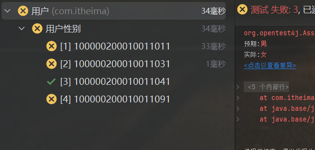
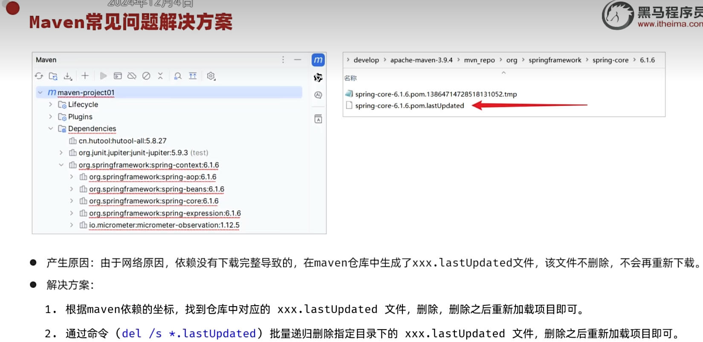
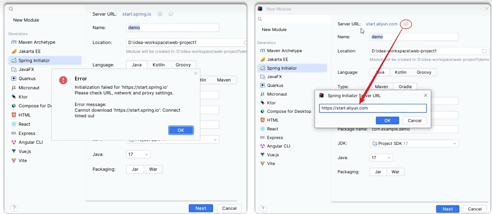
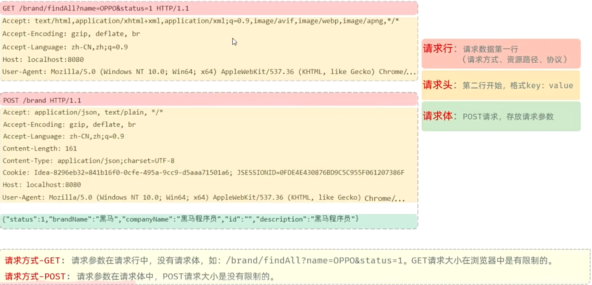
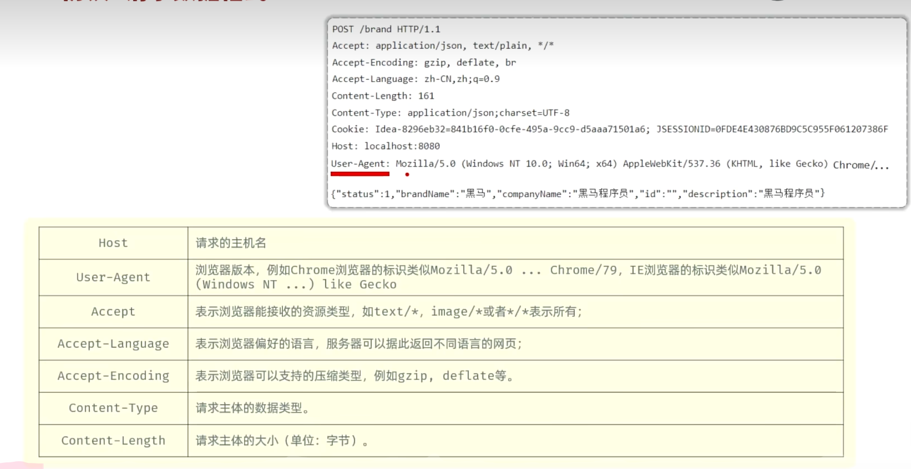
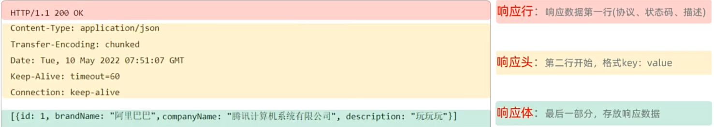
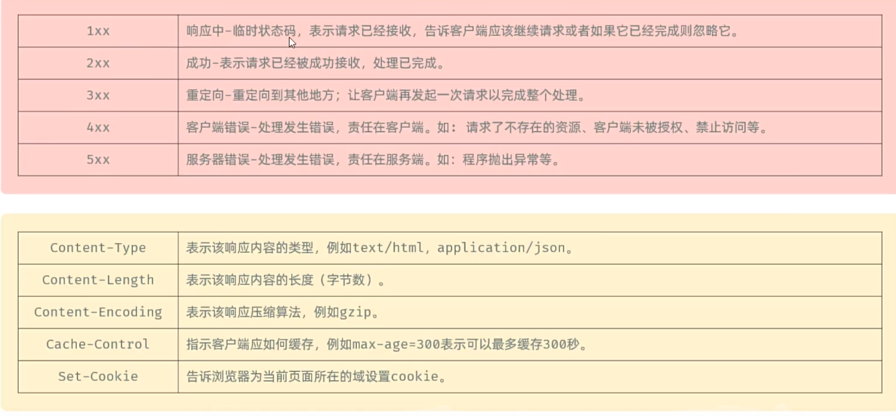
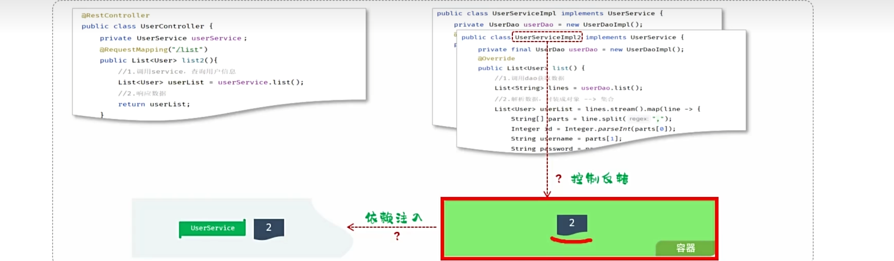
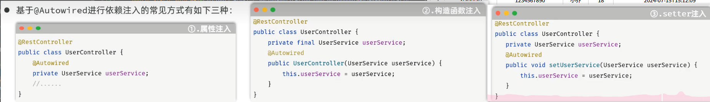

# 测试

**阶段划分**

* 单元测试（白盒测试）
* 集成测试（灰盒测试）
* 系统测试（黑河测试）
* 验收测试（黑盒测试）

### 单元测试

就是针对最小的功能单元（方法），编写测试代码对其正确性进行测试。

JUnit：最流行的Java测试框架之一，提供了一些功能，方便程序进行单元测试（第三方公司提供）

**main方法测试**：测试代码与源代码分开，难维护，一个方法测试失败，影响后面方法，无法自动化测试，得到测试报告

**JUnit单元测试**：测试代码与源代码分开，便于维护，可根据需要进行自动化测试，可自动化分析结果，产出测试报告

### JUnit断言操作

```java
Assertions.assertEquals(Object exp, Object act, String msg);//检查两个值是否相等，不相等就报错
Assertions.assertNotEquals(Object unexp, Object act, String msg);//检查两个值是否不相等，不相等就报错
Assertions.assertNull(Object act, String msg);//检查对象是否为null，不为null，就报错
Assertions.assertNotNull(Object act, String msg);//检查对象是否不为null，为null，就报错
Assertions.assertTrue(boolean condition, Sring msg);//检查条件是否为true,不为true就报错
Assertions.assertFalse(boolean condition, Sring msg);//检查条件是否为false,不为false就报错

Assertions.assertThrow(Class expType, Executable exec, String msg);//检查程序运行抛出的异常是否符合预期
//实例
@Test
    public void testGenderWithAssert2(){
        UserService userService = new UserService();
        Assertions.assertThrows(IllegalArgumentException.class, () ->{
            userService.getGender(null);
        });
    }//第二个参数是传入lambda表达式
```

### JUnit常见注解


实例:

```java
@DisplayName("用户性别")
    @ParameterizedTest
    @ValueSource(strings = {"100000200010011011", "100000200010011031", "100000200010011041", "100000200010011091"})
    public void testGetGender2(String idCard){
        UserService userService = new UserService();
        String gender = userService.getGender(idCard);
        //断言
        Assertions.assertEquals("男", gender, "性别获取错误");
    }
```



# maven的常见问题



# SpringBoot

点击新建springboot，勾选maven，下一步，勾选web

如果国外的骨架连不上，可以改为阿里云提供的镜像版



只要引入一个spring起步依赖，所有的相关依赖也会下载进来，这是因为maven的依赖传递

# HTTP协议

* 概念：Hyper Text Transfer Protocol，超文本传输协议，规定了浏览器和服务器之间数据传输的规则
* 特点：
  1. 基于TCP协议：面向连接，安全
  2. 基于请求-响应模型：一次请求对应一次响应
  3. HTTP协议是无状态的协议：对于事物处理没有记忆能力。每次请求-响应都是独立的。
     * 缺点：多次请求间不能共享数据
     * 优点：速度快



GET类型的请求没有请求体



### 响应数据



### http协议，响应数据格式



### 获取请求数据

```java
package com.itheima;

import jakarta.servlet.http.HttpServletRequest;
import org.springframework.web.bind.annotation.RequestMapping;
import org.springframework.web.bind.annotation.RestController;

@RestController
public class RequestController {
    @RequestMapping("/request")
    public String request(HttpServletRequest request){
        //1.获取请求方式
        String method = request.getMethod();
        System.out.println("Method: " + method);

        //2.获取请求的url地址
        StringBuffer requestURL = request.getRequestURL();
        System.out.println("URL: " + requestURL.toString());
        String uri = request.getRequestURI();
        System.out.println("资源访问路径" + uri);

        int i = 1 / 0;

        //3.获取请求协议
        String protocol = request.getProtocol();
        System.out.println("Protocol: " + protocol);

        //4.获取请求参数 - name
        String nameParam = request.getParameter("name");
        System.out.println("Name Parameter: " + nameParam);
        //age
        String ageParam = request.getParameter("age");
        System.out.println("Age Parameter: " + ageParam);

        //5.获取请求头 - Accept
        String acceptHeader = request.getHeader("Accept");
        System.out.println("Accept Header: " + acceptHeader);
        System.out.println("--------------------------------------------------------------------------------------------------------------------------------------------------------------------------------------------------------------------------------------------------------------------------------------------------------------------------------------------------------------------------------------------------------------------------------------------------------------------------------------------------------------------------------------------------------------------------------------------------------------------------------------------------------------------------------------------------------------------------------------------------------------------------------------------------------------------------------");

        // 返回获取到的信息
        return "OK";
    }
}

```

### 获取响应数据

```java

package com.itheima;

import jakarta.servlet.http.HttpServletRequest;
import jakarta.servlet.http.HttpServletResponse;
import org.springframework.web.bind.annotation.RequestMapping;
import org.springframework.web.bind.annotation.RestController;

import java.io.IOException;

@RestController
public class ResponseController {
    @RequestMapping("/response")
    public String response(HttpServletRequest request, HttpServletResponse response) throws IOException {
        //1.获取请求方式
        String method = request.getMethod();
        System.out.println("Method: " + method);

        //2.获取请求的url地址
        StringBuffer requestURL = request.getRequestURL();
        System.out.println("URL: " + requestURL.toString());
        String uri = request.getRequestURI();
        System.out.println("资源访问路径: " + uri);

        // 模拟设置响应状态码和头信息
        response.setStatus(HttpServletResponse.SC_OK);
        response.setContentType("text/plain");
        response.setHeader("Custom-Header", "CustomValue");

        //3.获取响应状态码
        int statusCode = response.getStatus();
        System.out.println("Status Code: " + statusCode);

        //4.获取响应内容类型
        String contentType = response.getContentType();
        System.out.println("Content Type: " + contentType);

        //5.获取响应头 - Custom-Header
        String customHeader = response.getHeader("Custom-Header");
        System.out.println("Custom Header: " + customHeader);

        System.out.println("--------------------------------------------------------------------------------------------------------------------------------------------------------------------------------------------------------------------------------------------------------------------------------------------------------------------------------------------------------------------------------------------------------------------------------------------------------------------------------------------------------------------------------------------------------------------------------------------------------------------------------------------------------------------------------------------------------------------------------------------------------------------------------------------------------------------------------");

        // 返回获取到的信息
        return "OK";
    }
}
```

### 设置响应数据

但是通常不会设置状态码，因为服务器端请求处理完毕后他会设置的生成状态码

```java
package com.itheima;

import jakarta.servlet.http.HttpServletRequest;
import jakarta.servlet.http.HttpServletResponse;
import org.springframework.web.bind.annotation.RequestMapping;
import org.springframework.web.bind.annotation.RestController;

import java.io.IOException;

@RestController
public class ResponseController {
    @RequestMapping("/response")
    public void response(HttpServletRequest request, HttpServletResponse response) throws IOException {

        //设置响应码
        response.setStatus(404);

        //设置响应标头
        response.setHeader("name", "itheima");

        //设置响应体
        response.getWriter().write("<h1>hello response</h1>");


    }
}
```

也可以直接使用**Spring**提供的库来封装一个**方法**

其中**ResponseEntity<泛型>**是已经封装好的，作为返回值

链式调用非常方便

```java
@RequestMapping("/response2")
    public ResponseEntity<String> response2(){
        return ResponseEntity
                .status(401)
                .header("name", "java_web")
                .body("<h1>hello response</h1>");
    }
```

# 获取文件输入流

src下的main下的java目录和resources目录最终编译后放在同一个目录下（classes目录下，也就是类路径下），这个时候我们就可以通过字节码对象来获取到类的加载器

类加载器更安全，可以从classpath任何位置读取文件

```java
InputStream in = this.getClass().getClassLoader().getResourceAsStream("user.txt");
```

# String转换成LocalDateTime类型

```java
LocalDateTime updateTime = LocalDateTime.parse(parts[5],
DateTimeFormatter.ofPattern("yyyy-MM-dd HH:mm:ss"));
```

# 封装用户信息

$@ResController = @Controller + @ResponseBody$

$@RestController$这个注解底层封装了一个注解$@ResponseBody$

这个注解的作用：将controller返回值最为响应体的数据直接响应；返回值是对象/集合 会先转 json 再响应

```java
//用户信息controller
@RestController//这个注解底层封装了一个注解@ResponseBody
public class UserController {
    @RequestMapping("/list")
    public List<User> list() throws Exception {
        //1.加载并读取user.txt文件
        //InputStream in = new FileInputStream(new File("src/main/resources/user.txt"));
        InputStream in = this.getClass().getClassLoader().getResourceAsStream("user.txt");
        ArrayList<String> lines = IoUtil.readLines(in, StandardCharsets.UTF_8, new ArrayList<>());//这个表示一行一行的读取


        //2.解析用户信息，封装为User对象 - list集合
        List<User> userList = lines.stream().map(line -> {
            String[] parts = line.split(",");
            Integer id = Integer.parseInt(parts[0]);
            String username = parts[1];
            String password = parts[2];
            String name = parts[3];
            Integer age = Integer.parseInt(parts[4]);
            LocalDateTime updateTime = LocalDateTime.parse(parts[5], DateTimeFormatter.ofPattern("yyyy-MM-dd HH:mm:ss"));
            return new User(id, username, password, name, age, updateTime);
        }).collect(Collectors.toList());//在jdk17之后可以直接用.toList();

        //3.返回数据到前端（json格式）
        return userList;
        //最终服务器在给前端响应数据的时候，会自动的将这个List集合转换为json格式的数据，然后再响应回去
    }
}
```

# 三层架构

* controller：控制层，接受前端发送的请求，对请求进行处理，并响应数据。
* service：业务逻辑层，处理具体的业务逻辑。
* dao：数据访问层（Data Access Object）（持久层），负责数据访问操作，包括数据的增、删、改、查。

# 分层解耦

* **耦合**：衡量软件中各个层/各个模块的以来的关联程度
* **内聚**：软件中各个功能模块内部的功能联系



**控制反转**：Inversion Of Control，简称IOC。对象的创建控制权由程序自身转移到外部（容器），这种思想成为控制反转。

**依赖注入**：Dependency Injection，简称DI。容器为应用程序提供运行时，所依赖的资源，称之为依赖注入。

**Bean对象**：IOC容器中创建、管理的对象，称之为Bean。

### 1.实现分层解耦的思路是什么？

* 将项目中的类交给IOC容器管理（IOC， 控制反转）
* 应用程序运行时需要什么对象，就直接依赖容器为其提供（DI， 依赖注入）

```java
@Component//表示下面这个实现类会存储到IOC容器中
public class UserServiceImpl implements UserService {...}
```

```java
@Autowired//应用程序运行时，会自动的查询该类型的bean对象，并赋值给该成员变量
    private UserService userService;
```

### IOC详解

|    注解     |         说明         |                      位置                       |
| :---------: | :------------------: | :---------------------------------------------: |
| @Component  |  声明bean的基础注解  |           不属于以下三类是，用此注解            |
| @Controller | @Component的衍生注解 |                标注在控制层类上                 |
|  @Service   | @Component的衍生注解 |                标注在业务层类上                 |
| @Repository |  @Component衍生注解  | 标注在数据访问层上（由于与mybatis整合，用的少） |

**注意**：声明bean的时候，可以通过注解的value属性指定bean的名字，如果没有指定，默认为类名首字母小写

* 前面声明bean的四大注解，想要生效，还需要被组件扫描注解$@ComponentScan$扫描
* 该注解虽然没有显示配置，但是实际上已经包含在了启动类声明注解$@SpringBootApplication$中，默认扫描范围是启动类所在包及其子包

### DI详解



* 属性注入：
* * 优点：代码简洁，方便快速开发 
  * 缺点：隐藏了类之间的依赖关系，可能会破坏类的封装性

```java
@Autowired
private UserService userService;
```

* 构造器注入：
* * 优点：能清晰的看到类的依赖关系、提高了代码的安全性
  * 缺点：代码繁琐、如果构造参数过多，可能会导致构造函数臃肿
  * 注意：如果只有一个构造函数，@Autowired注解可以省略

```java
//相当于构造函数，创建Controller对象的时候会自动执行这个函数
private final UserService userService;
    @Autowired
    public UserController(UserService userService) {
        this.userService = userService;
    }
```

* setter注入：
* * 优点：保持了类的封装性，依赖关系更清晰
  * 缺点：需要额外编写setter方法，增加了代码量

```java
//创建Controller对象的时候会自动执行这个函数
private UserService userService;
    @Autowired
    public void setUserService(UserService userService){
        this.userService = userService;
    }
```

