# 测试

**阶段划分**

* 单元测试（白盒测试）
* 集成测试（灰盒测试）
* 系统测试（黑河测试）
* 验收测试（黑盒测试）

### 单元测试

就是针对最小的功能单元（方法），编写测试代码对其正确性进行测试。

JUnit：最流行的Java测试框架之一，提供了一些功能，方便程序进行单元测试（第三方公司提供）

**main方法测试**：测试代码与源代码分开，难维护，一个方法测试失败，影响后面方法，无法自动化测试，得到测试报告

**JUnit单元测试**：测试代码与源代码分开，便于维护，可根据需要进行自动化测试，可自动化分析结果，产出测试报告

### JUnit断言操作

```java
Assertions.assertEquals(Object exp, Object act, String msg);//检查两个值是否相等，不相等就报错
Assertions.assertNotEquals(Object unexp, Object act, String msg);//检查两个值是否不相等，不相等就报错
Assertions.assertNull(Object act, String msg);//检查对象是否为null，不为null，就报错
Assertions.assertNotNull(Object act, String msg);//检查对象是否不为null，为null，就报错
Assertions.assertTrue(boolean condition, Sring msg);//检查条件是否为true,不为true就报错
Assertions.assertFalse(boolean condition, Sring msg);//检查条件是否为false,不为false就报错

Assertions.assertThrow(Class expType, Executable exec, String msg);//检查程序运行抛出的异常是否符合预期
//实例
@Test
    public void testGenderWithAssert2(){
        UserService userService = new UserService();
        Assertions.assertThrows(IllegalArgumentException.class, () ->{
            userService.getGender(null);
        });
    }//第二个参数是传入lambda表达式
```

### JUnit常见注解


实例:

```java
@DisplayName("用户性别")
    @ParameterizedTest
    @ValueSource(strings = {"100000200010011011", "100000200010011031", "100000200010011041", "100000200010011091"})
    public void testGetGender2(String idCard){
        UserService userService = new UserService();
        String gender = userService.getGender(idCard);
        //断言
        Assertions.assertEquals("男", gender, "性别获取错误");
    }
```


# maven的常见问题


# SpringBoot

点击新建springboot，勾选maven，下一步，勾选web

如果国外的骨架连不上，可以改为阿里云提供的镜像版


只要引入一个spring起步依赖，所有的相关依赖也会下载进来，这是因为maven的依赖传递

# HTTP协议

* 概念：Hyper Text Transfer Protocol，超文本传输协议，规定了浏览器和服务器之间数据传输的规则
* 特点：
  1. 基于TCP协议：面向连接，安全
  2. 基于请求-响应模型：一次请求对应一次响应
  3. HTTP协议是无状态的协议：对于事物处理没有记忆能力。每次请求-响应都是独立的。
     * 缺点：多次请求间不能共享数据
     * 优点：速度快


GET类型的请求没有请求体


### 响应数据


### http协议，响应数据格式


### 获取请求数据

```java
package com.itheima;

import jakarta.servlet.http.HttpServletRequest;
import org.springframework.web.bind.annotation.RequestMapping;
import org.springframework.web.bind.annotation.RestController;

@RestController
public class RequestController {
    @RequestMapping("/request")
    public String request(HttpServletRequest request){
        //1.获取请求方式
        String method = request.getMethod();
        System.out.println("Method: " + method);

        //2.获取请求的url地址
        StringBuffer requestURL = request.getRequestURL();
        System.out.println("URL: " + requestURL.toString());
        String uri = request.getRequestURI();
        System.out.println("资源访问路径" + uri);

        int i = 1 / 0;

        //3.获取请求协议
        String protocol = request.getProtocol();
        System.out.println("Protocol: " + protocol);

        //4.获取请求参数 - name
        String nameParam = request.getParameter("name");
        System.out.println("Name Parameter: " + nameParam);
        //age
        String ageParam = request.getParameter("age");
        System.out.println("Age Parameter: " + ageParam);

        //5.获取请求头 - Accept
        String acceptHeader = request.getHeader("Accept");
        System.out.println("Accept Header: " + acceptHeader);
        System.out.println("--------------------------------------------------------------------------------------------------------------------------------------------------------------------------------------------------------------------------------------------------------------------------------------------------------------------------------------------------------------------------------------------------------------------------------------------------------------------------------------------------------------------------------------------------------------------------------------------------------------------------------------------------------------------------------------------------------------------------------------------------------------------------------------------------------------------------------");

        // 返回获取到的信息
        return "OK";
    }
}

```

### 获取响应数据

```java

package com.itheima;

import jakarta.servlet.http.HttpServletRequest;
import jakarta.servlet.http.HttpServletResponse;
import org.springframework.web.bind.annotation.RequestMapping;
import org.springframework.web.bind.annotation.RestController;

import java.io.IOException;

@RestController
public class ResponseController {
    @RequestMapping("/response")
    public String response(HttpServletRequest request, HttpServletResponse response) throws IOException {
        //1.获取请求方式
        String method = request.getMethod();
        System.out.println("Method: " + method);

        //2.获取请求的url地址
        StringBuffer requestURL = request.getRequestURL();
        System.out.println("URL: " + requestURL.toString());
        String uri = request.getRequestURI();
        System.out.println("资源访问路径: " + uri);

        // 模拟设置响应状态码和头信息
        response.setStatus(HttpServletResponse.SC_OK);
        response.setContentType("text/plain");
        response.setHeader("Custom-Header", "CustomValue");

        //3.获取响应状态码
        int statusCode = response.getStatus();
        System.out.println("Status Code: " + statusCode);

        //4.获取响应内容类型
        String contentType = response.getContentType();
        System.out.println("Content Type: " + contentType);

        //5.获取响应头 - Custom-Header
        String customHeader = response.getHeader("Custom-Header");
        System.out.println("Custom Header: " + customHeader);

        System.out.println("--------------------------------------------------------------------------------------------------------------------------------------------------------------------------------------------------------------------------------------------------------------------------------------------------------------------------------------------------------------------------------------------------------------------------------------------------------------------------------------------------------------------------------------------------------------------------------------------------------------------------------------------------------------------------------------------------------------------------------------------------------------------------------------------------------------------------------");

        // 返回获取到的信息
        return "OK";
    }
}
```

### 设置响应数据

但是通常不会设置状态码，因为服务器端请求处理完毕后他会设置的生成状态码

```java
package com.itheima;

import jakarta.servlet.http.HttpServletRequest;
import jakarta.servlet.http.HttpServletResponse;
import org.springframework.web.bind.annotation.RequestMapping;
import org.springframework.web.bind.annotation.RestController;

import java.io.IOException;

@RestController
public class ResponseController {
    @RequestMapping("/response")
    public void response(HttpServletRequest request, HttpServletResponse response) throws IOException {

        //设置响应码
        response.setStatus(404);

        //设置响应标头
        response.setHeader("name", "itheima");

        //设置响应体
        response.getWriter().write("<h1>hello response</h1>");


    }
}
```

也可以直接使用**Spring**提供的库来封装一个**方法**

其中**ResponseEntity<泛型>**是已经封装好的，作为返回值

链式调用非常方便

```java
@RequestMapping("/response2")
    public ResponseEntity<String> response2(){
        return ResponseEntity
                .status(401)
                .header("name", "java_web")
                .body("<h1>hello response</h1>");
    }
```

# 获取文件输入流

src下的main下的java目录和resources目录最终编译后放在同一个目录下（classes目录下，也就是类路径下），这个时候我们就可以通过字节码对象来获取到类的加载器

类加载器更安全，可以从classpath任何位置读取文件

```java
InputStream in = this.getClass().getClassLoader().getResourceAsStream("user.txt");
```

# String转换成LocalDateTime类型

```java
LocalDateTime updateTime = LocalDateTime.parse(parts[5],
DateTimeFormatter.ofPattern("yyyy-MM-dd HH:mm:ss"));
```

# 封装用户信息

$@ResController = @Controller + @ResponseBody$

$@RestController$这个注解底层封装了一个注解$@ResponseBody$

这个注解的作用：将controller返回值最为响应体的数据直接响应；返回值是对象/集合 会先转 json 再响应

```java
//用户信息controller
@RestController//这个注解底层封装了一个注解@ResponseBody
public class UserController {
    @RequestMapping("/list")
    public List<User> list() throws Exception {
        //1.加载并读取user.txt文件
        //InputStream in = new FileInputStream(new File("src/main/resources/user.txt"));
        InputStream in = this.getClass().getClassLoader().getResourceAsStream("user.txt");
        ArrayList<String> lines = IoUtil.readLines(in, StandardCharsets.UTF_8, new ArrayList<>());//这个表示一行一行的读取


        //2.解析用户信息，封装为User对象 - list集合
        List<User> userList = lines.stream().map(line -> {
            String[] parts = line.split(",");
            Integer id = Integer.parseInt(parts[0]);
            String username = parts[1];
            String password = parts[2];
            String name = parts[3];
            Integer age = Integer.parseInt(parts[4]);
            LocalDateTime updateTime = LocalDateTime.parse(parts[5], DateTimeFormatter.ofPattern("yyyy-MM-dd HH:mm:ss"));
            return new User(id, username, password, name, age, updateTime);
        }).collect(Collectors.toList());//在jdk17之后可以直接用.toList();

        //3.返回数据到前端（json格式）
        return userList;
        //最终服务器在给前端响应数据的时候，会自动的将这个List集合转换为json格式的数据，然后再响应回去
    }
}
```

# 三层架构

* controller：控制层，接受前端发送的请求，对请求进行处理，并响应数据。
* service：业务逻辑层，处理具体的业务逻辑。
* dao：数据访问层（Data Access Object）（持久层），负责数据访问操作，包括数据的增、删、改、查。

**controller层收到请求调用servece层，service层调用dao层，然后controller再响应数据给前端**

# 三层架构的详解及代码

* **controller包：**放置请求处理类

* * **DeptController：**

  * ```java
    package com.itheima.controller;
    
    import com.itheima.pojo.Dept;
    import com.itheima.pojo.Result;
    import com.itheima.service.impl.DeptServiceImpl;
    import org.springframework.beans.factory.annotation.Autowired;
    import org.springframework.web.bind.annotation.GetMapping;
    import org.springframework.web.bind.annotation.RequestMapping;
    import org.springframework.web.bind.annotation.RequestMethod;
    import org.springframework.web.bind.annotation.RestController;
    
    import java.util.List;
    
    @RestController
    public class DeptController {
    
        private final DeptServiceImpl deptServiceImpl;
        @Autowired
        private DeptController(DeptServiceImpl deptServiceImpl){
            this.deptServiceImpl = deptServiceImpl;
        }
        //@RequestMapping(value = "/depts", method = RequestMethod.GET)
        @GetMapping("/depts")
        public Result list(){
    
            System.out.println("查询全部部门的数据");
            List<Dept> deptList = deptServiceImpl.findAll();
            return Result.success(deptList);
        }
    }
    ```

* **mapper（dao）包：**放置数据处理类（如操作数据库）

* * **DeptMapper：**

  * ```java
    package com.itheima.mapper;
    
    import com.itheima.pojo.Dept;
    import org.apache.ibatis.annotations.Mapper;
    import org.apache.ibatis.annotations.Select;
    
    import java.util.List;
    
    @Mapper
    public interface DeptMapper {
    
        @Select("select id, name, create_time, update_time from dept order by update_time desc")
        public List<Dept> findAll();
    
    }
    ```

* **service包：**放置业务逻辑接口和实现

* * **DeptService：**

  * ```java
    package com.itheima.service;
    
    import com.itheima.pojo.Dept;
    
    import java.util.List;
    
    public interface DeptService {
        public List<Dept> findAll();
    }
    ```

* * **imlp包：**放置接口的实现类

  * * **DeptServiceImpl：**

    * ```java
      package com.itheima.service.impl;
      
      import com.itheima.mapper.DeptMapper;
      import com.itheima.pojo.Dept;
      import com.itheima.service.DeptService;
      import org.springframework.beans.factory.annotation.Autowired;
      import org.springframework.stereotype.Service;
      
      import java.util.List;
      
      @Service
      public class DeptServiceImpl implements DeptService {
      
      
          private DeptMapper deptMapper;
          @Autowired
          private DeptServiceImpl(DeptMapper deptMapper){
              this.deptMapper = deptMapper;
          }
          @Override
          public List<Dept> findAll(){
              return deptMapper.findAll();
          }
      }
      ```

* **pojo包：**放置封装好的实体类

* * **Dept：**

  * ```java
    package com.itheima.pojo;
    
    import lombok.AllArgsConstructor;
    import lombok.Data;
    import lombok.NoArgsConstructor;
    
    import java.time.LocalDateTime;
    
    @Data
    @NoArgsConstructor
    @AllArgsConstructor
    public class Dept {
        private Integer id;
        private String name;
        private LocalDateTime createTime;
        private LocalDateTime updateTime;
    }
    ```

  * **Result：**

  * ```java
    package com.itheima.pojo;
    
    import lombok.Data;
    
    import java.io.Serializable;
    
    /**
     * 后端统一返回结果
     */
    @Data
    public class Result {
    
        private Integer code; //编码：1成功，0为失败
        private String msg; //错误信息
        private Object data; //数据
    
        public static Result success() {
            Result result = new Result();
            result.code = 1;
            result.msg = "success";
            return result;
        }
    
        public static Result success(Object object) {
            Result result = new Result();
            result.data = object;
            result.code = 1;
            result.msg = "success";
            return result;
        }
    
        public static Result error(String msg) {
            Result result = new Result();
            result.msg = msg;
            result.code = 0;
            return result;
        }
    }
    ```

# 分层解耦

* **耦合**：衡量软件中各个层/各个模块的以来的关联程度
* **内聚**：软件中各个功能模块内部的功能联系


**控制反转**：Inversion Of Control，简称IOC。对象的创建控制权由程序自身转移到外部（容器），这种思想成为控制反转。

**依赖注入**：Dependency Injection，简称DI。容器为应用程序提供运行时，所依赖的资源，称之为依赖注入。

**Bean对象**：IOC容器中创建、管理的对象，称之为Bean。

### 1.实现分层解耦的思路是什么？

* 将项目中的类交给IOC容器管理（IOC， 控制反转）
* 应用程序运行时需要什么对象，就直接依赖容器为其提供（DI， 依赖注入）

```java
@Component//表示下面这个实现类会存储到IOC容器中
public class UserServiceImpl implements UserService {...}
```

```java
@Autowired//应用程序运行时，会自动的查询该类型的bean对象，并赋值给该成员变量
    private UserService userService;
```

### IOC详解

|    注解     |         说明         |                      位置                       |
| :---------: | :------------------: | :---------------------------------------------: |
| @Component  |  声明bean的基础注解  |           不属于以下三类是，用此注解            |
| @Controller | @Component的衍生注解 |                标注在控制层类上                 |
|  @Service   | @Component的衍生注解 |                标注在业务层类上                 |
| @Repository |  @Component衍生注解  | 标注在数据访问层上（由于与mybatis整合，用的少） |

**注意**：声明bean的时候，可以通过注解的value属性指定bean的名字，如果没有指定，默认为类名首字母小写

* 前面声明bean的四大注解，想要生效，还需要被组件扫描注解$@ComponentScan$扫描
* 该注解虽然没有显示配置，但是实际上已经包含在了启动类声明注解$@SpringBootApplication$中，默认扫描范围是启动类所在包及其子包

### DI详解


* 属性注入：
* * 优点：代码简洁，方便快速开发 
  * 缺点：隐藏了类之间的依赖关系，可能会破坏类的封装性

```java
@Autowired
private UserService userService;
```

* 构造器注入：
* * 优点：能清晰的看到类的依赖关系、提高了代码的安全性
  * 缺点：代码繁琐、如果构造参数过多，可能会导致构造函数臃肿
  * 注意：如果只有一个构造函数，@Autowired注解可以省略

```java
//相当于构造函数，创建Controller对象的时候会自动执行这个函数
private final UserService userService;
    @Autowired
    public UserController(UserService userService) {
        this.userService = userService;
    }
```

* setter注入：
* * 优点：保持了类的封装性，依赖关系更清晰
  * 缺点：需要额外编写setter方法，增加了代码量

```java
//创建Controller对象的时候会自动执行这个函数
private UserService userService;
    @Autowired
    public void setUserService(UserService userService){
        this.userService = userService;
    }
```

**@Autowired注解，默认是按照类型注入的**

**如果存在多种相同类型的bean，将会报出如下错误**

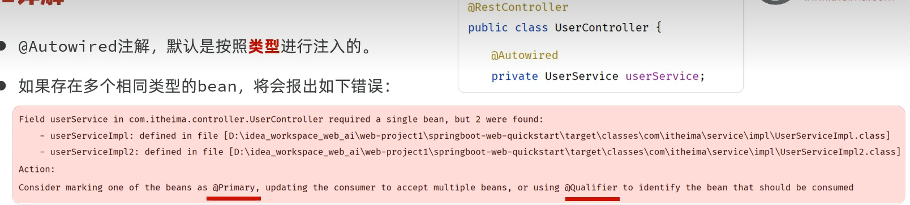

* 方案一：@Primary，会优先注入这个标记的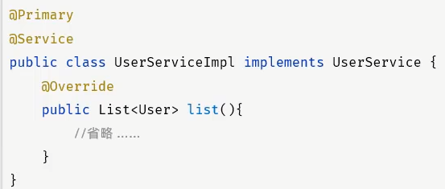

* 方案二：@Qualifier，指定注入的是哪个bean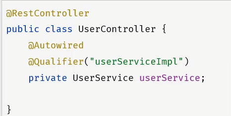

* 方案三：@Resource，指定注入的bean的名称

# 数据库

* 数据库：DataBase（DB），是存储和管理数据的仓库。
* 数据库管理系统：DataBase Management System（DBMS），操作和管理数据库的大型软件。
* SQL：Structured Query Language，操作关系型数据库的编程语言，定义了一套操作关系型数据库统一标准

# MySQL

方括号括起来的是可选的，默认值是本机的3306端口

```sql
mysql -u用户名 -p密码 [-h数据库服务器IP地址 -p端口号]
```

* 关系型数据库：建立在关系模型基础上，由多张相互连接的二位表组成的数据库。
* 特点：
* * 使用表存储数据，格式统一，便于维护。
  * 使用SQL语言操作，标准统一，使用方便，可用于复杂查询

| 分类 |            全称            |                          说明                          |
| :--: | :------------------------: | :----------------------------------------------------: |
| DDL  |  Data Definition Language  |  数据定义语言，用来定义数据库对象（数据库、表、字段）  |
| DML  | Data Manipulation Language |     数据操作语言，用来队数据库表中的数据进行增删改     |
| DQL  |    Data Query Language     |         数据查询语言，用来查询数据库中表的记录         |
| DCL  |   Data Control Language    | 数据控制语言，用来创建数据库用户，控制数据库的访问权限 |

### DDL：

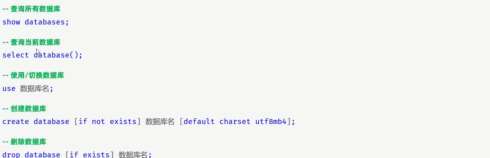

### DDL表操作

```sql
-- DDL表操作
-- 创建表
create table user(
    id int comment  'ID',
    username varchar(50) comment 'username',
    name varchar(10)  comment 'name',
    age int comment 'age',
    gender char(1) comment 'gender'
)comment '用户信息表';
```

**约束**

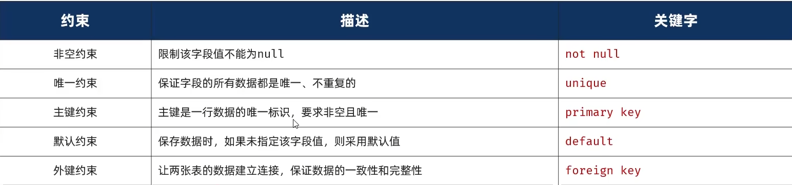

### 数据类型

MYSQL的数据类型主要分为三类：数值类型，字符串类型，日期时间类型。

* char(10)：固定占用10个字符空间；存储A，占用10个空间；存储ABC，占用10个空间；
* varchar(10)：最多占用10个字符空间；存储A，占用1个空间；存储ABC，占用3个空间；

### DML-insert

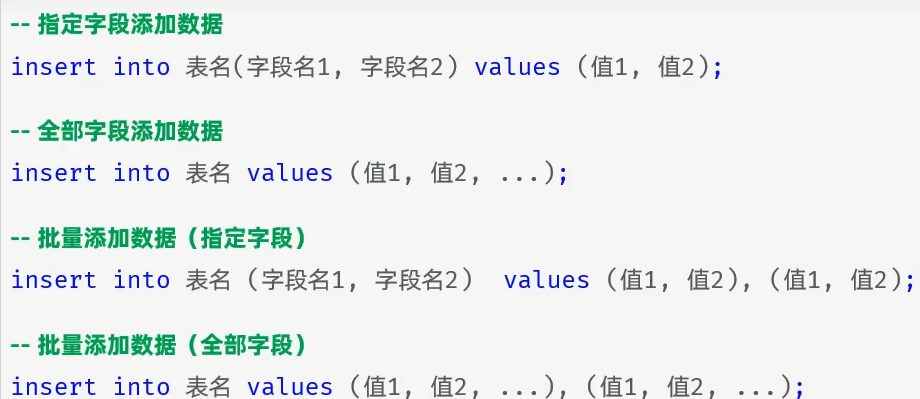

### DQL

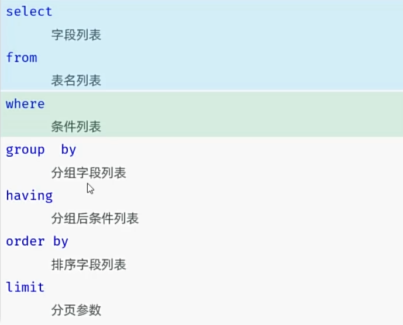

查询：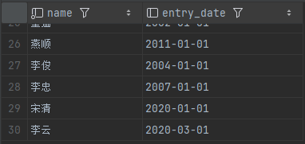

```sql
select name, entry_date from emp;
```

起别名: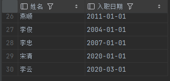

```sql
select name as 姓名, entry_date as 入职日期 from emp;
```

别名中间有空格必须加引号包起来

去重：

```sql
-- 4. 查询已有的员工关联了哪几种职位(不要重复) - distinct
select distinct job from emp;
```

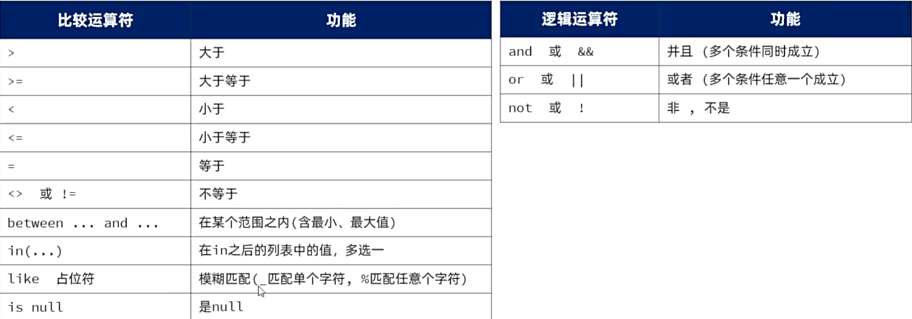

### set来声明变量

```sql
-- 6. 查询 入职日期 在 '2000-01-01' (包含) 到 '2010-01-01'(包含) 之间的员工信息
set @begin = '2000-01-01';
set @end = '2010-01-01';
select * from emp where entry_date between @begin and @end;
-- select * from emp where entry_date between '2000-01-01' and '2010-01-01';
```

```sql
-- 9. 查询 姓名 为两个字的员工信息
-- select * from emp where char_length(name) = 2;
select * from emp where name like '__';
```

```sql
SUBSTRING(str, pos, len)-- 从字符串 str 的第 pos 位置开始截取长度为 len 的子串。
-- 10. 查询 姓 '李' 的员工信息
-- select * from emp where substring(name, 1, 1) = '李';
select * from emp where name like '李%';
```

```sql
-- 11. 查询 姓名中包含 '二' 的员工信息
select * from emp where name like '%二%';
```

### DQL分组查询

| 函数  |   功能   |
| :---: | :------: |
| count | 统计数量 |
|  max  |  最大值  |
|  min  |  最小值  |
|  avg  |  平均值  |
|  sum  |   求和   |

```sql
-- 注意：所有的聚合函数不参与NULL的统计
-- 1. 统计该企业员工数量
-- count(字段)
select count(username) from emp;
-- count(*)
select count(*) from emp;-- 开发推荐，做了优化，性能最高
-- count(常量)
select count(0) from emp;
```

**分组**：

```sql
-- 注意：分组之后，select 之后的字段列表不能随意书写，能写的一般是分组字段 + 聚合函数
-- 1. 根据性别分组 , 统计男性和女性员工的数量
select gender, count(*) from emp group by gender;
```

```sql
-- 2. 先查询入职时间在 '2015-01-01' (包含) 以前的员工 , 并对结果根据职位分组 , 获取员工数量大于等于2的职位
select job from emp where entry_date <= '2015-01-01' group by job having count(*) >= 2;
```

### DOL-排序查询


**排序方式**：升序（asc），降序（desc）；默认为升序asc

```sql
-- 3. 根据 入职时间 对公司的员工进行 升序排序 ， 入职时间相同 , 再按照 更新时间 进行降序排序
select * from emp order by entry_date asc, update_time desc;
```

### DQL-分页查询


**说明**：

* 起始索引从0开始
* 分页查询是数据库的方言，不同的数据库有不同的实现，MYSQL中是LIMIT
* 如起始索引为0，起始索引可以省略，直接简写为 limit 10

```sql
-- 3. 查询 第2页 员工数据, 每页展示5条记录
select * from emp limit 5, 5;
```

# JDBC-介绍

JDBC：（Java DataBase Connectivity），就是使用Java语言操作关系型数据库的一套API。

```java
package com.itheima;


import org.junit.Test;

import java.sql.Connection;
import java.sql.DriverManager;
import java.sql.SQLException;
import java.sql.Statement;

public class jdbcTest {
    /*

    * */
    @Test
    public void testUpdate() throws ClassNotFoundException, SQLException {
        //注册驱动
        Class.forName("com.mysql.cj.jdbc.Driver");

        //连接数据库
        String url = "jdbc:mysql://localhost:3306/web01";
        String username = "root";
        String password = "Zouzixi060714";
        Connection connection = DriverManager.getConnection(url, username, password);

        //获取SQL语句的执行对象
        Statement statement = connection.createStatement();

        //执行SQL
        int i = statement.executeUpdate("update user set age = 25 where id = 1");//DML
        System.out.println("SQL执行完毕影响的行数：" + i);

        //释放资源
        statement.close();
        connection.close();
    }
}
```

**项目中常用预编译sql语句，安全，性能高**

```java
@Test
    public void testSelect(){
        String url = "jdbc:mysql://localhost:3306/web01";
        String username = "root";
        String password = "Zouzixi060714";

        Connection connection = null;
        PreparedStatement statement = null;
        ResultSet resultSet = null;
        String sql = "select * from user where username = ? && password = ?";
        try{
            connection = DriverManager.getConnection(url, username, password);
            statement =  connection.prepareStatement(sql);//预编译
            String settingOne = "daqiao";
            String settingTwo = "123456";
            statement.setString(1, settingOne);
            statement.setString(2, settingTwo);
            resultSet = statement.executeQuery();
            while(resultSet.next()){
                Integer Id = resultSet.getInt("id");
                String Username = resultSet.getString("username");
                String Password = resultSet.getString("password");
                String Name = resultSet.getString("name");
                Integer Age = resultSet.getInt("age");
                User user = new User(Id, Username, Password, Name, Age);
                System.out.println(user);
            }
        }catch (Exception e){
            throw new RuntimeException(e);
        }finally {//关闭资源的程序写在finally里面，避免报错而没有释放资源，安全
            try{
                if(resultSet != null)resultSet.close();
                if(statement != null)statement.close();
                if(connection != null)connection.close();
            }catch (Exception e){
                throw new RuntimeException(e);
            }
        }
    }
```

* JDBC程序执行DML语句和DQL语句
* * DML语句：int rowsAffected = statement.executeUpdate();
  * DQL语句：ResuiltSet rs = statement.executeQuery();
* DQL语句执行完毕结果集ResuitSet解析
* * resultSet.next()：光标向下移动一行
  * resultSet.getXxx()：获取字段数据

### 预编译SQL

* 优势一：防止SQL植入，更安全（SQL注入：通过输入来修改事先定义好的SQL语句，以达到执行代码对服务器进行攻击的方法。）

静态注入：

```sql
dashjdashkd
' or '1'='1
Preparing: select count(*) from emp where username = 'dashjdashkd' and password = '' or '1'='1'
```

预编译：

```sql
==>  Preparing: select count(*) from emp where username = ? and password = ?
==> Parameters: asdhjlask(String), ' or '1'='1(String)
```

# MyBatis

### 步骤

* MyBatis是一款优秀的**持久层**框架，用于**简化JDBC**的开发

1. **在application.properties文件中写数据库配置信息**

```properties
#加入下面这个条语句可以看到SQL的执行日志
mybatis.configuration.log-impl=org.apache.ibatis.logging.stdout.StdOutImpl

spring.datasource.url=jdbc:mysql://localhost:3306/web01
spring.datasource.driver-class-name=com.mysql.cj.jdbc.Driver
spring.datasource.username=root
spring.datasource.password=1234
```

2. **创建接口（他的实现类通过Mapping注解，在运行时自动生成并存入IOC容器中）**

```java
@Mapper//应用程序在运行时，会自动地为该接口创建一个实现类（代理对象），并且会自动的将该实现类对象存入IOC容器中 - bean
public interface UserMapper {
    //查询所有用户
    @Select("select * from user")
    public List<User> findAll();
}
```

3. 编写单元测试

```java
@SpringBootTest//SpringBoot单元测试的注解，当前测试类中的测试方法运行时会启动springboot项目-IOC容器
class MybatisStartApplicationTests {
    private final UserMapper userMapper;
    @Autowired
    public MybatisStartApplicationTests(UserMapper userMapper){
        this.userMapper = userMapper;
    }
    @Test
    public void testFindAll(){
        List<User> userList = userMapper.findAll();
        userList.forEach(System.out::println);
    }
}
```

### 删除

```java
 @Delete("delete from user where id = #{id}")//占位符#{id}，表示待会要传进来变量id
 public void deleteById(Integer id);
```

### 新增

**用对象里的成员变量传入占位符里**

MyBatis会自动将对象的成员变量解析为SQL参数。在$@Insert$注解示例中，MyBatis会通过**对象属性映射**的方式，将User对象的成员变量注入到SQL语句中。

* 参数解析机制
* * 反射获取属性：通过对象的getter方法（或直接访问字段）获取属性值。
  * 参数名映射：#{参数名}中的参数必须与对象的**属性名**一致（而非数据库里的字段名）
  * 类型转换：自动将Java类型转换为数据库类型（如 Integer -> int）

```java
@Insert("insert into user(id, username, password, name, age) values(#{id}, #{username}, #{password}, #{name}, #{age})")
public Integer insert(User user);
    
@Select("select count(1) from user")
public Integer findSum();
```

```java
@Test
public void testInsert(){
    Integer i = userMapper.insert(new User( userMapper.findSum() + 1,"zhouyu", "123456", "周瑜", 20));
    System.out.println(i);
}
```

### 查询

**形参在编译之后是没有名字的，要给形参起名要用注解@Param**

$但是$：基于官方骨架创建的springboot项目中，接口编译时会保留方法形参名，@Param注解可以省略

```java
@Select("select * from user where username = #{username} && password = #{password}")
    public User findByUsernameAndPassword(@Param("username") String username, @Param("password") String password);
```


# 数据库连接池

* 数据库连接池是个容器，负责分配，管理数据库连接（connection）
* 它允许应用程序重复使用一个现有的数据库连接，而不是新建一个
* 释放空闲时间超过最大空闲时间的连接，来避免因为没有释放连接而引起的数据库连接泄露

* 优势：
* 1. 资源重用
  2. 提升系统响应速度
  3. 避免数据库连接遗漏

标准接口：DataSource

官方（sun）提供的数据库连接池接口，由第三方组织实现此接口

功能：获取连接（Connection getConnection() throws SQLException;）

* Druid（德鲁伊）
* * Druid连接池是阿里巴巴开源的数据库连接池项目
  * 功能强大，性能优秀，是Java语言最好的数据库连接池之一

**spring-boot项目默认的连接池是$Hikari$， 如下操作可以改变使用的连接池**

pom.xml文件中添加依赖

```xml
<dependency>
      <groupId>com.alibaba</groupId>
      <artifactId>druid-spring-boot-starter</artifactId>
      <version>1.2.19</version>
</dependency>
```

在application.properties文件中添加配置

```properties
spring.datasource.type=com.alibaba.druid.pool.DruidDataSource
```

Mybatis中的 # 号, $ 号：

| 符号   | 说明                                               | 场景                       | 优缺点         |
| ------ | -------------------------------------------------- | -------------------------- | -------------- |
| #{...} | 占位符。执行时，会将#{...}替换为?，生成预编译SQL   | 参数值传递                 | 安全，性能高   |
| ${...} | 拼接符，直接将参数拼接在SQL语句中，存在SQL注入问题 | 表名，字段名动态设置时使用 | 不安全，性能低 |

# XML映射配置

* 在MyBatis中，既可以通过注解配置SQL语句，也可以通过XML配置文件配置SQL语句
* 默认规则：
* 1. XML映射文件的名称与Mapper接口名称一致，并且将XML映射文件和Mapper接口放置在相同包下（同名同包）
  2. XML映射文件的namespace属性为Mapper接口全限定名一致
  3. XML映射文件中sql语句的id和Mapper接口的方法名一致，并保持返回类型一致

Mapper接口：

```java
@Mapper
public interface UserMapper{
    public List<User> findAll();
}
```

XML映射文件：

```xml
<mapper namespace = "com.itheima.mapper.UserMapper">
    <!-- resultType：查询返回的单条记录所封装的类型 -->
	<select id = "findAll" resultType = "com.itheima.pojo.User">
    	select id, username, password, name, age from user
    </select>
</mapper>
```

XML映射辅助配置：

可以这样设置后将$UserMapper.xml$放在类路径（编译之后Java目录和resources目录会合并为一个类路径）下程序也可以正常运行

```xml
mybatis.mapper-locations=classpath:mapper/*.xml
```

# SpringBoot项目配置文件

* SpringBoot项目提供了多种属性配置方式（properties,yaml,yml）

$$application.properties$$文件：

```properties
spring.datasource.url=jdbc:mysql://localhost:3306/web01
spring.datasource.driver-class-name=com.mysql.cj.jdbc.Driver
spring.datasource.username=root
spring.datasource.password=1234
```

$application.yaml / application.yml$文件：

```yaml
spring:
	datesource:
		driver-class-name: com.mysql.jdbc.Driver
		url: jdbc:mysql://localhost:3306/web01
		username: root
		password: 1234
```

* 格式
* * 数值前边必须有空格，作为分隔符
  * 使用缩进表示层级关系，缩进时，不允许使用Tab键，只能用空格（idea中会自动将Tab转化为空格）
  * 所进的空格数目不重要，只要相同层级的元素对齐即可
  * \# 表示注释，从这个字符一直到行尾，都会被解析器忽略

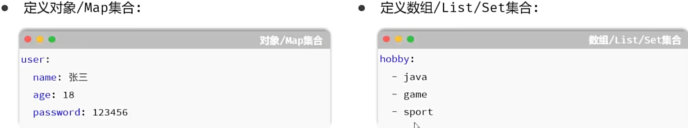

```yaml
#定义对象
user:
  name: Tom
  age: 18
  gender: 男

#定义数组/List/Set集合
hobby:
  - Java
  - Game
  - Sport
```

**注意：在yml格式的配置文件中，如果配置项的值是以 0 开头，值需要使用 '' 引起来，因为以0开头在yml中表示8进制的数据 **

```yaml
mybatis:
  mapper-locations: classpath:mapper/*.xml
  configuration:
    log-impl: org.apache.ibatis.logging.stdout.StdOutImpl

spring:
  datasource:
    type:  com.alibaba.druid.pool.DruidDataSource
    url: jdbc:mysql://localhost:3306/web01
    driver-class-name: com.mysql.cj.jdbc.Driver
    username: root
    password: 1234
  application:
    name: mybatis_start
```

# Restful

* REST（Representational State Transfer），表述性状态转换，他是一种软件架构风格。

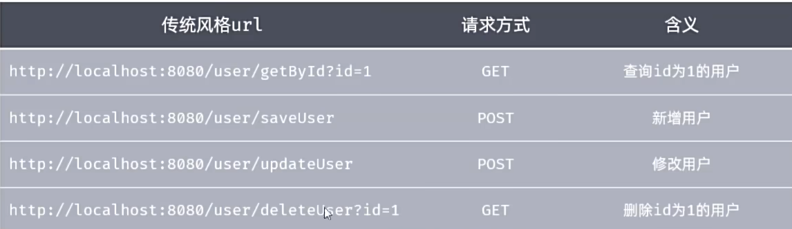

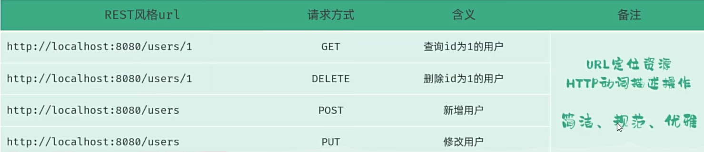

1. REST式风格，是约定方式，约定不是规定，可以打破
2. 描述功能模块通常使用复数形式（加s），表示此类资源，而非单个资源。如：users、books

# RequestMapping注解的子注解

**GetMapping, DeleteMapping, PostMapping, PutMapping**

**下面这两个注解的作用相同**

```java
@RequestMapping(value = "/depts", method = RequestMethod.GET)
@GetMapping("/depts")
```

# 数据封装

* 手动结果映射：通过$@Results$和$@Result$进行手动结果映射。

```java
//数据库表中的字段名写在columbn，实体类中的成员变量名写在property
@Results({
            @Result(column = "create_time", property = "createTime"),
            @Result(column = "update_time", property = "updateTime")
    })
    @Select("select id, name, create_time, update_time from dept order by update_time desc")
    public List<Dept> findAll();
```

* 起别名：在SQL语句中，对不一样的字段名起别名，别名和实体类属性名一样

```java
@Select("select id, name, create_time createTime, update_time updateTime from dept order by update_time desc")
public List<Dept> findAll();
```

* 开启驼峰命名：如果字段名与属性名符合驼峰命名规则，mybatis会自动通过驼峰命名规则映射（推荐）

```yml
mybatis:
  configuration:
  	map-underscore-to-camel-case: true
```

