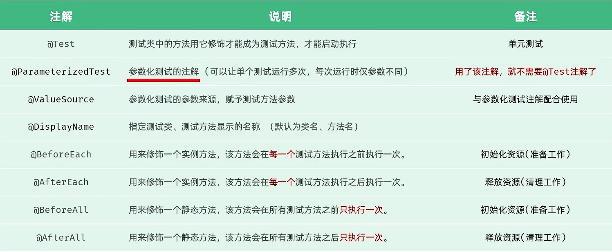

# 测试

**阶段划分**

* 单元测试（白盒测试）
* 集成测试（灰盒测试）
* 系统测试（黑河测试）
* 验收测试（黑盒测试）

### 单元测试

就是针对最小的功能单元（方法），编写测试代码对其正确性进行测试。

JUnit：最流行的Java测试框架之一，提供了一些功能，方便程序进行单元测试（第三方公司提供）

**main方法测试**：测试代码与源代码分开，难维护，一个方法测试失败，影响后面方法，无法自动化测试，得到测试报告

**JUnit单元测试**：测试代码与源代码分开，便于维护，可根据需要进行自动化测试，可自动化分析结果，产出测试报告

### JUnit断言操作

```java
Assertions.assertEquals(Object exp, Object act, String msg);//检查两个值是否相等，不相等就报错
Assertions.assertNotEquals(Object unexp, Object act, String msg);//检查两个值是否不相等，不相等就报错
Assertions.assertNull(Object act, String msg);//检查对象是否为null，不为null，就报错
Assertions.assertNotNull(Object act, String msg);//检查对象是否不为null，为null，就报错
Assertions.assertTrue(boolean condition, Sring msg);//检查条件是否为true,不为true就报错
Assertions.assertFalse(boolean condition, Sring msg);//检查条件是否为false,不为false就报错

Assertions.assertThrow(Class expType, Executable exec, String msg);//检查程序运行抛出的异常是否符合预期
//实例
@Test
    public void testGenderWithAssert2(){
        UserService userService = new UserService();
        Assertions.assertThrows(IllegalArgumentException.class, () ->{
            userService.getGender(null);
        });
    }//第二个参数是传入lambda表达式
```

### JUnit常见注解



实例:

```java
@DisplayName("用户性别")
    @ParameterizedTest
    @ValueSource(strings = {"100000200010011011", "100000200010011031", "100000200010011041", "100000200010011091"})
    public void testGetGender2(String idCard){
        UserService userService = new UserService();
        String gender = userService.getGender(idCard);
        //断言
        Assertions.assertEquals("男", gender, "性别获取错误");
    }
```


# maven的常见问题


# SpringBoot

点击新建springboot，勾选maven，下一步，勾选web

如果国外的骨架连不上，可以改为阿里云提供的镜像版


只要引入一个spring起步依赖，所有的相关依赖也会下载进来，这是因为maven的依赖传递

# HTTP协议

* 概念：Hyper Text Transfer Protocol，超文本传输协议，规定了浏览器和服务器之间数据传输的规则
* 特点：
  1. 基于TCP协议：面向连接，安全
  2. 基于请求-响应模型：一次请求对应一次响应
  3. HTTP协议是无状态的协议：对于事物处理没有记忆能力。每次请求-响应都是独立的。
     * 缺点：多次请求间不能共享数据
     * 优点：速度快


GET类型的请求没有请求体


### 响应数据


### http协议，响应数据格式


### 获取请求数据

```java
package com.itheima;

import jakarta.servlet.http.HttpServletRequest;
import org.springframework.web.bind.annotation.RequestMapping;
import org.springframework.web.bind.annotation.RestController;

@RestController
public class RequestController {
    @RequestMapping("/request")
    public String request(HttpServletRequest request){
        //1.获取请求方式
        String method = request.getMethod();
        System.out.println("Method: " + method);

        //2.获取请求的url地址
        StringBuffer requestURL = request.getRequestURL();
        System.out.println("URL: " + requestURL.toString());
        String uri = request.getRequestURI();
        System.out.println("资源访问路径" + uri);

        int i = 1 / 0;

        //3.获取请求协议
        String protocol = request.getProtocol();
        System.out.println("Protocol: " + protocol);

        //4.获取请求参数 - name
        String nameParam = request.getParameter("name");
        System.out.println("Name Parameter: " + nameParam);
        //age
        String ageParam = request.getParameter("age");
        System.out.println("Age Parameter: " + ageParam);

        //5.获取请求头 - Accept
        String acceptHeader = request.getHeader("Accept");
        System.out.println("Accept Header: " + acceptHeader);
        System.out.println("--------------------------------------------------------------------------------------------------------------------------------------------------------------------------------------------------------------------------------------------------------------------------------------------------------------------------------------------------------------------------------------------------------------------------------------------------------------------------------------------------------------------------------------------------------------------------------------------------------------------------------------------------------------------------------------------------------------------------------------------------------------------------------------------------------------------------------");

        // 返回获取到的信息
        return "OK";
    }
}

```

### 获取响应数据

```java

package com.itheima;

import jakarta.servlet.http.HttpServletRequest;
import jakarta.servlet.http.HttpServletResponse;
import org.springframework.web.bind.annotation.RequestMapping;
import org.springframework.web.bind.annotation.RestController;

import java.io.IOException;

@RestController
public class ResponseController {
    @RequestMapping("/response")
    public String response(HttpServletRequest request, HttpServletResponse response) throws IOException {
        //1.获取请求方式
        String method = request.getMethod();
        System.out.println("Method: " + method);

        //2.获取请求的url地址
        StringBuffer requestURL = request.getRequestURL();
        System.out.println("URL: " + requestURL.toString());
        String uri = request.getRequestURI();
        System.out.println("资源访问路径: " + uri);

        // 模拟设置响应状态码和头信息
        response.setStatus(HttpServletResponse.SC_OK);
        response.setContentType("text/plain");
        response.setHeader("Custom-Header", "CustomValue");

        //3.获取响应状态码
        int statusCode = response.getStatus();
        System.out.println("Status Code: " + statusCode);

        //4.获取响应内容类型
        String contentType = response.getContentType();
        System.out.println("Content Type: " + contentType);

        //5.获取响应头 - Custom-Header
        String customHeader = response.getHeader("Custom-Header");
        System.out.println("Custom Header: " + customHeader);

        System.out.println("--------------------------------------------------------------------------------------------------------------------------------------------------------------------------------------------------------------------------------------------------------------------------------------------------------------------------------------------------------------------------------------------------------------------------------------------------------------------------------------------------------------------------------------------------------------------------------------------------------------------------------------------------------------------------------------------------------------------------------------------------------------------------------------------------------------------------------");

        // 返回获取到的信息
        return "OK";
    }
}
```

### 设置响应数据

但是通常不会设置状态码，因为服务器端请求处理完毕后他会设置的生成状态码

```java
package com.itheima;

import jakarta.servlet.http.HttpServletRequest;
import jakarta.servlet.http.HttpServletResponse;
import org.springframework.web.bind.annotation.RequestMapping;
import org.springframework.web.bind.annotation.RestController;

import java.io.IOException;

@RestController
public class ResponseController {
    @RequestMapping("/response")
    public void response(HttpServletRequest request, HttpServletResponse response) throws IOException {

        //设置响应码
        response.setStatus(404);

        //设置响应标头
        response.setHeader("name", "itheima");

        //设置响应体
        response.getWriter().write("<h1>hello response</h1>");


    }
}
```

也可以直接使用**Spring**提供的库来封装一个**方法**

其中**ResponseEntity<泛型>**是已经封装好的，作为返回值

链式调用非常方便

```java
@RequestMapping("/response2")
    public ResponseEntity<String> response2(){
        return ResponseEntity
                .status(401)
                .header("name", "java_web")
                .body("<h1>hello response</h1>");
    }
```

