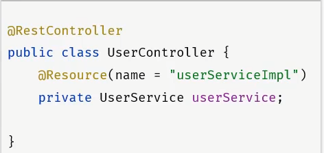
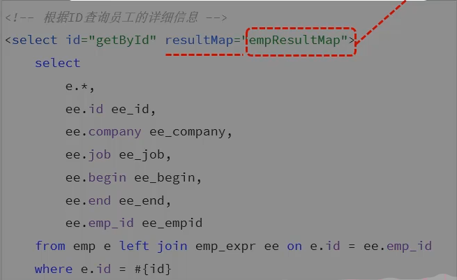
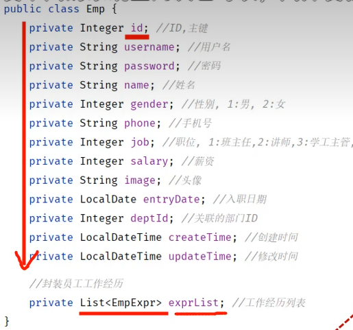
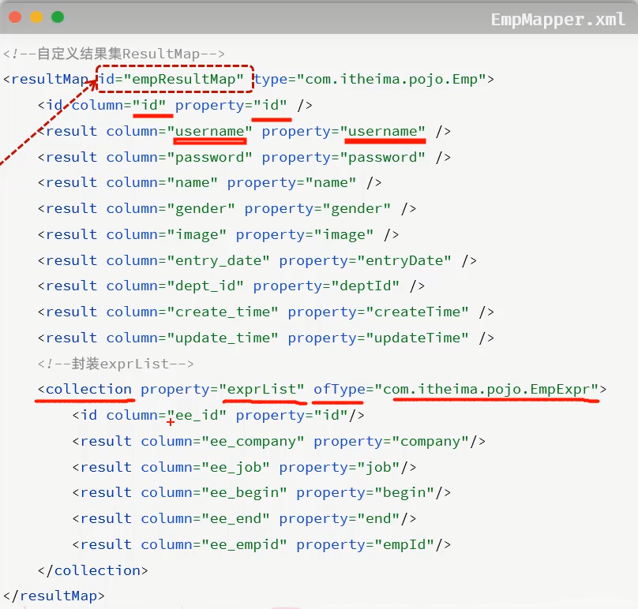
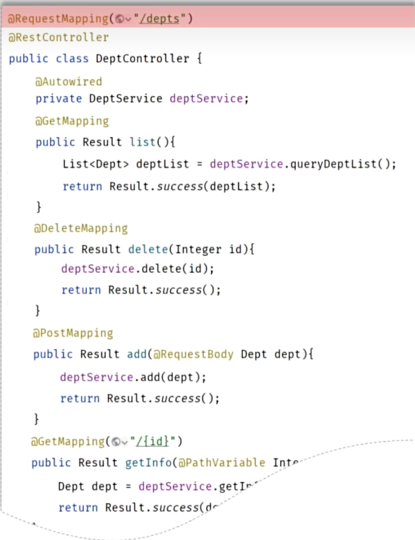
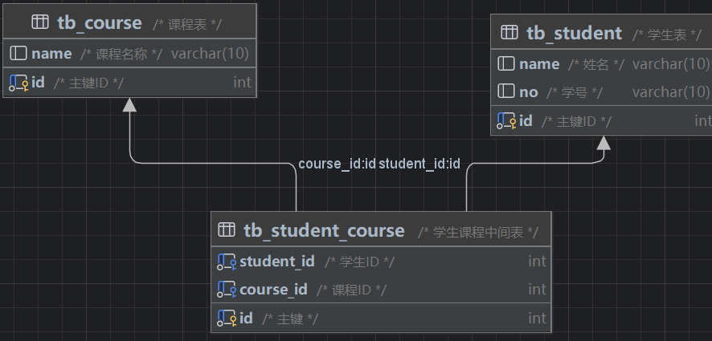
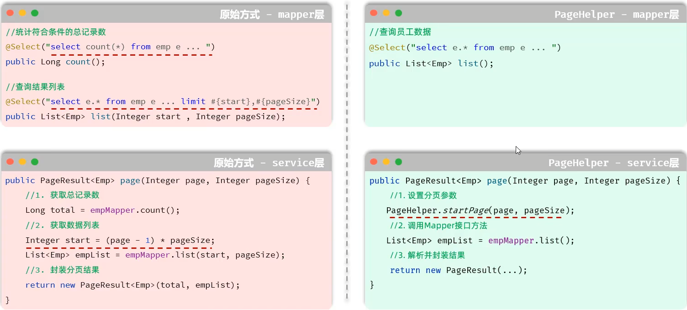
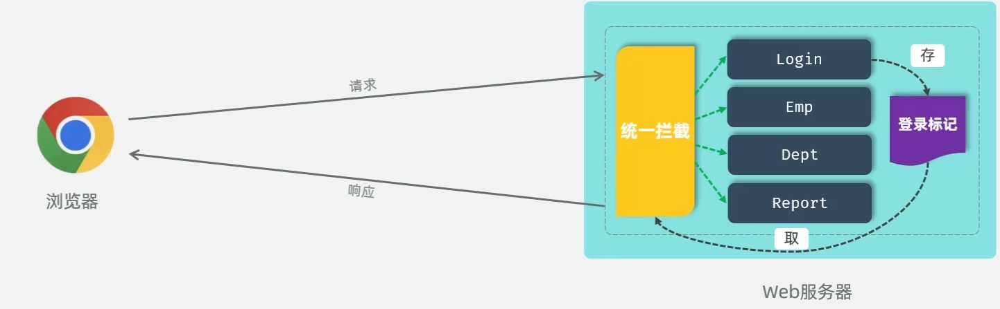

# 测试

**阶段划分**

* 单元测试（白盒测试）
* 集成测试（灰盒测试）
* 系统测试（黑河测试）
* 验收测试（黑盒测试）

### 单元测试

就是针对最小的功能单元（方法），编写测试代码对其正确性进行测试。

JUnit：最流行的Java测试框架之一，提供了一些功能，方便程序进行单元测试（第三方公司提供）

**main方法测试**：测试代码与源代码分开，难维护，一个方法测试失败，影响后面方法，无法自动化测试，得到测试报告

**JUnit单元测试**：测试代码与源代码分开，便于维护，可根据需要进行自动化测试，可自动化分析结果，产出测试报告

### JUnit断言操作

```java
Assertions.assertEquals(Object exp, Object act, String msg);//检查两个值是否相等，不相等就报错
Assertions.assertNotEquals(Object unexp, Object act, String msg);//检查两个值是否不相等，不相等就报错
Assertions.assertNull(Object act, String msg);//检查对象是否为null，不为null，就报错
Assertions.assertNotNull(Object act, String msg);//检查对象是否不为null，为null，就报错
Assertions.assertTrue(boolean condition, Sring msg);//检查条件是否为true,不为true就报错
Assertions.assertFalse(boolean condition, Sring msg);//检查条件是否为false,不为false就报错

Assertions.assertThrow(Class expType, Executable exec, String msg);//检查程序运行抛出的异常是否符合预期
//实例
@Test
    public void testGenderWithAssert2(){
        UserService userService = new UserService();
        Assertions.assertThrows(IllegalArgumentException.class, () ->{
            userService.getGender(null);
        });
    }//第二个参数是传入lambda表达式
```

### JUnit常见注解


实例:

```java
@DisplayName("用户性别")
    @ParameterizedTest
    @ValueSource(strings = {"100000200010011011", "100000200010011031", "100000200010011041", "100000200010011091"})
    public void testGetGender2(String idCard){
        UserService userService = new UserService();
        String gender = userService.getGender(idCard);
        //断言
        Assertions.assertEquals("男", gender, "性别获取错误");
    }
```


# maven的常见问题


# SpringBoot

点击新建springboot，勾选maven，下一步，勾选web

如果国外的骨架连不上，可以改为阿里云提供的镜像版


只要引入一个spring起步依赖，所有的相关依赖也会下载进来，这是因为maven的依赖传递

# HTTP协议

* 概念：Hyper Text Transfer Protocol，超文本传输协议，规定了浏览器和服务器之间数据传输的规则
* 特点：
  1. 基于TCP协议：面向连接，安全
  2. 基于请求-响应模型：一次请求对应一次响应
  3. HTTP协议是无状态的协议：对于事物处理没有记忆能力。每次请求-响应都是独立的。
     * 缺点：多次请求间不能共享数据
     * 优点：速度快


GET类型的请求没有请求体


### 响应数据


### http协议，响应数据格式


### 获取请求数据

```java
package com.itheima;

import jakarta.servlet.http.HttpServletRequest;
import org.springframework.web.bind.annotation.RequestMapping;
import org.springframework.web.bind.annotation.RestController;

@RestController
public class RequestController {
    @RequestMapping("/request")
    public String request(HttpServletRequest request){
        //1.获取请求方式
        String method = request.getMethod();
        System.out.println("Method: " + method);

        //2.获取请求的url地址
        StringBuffer requestURL = request.getRequestURL();
        System.out.println("URL: " + requestURL.toString());
        String uri = request.getRequestURI();
        System.out.println("资源访问路径" + uri);

        int i = 1 / 0;

        //3.获取请求协议
        String protocol = request.getProtocol();
        System.out.println("Protocol: " + protocol);

        //4.获取请求参数 - name
        String nameParam = request.getParameter("name");
        System.out.println("Name Parameter: " + nameParam);
        //age
        String ageParam = request.getParameter("age");
        System.out.println("Age Parameter: " + ageParam);

        //5.获取请求头 - Accept
        String acceptHeader = request.getHeader("Accept");
        System.out.println("Accept Header: " + acceptHeader);
        System.out.println("--------------------------------------------------------------------------------------------------------------------------------------------------------------------------------------------------------------------------------------------------------------------------------------------------------------------------------------------------------------------------------------------------------------------------------------------------------------------------------------------------------------------------------------------------------------------------------------------------------------------------------------------------------------------------------------------------------------------------------------------------------------------------------------------------------------------------------");

        // 返回获取到的信息
        return "OK";
    }
}

```

### 获取响应数据

```java

package com.itheima;

import jakarta.servlet.http.HttpServletRequest;
import jakarta.servlet.http.HttpServletResponse;
import org.springframework.web.bind.annotation.RequestMapping;
import org.springframework.web.bind.annotation.RestController;

import java.io.IOException;

@RestController
public class ResponseController {
    @RequestMapping("/response")
    public String response(HttpServletRequest request, HttpServletResponse response) throws IOException {
        //1.获取请求方式
        String method = request.getMethod();
        System.out.println("Method: " + method);

        //2.获取请求的url地址
        StringBuffer requestURL = request.getRequestURL();
        System.out.println("URL: " + requestURL.toString());
        String uri = request.getRequestURI();
        System.out.println("资源访问路径: " + uri);

        // 模拟设置响应状态码和头信息
        response.setStatus(HttpServletResponse.SC_OK);
        response.setContentType("text/plain");
        response.setHeader("Custom-Header", "CustomValue");

        //3.获取响应状态码
        int statusCode = response.getStatus();
        System.out.println("Status Code: " + statusCode);

        //4.获取响应内容类型
        String contentType = response.getContentType();
        System.out.println("Content Type: " + contentType);

        //5.获取响应头 - Custom-Header
        String customHeader = response.getHeader("Custom-Header");
        System.out.println("Custom Header: " + customHeader);

        System.out.println("--------------------------------------------------------------------------------------------------------------------------------------------------------------------------------------------------------------------------------------------------------------------------------------------------------------------------------------------------------------------------------------------------------------------------------------------------------------------------------------------------------------------------------------------------------------------------------------------------------------------------------------------------------------------------------------------------------------------------------------------------------------------------------------------------------------------------------");

        // 返回获取到的信息
        return "OK";
    }
}
```

### 设置响应数据

但是通常不会设置状态码，因为服务器端请求处理完毕后他会设置的生成状态码

```java
package com.itheima;

import jakarta.servlet.http.HttpServletRequest;
import jakarta.servlet.http.HttpServletResponse;
import org.springframework.web.bind.annotation.RequestMapping;
import org.springframework.web.bind.annotation.RestController;

import java.io.IOException;

@RestController
public class ResponseController {
    @RequestMapping("/response")
    public void response(HttpServletRequest request, HttpServletResponse response) throws IOException {

        //设置响应码
        response.setStatus(404);

        //设置响应标头
        response.setHeader("name", "itheima");

        //设置响应体
        response.getWriter().write("<h1>hello response</h1>");


    }
}
```

也可以直接使用**Spring**提供的库来封装一个**方法**

其中**ResponseEntity<泛型>**是已经封装好的，作为返回值

链式调用非常方便

```java
@RequestMapping("/response2")
    public ResponseEntity<String> response2(){
        return ResponseEntity
                .status(401)
                .header("name", "java_web")
                .body("<h1>hello response</h1>");
    }
```

# 获取文件输入流

src下的main下的java目录和resources目录最终编译后放在同一个目录下（classes目录下，也就是类路径下），这个时候我们就可以通过字节码对象来获取到类的加载器

类加载器更安全，可以从classpath任何位置读取文件

```java
InputStream in = this.getClass().getClassLoader().getResourceAsStream("user.txt");
```

# String转换成LocalDateTime类型

```java
LocalDateTime updateTime = LocalDateTime.parse(parts[5],
DateTimeFormatter.ofPattern("yyyy-MM-dd HH:mm:ss"));
```

# 封装用户信息

$@ResController = @Controller + @ResponseBody$

$@RestController$这个注解底层封装了一个注解$@ResponseBody$

这个注解的作用：将controller返回值最为响应体的数据直接响应；返回值是对象/集合 会先转 json 再响应

```java
//用户信息controller
@RestController//这个注解底层封装了一个注解@ResponseBody
public class UserController {
    @RequestMapping("/list")
    public List<User> list() throws Exception {
        //1.加载并读取user.txt文件
        //InputStream in = new FileInputStream(new File("src/main/resources/user.txt"));
        InputStream in = this.getClass().getClassLoader().getResourceAsStream("user.txt");
        ArrayList<String> lines = IoUtil.readLines(in, StandardCharsets.UTF_8, new ArrayList<>());//这个表示一行一行的读取


        //2.解析用户信息，封装为User对象 - list集合
        List<User> userList = lines.stream().map(line -> {
            String[] parts = line.split(",");
            Integer id = Integer.parseInt(parts[0]);
            String username = parts[1];
            String password = parts[2];
            String name = parts[3];
            Integer age = Integer.parseInt(parts[4]);
            LocalDateTime updateTime = LocalDateTime.parse(parts[5], DateTimeFormatter.ofPattern("yyyy-MM-dd HH:mm:ss"));
            return new User(id, username, password, name, age, updateTime);
        }).collect(Collectors.toList());//在jdk17之后可以直接用.toList();

        //3.返回数据到前端（json格式）
        return userList;
        //最终服务器在给前端响应数据的时候，会自动的将这个List集合转换为json格式的数据，然后再响应回去
    }
}
```

# 三层架构

* controller：控制层，接受前端发送的请求，对请求进行处理，并响应数据。
* service：业务逻辑层，处理具体的业务逻辑。
* dao：数据访问层（Data Access Object）（持久层），负责数据访问操作，包括数据的增、删、改、查。

**controller层收到请求调用servece层，service层调用dao层，然后controller再响应数据给前端**

# 三层架构的详解及代码

* **controller包：**放置请求处理类

* * **DeptController：**

  * ```java
    package com.itheima.controller;
    
    import com.itheima.pojo.Dept;
    import com.itheima.pojo.Result;
    import com.itheima.service.impl.DeptServiceImpl;
    import org.springframework.beans.factory.annotation.Autowired;
    import org.springframework.web.bind.annotation.GetMapping;
    import org.springframework.web.bind.annotation.RequestMapping;
    import org.springframework.web.bind.annotation.RequestMethod;
    import org.springframework.web.bind.annotation.RestController;
    
    import java.util.List;
    
    @RestController
    public class DeptController {
    
        private final DeptServiceImpl deptServiceImpl;
        @Autowired
        private DeptController(DeptServiceImpl deptServiceImpl){
            this.deptServiceImpl = deptServiceImpl;
        }
        //@RequestMapping(value = "/depts", method = RequestMethod.GET)
        @GetMapping("/depts")
        public Result list(){
    
            System.out.println("查询全部部门的数据");
            List<Dept> deptList = deptServiceImpl.findAll();
            return Result.success(deptList);
        }
    }
    ```

* **mapper（dao）包：**放置数据处理类（如操作数据库）

* * **DeptMapper：**

  * ```java
    package com.itheima.mapper;
    
    import com.itheima.pojo.Dept;
    import org.apache.ibatis.annotations.Mapper;
    import org.apache.ibatis.annotations.Select;
    
    import java.util.List;
    
    @Mapper
    public interface DeptMapper {
    
        @Select("select id, name, create_time, update_time from dept order by update_time desc")
        public List<Dept> findAll();
    
    }
    ```

* **service包：**放置业务逻辑接口和实现

* * **DeptService：**

  * ```java
    package com.itheima.service;
    
    import com.itheima.pojo.Dept;
    
    import java.util.List;
    
    public interface DeptService {
        public List<Dept> findAll();
    }
    ```

* * **imlp包：**放置接口的实现类

  * * **DeptServiceImpl：**

    * ```java
      package com.itheima.service.impl;
      
      import com.itheima.mapper.DeptMapper;
      import com.itheima.pojo.Dept;
      import com.itheima.service.DeptService;
      import org.springframework.beans.factory.annotation.Autowired;
      import org.springframework.stereotype.Service;
      
      import java.util.List;
      
      @Service
      public class DeptServiceImpl implements DeptService {
      
      
          private DeptMapper deptMapper;
          @Autowired
          private DeptServiceImpl(DeptMapper deptMapper){
              this.deptMapper = deptMapper;
          }
          @Override
          public List<Dept> findAll(){
              return deptMapper.findAll();
          }
      }
      ```

* **pojo包：**放置封装好的实体类

* * **Dept：**

  * ```java
    package com.itheima.pojo;
    
    import lombok.AllArgsConstructor;
    import lombok.Data;
    import lombok.NoArgsConstructor;
    
    import java.time.LocalDateTime;
    
    @Data
    @NoArgsConstructor
    @AllArgsConstructor
    public class Dept {
        private Integer id;
        private String name;
        private LocalDateTime createTime;
        private LocalDateTime updateTime;
    }
    ```

  * **Result：**

  * ```java
    package com.itheima.pojo;
    
    import lombok.Data;
    
    import java.io.Serializable;
    
    /**
     * 后端统一返回结果
     */
    @Data
    public class Result {
    
        private Integer code; //编码：1成功，0为失败
        private String msg; //错误信息
        private Object data; //数据
    
        public static Result success() {
            Result result = new Result();
            result.code = 1;
            result.msg = "success";
            return result;
        }
    
        public static Result success(Object object) {
            Result result = new Result();
            result.data = object;
            result.code = 1;
            result.msg = "success";
            return result;
        }
    
        public static Result error(String msg) {
            Result result = new Result();
            result.msg = msg;
            result.code = 0;
            return result;
        }
    }
    ```

# 分层解耦

* **耦合**：衡量软件中各个层/各个模块的以来的关联程度
* **内聚**：软件中各个功能模块内部的功能联系


**控制反转**：Inversion Of Control，简称IOC。对象的创建控制权由程序自身转移到外部（容器），这种思想成为控制反转。

**依赖注入**：Dependency Injection，简称DI。容器为应用程序提供运行时，所依赖的资源，称之为依赖注入。

**Bean对象**：IOC容器中创建、管理的对象，称之为Bean。

### 1.实现分层解耦的思路是什么？

* 将项目中的类交给IOC容器管理（IOC， 控制反转）
* 应用程序运行时需要什么对象，就直接依赖容器为其提供（DI， 依赖注入）

```java
@Component//表示下面这个实现类会存储到IOC容器中
public class UserServiceImpl implements UserService {...}
```

```java
@Autowired//应用程序运行时，会自动的查询该类型的bean对象，并赋值给该成员变量
    private UserService userService;
```

### IOC详解

|    注解     |         说明         |                      位置                       |
| :---------: | :------------------: | :---------------------------------------------: |
| @Component  |  声明bean的基础注解  |           不属于以下三类是，用此注解            |
| @Controller | @Component的衍生注解 |                标注在控制层类上                 |
|  @Service   | @Component的衍生注解 |                标注在业务层类上                 |
| @Repository |  @Component衍生注解  | 标注在数据访问层上（由于与mybatis整合，用的少） |

**注意**：声明bean的时候，可以通过注解的value属性指定bean的名字，如果没有指定，默认为类名首字母小写

* 前面声明bean的四大注解，想要生效，还需要被组件扫描注解$@ComponentScan$扫描
* 该注解虽然没有显示配置，但是实际上已经包含在了启动类声明注解$@SpringBootApplication$中，默认扫描范围是启动类所在包及其子包

### DI详解


* 属性注入：
* * 优点：代码简洁，方便快速开发 
  * 缺点：隐藏了类之间的依赖关系，可能会破坏类的封装性

```java
@Autowired
private UserService userService;
```

* 构造器注入：
* * 优点：能清晰的看到类的依赖关系、提高了代码的安全性
  * 缺点：代码繁琐、如果构造参数过多，可能会导致构造函数臃肿
  * 注意：如果只有一个构造函数，@Autowired注解可以省略

```java
//相当于构造函数，创建Controller对象的时候会自动执行这个函数
private final UserService userService;
    @Autowired
    public UserController(UserService userService) {
        this.userService = userService;
    }
```

* setter注入：
* * 优点：保持了类的封装性，依赖关系更清晰
  * 缺点：需要额外编写setter方法，增加了代码量

```java
//创建Controller对象的时候会自动执行这个函数
private UserService userService;
    @Autowired
    public void setUserService(UserService userService){
        this.userService = userService;
    }
```

**@Autowired注解，默认是按照类型注入的**

**如果存在多种相同类型的bean，将会报出如下错误**


* 方案一：@Primary，会优先注入这个标记的

* 方案二：@Qualifier，指定注入的是哪个bean

* 方案三：@Resource，指定注入的bean的名称

# 数据库

* 数据库：DataBase（DB），是存储和管理数据的仓库。
* 数据库管理系统：DataBase Management System（DBMS），操作和管理数据库的大型软件。
* SQL：Structured Query Language，操作关系型数据库的编程语言，定义了一套操作关系型数据库统一标准

# MySQL

方括号括起来的是可选的，默认值是本机的3306端口

```sql
mysql -u用户名 -p密码 [-h数据库服务器IP地址 -p端口号]
```

* 关系型数据库：建立在关系模型基础上，由多张相互连接的二位表组成的数据库。
* 特点：
* * 使用表存储数据，格式统一，便于维护。
  * 使用SQL语言操作，标准统一，使用方便，可用于复杂查询

| 分类 |            全称            |                          说明                          |
| :--: | :------------------------: | :----------------------------------------------------: |
| DDL  |  Data Definition Language  |  数据定义语言，用来定义数据库对象（数据库、表、字段）  |
| DML  | Data Manipulation Language |     数据操作语言，用来队数据库表中的数据进行增删改     |
| DQL  |    Data Query Language     |         数据查询语言，用来查询数据库中表的记录         |
| DCL  |   Data Control Language    | 数据控制语言，用来创建数据库用户，控制数据库的访问权限 |

### DDL：


### DDL表操作

```sql
-- DDL表操作
-- 创建表
create table user(
    id int comment  'ID',
    username varchar(50) comment 'username',
    name varchar(10)  comment 'name',
    age int comment 'age',
    gender char(1) comment 'gender'
)comment '用户信息表';
```

**约束**


### 数据类型

MYSQL的数据类型主要分为三类：数值类型，字符串类型，日期时间类型。

* char(10)：固定占用10个字符空间；存储A，占用10个空间；存储ABC，占用10个空间；
* varchar(10)：最多占用10个字符空间；存储A，占用1个空间；存储ABC，占用3个空间；

### DML-insert


### DQL


查询：

```sql
select name, entry_date from emp;
```

起别名:

```sql
select name as 姓名, entry_date as 入职日期 from emp;
```

别名中间有空格必须加引号包起来

去重：

```sql
-- 4. 查询已有的员工关联了哪几种职位(不要重复) - distinct
select distinct job from emp;
```


### set来声明变量

```sql
-- 6. 查询 入职日期 在 '2000-01-01' (包含) 到 '2010-01-01'(包含) 之间的员工信息
set @begin = '2000-01-01';
set @end = '2010-01-01';
select * from emp where entry_date between @begin and @end;
-- select * from emp where entry_date between '2000-01-01' and '2010-01-01';
```

```sql
-- 9. 查询 姓名 为两个字的员工信息
-- select * from emp where char_length(name) = 2;
select * from emp where name like '__';
```

```sql
SUBSTRING(str, pos, len)-- 从字符串 str 的第 pos 位置开始截取长度为 len 的子串。
-- 10. 查询 姓 '李' 的员工信息
-- select * from emp where substring(name, 1, 1) = '李';
select * from emp where name like '李%';
```

```sql
-- 11. 查询 姓名中包含 '二' 的员工信息
select * from emp where name like '%二%';
```

### DQL分组查询

| 函数  |   功能   |
| :---: | :------: |
| count | 统计数量 |
|  max  |  最大值  |
|  min  |  最小值  |
|  avg  |  平均值  |
|  sum  |   求和   |

```sql
-- 注意：所有的聚合函数不参与NULL的统计
-- 1. 统计该企业员工数量
-- count(字段)
select count(username) from emp;
-- count(*)
select count(*) from emp;-- 开发推荐，做了优化，性能最高
-- count(常量)
select count(0) from emp;
```

**分组**：

```sql
-- 注意：分组之后，select 之后的字段列表不能随意书写，能写的一般是分组字段 + 聚合函数
-- 1. 根据性别分组 , 统计男性和女性员工的数量
select gender, count(*) from emp group by gender;
```

```sql
-- 2. 先查询入职时间在 '2015-01-01' (包含) 以前的员工 , 并对结果根据职位分组 , 获取员工数量大于等于2的职位
select job from emp where entry_date <= '2015-01-01' group by job having count(*) >= 2;
```

### DOL-排序查询


**排序方式**：升序（asc），降序（desc）；默认为升序asc

```sql
-- 3. 根据 入职时间 对公司的员工进行 升序排序 ， 入职时间相同 , 再按照 更新时间 进行降序排序
select * from emp order by entry_date asc, update_time desc;
```

### DQL-分页查询


**说明**：

* 起始索引从0开始
* 分页查询是数据库的方言，不同的数据库有不同的实现，MYSQL中是LIMIT
* 如起始索引为0，起始索引可以省略，直接简写为 limit 10

```sql
-- 3. 查询 第2页 员工数据, 每页展示5条记录
select * from emp limit 5, 5;
```

# JDBC-介绍

JDBC：（Java DataBase Connectivity），就是使用Java语言操作关系型数据库的一套API。

```java
package com.itheima;


import org.junit.Test;

import java.sql.Connection;
import java.sql.DriverManager;
import java.sql.SQLException;
import java.sql.Statement;

public class jdbcTest {
    /*

    * */
    @Test
    public void testUpdate() throws ClassNotFoundException, SQLException {
        //注册驱动
        Class.forName("com.mysql.cj.jdbc.Driver");

        //连接数据库
        String url = "jdbc:mysql://localhost:3306/web01";
        String username = "root";
        String password = "Zouzixi060714";
        Connection connection = DriverManager.getConnection(url, username, password);

        //获取SQL语句的执行对象
        Statement statement = connection.createStatement();

        //执行SQL
        int i = statement.executeUpdate("update user set age = 25 where id = 1");//DML
        System.out.println("SQL执行完毕影响的行数：" + i);

        //释放资源
        statement.close();
        connection.close();
    }
}
```

**项目中常用预编译sql语句，安全，性能高**

```java
@Test
    public void testSelect(){
        String url = "jdbc:mysql://localhost:3306/web01";
        String username = "root";
        String password = "Zouzixi060714";

        Connection connection = null;
        PreparedStatement statement = null;
        ResultSet resultSet = null;
        String sql = "select * from user where username = ? && password = ?";
        try{
            connection = DriverManager.getConnection(url, username, password);
            statement =  connection.prepareStatement(sql);//预编译
            String settingOne = "daqiao";
            String settingTwo = "123456";
            statement.setString(1, settingOne);
            statement.setString(2, settingTwo);
            resultSet = statement.executeQuery();
            while(resultSet.next()){
                Integer Id = resultSet.getInt("id");
                String Username = resultSet.getString("username");
                String Password = resultSet.getString("password");
                String Name = resultSet.getString("name");
                Integer Age = resultSet.getInt("age");
                User user = new User(Id, Username, Password, Name, Age);
                System.out.println(user);
            }
        }catch (Exception e){
            throw new RuntimeException(e);
        }finally {//关闭资源的程序写在finally里面，避免报错而没有释放资源，安全
            try{
                if(resultSet != null)resultSet.close();
                if(statement != null)statement.close();
                if(connection != null)connection.close();
            }catch (Exception e){
                throw new RuntimeException(e);
            }
        }
    }
```

* JDBC程序执行DML语句和DQL语句
* * DML语句：int rowsAffected = statement.executeUpdate();
  * DQL语句：ResuiltSet rs = statement.executeQuery();
* DQL语句执行完毕结果集ResuitSet解析
* * resultSet.next()：光标向下移动一行
  * resultSet.getXxx()：获取字段数据

### 预编译SQL

* 优势一：防止SQL植入，更安全（SQL注入：通过输入来修改事先定义好的SQL语句，以达到执行代码对服务器进行攻击的方法。）

静态注入：

```sql
dashjdashkd
' or '1'='1
Preparing: select count(*) from emp where username = 'dashjdashkd' and password = '' or '1'='1'
```

预编译：

```sql
==>  Preparing: select count(*) from emp where username = ? and password = ?
==> Parameters: asdhjlask(String), ' or '1'='1(String)
```

# MyBatis

### 步骤

* MyBatis是一款优秀的**持久层**框架，用于**简化JDBC**的开发

1. **在application.properties文件中写数据库配置信息**

```properties
#加入下面这个条语句可以看到SQL的执行日志
mybatis.configuration.log-impl=org.apache.ibatis.logging.stdout.StdOutImpl

spring.datasource.url=jdbc:mysql://localhost:3306/web01
spring.datasource.driver-class-name=com.mysql.cj.jdbc.Driver
spring.datasource.username=root
spring.datasource.password=1234
```

2. **创建接口（他的实现类通过Mapping注解，在运行时自动生成并存入IOC容器中）**

```java
@Mapper//应用程序在运行时，会自动地为该接口创建一个实现类（代理对象），并且会自动的将该实现类对象存入IOC容器中 - bean
public interface UserMapper {
    //查询所有用户
    @Select("select * from user")
    public List<User> findAll();
}
```

3. 编写单元测试

```java
@SpringBootTest//SpringBoot单元测试的注解，当前测试类中的测试方法运行时会启动springboot项目-IOC容器
class MybatisStartApplicationTests {
    private final UserMapper userMapper;
    @Autowired
    public MybatisStartApplicationTests(UserMapper userMapper){
        this.userMapper = userMapper;
    }
    @Test
    public void testFindAll(){
        List<User> userList = userMapper.findAll();
        userList.forEach(System.out::println);
    }
}
```

### 删除

```java
 @Delete("delete from user where id = #{id}")//占位符#{id}，表示待会要传进来变量id
 public void deleteById(Integer id);
```

### 新增

**用对象里的成员变量传入占位符里**

MyBatis会自动将对象的成员变量解析为SQL参数。在$@Insert$注解示例中，MyBatis会通过**对象属性映射**的方式，将User对象的成员变量注入到SQL语句中。

* 参数解析机制
* * 反射获取属性：通过对象的getter方法（或直接访问字段）获取属性值。
  * 参数名映射：#{参数名}中的参数必须与对象的**属性名**一致（而非数据库里的字段名）
  * 类型转换：自动将Java类型转换为数据库类型（如 Integer -> int）

```java
@Insert("insert into user(id, username, password, name, age) values(#{id}, #{username}, #{password}, #{name}, #{age})")
public Integer insert(User user);
    
@Select("select count(1) from user")
public Integer findSum();
```

```java
@Test
public void testInsert(){
    Integer i = userMapper.insert(new User( userMapper.findSum() + 1,"zhouyu", "123456", "周瑜", 20));
    System.out.println(i);
}
```

### 查询

**形参在编译之后是没有名字的，要给形参起名要用注解@Param**

$但是$：基于官方骨架创建的springboot项目中，接口编译时会保留方法形参名，@Param注解可以省略

```java
@Select("select * from user where username = #{username} && password = #{password}")
    public User findByUsernameAndPassword(@Param("username") String username, @Param("password") String password);
```

### 更新

```sql
update dept set name = #{name}, update_time = #{updateTime} where id = #{id}
```


# 数据库连接池

* 数据库连接池是个容器，负责分配，管理数据库连接（connection）
* 它允许应用程序重复使用一个现有的数据库连接，而不是新建一个
* 释放空闲时间超过最大空闲时间的连接，来避免因为没有释放连接而引起的数据库连接泄露

* 优势：
* 1. 资源重用
  2. 提升系统响应速度
  3. 避免数据库连接遗漏

标准接口：DataSource

官方（sun）提供的数据库连接池接口，由第三方组织实现此接口

功能：获取连接（Connection getConnection() throws SQLException;）

* Druid（德鲁伊）
* * Druid连接池是阿里巴巴开源的数据库连接池项目
  * 功能强大，性能优秀，是Java语言最好的数据库连接池之一

**spring-boot项目默认的连接池是$Hikari$， 如下操作可以改变使用的连接池**

pom.xml文件中添加依赖

```xml
<dependency>
      <groupId>com.alibaba</groupId>
      <artifactId>druid-spring-boot-starter</artifactId>
      <version>1.2.19</version>
</dependency>
```

在application.properties文件中添加配置

```properties
spring.datasource.type=com.alibaba.druid.pool.DruidDataSource
```

Mybatis中的 # 号, $ 号：

| 符号   | 说明                                               | 场景                       | 优缺点         |
| ------ | -------------------------------------------------- | -------------------------- | -------------- |
| #{...} | 占位符。执行时，会将#{...}替换为?，生成预编译SQL   | 参数值传递                 | 安全，性能高   |
| ${...} | 拼接符，直接将参数拼接在SQL语句中，存在SQL注入问题 | 表名，字段名动态设置时使用 | 不安全，性能低 |

# XML映射配置

* 在MyBatis中，既可以通过注解配置SQL语句，也可以通过XML配置文件配置SQL语句
* 默认规则：
* 1. XML映射文件的名称与Mapper接口名称一致，并且将XML映射文件和Mapper接口放置在相同包下（同名同包）
  2. XML映射文件的namespace属性为Mapper接口全限定名一致
  3. XML映射文件中sql语句的id和Mapper接口的方法名一致，并保持返回类型一致

Mapper接口：

```java
@Mapper
public interface UserMapper{
    public List<User> findAll();
}
```

XML映射文件：**resultType 是表示单个返回的类型**

```xml
<mapper namespace = "com.itheima.mapper.UserMapper">
    <!-- resultType：查询返回的单条记录所封装的类型 -->
	<select id = "findAll" resultType = "com.itheima.pojo.User">
    	select id, username, password, name, age from user
    </select>
</mapper>
```

### XML映射文件中的返回值自定义：



XML映射辅助配置：

可以这样设置后将$UserMapper.xml$放在类路径（编译之后Java目录和resources目录会合并为一个类路径）下程序也可以正常运行

```xml
mybatis.mapper-locations=classpath:mapper/*.xml
```

# SpringBoot项目配置文件

* SpringBoot项目提供了多种属性配置方式（properties,yaml,yml）

$$application.properties$$文件：

```properties
spring.datasource.url=jdbc:mysql://localhost:3306/web01
spring.datasource.driver-class-name=com.mysql.cj.jdbc.Driver
spring.datasource.username=root
spring.datasource.password=1234
```

$application.yaml / application.yml$文件：

```yaml
spring:
	datesource:
		driver-class-name: com.mysql.jdbc.Driver
		url: jdbc:mysql://localhost:3306/web01
		username: root
		password: 1234
```

* 格式
* * 数值前边必须有空格，作为分隔符
  * 使用缩进表示层级关系，缩进时，不允许使用Tab键，只能用空格（idea中会自动将Tab转化为空格）
  * 所进的空格数目不重要，只要相同层级的元素对齐即可
  * \# 表示注释，从这个字符一直到行尾，都会被解析器忽略


```yaml
#定义对象
user:
  name: Tom
  age: 18
  gender: 男

#定义数组/List/Set集合
hobby:
  - Java
  - Game
  - Sport
```

**注意：在yml格式的配置文件中，如果配置项的值是以 0 开头，值需要使用 '' 引起来，因为以0开头在yml中表示8进制的数据 **

```yaml
mybatis:
  mapper-locations: classpath:mapper/*.xml
  configuration:
    log-impl: org.apache.ibatis.logging.stdout.StdOutImpl

spring:
  datasource:
    type:  com.alibaba.druid.pool.DruidDataSource
    url: jdbc:mysql://localhost:3306/web01
    driver-class-name: com.mysql.cj.jdbc.Driver
    username: root
    password: 1234
  application:
    name: mybatis_start
```

# Restful

* REST（Representational State Transfer），表述性状态转换，他是一种软件架构风格。


1. REST式风格，是约定方式，约定不是规定，可以打破
2. 描述功能模块通常使用复数形式（加s），表示此类资源，而非单个资源。如：users、books

# RequestMapping注解的子注解

**GetMapping, DeleteMapping, PostMapping, PutMapping**

**下面这两个注解的作用相同**

```java
@RequestMapping(value = "/depts", method = RequestMethod.GET)
@GetMapping("/depts")
```

# 数据封装

* 手动结果映射：通过$@Results$和$@Result$进行手动结果映射。

```java
//数据库表中的字段名写在columbn，实体类中的成员变量名写在property
@Results({
            @Result(column = "create_time", property = "createTime"),
            @Result(column = "update_time", property = "updateTime")
    })
    @Select("select id, name, create_time, update_time from dept order by update_time desc")
    public List<Dept> findAll();
```

* 起别名：在SQL语句中，对不一样的字段名起别名，别名和实体类属性名一样

```java
@Select("select id, name, create_time createTime, update_time updateTime from dept order by update_time desc")
public List<Dept> findAll();
```

* 开启驼峰命名：如果字段名与属性名符合驼峰命名规则，mybatis会自动通过驼峰命名规则映射（推荐），要求：（xxx_abc -> xxxAbc）

```yml
mybatis:
  configuration:
  	map-underscore-to-camel-case: true
```

# Controller接收参数

### 接收URL中的查询参数

* 方式一：通过原始的 HttpServletRequest 对象获取请求参数

```java
@DeleteMapping("/depts")
public Result delete(HttpServletQuest request){
    String idStr = request.getParamenter("id");
    Integer id = Integer.parseInt(idStr);
    System.out.println("根据ID删除部门：" + id);
    deptServiceImpl.delete();
    return Result.success();
}
```

* 方式二：通过Sring提供的 @RequestParam 注解，将请求参数绑定给方法形参。

```java
@DeleteMapping("/depts")
public Result delete(@RequestParam("id") Integer deptId){
    System.out.println("根据ID删除部门：" + deptId);
    deptServiceImpl.delete();
    return Result.success();
}
```

* 方式三：如果请求参数名与形参变量名相同，直接定义方法形参即可接受（省略@RequestParam）

```java
@DeleteMapping("/depts")
public Result delete(Integer id){
    System.out.println("根据ID删除部门：" + id);
    deptServiceImpl.delete(id);
    return Result.success();
}
```

* 方式四：用类接收

```java
//有多个参数，先封装一个类，然后用类来接收
```

* 特殊情况1：url参数：DELETE /emps?ids=1,2,3

* * 方式一：直接用数组接收

    ```java
    @DeleteMapping
    public Result delete(Integer[] ids){
        log.info("根据id删除员工信息:" + ids);
        return Result.success();
    }
    ```

  * 方式二：通过集合来接收

    ```java
    @DeleteMapping
    public Result delete(Integer[] ids){
    	log.info("根据id删除员工信息:" + ids);
    	return Result.success();
    
    ```

**注意：一旦加了@RequestParam注解，该参数必须传递，因为默认required为true，如果是可传可不传，就把required设置为false**

### 接收json格式的请求体参数

**POST /depts {"name":"教研部"}

* JSON格式的参数，通常会使用一个实体对象进行接收。
* 规则：JSON数据的**键名**与方法形参的**对象的属性名**相同，并需要**@RequestBody**注解标识。

```java
@PostMapping("/depts")
public Result insert(@RequestBody Dept dept){
    System.out.println("插入" + dept.getName());
    deptService.insert(dept.getName());
    return Result.success();
}
```

### 接收请求参数（路径参数）

**GET  /depts/{id}**（假如id=1，为 /depts/1）

* 路径参数：通过URL直接传递参数，使用{...}来标识该路径参数，需要使用$@PathVariable$获取

```java
@GetMapping("/depts/{id}")
public Result getInfo(@PathVariable("id")Integer deptId){
    System.out.println("根据部门ID查询部门数据：" + deptId);
    Dept dept = deptService.getInfo(deptId);
    return Result.success(dept);
}
```

当参数名与路径参数的参数名一致时可以这样写

```java
@GetMapping("/depts/{id}")
public Result getInfo(@PathVariable Integer id){
    System.out.println("根据部门ID查询部门数据：" + id);
    Dept dept = deptService.getInfo(id);
    return Result.success(dept);
}
```

* 在URL中可以携带多个路径参数，如：depts/1/0

```java
@GetMapping("depts/{id}/{sta}")
public Result getInfo(@PathVariable Integer id, @PathVariable Integer sta){
    //...
}
```

**相同的路径可以抽取到类上**



# 当前时间的获取和格式转换

```java
//获取当前时间（格式为yyyy-MM-ddTHH:mm:ss）
LocalDateTime timeNow = LocalDateTime.now();
//设置需要转换成的格式（DateTimeFormatter是一个可以自定义的时间格式类）
DateTimeFormatter formatter = DateTimeFormatter.ofPattern("yyyy-MM-dd HH:mm:ss");
//根据这个格式转换成字符串
String formatterTimeNow = timeNow.format(formatter);
```

# 日志技术

* JUL：这是JavaSE平台提供的官方日志框架，也被称为JUL。配置相对简单，但不够灵活，性能较差
* Log4j：一个流行的日志框架，提供了灵活的配置选项，支持多种输出目标
* Logback：基于Log4j升级而来，提供了更多的功能和配置选项，性能优于Log4j
* Slf4j（Simple Logging Dacede for Java）：简单日志门面，提供了一套日志操作的标准接口及抽象类，允许运用程序使用不同的底层日志框架（它没有实现，他只是规范，它的实现靠Log4j，Logback 等等）

入门程序：

```java
public class LogTest {
    private static final Logger log = LoggerFactory.getLogger(LogTest.class);

    @Test
    public void testLog(){
        log.debug("开始计算...");
        int sum = 0;
        int[] nums = {1, 5, 3, 2, 1, 4, 5, 4, 6, 7, 4, 34, 2, 23};
        for (int num : nums) {
            sum += num;
        }      
        log.info("计算结果为：" + sum);
        log.info("计算结果为：{}", sum);//避免了字符串的拼接
        log.info("结束计算...");
    }
}
```

**在类上放写一个注解$@Slf4j$就可以不定义Logger对象**

```java
@Slf4j
public class LogTest {
    @Test
    public void testLog(){
        log.debug("开始计算...");
        int sum = 0;
        int[] nums = {1, 5, 3, 2, 1, 4, 5, 4, 6, 7, 4, 34, 2, 23};
        for (int num : nums) {
            sum += num;
        }
        log.info("计算结果为：" + sum);
        log.info("结束计算...");
    }
}
```


### 配置文件

* 配置文件名：logback.xml
* 该配置文件是对Logback日志框架输出的日志进行控制的，可以来配置输出的格式、位置及日志开关等。
* 常用的两种输出日志的位置：控制台、系统文件

```xml
<!-- 控制台输出 -->
<appender name="STDOUT" class="ch.qos.logback.core.ConsoleAppender">
    <encoder class="ch.qos.logback.classic.encoder.PatternLayoutEncoder">
        <!--格式化输出：%d 表示日期，%thread 表示线程名，%-5level表示级别从左显示5个字符宽度，%logger显示日志记录器的名称， %msg表示日志消息，%n表示换行符 -->
        <pattern>%d{yyyy-MM-dd HH:mm:ss.SSS} [%thread] %-5level %logger{50}-%msg%n</pattern>
    </encoder>
</appender>
```

```xml
<!-- 系统文件输出 -->
<appender name="FILE" class="ch.qos.logback.core.rolling.RollingFileAppender">
<rollingPolicy class="ch.qos.logback.core.rolling.SizeAndTimeBasedRollingPolicy">
        <!-- 日志文件输出的文件名, %i表示序号 -->
        <FileNamePattern>D:/tlias-%d{yyyy-MM-dd}-%i.log</FileNamePattern>
        <!-- 最多保留的历史日志文件数量 -->
        <MaxHistory>30</MaxHistory>
        <!-- 最大文件大小，超过这个大小会触发滚动到新文件，默认为 10MB -->
        <maxFileSize>10MB</maxFileSize>
</rollingPolicy>
	<encoder class="ch.qos.logback.classic.encoder.PatternLayoutEncoder">
        <!--格式化输出：%d 表示日期，%thread 表示线程名，%-5level表示级别从左显示5个字符宽度，%msg表示日志消息，%n表示换行符 -->
        <pattern>%d{yyyy-MM-dd HH:mm:ss.SSS} [%thread] %-5level %logger{50}-%msg%n</pattern>
    </encoder>
</appender><!-- 系统文件输出 -->
<appender name="FILE" class="ch.qos.logback.core.rolling.RollingFileAppender">...</appender>
```

* 开启日志（ALL），关闭日志（OFF）

```xml
<root level="ALL">
	<appender-ref ref="STDOUT" />
    <appender-ref ref="FILE" />
</root>
```

### 日志级别

**日志级别指的是日志信息的类型，日志都会分级别，常见的日志级别如下（级别由低到高）：**

| 日志级别 | 说明                                                         |
| -------- | ------------------------------------------------------------ |
| trace    | 追踪，记录程序运行轨迹【使用很少】                           |
| debug    | 调试，记录程序调试过程中的信息，实际应用中一般将其视为最低级别【使用较多】 |
| info     | 记录一般信息，描述程序运行的关键事件，如：网络连接、io操作【使用较多】 |
| warn     | 警告信息，记录潜在有害的情况【使用较多】                     |
| error    | 错误信息【使用较多】                                         |

**可以在配置文件中，灵活的控制输出那些类型的日志（大于等于配置的日志级别的日志才会输出）**

```xml
<root level="info">
	<appender-ref ref="STDOUT" />
    <appender-ref ref="FILE" />
</root>
```

# 多表关系

* 项目开发中，在进行数据库表结构设计时，会根据业务需求及业务模块之间的关系，分析并设计表结构。由于业务之间相互关联，所以各个表结构之间也存在着各种联系。
* 多表关系分为三种：
* * 一对多（多对一）
  * 一对一
  * 多对多

### 外键约束

* 可以在创建表时 或 表结构创建完成后，为字段添加外键约束

```sql
-- 创建表时指定
create table 表名(
	字段名 数据类型,
    ...
    [constraint] [外键名称] foreign key (外键字段名) references 主表 (字段名)
);
```

```sql
-- 建完表后，添加外键
alter table 表名 add constraint 外键名称 foreign key (外键字段名) references 主表 (字段名);
```

以上为**物理外键**：

* 概念：使用 foreign key 定义外键关联另外一张表。
* 缺点：
* 1. 影响增、删、改的效率（需要检查外键关系）。
  2. 仅用于单节点数据库，不适用于分布式、集群场景。
  3. 容易引发数据库的死锁问题，消耗性能

**逻辑外键**：

* 概念：在业务层逻辑中，解决外键关联。
* 通过逻辑外键，就可以很方便的解决上述问题。

### 一对多

在子表设置外键

### 一对一

一对一关系，多用于单表拆分，将一张表的基础字段放在一张表中，其他字段放在另一张表中，以提升操作效率

实现：在任意一方加入外键，关联另一方的主键，并且设置外键为唯一的（UNIQUE）

### 多对多

关系：一个学生可以选修多门课程，一门课程也可以提供多个学生选择

实现：建立第三张中间表，中间表至少包含两个外键，分别关联两方的主键



# 多表查询

* 多表查询：指从多张表中查询数据。
* 笛卡尔积：指在数学中，两个集合（A集合 和 B集合）的所有组合情况。

```sql
-- emp表有30条数据，dept表有5条
select * from dept, emp;
-- 这样查询出来有150条数据
select * from dept, emp where dept_id = dept.id;
-- 这样查询出来有30条数据
```

### 连接查询

* 内连接：相当于查询A、B交集部分数据
* 外连接：
* * 左外连接：查询左表所有数据（包括两张表交集部分数据）
  * 右外连接：查询右表所有数据（包括两张表交集部分数据）

##### 内连接

```sql
-- 隐式内连接
select 字段列表 from 表1, 表2 where 连接条件 ...;

-- 显式内连接,[]中的表示可以省略
select 字段列表 from 表1 [inner] join 表2 on 连接条件 。。。；
```

示例：

```sql
-- A. 查询所有员工的ID, 姓名 , 及所属的部门名称 (隐式、显式内连接实现)
select emp.id, emp.name, dept.name from emp, dept where emp.dept_id = dept.id;

select emp.id, emp.name, dept.name from emp inner join dept on emp.dept_id = dept.id;
```

**给表起别名**

**注意：一旦为表起了别名，就要通过别名来指定字段名，而不能再使用表名**

```sql
select * from 表1 [as] 别名, 表2 [as] 别名 where ...;
```

##### 外连接

```sql
-- 左外连接
select 字段列表 from 表1 left [outer] join 表2 on 连接条件 ...;

-- 右外连接([]内的可省略)
select 字段列表 from 表1 right [outer] join 表2 on 连接条件 ...;
```

示例

```sql
-- 查询员工表 所有 员工的姓名, 和对应的部门名称 (左外连接)
select emp.name, dept.name from emp left outer join dept on emp.dept_id = dept.id;
    
-- 查询部门表 所有 部门的名称, 和对应的员工名称 (右外连接)
select dept.name, emp.name from emp right outer join dept on emp.dept_id = dept.id;

-- C. 查询工资 高于8000 的 所有员工的姓名, 和对应的部门名称 (左外连接)
 select emp.name, dept.name from emp left outer join dept on emp.dept_id = dept.id where emp.salary > 8000;
-- 后面加where才能使小于等于8000的不显示出来
```


### 子查询

* 介绍：SQL语句中嵌套select语句，称为嵌套查询，又称子查询。

* 形式：

  ```sql
  select * from t1 where column1 = (select column1 from t2 ...);
  ```

* 说明：子查询的外部语句可以是insert / update / delete / select 的任何一种，最常见的是select

* 分类：

* * 标量子查询：子查询返回的结果为单个值
  * 列子查询：子查询返回的结果为一列
  * 行子查询：子查询返回的结果为一行
  * 表子查询：子查询返回的结果为多行多列

##### 标量子查询

```sql
-- 查询入职时间最早的员工信息
select * from emp where entry_date = (select min(entry_date) from emp);
```

##### 列子查询

```sql
-- 查询“教研部”和“咨询部”的所有员工信息
select * from emp where dept_id in (select id from dept where name = '教研部' or '咨询部');
```

##### 行子查询

```sql
-- 查询与“李忠”的薪资及职位都相同的员工信息
select * from emp where salary = (select salary from emp where name = '李忠') && job = (select job from emp where name = '李忠');
-- 下面是上面的优化
select * from emp where (salary, job) = (select salary, job from emp where name = '李忠');
```

##### 表子查询

```sql
-- 获取每个部门中薪资最高的员工信息
select * from emp where salary in (select max(salary) from emp group by  dept_id) && dept_id is not null;

-- 下面这个的效果是一样的，但使用的是多表查询
select * from emp, (select dept_id, max(salary) max_sal from emp group by dept_id) st where emp.dept_id = st.dept_id && emp.salary = st.max_sal;
```

# 查询的整体混合运用实例

```sql
-- 查询 “教研部” 性别为 男， 且在 “2011-05-01” 之后入职的员工信息。
select * from emp where gender = 1 && entry_date > '2011-05-01' && dept_id = (select id from dept where name = '教研部');

-- 查询工资 低于公司平均工资的 且 性别为男 的员工信息。
select * from emp where salary < (select avg(salary) from emp) && gender = 1;

-- 查询部门人数超过 10 人的部门名称。
select dept.name from dept, (select dept_id, count(1) num from emp group by dept_id) st where st.num > 10  && dept.id = st.dept_id;

-- 查询再 “2010-05-01” 后入职，且薪资高于 10000 的 “教研部” 员工信息，并根据薪资倒序排序。
select * from emp where dept_id = (select id from dept where name = '教研部') && entry_date > '2010-05-01' && salary > 10000 order by salary desc;

-- 查询工资 低于本部门平均工资的员工信息。
select emp.* from emp, (select dept_id, avg(salary) num from emp group by dept_id) st where emp.salary < st.num && emp.dept_id = st.dept_id;
```

# PageHelper

* PageHelper是第三方提供的在Mybatis框架中用来实现分页的插件，用来简化分页操作，提高开发效率



* 使用步骤：
* 1. 引入PageHelper的依赖
  2. 定义Mapper接口的查询方法（无需考虑分页）
  3. 在Service方法中实现分页查询

Mapper:

```java
@Select("select emp.*, dept.name deptName from emp left outer join dept on emp.dept_id = dept.id order by emp.update_time desc")
    public Page<Emp> list();
```

Service:

EmpService:

```java
public interface EmpService<T> {
    public PageResult<T> page(Integer page, Integer pageSize);
}
```

EmpServiceImpl:

```java
//根据PageHelper分页查询
    @Override
    public PageResult<Emp> page(Integer page, Integer pageSize) {
        //设置分页参数
        PageHelper.startPage(page, pageSize);
        //执行查询
        Page<Emp> p = empMapper.list();
        //解析查询结果，封装
        return new PageResult<Emp>(p.getTotal(), p.getResult());
    }
```

* PageHelper实现机制
* 1. select count(0) from emp e ...
  2. select ... from emp e ...
* 注意事项：
* 1. SQL语句结尾不要加分号（；）
  2. PageHelper只会对紧跟在其后的第一条SQL语句进行分页处理

# 动态SQL

* 随着用户的输入或外部条件的变化而变化的SQL语句，我们称为动态SQL

* \<if>：判断条件是否成立，如果条件为true，则拼接SQL

```xml
<if test="gender != null">
	and emp.gender = #{gender}
</if>
```

* \<where>：根据查询条件，来生成where关键字，并会自动去除条件前面多余的and和or

```xml
<select id="list" resultType="com.itheima.pojo.Emp">
   select emp.*, dept.name from emp left outer join dept on emp.dept_id = dept.id
           <where>
              <if test="name != null and name != ''">
                  and emp.name like concat('%', #{name}, '%')
              </if>
              <if test="gender != null">
                  and gender = #{gender}
              </if>
              <if test="begin != null and end != null">
                  and emp.entry_date between #{begin} and #{end}
              </if>
             </where>>order by emp.update_time desc
</select>
```

# 新增员工-批量保存工作经历

动态SQL：\<foreach>

* \<foreach>属性说明：
* 1. collection：集合名称
  2. item：集合遍历出来的元素/项
  3. separator：每一次遍历使用的分隔符
  4. open：遍历开始前拼接的片段
  5. close：遍历结束后拼接的片段

# 主键返回

```java
@Options(useGeneratedKeys = true, keyProperty = "id")//获取到生成的主键--主键返回
    @Insert(".....")
    public void insert(Emp emp);
```

# 事务管理

保存员工基本信息成功了，而保存工作经历失败了，这是不行的，因为这属于一个业务操作，如果保存员工信息成功了，保存工作经历信息失败了，就会造成数据库数据的不完整，不一致。

**概念**：事务，是一组操作的集合，它是一个不可分割的工作单位。事物会把所有的操作作为一个整体一起向系统提交或撤销操作请求，即这些操作要么同时成功，要么同时失败。

* 事务控制主要三步操作：开启事务，提交事务/回滚事务

```sql
start transaction; / begin;
-- 1.保存员工基本信息
insert into emp values(....);
-- 2.保存员工的工作经历信息
insert into emp_expr(...) values(...), (...);

-- 提交事务（全部成功） / 回滚事务（有一个失败）
commit; / rollback;
```

Spring事务管理-控制事务

* 注解：@Transactional
* 作用：将当前方法交给spring进行事务管理，方法执行前，开启事务；成功执行完毕，提交事务；出现异常，回滚事务
* 位置，业务（service）层得方法上、类上、接口上

方法上：这个方法需要进行事务控制（推荐）

实现类上：这个类中的所有方法需要进行事务控制

接口上：这个接口所有的实现类中的所有的方法需要进行事务控制

**注意**：Spring在进行AOP代理时（如@Transactional），默认需要一个无参构造函数，但是使用了自定义构造函数之后如果没有显式定义无参构造函数，可能会导致代理创建失败。

比如使用了@Autowired的构造器注入：

```java
private EmpMapper empMapper;
private EmpExprMapper empExprMapper;
@Autowired
public EmpServiceImpl(EmpMapper empMapper, EmpExprMapper empExprMapper){
    this.empMapper = empMapper;
    this.empExprMapper = empExprMapper;
}


public EmpServiceImpl() {//添加一个无参构造函数
}
@Transactional//事务管理的注解
@Override
public void save(Emp emp){
    //1.保存员工基本信息
    emp.setCreateTime(LocalDateTime.now());
    emp.setUpdateTime(LocalDateTime.now());
    empMapper.insert(emp);
    //2.保存员工工作经历信息
    List<EmpExpr> exprList = emp.getExprList();
    if(!CollectionUtils.isEmpty(exprList)){
        exprList.forEach(empExpr -> {
            empExpr.setEmpId(emp.getId());
        });
        empExprMapper.insertBatch(exprList);
    }
}
```

### rollbackFor

这个属性用于控制出现何种异常类型，回滚事务。

```java
@Transactional(rollbackFor = {Exception.class})//使出现所有异常都会回滚
```

**@Transactional的rollbackFor的默认是出现运行时异常RuntimeException才会回滚**

### propagation

事务传播行为：指的是当一个事务方法被另一个事务方法调用时，这个事务方法应该如何进行事务控制

| 属性值        | 含义                                                         |
| ------------- | ------------------------------------------------------------ |
| REQUIRED      | 【默认值】需要事务，有则加入，无则创建新事务                 |
| REQUIRES_NEW  | 需要新事务，无论有无，总是创建新事务                         |
| SUPPORTS      | 支持事务，有则加入，无则在无事务状态中运行                   |
| NOT_SUPPORTED | 不支持事务，在无事务状态下运行，如果当前存在已有事务，则挂起当前事务 |
| MANDATORY     | 必须有事务，否则抛异常                                       |
| NEVER         | 必须没事务，否则抛异常                                       |

下面这个程序，功能为插入数据和记录日志，记录日志是无论插入成功与否都要记录，但是现在的方法empLogService.insertLog();，它没有加@Transactional注解，所以当这个save方法抛出异常时，它会回滚，所以往数据库里写入日志也会回滚，虽然在final之后，但是也无法执行写入。

所以必须要在insertLog方法的本体上面加一个注解@Transactional(propagation = Propagation.REQUIRES_NEW)（意思是，创建一个新的事务，需要在一个新的事务中运行），所以它运行完毕之后直接久已经commit了，就算save方法回滚也并不会影响

```java
@Transactional(rollbackFor = {Exception.class})//事务管理的注解 - 默认出现运行时异常RuntimeException才会回滚
@Override
public void save(Emp emp) throws Exception {
    try {
        //1.保存员工基本信息
        emp.setCreateTime(LocalDateTime.now());
        emp.setUpdateTime(LocalDateTime.now());
        empMapper.insert(emp);
        //2.保存员工工作经历信息
        int i = 1 / 0;
        List<EmpExpr> exprList = emp.getExprList();
        if(!CollectionUtils.isEmpty(exprList)){
            exprList.forEach(empExpr -> {
                empExpr.setEmpId(emp.getId());
            });
            empExprMapper.insertBatch(exprList);
        }
    } finally {
        //记录操作日志
        EmpLog empLog = new EmpLog(null, LocalDateTime.now(), "新增员工：" + emp);
        empLogService.insertLog(empLog);
    }
}
```

### 常见的传播行为

* REQUIRED：大部分场景（有事务我就加入，没有事务我就创建一个）
* REQUIRES_NEW：希望两个方法在独立的事务中运行，互不影响（有没有事务我都要创建一个独立的自己的事务）

### 事务的四大特性（ACID）

原子性（Atomicity）：事务是不可分割的最小单元，要么全部成功，要么全部失败

一致性（Consistency）：事务完成时，必须使所有的数据都保持一致状态

隔离性（Isolation）：数据库系统提供的隔离机制，保证事务在不受外部并发操作影响的独立环境下运行

持久性（Durability）：事务一旦提交或回滚，它对数据库中的数据的改变就是永久的

# 文件上传

html页面

这个属性很重要enctype，没有写这属性的话之后传入文件的名称，有了这个属性才会传入文件的内容

```html
<form action="/upload" method="post" enctype="multipart/form-data">
    <input type="submit" value="提交">
</form>
```

SpringBoot上传文件屎，默认的最大大小为1MB

### 阿里云OSS参数配置化

**将一些需要灵活变化的参数，配置在配置文件中，然后通过@Value注解来注入外部配置的属性。**

```yml
aliyun:
	oss:
		endpoint: https//oss-cn-beijing.aliyuncs.com
		bucketName: web-true
		region: cn.beijing
```

##### 使用@Value注解来注入

```java
@Component
public class AliyunOSSOperator{
    @Value("${aliyun.oss.endpoint}")
    private String endpoint;
    @Value("${aliyun.oss.backetName}")
    private String bucketName;
    @Value("${aliyun.oss.region}")
    private String region;
}
```

##### 但是一个一个的注入很繁琐，下面是批量注入(@ConfigurationProperties注入)

```yml
aliyun:
	oss:
		endpoint: https//oss-cn-beijing.aliyuncs.com
		bucketName: web-true
		region: cn.beijing
```

声明一个实体类用来存储这些配置信息

```java
@Data//获取get，set方法
@Component//作为一个Bean由IOC容器代理
@CongigurationProperties(prefix = "aliyun.oss")//这里表示配置文件中的前缀是什么
public class AliyunOSSProperties{
    private String endpoint;
    private String bucketName;
    private String region;
}
```

在需要使用的时候注入

```java
@Component
public class AliyunOSSOperator{
	@Autowired
	private AliyunOSSProperties aliyunOOSSProperties;
    
    public String upload(byte[] content, String originalFilename) throws Exception{
        String endpoint = aliyunOSSProperties.getEndpoint();
        String bucketName = aliyunOSSProperties.getBucketName();
        String region = aliyunOSSProperties.getRegion();
    }
}
```

# 全局异常处理器

在com.itheima下新建一个包exception包下面新建一个类GlobalExceptionHandler.java

以下代码可以**穿透多层异常链**，找到最底层的导致异常的根本原因，这种方法适用于任何类型的嵌套异常，并且不依赖于具体的异常类型或消息格式

```java
@Slf4j
@RestControllerAdvice
public class GlobalExceptionHandler {

    @ExceptionHandler
    public Result handleException(Throwable throwable){
        Throwable cause = throwable;
        while(cause.getCause() != null && cause.getCause() != cause){
            cause = cause.getCause();
        }
        String msg = cause.getMessage();
        log.error("程序出错了" + msg);
        return Result.error("程序出错了，请联系管理员" + msg);
    }
}
```

# Map的键与值得别名

这里查询到的数据封装到LIst集合里，集合中Map的键的别名为“pos”， 值得别名为“num”

```java
//统计员工性别人数
    @MapKey("pos")
    public List<Map<String, Object>> countEmpGenderData();
```

```xml
 <!-- 统计员工职位人数 -->
    <select id="countEmpJobData" resultType="java.util.Map">
        select
            (case when job = 1 then '班主任'
                when job = 2 then '讲师'
                when job = 3 then '学工主管'
                when job = 4 then '教研主管'
                when job = 5 then '咨询师'
                else '其他' end) pos,
            count(*) num
        from emp group by job order by num asc;
    </select>
    <select id="countEmpGenderData" resultType="java.util.Map">
        select
            (case when gender = 1 then '男性员工'
                when gender = 2 then '女性员工'
                end) pos,
            count(*) num
        from emp group by gender order by gender asc;
    </select>
```

# 登录校验



**登录标记**：用户登录成功之后，在后续的每一次请求中，都可以获取到该标记。【会话技术】

**统一拦截**：过滤器Filter，拦截器Interceptor

### 会话技术

* 会话：用户打开浏览器，访问web服务器的资源，会话建立，直到有一方断开连接，会话结束。在一次会话中可以包含多次请求和响应。
* 会话跟踪：一种维护浏览器状态的方法，服务器需要识别多次请求是否来自于同一浏览器，以便在同一次会话的多次请求间共享数据

* 会话跟踪方案：
* * 客户端会话跟踪技术：Cookie
  * 服务端会话跟踪技术：Session
  * 令牌技术
