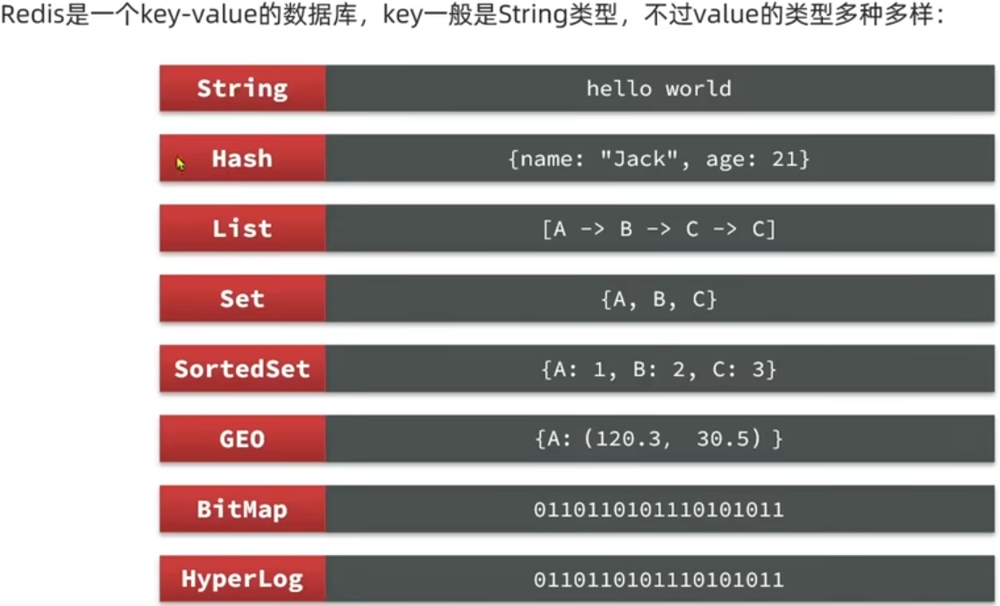
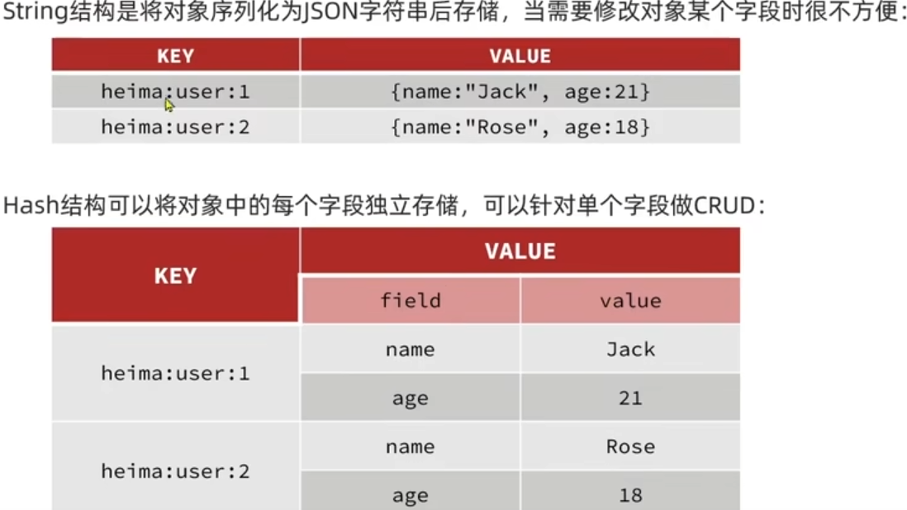

# Redis

基于内存的键值型NoSQL数据库

**特征**：

* 键值型（key-value）：value支持多种不同的数据结构
* 单线程，每个命令具备原子性

* 低延迟，速度快（基于内存，IO多路复用，良好的编码【基于C语言】）
* 支持数据持久化
* 支持主从集群，分片集群
* 支持多语言客户端

# Redis通用命令

通用指令是部分数据类型的，都可以使用的指令，常见的有：

* keys：查看符合模板的所有的key，不建议在生产环境设备上使用
* del：删除一个指定的key
* exists：判断key是否存在
* expire：给一个key设置有效期，有效期到期时该key会被自动删除

* ttl：查看一个key的剩余有效期

# String类型的常见命令

String类型的三种格式，字符串，int，float

* set：添加或者修改已经存在的一个String类型的键值对
* get：根据key获取String类型的value
* mset：批量添加多个String类型键值对
* mget：根据多个key获取多个String类型的value
* incr：让一个整型的key自增并指定步长，例如：incrby num 2 让num值自增2
* incrbyfloat：让一个浮点类型的数字自增并指定步长
* setnx：添加一个String类型的键值对，前提是这个给key不存在，否则不执行
* setex：添加一个String类型的键值对，并指定有效期

# key的结构

Redis的key允许多个单词形成层级结构，多个单词之间用 ‘ : ’ 隔开，格式如下：

$项目名:业务名:类型:id$

这个格式不固定

# Hash类型

Hash类型，也叫散列，其value是一个无序字典，类似于Java中的HashMap结构

Hash常见命令：

* hset key field value：添加或者修改hash类型key的field的值
* hget key field
* hmset
* h。。。

# List类型

Redis中的List类型与Java中的LinkedList类似，可以看作是一个双向链表结构。既可以支持正向检索，也可以支持反向检索

特征也与LinkedList类似：

* 有序
* 元素可以重复
* 插入和删除快
* 查询速度一般

List类型常见命令

* lpush key element ...：向链表左侧插入一个或多个元素
* lpop key：移除并返回列表左侧的第一个元素，没有则返回nil
* rpush key element ...：向链表右侧插入一个或多个元素
* rpoop key：移除并返回列表右侧的第一个元素
* lrange key star end：返回一段角标范围内的所有元素
* blpop和brpop：与lpop和rpop类似，只不过没有元素时等待指定时间，而不是直接返回nil

# Set类型

redis的Set结构与Java中的HashSet类似，可以看作是一个value为null的HashMap。因为也是一个Hash表，因此具备与HashSet类似的特征：

* 无序
* 元素不可重复
* 查找快
* 支持交集、并集、差集等功能

Set类型的常见命令

* sadd key member 。。。：向set中添加一个或多个元素
* srem key member 。。。：移除set中的指定元素
* scard key：返回set中元素的个数
* sismember key member：判断一个元素是否存在于set中
* smembers：获取set中所有元素
* sinter key1 key2 ...：求key1与key2的交集
* sdiff key1 key2  。。。：求key1与key2的差集
* sunion key1 key2  。。。：求key1与key2的并集

# SortedSet类型

redis的SortedSet是一个可排序的set集合，与Java中的TreeSet有些相似，但底层数据结构却差别很大。SortedSet中的每一个元素都有一个score属性，可以基于score属性对元素排序，底层的实现是一个调表（SkipList，用来排序）加 Hash表（用来去重）。

SortedSet特性：

* 可排序
* 去重
* 查询速度快

**因为SortedSet的可排序特性，经常被用来实现排行榜这样的功能**

SortedSet常见命令：

* zadd key score member：添加一个或多个元素到SortedSet，如果已经存在则更新其score值
* zrem key member：删除SortedSet中的一个指定元素
* zscore key member：获取SortedSet中的指定元素的score值
* zrank key member：获取SortedSet中的指定元素的排名
* zcard key：获取SortedSet中的元素个数
* zcount key min max：统计score值在给定范围内的所有元素的个数
* zincrby key increment member：让SortedSet中的指定元素自增，步长为指定的increment值
* zrange key start stop：按照score排序后，排名[start, stop]区间的member
* zdiff、zinter、zunion：求差集、交集、并集

**注意：所有的排名默认都是升序，如果要降序，在命令z后面添加rev即可（reverse，反转）**

