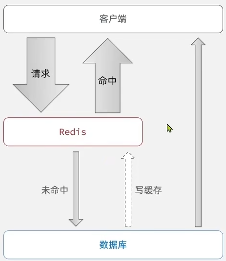

# Redis

基于内存的键值型NoSQL数据库

**特征**：

* 键值型（key-value）：value支持多种不同的数据结构
* 单线程，每个命令具备原子性

* 低延迟，速度快（基于内存，IO多路复用，良好的编码【基于C语言】）
* 支持数据持久化
* 支持主从集群，分片集群
* 支持多语言客户端


# Redis通用命令

通用指令是部分数据类型的，都可以使用的指令，常见的有：

* keys：查看符合模板的所有的key，不建议在生产环境设备上使用
* del：删除一个指定的key
* exists：判断key是否存在
* expire：给一个key设置有效期，有效期到期时该key会被自动删除

* ttl：查看一个key的剩余有效期

# String类型的常见命令

String类型的三种格式，字符串，int，float

* set：添加或者修改已经存在的一个String类型的键值对
* get：根据key获取String类型的value
* mset：批量添加多个String类型键值对
* mget：根据多个key获取多个String类型的value
* incr：让一个整型的key自增并指定步长，例如：incrby num 2 让num值自增2
* incrbyfloat：让一个浮点类型的数字自增并指定步长
* setnx：添加一个String类型的键值对，前提是这个给key不存在，否则不执行
* setex：添加一个String类型的键值对，并指定有效期

# key的结构

Redis的key允许多个单词形成层级结构，多个单词之间用 ‘ : ’ 隔开，格式如下：

$项目名:业务名:类型:id$

这个格式不固定

# Hash类型

Hash类型，也叫散列，其value是一个无序字典，类似于Java中的HashMap结构


Hash常见命令：

* hset key field value：添加或者修改hash类型key的field的值
* hget key field
* hmset
* h。。。

# List类型

Redis中的List类型与Java中的LinkedList类似，可以看作是一个双向链表结构。既可以支持正向检索，也可以支持反向检索

特征也与LinkedList类似：

* 有序
* 元素可以重复
* 插入和删除快
* 查询速度一般

List类型常见命令

* lpush key element ...：向链表左侧插入一个或多个元素
* lpop key：移除并返回列表左侧的第一个元素，没有则返回nil
* rpush key element ...：向链表右侧插入一个或多个元素
* rpoop key：移除并返回列表右侧的第一个元素
* lrange key star end：返回一段角标范围内的所有元素
* blpop和brpop：与lpop和rpop类似，只不过没有元素时等待指定时间，而不是直接返回nil

# Set类型

redis的Set结构与Java中的HashSet类似，可以看作是一个value为null的HashMap。因为也是一个Hash表，因此具备与HashSet类似的特征：

* 无序
* 元素不可重复
* 查找快
* 支持交集、并集、差集等功能

Set类型的常见命令

* sadd key member 。。。：向set中添加一个或多个元素
* srem key member 。。。：移除set中的指定元素
* scard key：返回set中元素的个数
* sismember key member：判断一个元素是否存在于set中
* smembers：获取set中所有元素
* sinter key1 key2 ...：求key1与key2的交集
* sdiff key1 key2  。。。：求key1与key2的差集
* sunion key1 key2  。。。：求key1与key2的并集

# SortedSet类型

redis的SortedSet是一个可排序的set集合，与Java中的TreeSet有些相似，但底层数据结构却差别很大。SortedSet中的每一个元素都有一个score属性，可以基于score属性对元素排序，底层的实现是一个调表（SkipList，用来排序）加 Hash表（用来去重）。

SortedSet特性：

* 可排序
* 去重
* 查询速度快

**因为SortedSet的可排序特性，经常被用来实现排行榜这样的功能**

SortedSet常见命令：

* zadd key score member：添加一个或多个元素到SortedSet，如果已经存在则更新其score值
* zrem key member：删除SortedSet中的一个指定元素
* zscore key member：获取SortedSet中的指定元素的score值
* zrank key member：获取SortedSet中的指定元素的排名
* zcard key：获取SortedSet中的元素个数
* zcount key min max：统计score值在给定范围内的所有元素的个数
* zincrby key increment member：让SortedSet中的指定元素自增，步长为指定的increment值
* zrange key start stop：按照score排序后，排名[start, stop]区间的member，索引从0开始
* zdiff、zinter、zunion：求差集、交集、并集

**注意：所有的排名默认都是升序，如果要降序，在命令z后面添加rev即可（reverse，反转）**

# Spring--data-redis

application.yml配置

```yaml
spring:
  data:
    redis:
      host: 192.168.100.128 #服务器地址
      port: 6379
      password: 1234
      lettuce:  #使用lettuce客户端（默认），如果使用jedis要引入jedis依赖
        pool:
          max-active: 8 #最大连接
          max-idle: 8 #最大空闲连接
          min-idle: 0 #最小空闲连接
          max-wait: 100 #连接池最大阻塞等待时间
      database: 0 #指定要使用的数据库编号
      timeout: 5000 #连接超时时间（ms）
```

# 配置类指定如何序列化

```java
package com.heima.redis.config;

import org.springframework.context.annotation.Bean;
import org.springframework.context.annotation.Configuration;
import org.springframework.data.redis.connection.RedisConnectionFactory;
import org.springframework.data.redis.core.RedisTemplate;
import org.springframework.data.redis.serializer.GenericJackson2JsonRedisSerializer;
import org.springframework.data.redis.serializer.RedisSerializer;

@Configuration
public class RedisConfig {

    @Bean
    public RedisTemplate<String, Object> redisTemplate(RedisConnectionFactory connectionFactory){
        //创建RedisTemplate对象
        RedisTemplate template = new RedisTemplate<String, Object>();
        //设置连接工厂
        template.setConnectionFactory(connectionFactory);
        //创建JSON序列化工具
        GenericJackson2JsonRedisSerializer jsonRedisSerializer = new GenericJackson2JsonRedisSerializer();
        //设置KEY得序列化
        template.setKeySerializer(RedisSerializer.string());
        template.setHashKeySerializer(RedisSerializer.string());
        //设置Value得序列化
        template.setValueSerializer(jsonRedisSerializer);
        template.setHashValueSerializer(jsonRedisSerializer);
        return template;
    }
}
```

# StringRedisTemplate

**为了节省内存空间，我们并不会使用JSON序列化器来处理value，而是统一使用String序列化器，要求只能存储String类型的key和value，当需要Java对象时，手动完成对象的序列化和反序列化。（比如Gson）**

Spring默认提供了一个StringRedisTemplate类，它的key和value的序列化方式默认就是String方式。省去了我们自定义RedisTemplate的过程

**构造器注入**

拦截器一般不需要最为Spring Bean，减少开销

```java
@Configuration
public class WebConfig implements WebMvcConfigurer {
    private StringRedisTemplate stringRedisTemplate;
    public WebConfig(StringRedisTemplate stringRedisTemplate){
        this.stringRedisTemplate = stringRedisTemplate;
    }
    @Override
    public void addInterceptors(InterceptorRegistry registry) {
        registry.addInterceptor(new LoginInterceptor())
                .addPathPatterns("/**")
                .excludePathPatterns(
                        "/user/login",
                        "/user/code",
                        "/blog/hot",
                        "/shop/**",
                        "/shop-type/**",
                        "/voucher/**")
                .order(1);
        
        //这里直接采用构造注入stringRedisTemplate，是因为RefreshTokenInterceptor不是Bean
        registry.addInterceptor(new RefreshTokenInterceptor(stringRedisTemplate))
                .addPathPatterns("/**")
                .order(0);
    }
}
```


# 基于Session实现登录

| 发送短信验证码      | 短信验证码登录、注册             | 校验登录状态                |
| ------------------- | -------------------------------- | --------------------------- |
| 提交手机号          | 提交手机号和验证码               | 请求并携带cookie            |
| 校验手机号          | 校验验证码                       | 从session中获取用户         |
| 生成验证码          | 根据手机号查询用户信息           | 判断用户是否存在            |
| 保存验证码到Session | 用户是否存在                     | 存在，保存用户到ThreadLocal |
| 发送验证码          | 存在，保存用户到Session          | 不存在，拦截                |
|                     | 不存在，创建新用户，保存到数据库 |                             |
|                     |                                  |                             |

**但是：多台tomcat不能共享Session**

# Redis

* 接收phone， 生成code（验证码），将验证码短信发给指定手机号

* 将 $前缀+phone$ 作为key，code（验证码）作为value

# Redis权限验证

* **后端：**接收phone和code，验证手机号格式，从Redis中去除key为 $前缀 + phone$ 的code，验证code是否一致，一致，生成token，以token作为key，HashMap储存用户基本信息作为value存储在Redis里，最后返回token给前端
* **前端：**接收token，储存在sessionStorage里（浏览器的储存）， 每次发起请求都会经过一个axios的拦截器，把token从sessionStorage里取出来，放在请求头里

* **后端：**后端拦截器拦截之后的请求，获取请求头中的token，从Redis查询用户基本信息，为空拦截，非空储存用户基本信息在ThreadLocal里，供后续的controller使用，放行。

# 缓存

缓存就是数据交换的缓冲区（称为Cache），是存储数据的临时的地方，一般读写性能较高

**缓存的作用：**

* 降低后端负载
* 提高读写效率，降低响应时间

**缓存的成本：**

* 数据一致性成本
* 代码维护成本
* 运维成本



# 缓存更新策略

|              | 内存淘汰                                                     | 超时剔除                                                     | 主动更新                                 |
| ------------ | ------------------------------------------------------------ | ------------------------------------------------------------ | ---------------------------------------- |
| **说明**     | 不用自己维护，利用Redis的内存呢淘汰机制，当内存不足时自动淘汰部分数据，下次查询时更新缓存 | 给缓存数据添加TTL时间，到期后自动删除缓存，下次查询时更新缓存 | 编写业务逻辑，在修改数据库的同时更新缓存 |
| **一致性**   | 差                                                           | 一般                                                         | 好                                       |
| **维护成本** | 无                                                           | 低                                                           | 高                                       |

业务场景：

* 低一致性需求：使用内存淘汰机制。例如店铺类型的查询缓存
* 高一致性需求：主动更新，并以超时剔除作为兜底方案。例如店铺详情查询的缓存

# 主动更新策略

* Cache Aside Pattern：缓存的调用者，在更新数据库的同时更新缓存
* Read/Write Through Pattern：缓存与数据库整合为一个业务，由服务来维护一致性。调用者调用该服务，无需关心缓存一致性问题
* Write Behind Caching Pattern：调用者只操作缓存，由其他线程异步的将缓存数据持久化到数据库，保证最终一致

### 操作缓存和数据库时有三个问题需要考虑：

* 删除缓存还是更新缓存？
* * 更新缓存：每次更新数据库都更新缓存，无效写操作较多
  * 删除缓存：更新数据库时让缓存失效，查询时再更新缓存（推荐使用）
* 如何保证缓存与数据库的操作同时成功或失败？
* * 单体系统，将缓存与数据库操作放在一个事务
  * 分布式系统，利用TCC等分布式事务方案

* 先操作缓存还是先操作数据库？

| 先删除缓存，再操作数据库                                     | 先操作数据库，再删除缓存                                     |
| ------------------------------------------------------------ | ------------------------------------------------------------ |
|  |  |
| **异常情况**：线程1删除了缓存，线程2查询并写入，线程1数据库更新，导致不一致，**发生概率高** | **异常情况**：Redis自动删除了缓存，此时，线程1查询缓存未命中然后查询数据库，线程2更新数据库删除缓存后，线程1写入缓存，**发生概率极低**（推荐） |

# 缓存穿透

**缓存穿透**是指客户端请求的数据再缓存中和数据库中都不存在，这样缓存永远不会生效，这些请求都会打到数据库。


### 常见的两种解决方案

* 缓存空对象：查询数据库里没有的时候，存储null到缓存里，这样下次请求就不会到数据库
* * 优点：实现简单，维护方便
  * 缺点：额外的内存消耗，可能造成短期不一致

* 布隆过滤：会在客户端和Redis之间设置一个布隆过滤器，请求会经过布隆过滤器，如果请求不存在拒绝，数据**计算Hash值二进制**保存在布隆过滤器里，不怎么占空间

* * 优点：内存占用少，没有多余的key
  * 缺点：实现复杂，存在误判可能

* 增强id的复杂度，避免被猜测id规律
* 做好数据的基础格式校验

* 加强用户权限校验
* 做好热点参数的限流

# 缓存雪崩

**缓存雪崩**是指在同一时段大量的缓存key同时失效或者Redis服务宕机，导致大量请求到达数据库，带来巨大压力

**解决方案**：

* 给不同的Key的TTL添加随机值
* 利用Redis集群提高服务的可用性
* 给缓存业务添加降级限流策略
* 给业务添加多级缓存

# 缓存击穿

**缓存击穿问题**也叫热点Key问题，就是一个被**高并发访问**并且**缓存重建的业务较复杂**的key突然失效了，无数的请求访问会在瞬间给数据库带来巨大的冲击


常见解决方案有两种：

* 互斥锁
* 逻辑过期


| 解决方案 | 优点                                     | 缺点                                     |
| -------- | ---------------------------------------- | ---------------------------------------- |
| 互斥锁   | 没有额外的内存消耗，保证一致性，实现简单 | 线程需要等待，性能受影响，可能有死锁风险 |
| 逻辑过期 | 线程无需等待，性能较好                   | 不保证一致性，有额外内存消耗，实现复杂   |

# 全局ID生成器

全局ID生成器，是一种在分布式系统下用来生成全局唯一ID的工具，一般要满足下列特性：

唯一性，高可用，高性能， 递增性， 安全性

**为了增加ID的安全性，我们可以不直接使用Redis自增的数值，而是拼接一些其他信息：**


ID组成部分：

* 符号位：1 bit， 永远为0
* 时间戳：31 bit， 以秒为单位，可以使用69年
* 序列号：32 bit， 秒内的计数器，支持每秒产生2^32个不同的ID

# 实现优惠券秒杀的下单功能

下单时需要判断两点：

* 秒杀是否开始或结束，如果尚未开始或已经结束则无法下单
* 库存是否充足，不足则无法下单


# 超卖问题

超卖问题是典型得多线程安全问题，针对这一问题得常见解决方案就是加锁：

* **悲观锁**：认为线程安全问题一定会发生，因此在数据之前先获取锁，确保线程串行
* * 例如：Synchronized，Lock都属于悲观锁
* **乐观锁**：认为线程安全问题不一定会发生，因此不加锁，只是在更新数据时去判断有没有其他线程对数据做了修改
* * 如果没有修改则认为是安全的，自己才更新数据。
  * 如果已经被其他线程修改说明发生了安全问题，此时可以重试或异常。

### 乐观锁

乐观锁的关键是判断之前查询得到的数据是否有被修改过，常见的方式有两种：

* **版本号法：**数据库的表再加一个字段version，每次修改这一行，version就加一

| id   | stock | version |
| ---- | ----- | ------- |
| 10   | 1     | 1       |


* CAS法：将库存作为版本号，修改时判断库存是否和前面查询到的一致

| id   | stock |
| ---- | ----- |
| 10   | 1     |

### 乐观锁锁库存，悲观锁锁相同用户

**给一个用户的id为唯一标识上锁，这样可以解决一人一单问题**

因为每次查询userId再转换成字符串就会生成新的字符串（引用不相同），所以要加上$intern（）$函数

* intern函数的作用：用于返回字符串对象的规范化表示，确保相同内容的字符串再内存中只有一份，如果String Pool中没有就将当前字符串引用加入Pool中并返回，如果有就直接返回Pool中的引用

```java
//让userId变成唯一标识
Long userId = UserHolder.getUser.getId();
synchronized (userId.toString().intern()){
    ....
}

```

### 字符串创建与String Pool的关系

* **字符串字面量（String Literals）**

```java
String s1 = "hello";        // 字符串字面量
String s2 = "hello";        // 字符串字面量
String s3 = "world";        // 字符串字面量

System.out.println(s1 == s2);  // true - 直接从 String Pool 获取
```

String Pool的运作：

JVM 在类加载使会将字符串字面量放入 String Pool

当使用相同字面量时，会直接从 Pool 中获取引用

这是 String Pool 最主要的运作场景

* **new String() 方式**

```java
String s1 = new String("hello");  // 堆中创建新对象
String s2 = new String("hello");  // 堆中创建另一个新对象

System.out.println(s1 == s2);     // false - 两个不同对象
System.out.println(s1.equals(s2)); // true - 内容相同
```

String Pool 的运作：

"hello" 字面量本身会被放入 String Pool

但 new String("hello") 会在堆中创建新对象

String Pool 中的"hello" 和堆中的对象是不同的

* **运行时字符串构造**

```java
String s1 = "hello" + "world";     // 编译时优化，等同于 "helloworld"
String s2 = "hello";
String s3 = s2 + "world";          // 运行时构造
String s4 = "hello".concat("world"); // 运行时构造
```

s1：编译时优化，直接使用 String Pool

s3，s4：运行时构造，在堆中创建，不自动进入 String Pool

* **JVM 启动时 String  Pool 的初始化**

```java
// JVM 启动时的部分操作：
// 1. 加载常量池中的字符串字面量到 String Pool
// 2. 初始化基本的字符串如 " ", "true", "false" 等
// 3. 为每个类的字符串字面量分配内存

public class JVMStringPool {
    private static final String CONSTANT1 = "constant";  // 类加载时进入 Pool
    private static final String CONSTANT2 = "constant";  // 复用 Pool 中的对象
    
    public static void main(String[] args) {
        String local1 = "constant";  // 复用 Pool 中的对象
        String local2 = "constant";  // 复用 Pool 中的对象
        
        System.out.println(CONSTANT1 == local1); // true
        System.out.println(CONSTANT2 == local2); // true
    }
}
```

### 事务失效

```java
@Service
public class VoucherOrderServiceImpl extends ServiceImpl<VoucherOrderMapper, VoucherOrder> implements IVoucherOrderService {
    @Resource
    private ISeckillVoucherService seckillVoucherService;
    @Resource
    private RedisIdWorker redisIdWorker;

    
    
    @Override
    @Transactional
    public Result seckillVoucher(Long voucherId) {
        。。。
        Long  userId = UserHolder.getUserDTO().getId();
        synchronized (userId.toString().intern()) {
            IVoucherOrderService proxy = (IVoucherOrderService) AopContext.currentProxy();
            return this.createVoucherOrder(voucherId);
        }
    }

    @Transactional
    public Result  createVoucherOrder(Long voucherId){
        。。。
    }
}
```

* 代理对象与 IOC 容器的关系：
* * Bean 实例化阶段：
  * * Spring  IOC 容器创建 VoucherOrderServiceImpl 原始对象
    * 将原始对象放入容器中
* * Bean 后置处理阶段：
* * * InfrastructureAdvisiorAutoProxyCreator （BeanPostProcessor）介入
  * * 检查 Bean 是否有 @Transactional 注解
  * * 如果有，则创建代理对象替换原始 Bean
* * 代理对象注册：
* * * 代理队形代替原始对象存储在 IOC 容器中
    * 当其他组件通过 @Autowired 或 @Resource 注入 IVoucherOrderService时，实际注入的时代理对象
  * 容器管理：
  * * 代理对象仍然是 Spring IOC 容器管理的 Bean
    * 声明周期由容器控制
    * 通过容器获取的都是代理对象，而非原始对象
* 直接调用 this 方法失效的原因
* * 绕过代理机制：
  * * this 指向的是原始对象实例，不是代理对象
    * 直接调用原始对象的方法，不经过 Spring AOP 拦截器链
  * 事务拦截器未触发：
  * * 事务是通过 AOP 拦截器实现的
    * 只有通过代理对象调用方法时才会触发事务拦截器
    * 直接通过 this 调用，跳过了整个 AOP 处理流程
  * 事务上下文缺失：
  * * 事务拦截器负责创建和管理事务上下文
    * 绕过代理调用时，没有事务上下文的创建和传播
    * 即使方法上有 @Transactional 直接也不会生效

### AopContext.currentProxy()

是 Spring AOP 框架提供的一个静态方法，用于获取正在执行的代理对象，它允许目标对象的方法内部访问 Spring 创建的代理实例

**主要解决同类方法调用事务失效的问题**

* 需要添加依赖：

  ```xml
          <dependency>
              <groupId>org.aspectj</groupId>
              <artifactId>aspectjweaver</artifactId>
          </dependency>
  ```

* 需要在启动类上添加注解：$@EnableAspectJAutoProxy(exposeProxy = true)$

# 分布式锁

**分布式锁**：满足分布式系统或集群模式下多进程可见并且互斥的锁。

|          | MySQL                   | Redis                    | Zookeeper                        |
| -------- | ----------------------- | ------------------------ | -------------------------------- |
| 互斥     | 利用mysql本身的互斥机制 | 利用setnx这样的互斥命令  | 利用节点的唯一性和有序性实现互斥 |
| 高可用性 | 好                      | 好                       | 好                               |
| 高性能   | 一般                    | 好                       | 一般                             |
| 安全性   | 断开连接，自动释放锁    | 利用锁超时时间，到期释放 | 临时节点，断开连接自动释放       |

### 基于Redis的分布式锁

实现分布式锁时需要实现的两个基本方法：

* 获取锁：

* * 互斥：确保只能有一个线程获取锁

  * 非阻塞：尝试一次，成功返回true，失败返回false

    ```redis
    # 添加锁，利用setnx的互斥特性
    SETNX lock thread1
    
    # 添加锁过期时间，避免服务当即引起的死锁
    EXPIRE lock 10
    ```

* 释放锁：

* * 手动释放：

  * 超时释放：获取锁时添加一个超时时间

    ```redis
    # 释放锁，删除即可
    DEL key
    ```


**注意：**可能因为**线程A**业务阻塞，导致业务未完成，但是锁提前超时释放，然后**线程B**拿到锁，然后**线程A**业务完成释放了**线程B**正在使用的锁，这样其他线程又可以拿到锁了

### 改进Redis的分布式锁

需求：修改之前的分布式锁实现，满足：

* 在获取锁时存入线程标识（可以用UUID，因为每个JVM中会出现相同的Thread ID）
* 在释放锁时获取锁中的线程标识，判断是否与当前线程标识一致
* * 一致，释放锁
  * 不一致，不释放锁


**注意：**在判断和释放之间的窗口期可能发生阻塞，从而导致误删锁

# Redis的Lua脚本

**Lua脚本的每行最后写不写 ";" 都可以**

**使用Lua脚本的原因：**

**synchronized只能保证在单个JVM中的原子性，Lua脚本可以保证在Redis中的原子性**

例如，要执行 redis.cal('set', 'name', 'jack')这个脚本，语法如下：

```redis
# 调用脚本
EVAL "return redis.call('set', 'name', 'jack')" 0
```

如果脚本中的key、value不想写死，可以作为参数传递。key类型参数会放入KEYS数组，其他参数会放入ARGV数组，在脚本中可以从KEY和ARGV数组获取这些参数

```redis
# 调用脚本
EVAL "return redis.call('set', KEYS[1], ARGV[1])" 1 name Rose
```

(Lua中的数组下标是从 1 开始)

释放锁的业务流程：

1. 获取锁中的线程标识
2. 判断是否与指定的标识一致
3. 一致释放锁
4. 不一致不释放

### 改进Redis分布式锁

需求：基于Lua脚本实现分布式锁的释放锁逻辑

提示：RedisTemplate调用Lua脚本的API如下：

```java
@Override
public <T> T execute(RedisScript<T> script, List<K> keys, Object... arge){
    return scriptExecutor.execte(script, keys, args);
}
```


### 基于Redis的分布式锁优化

基于setnx实现的分布式锁存在下面的问题：

* **不可重入：**同一个线程无法多次获取同一把锁
* **不可重试：**获取锁只尝试一次就返回false，没有重试机制
* **超时释放：**锁超时释放虽然可以避免死锁，但如果业务执行耗时较长，也会导致锁释放，存在安全隐患

* **主从一致性：**如果Redis提供了主从集群，主从同步存在延迟，当主宕机时，如果从并同步中的锁数据，则会出现锁实现

# Redisson

Redisson是一个在Redis基础上实现的Java驻内存数据网格（In-Memory Data Grid）。

* Redisson的依赖：

```xml
<dependency>
   <groupId>org.redisson</groupId>
   <artifactId>redisson</artifactId>
   <version>3.51.0</version>
</dependency>
```

* 配置Redisson客户端：

  ```java
  @Configuration
  public class RedissonConfig {
      @Bean
      public RedissonClient redissonClient() {
          //配置类
          Config config = new Config();
          //添加redis地址，这里添加了单点的地址，也可以使用config.uerClusterServers()添加集群地址
        	config.useSingleServer()
            .setAddress("redis://192.168.100.128:6379")
              .setPassword("1234");
          //创建客户端
          return Redisson.create(config);
      }
  }
  ```

* 示例：

  ```java
  @Resource
  private RedissonClient redissonClient;
  @Test
  void testRedisson() throws InterruptedException {
      // 获取锁（可重入）， 指定锁的名称
      RLock lock = redissonClient.getLock("anyLock");
      // 尝试获取锁，参数分别是：获取锁的最大等待时间（期间会重试），锁自动释放时间，时间单位
      boolean isLock = lock.tryLock(1, 10, TimeUnit.SECONDS);
      // 判断是否获取成功
      if(isLock){
          try{
              System.out.println("执行业务");
          }finally {
              // 释放锁
              lock.unlock();
          }
      }
  }
  ```

  ### Redisson可重入式锁原理

  采用Redis中的Hash结构来存储

  

  1. 如果锁已经被获取了，查看线程是否一致，一致这个线程获取锁的次数 ++
  2. 然后每次释放锁，这个线程的获取锁的次数 --
  3. 每次释放锁后，检查这个线程获取锁次数，如果为 0，del key


**每次获取和释放（获取次数不为0时）都要重置锁的有效期**

### 获取锁的Lua脚本

```lua
local key = KEYS[1]; -- 锁的key
local threadId = ARGV[1]; -- 线程的唯一标识
local releaseTime = ARGV[2]; -- 锁的自动释放时间
-- 判断是否存在
if(redis.call('exists', key) == 0) then
    -- 不存在，获取锁
    redis.call('hset', key, threadId, '1');
    -- 设置有效期
    redis.call('expire', key, releaseTime);
    return 1; -- 返回结果
end;
-- 锁已经存在，判断threadId是否是自己
if(redis.call('hexists', key, threadId) == 1) then
    -- 是自己，获取锁，冲入次数++
    redis.call('hincrby', key, threadId, '1');
    -- 设置有效期
    redis.call('expire', key, releaseTime);
    return 1; --返回结果
end;
return 0; -- 代码走到这里。说明获取的锁不是自己的，获取锁失败
```

### 释放锁的Lua脚本

```Lua
local key = KEYS[1]; -- 锁的key
local threadId = ARGV[1]; -- 线程的唯一标识
local releaseTime = ARGV[2]; -- 锁的自动释放时间
-- 查看锁的线程是否与自己一致
if(redis.call('hexists', key, threadId) == 0) then
    -- 不一致，说明锁已经不存在
    return nil;
end;
-- 锁的线程与自己一致，锁的获取次数减减
local count = redis.call('hincrby', key, threadId, '-1');
-- 判断锁的获取次数是否为0
if(count == 0) then
    -- 获取次数为0，删除这个key
    redis.call('del', key);
    return nil;
end;
-- 获取次数不为0，重置过期时间
redis.call('expire', key, releaseTime);
return nil;
```

