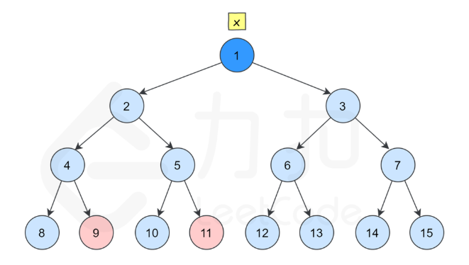

# 4.寻找两个正序数组的中位数

```java
class Solution {
    public double findMedianSortedArrays(int[] nums1, int[] nums2) {
        if (nums1.length > nums2.length) {
            return findMedianSortedArrays(nums2, nums1);
        }

        int m = nums1.length;
        int n = nums2.length;
        int left = 0, right = m;
        // median1：前一部分的最大值
        // median2：后一部分的最小值
        int median1 = 0, median2 = 0;

        while (left <= right) {
            // 前一部分包含 nums1[0 .. i-1] 和 nums2[0 .. j-1]
            // 后一部分包含 nums1[i .. m-1] 和 nums2[j .. n-1]
            int i = (left + right) / 2;
            int j = (m + n + 1) / 2 - i;

            // nums_im1, nums_i, nums_jm1, nums_j 分别表示 nums1[i-1], nums1[i], nums2[j-1], nums2[j]
            int nums_im1 = (i == 0 ? Integer.MIN_VALUE : nums1[i - 1]);
            int nums_i = (i == m ? Integer.MAX_VALUE : nums1[i]);
            int nums_jm1 = (j == 0 ? Integer.MIN_VALUE : nums2[j - 1]);
            int nums_j = (j == n ? Integer.MAX_VALUE : nums2[j]);

            if (nums_im1 <= nums_j) {
                median1 = Math.max(nums_im1, nums_jm1);
                median2 = Math.min(nums_i, nums_j);
                left = i + 1;
            } else {
                right = i - 1;
            }
        }

        return (m + n) % 2 == 0 ? (median1 + median2) / 2.0 : median1;
    }
}
```

# 5.最长回文子串

用的重心扩散法时间复杂度 < O(n^2)

```java
class Solution {
    public String longestPalindrome(String s) {
        char[] str = s.toCharArray();
        int num = str.length;
        int ans = 0;
        int l = 0;
        int r = 0;
        if(num == 2 && str[0] == str[1])return s;
        for(int i = 0; i < num; i++){
            if(i == 0 || i == num - 1)continue;
            if(str[i] == str[i + 1]){
                int check = 0;
                int p = i, q = i + 1;
                for(; p >= 0 && q < num; p--, q++){
                    if(str[p] != str[q])break;
                    check += 2;
                }
                if(check > ans){
                    l = p + 1;
                    r = q - 1;
                    ans = check;
                }
            }
            if(str[i] == str[i - 1]){
                int check = 0;
                int p = i - 1, q = i;
                for(; p >= 0 && q < num; p--, q++){
                    if(str[p] != str[q])break;
                    check += 2;
                }
                if(check > ans){
                    l = p + 1;
                    r = q - 1;
                    ans = check;
                }
            }
                int check = 1;
                int p = i - 1, q = i + 1;
                for(; p >= 0 && q < num; p--, q++){
                    if(str[p] != str[q])break;
                    check += 2;
                }
                if(check > ans){
                    l = p + 1;
                    r = q - 1;
                    ans = check;
                }
        }
        s = s.substring(l, r + 1);
        return s;
    }
}
```

# 6.z字形变化

```java
class Solution {
    public String convert(String s, int numRows) {
        char[] str = s.toCharArray();
        int num = str.length;
        int k = 0;
        StringBuilder p = new StringBuilder();
        if(numRows == 1)k = 1;
        else k = (numRows - 1) * 2;
        for(int i = 0; i < numRows; i++){
            int j = i;
            int uuu = 0;
            while(j < num){
                int x = j;
                if(uuu % 2 == 0){
                    p.append(str[j]);
                    j += k - i * 2;
                }
                else {
                    p.append(str[j]);
                    j += i * 2;
                }
                if(x == j)p.deleteCharAt(p.length() - 1);
                uuu++;
            }
        }
        s = p.toString();
        return s;
    }
}
```

# 11.盛水最多的容器

这个题使用的是双指针处理

在每个状态下，无论长板或短板向中间收窄一格，都会导致水槽 **底边宽度** - 1 变短：

* 若向内 **移动短板**， 水槽的短板 min(h[i], h[j]) 可能变大，因此下一个水槽的面积 **可能增大**。
* 若向内 **移动长板**， 水槽的短板 min(h[i], h[j]) 不变或变小， 因此下一个水槽的面积 **一定变小**。

因此，初始化双指针分列水槽左右两端，循环每轮将短板向内移动一格，并更新面积最大值，直到两个指针相遇时跳出；即可获得最大面积。

```java
class Solution {
    public int maxArea(int[] height) {
        int ans = 0;
        for(int i = 0, j = height.length - 1; i < j;){
            int u = Math.min(height[i], height[j]);
            ans = Math.max(ans, u * (j - i));
            if(height[i] > height[j])j--;
            else i++;
        }
        return ans;
    }
}
```

# 200.岛屿数量

```java
class Solution {
    int a[] = {1, 0, -1, 0};
    int b[] = {0, 1, 0, -1};
    public int numIslands(char[][] grid) {
        int ans = 0;
        for(int i = 0; i < grid.length; i++){
            for(int j = 0; j < grid[0].length; j++){
                if(grid[i][j] == '1'){
                    dfs(i, j, grid);
                    ans++;
                }
            }
        }
        return ans;
    }
    void dfs(int x, int y, char[][] s){
            if(x < 0 || x > s.length - 1 || y < 0 || y > s[0].length - 1)return ;
            if(s[x][y] != '1')return ;
            s[x][y] = '2';
            for(int i = 0; i < 4; i++){
                dfs(x + a[i], y + b[i], s);
            }
        }
}
```

# 121.买卖股票的最佳时机

```java
class Solution {
    public int maxProfit(int[] prices) {
        int minn = Integer.MAX_VALUE;
        int ans = 0;
        for(int i = 0; i < prices.length; i++){
            if(minn > prices[i]){
                minn = prices[i];
            }
            else if(prices[i] - minn > ans){
                ans = prices[i] - minn;
            }
        }
        return ans;
    }
}
```

# 122.买卖股票的最佳时机Ⅱ

```java
class Solution {
    public int maxProfit(int[] prices) {
        int minn = Integer.MAX_VALUE;
        int sum = 0;
        for(int i = 0; i < prices.length; i++){
            if(minn > prices[i]){
                minn = prices[i];
            }
            else if(prices[i] - minn > 0){
                sum += prices[i] - minn;
                minn = prices[i];
            }
        }
        return sum;
    }
}
```

# 55.跳跃游戏（贪心）

从末尾开始能走就走

```java
class Solution {
    public boolean canJump(int[] nums) {
        int place = nums.length - 1;
        for(int i = nums.length - 1; i >= 0; i--){
            if(nums[i] >= place - i)place = i;
            if(place == 0){
                return true;
            }
        }
        return false;
    }
}
```

# 56.跳跃游戏Ⅱ（贪心）

每次都到下一次可以走最多的地方

```java
class Solution {
    public int jump(int[] nums) {
        int ans = 0;
        if(nums.length == 1)return 0;
        for(int i = 0; i < nums.length;){
            System.out.println(i);
            if(nums[i] + i >= nums.length - 1){
                ans++;
                return ans;
            }
            else {
                int maxx = i;
                int d = nums[i] + i;
                for(int j = i; j <= nums[i] + i; j++){
                    if(nums[j] + j > d){
                        maxx = j;
                        d = nums[j] + j;
                    }
                }
                i = maxx;
                ans++;
            }
        }
        return ans;
    }
}
```

# 274.H指数

```java
import java.util.*;
class Solution {
    public int hIndex(int[] citations) {
        Arrays.sort(citations);
        int ans = 0;
        for(int i = citations.length - 1; i >= 0; i--){
            if(citations[i] < citations.length - i)break;
            ans = citations.length - i;
        }
        return ans;
    }
}
```

# 380.O(1)时间插入、删除和获取随即元素（模拟）

```java
import java.util.*;

class RandomizedSet {
    Map<Integer, Integer> map;
    int idx = 0;
    int[] num;


    public RandomizedSet() {
        map = new HashMap<>();
        num = new int[200010];
    }
    
    public boolean insert(int val) {
        if(map.get(val) != null){
            return false;
        }
        else {
            map.put(val, idx);
            num[idx++] = val;
            return true;
        }
    }
    
    public boolean remove(int val) {
        if(map.get(val) == null)return false;
        else {
            int t = map.get(val);
            int m = num[idx - 1];
            num[t] = m;
            map.put(m, t);
            idx--;
            map.remove(val);
            return true;
        }
    }
    
    public int getRandom() {
        Random random = new Random();
        int p = random.nextInt(idx);
        return num[p];
    }
}

/**
 * Your RandomizedSet object will be instantiated and called as such:
 * RandomizedSet obj = new RandomizedSet();
 * boolean param_1 = obj.insert(val);
 * boolean param_2 = obj.remove(val);
 * int param_3 = obj.getRandom();
 */
```

# 238.除自身以外数组的乘积

```java
class Solution {
    public int[] productExceptSelf(int[] nums) {
        int[] l = new int[nums.length];
        int[] r = new int[nums.length];
        int sum1 = 1; 
        int sum2 = 1;
        for(int i = 0, j = nums.length - 1; i < nums.length; i++, j--){
              sum1 *= nums[i];
              sum2 *= nums[j];
              l[i] = sum1;
              r[j] = sum2;
        } 
        for(int i = 0; i < nums.length; i++){
            if(i == 0 && i == nums.length - 1)nums[i] = 0;
            else if(i == 0){
                nums[i] = r[i + 1];
            }
            else if(i == nums.length - 1){
                nums[i] = l[i - 1];
            }
            else {
                nums[i] = l[i - 1] * r[i + 1];
            }
        }
        return nums;
    }
}
```

# 134.加油站

```java
class Solution {
    public int canCompleteCircuit(int[] gas, int[] cost) {
        int[] def = new int[gas.length];
        int sum = 0;
        for(int i = 0; i < gas.length; i++){
            def[i] = gas[i] - cost[i];
            sum += def[i];
        }
        if(sum < 0)return -1;
        boolean check = true;
        int place = -1;
        int x = 0;
        for(int i = 0; i < gas.length; i++){
            if(def[i] < 0)check = true;
            else if(place == -1 && check == true){
                check = false;
                place = i;
            }
            x += def[i];
            if(x < 0){
                check = true;
                x = 0;
                place = -1;
            }
            
        }
        return place;
    }
}
```

# 135.分发糖果（贪心）

```java
import java.util.*;
class Solution {
    public int candy(int[] ratings) {
        int place = 0;
        int h = 1;
        int sum = 1;
        int count = 1;
        for(int i = 1; i < ratings.length; i++){
            if(ratings[i] >= ratings[i - 1]){
                if(count <= h){
                    sum += add(count - 1);
                }
                else {
                    sum -= h;
                    sum += add(count);
                }

                if(count > 1)h = 1;
                count = 1;

                if(ratings[i] == ratings[i - 1]){
                    h = 1;
                    sum += h;
                    place = i;
                }
                else {
                    h++;
                    sum += h;
                    place = i;
                }
            }
            else if(ratings[i] < ratings[i - 1]){
                count++;
            }
        }
        if(count <= h){
            sum += add(count - 1);
        }
        else {
            sum -= h;
            sum += add(count);
        }
        return sum;
    }
    
    public static int add(int res){
        int sum = 0;
        while(res > 0){
            sum += res;
            res--;
        }
        return sum;
    }
}
```

方法一：两次遍历
思路及解法

我们可以将「相邻的孩子中，评分高的孩子必须获得更多的糖果」这句话拆分为两个规则，分别处理。

左规则：当 ratings[i−1]<ratings[i] 时，i 号学生的糖果数量将比 i−1 号孩子的糖果数量多。

右规则：当 ratings[i]>ratings[i+1] 时，i 号学生的糖果数量将比 i+1 号孩子的糖果数量多。

我们遍历该数组两次，处理出每一个学生分别满足左规则或右规则时，最少需要被分得的糖果数量。每个人最终分得的糖果数量即为这两个数量的最大值。

```java
class Solution {
    public int candy(int[] ratings) {
        int n = ratings.length;
        int[] left = new int[n];
        for (int i = 0; i < n; i++) {
            if (i > 0 && ratings[i] > ratings[i - 1]) {
                left[i] = left[i - 1] + 1;
            } else {
                left[i] = 1;
            }
        }
        int right = 0, ret = 0;
        for (int i = n - 1; i >= 0; i--) {
            if (i < n - 1 && ratings[i] > ratings[i + 1]) {
                right++;
            } else {
                right = 1;
            }
            ret += Math.max(left[i], right);
        }
        return ret;
    }
}
```

# 42.接雨水（单调栈）

```java
import java.util.*;
class Solution {
    public int trap(int[] height) {
        Stack<Integer> stack = new Stack<>();
        int sum = 0;
        int h = 0;
        for(int i = 0; i < height.length; i++){
            if(stack.empty() || height[stack.peek()] >= height[i])stack.push(i);
            else if(height[stack.peek()] < height[i]){
                while(!stack.empty()){
                    int l = stack.peek();
                    sum += (i - l - 1) * (Math.min(height[l], height[i]) - h);
                    System.out.println(l + " " + i + " " + sum);
                    h = height[l];
                    if(height[stack.peek()] > height[i])break;
                    stack.pop();
                }
                stack.push(i);
            }
        }
        return sum;
    }
}
```

# 97.交错字符串（DP）（$*$）

```java
class Solution {
    public boolean isInterleave(String s1, String s2, String s3) {
        int m = s1.length();
        int n = s2.length();
        int t = s3.length();
        if(m + n != t)return false;
        boolean[][] dp = new boolean[m + 1][n + 1];
        dp[0][0] = true;
        for(int i = 0; i <= m; i++){
            for(int j = 0; j <= n; j++){
                int k = i + j - 1;
                if(i > 0){
                    dp[i][j] = dp[i][j] || (dp[i - 1][j] && s1.charAt(i - 1) == s3.charAt(k));
                }
                if(j > 0){
                    dp[i][j] = dp[i][j] || (dp[i][j - 1] && s2.charAt(j - 1) == s3.charAt(k));
                }
            }
        }
        return dp[m][n];
    }
}
```

# 101.对称二叉树

通过分别对称移动来递归判断是否相等。

```java
/**
 * Definition for a binary tree node.
 * public class TreeNode {
 *     int val;
 *     TreeNode left;
 *     TreeNode right;
 *     TreeNode() {}
 *     TreeNode(int val) { this.val = val; }
 *     TreeNode(int val, TreeNode left, TreeNode right) {
 *         this.val = val;
 *         this.left = left;
 *         this.right = right;
 *     }
 * }
 */
class Solution {
    private boolean st = true;
    public boolean isSymmetric(TreeNode root) {
        f(root.left, root.right);
        return st;
    }

    public void f(TreeNode p, TreeNode q){
        if(p == null && q == null)return ;
        if(p == null || q == null){
            st = false;
            return ;
        }
        if(p != null && q != null){
            f(p.left, q.right);
            f(p.right, q.left);
        }
        if(p.val != q.val)st = false;
    }

}
```

# 543.二叉树的直径

**思路：**转化为求左右子树深度和的最大值（就是选一个节点，左右两边同时dfs）

```java
/**
 * Definition for a binary tree node.
 * public class TreeNode {
 *     int val;
 *     TreeNode left;
 *     TreeNode right;
 *     TreeNode() {}
 *     TreeNode(int val) { this.val = val; }
 *     TreeNode(int val, TreeNode left, TreeNode right) {
 *         this.val = val;
 *         this.left = left;
 *         this.right = right;
 *     }
 * }
 */
class Solution {
    int max = 0;
    public int diameterOfBinaryTree(TreeNode root) {
        dfs(root);
        return max;
    }

    private int dfs(TreeNode u){
        if(u == null)return 0;
        int l = dfs(u.left);
        int r = dfs(u.right);
        max = Math.max(max, l + r);
        return Math.max(l ,r) + 1;
    }
}
```

# 108.将有序数组转换为二叉搜索树

**思路：**采用dfs遍历每个节点，给每个节点赋值

```java
/**
 * Definition for a binary tree node.
 * public class TreeNode {
 *     int val;
 *     TreeNode left;
 *     TreeNode right;
 *     TreeNode() {}
 *     TreeNode(int val) { this.val = val; }
 *     TreeNode(int val, TreeNode left, TreeNode right) {
 *         this.val = val;
 *         this.left = left;
 *         this.right = right;
 *     }
 * }
 */
class Solution {
    public TreeNode sortedArrayToBST(int[] nums) {
        return dfs(nums, 0, nums.length - 1);
    }

    private TreeNode dfs(int[] nums, int l, int r){
        if(l > r)return null;
        int mid = l + r + 1 >> 1;
        TreeNode root = new TreeNode(nums[mid]);
        root.left = dfs(nums, l, mid - 1);
        root.right = dfs(nums, mid + 1, r);
        return root;
    }
}
```

# 98.验证二叉搜索树

**思路：**若当前节点再一个节点的**左分支**，那么他一定小于这个节点，若当前节点在一个节点的**右分支**，那么他一定大于这个节点。

**注意：**注意是左分支和右分支，不是左子节点和右子节点，对于每个节点都要考虑在祖宗节点中的位置，所以**可以从上往下递归把这个节点要小于的最小数和要大于的最大数传递下来**

```java
/**
 * Definition for a binary tree node.
 * public class TreeNode {
 *     int val;
 *     TreeNode left;
 *     TreeNode right;
 *     TreeNode() {}
 *     TreeNode(int val) { this.val = val; }
 *     TreeNode(int val, TreeNode left, TreeNode right) {
 *         this.val = val;
 *         this.left = left;
 *         this.right = right;
 *     }
 * }
 */
class Solution {
    private boolean st = true;
    public boolean isValidBST(TreeNode root) {
        dfs(root, (long)Math.pow(2, 33), -(long)Math.pow(2, 33));
        return st;
    }
    private void dfs(TreeNode u, long min, long max){
        if(u == null)return ;
        int op = u.val;
        if(op >= min || op <= max){
            st = false;
            return ;
        }
        dfs(u.left, Math.min(min, op), max);
        dfs(u.right, min, Math.max(max, op));
    }
}
```

# 146.LRU缓存

**妙手：**使用**伪头节点**与**伪尾节点**，使操作不用考虑临界情况，这样每个中间的节点都有prev节点和next节点

```java
public class LRUCache {
    class DLinkedNode {
        int key;
        int value;
        DLinkedNode prev;
        DLinkedNode next;
        public DLinkedNode() {}
        public DLinkedNode(int _key, int _value) {key = _key; value = _value;}
    }

    private Map<Integer, DLinkedNode> cache = new HashMap<Integer, DLinkedNode>();
    private int size;
    private int capacity;
    private DLinkedNode head, tail;

    public LRUCache(int capacity) {
        this.size = 0;
        this.capacity = capacity;
        // 使用伪头部和伪尾部节点
        head = new DLinkedNode();
        tail = new DLinkedNode();
        head.next = tail;
        tail.prev = head;
    }

    public int get(int key) {
        DLinkedNode node = cache.get(key);
        if (node == null) {
            return -1;
        }
        // 如果 key 存在，先通过哈希表定位，再移到头部
        moveToHead(node);
        return node.value;
    }

    public void put(int key, int value) {
        DLinkedNode node = cache.get(key);
        if (node == null) {
            // 如果 key 不存在，创建一个新的节点
            DLinkedNode newNode = new DLinkedNode(key, value);
            // 添加进哈希表
            cache.put(key, newNode);
            // 添加至双向链表的头部
            addToHead(newNode);
            ++size;
            if (size > capacity) {
                // 如果超出容量，删除双向链表的尾部节点
                DLinkedNode tail = removeTail();
                // 删除哈希表中对应的项
                cache.remove(tail.key);
                --size;
            }
        }
        else {
            // 如果 key 存在，先通过哈希表定位，再修改 value，并移到头部
            node.value = value;
            moveToHead(node);
        }
    }

    private void addToHead(DLinkedNode node) {
        node.prev = head;
        node.next = head.next;
        head.next.prev = node;
        head.next = node;
    }

    private void removeNode(DLinkedNode node) {
        node.prev.next = node.next;
        node.next.prev = node.prev;
    }

    private void moveToHead(DLinkedNode node) {
        removeNode(node);
        addToHead(node);
    }

    private DLinkedNode removeTail() {
        DLinkedNode res = tail.prev;
        removeNode(res);
        return res;
    }
}
```

# 236.二叉树的最近公共祖先（妙妙妙）



## 方法一：

**思路：**判断每个节点，他的后代节点是否有target节点；

* 情况一，没有target节点，返回null
* 情况二，有一个target节点，返回哪个target节点
* 情况三，有两个target节点，返回自己作为target节点

**原理：**把两个target节点传递上去，最终汇聚到一个最近的公共祖先节点，然后再把这个祖先节点传递上去

```java
/**
 * Definition for a binary tree node.
 * public class TreeNode {
 *     int val;
 *     TreeNode left;
 *     TreeNode right;
 *     TreeNode(int x) { val = x; }
 * }
 */
class Solution {
    public TreeNode lowestCommonAncestor(TreeNode root, TreeNode p, TreeNode q) {
        if(root == null || root == p || root == q)return root;
        TreeNode left = lowestCommonAncestor(root.left, p, q);
        TreeNode right = lowestCommonAncestor(root.right, p, q);
        return left == null ? right : (right == null ? left : root);
    }
}
```

## 方法二：

**思路：**利用储存所有节点的前驱节点，然后找到最近公共祖宗节点

```java
/**
 * Definition for a binary tree node.
 * public class TreeNode {
 *     int val;
 *     TreeNode left;
 *     TreeNode right;
 *     TreeNode(int x) { val = x; }
 * }
 */
class Solution {
    Map<TreeNode, TreeNode> pre = new HashMap<>();
    public TreeNode lowestCommonAncestor(TreeNode root, TreeNode p, TreeNode q) {
        dfs(root);
        return find(p, q);
    }

    private void dfs(TreeNode u){
        if(u == null)return ;
        pre.put(u.left, u);
        pre.put(u.right, u);
        dfs(u.left);
        dfs(u.right);
    }

    private TreeNode find(TreeNode p, TreeNode q){
        List<TreeNode> pList = new ArrayList<>();
        List<TreeNode> qList = new ArrayList<>();
        while(true){
            if(p == null && q == null)break;
            if(p != null){pList.add(p);p = pre.get(p);}
            if(q != null){qList.add(q);q = pre.get(q);}
        }
        TreeNode ans = null;
        for(int i = pList.size() - 1, j = qList.size() - 1; i >= 0 && j >= 0; i--, j--){
            if(pList.get(i) != qList.get(j))break;
            ans = pList.get(i);
        }
        return ans;
    }
}
```

# 124.二叉树中的最大路径和

**思路：**每个节点都找一下，左子树的最大路径和，右子树的最大路径和，如果为左右子树都为负数就只传递节点本身

**向上传递公式：**$max(sum, sum + left, sum + right)$

**维护ans的公式：**$max(sum, sum + left, sum + right, sum + left + right)$

```java
/**
 * Definition for a binary tree node.
 * public class TreeNode {
 *     int val;
 *     TreeNode left;
 *     TreeNode right;
 *     TreeNode() {}
 *     TreeNode(int val) { this.val = val; }
 *     TreeNode(int val, TreeNode left, TreeNode right) {
 *         this.val = val;
 *         this.left = left;
 *         this.right = right;
 *     }
 * }
 */
class Solution {
    private int ans = Integer.MIN_VALUE;
    public int maxPathSum(TreeNode root) {
        find(root);
        return ans;
    }
    private int find(TreeNode u){
        if(u == null)return 0;
        int sum = u.val;
        int left = find(u.left);
        int right = find(u.right);
        int op = Math.max(
            Math.max(sum + left + right, sum),
            Math.max(sum + left, sum + right)
        );
        if(ans < op)ans = op;
        return Math.max(
            Math.max(sum + left, sum + right),
            sum
        );
    }
}
```

# 208.实现 Trie（前缀树）

我自己的代码

```java
class Trie {
    public class Node {
        char val;
        List<Node> list;
        boolean end = false;
        public Node(char val){
            this.val = val;
            this.list = new ArrayList<>();
        }
        public Node(){
            this.list = new ArrayList<>();
        }
    }

    private Node first;

    public Trie() {
        this.first = new Node();
    }
    
    public void insert(String word) {
        Node op = first;
        for(int i = 0; i < word.length(); i++){
            char u = word.charAt(i);
            int x = find(u, op);
            if(x == -1){
                op.list.add(new Node(u));
                x = op.list.size() - 1;
            }
            op = op.list.get(x);
            if(i == word.length() - 1)op.end = true;
        }
    }
    
    public boolean search(String word) {
        Node op = first;
        for(int i = 0; i < word.length(); i++){
            char u = word.charAt(i);
            int x = find(u, op);
            if(x == -1)return false;
            op = op.list.get(x);
        }
        if(op.end == true)return true;
        return false;
    }
    
    public boolean startsWith(String prefix) {
        Node op = first;
        for(int i = 0; i < prefix.length(); i++){
            char u = prefix.charAt(i);
            int x = find(u, op);
            if(x == -1)return false;
            op = op.list.get(x);
        }
        return true;
    }

    private int find(char u, Node op){
        for(int i = 0; i < op.list.size(); i++){
            if(op.list.get(i).val == u)return i;
        }
        return -1;
    }
}
```

官方题解

```java
class Trie {
    private Trie[] children;
    private boolean isEnd;

    public Trie() {
        children = new Trie[26];
        isEnd = false;
    }
    
    public void insert(String word) {
        Trie node = this;
        for (int i = 0; i < word.length(); i++) {
            char ch = word.charAt(i);
            int index = ch - 'a';
            if (node.children[index] == null) {
                node.children[index] = new Trie();
            }
            node = node.children[index];
        }
        node.isEnd = true;
    }
    
    public boolean search(String word) {
        Trie node = searchPrefix(word);
        return node != null && node.isEnd;
    }
    
    public boolean startsWith(String prefix) {
        return searchPrefix(prefix) != null;
    }

    private Trie searchPrefix(String prefix) {
        Trie node = this;
        for (int i = 0; i < prefix.length(); i++) {
            char ch = prefix.charAt(i);
            int index = ch - 'a';
            if (node.children[index] == null) {
                return null;
            }
            node = node.children[index];
        }
        return node;
    }
}
```

# 78.子集

**思路：**全排列的写法，因为是给的数组是不重复的，所以我们只需要先排序，然后再全排列的基础上，判断当前 list 的最后一个值有没有小于当前的 nums[i] ，如果没有则 continue，然后每一次都要加到 ans 链表里面去

```java
class Solution {
    List<List<Integer>> ans = new LinkedList<>();
    boolean[] st;
    public List<List<Integer>> subsets(int[] nums) {
        st = new boolean[nums.length];
        Arrays.sort(nums);
        dfs(nums, new LinkedList<Integer>());
        return ans;
    }

    private void dfs(int[] nums, LinkedList<Integer> list){
        for(int i = 0; i < nums.length; i++){
            if(st[i])continue;
            if(!list.isEmpty() && list.get(list.size() - 1) > nums[i])continue;
            st[i] = true;
            list.add(nums[i]);
            dfs(nums, new LinkedList<>(list));
            st[i] = false;
            list.remove(list.size() - 1);
        }
        ans.add(list);
    }
}
```

