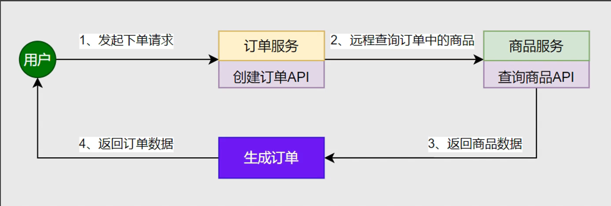

# Nacos注册中心

| 内容             | 核心                                          |
| ---------------- | --------------------------------------------- |
| 启动微服务       | SpringBoot 微服务web项目启动                  |
| 引入服务发现依赖 | spring-cloud-starter-alibaba-nacos-discovery  |
| 配置Nacos地址    | spring.cloud.nacos.server-addr=127.0.0.1:8848 |
| 查看注册中心效果 | 访问 http://localhost:8848/nacos              |
| 集群模式启动测试 | 单机情况下通过改变端口模拟微服务集群          |

一个更易于构建云原生应用的动态服务发现、配置管理和服务管理平台。

* 先进入nacos的安装目录，然后进入bin目录，进入cmd，输入指令

  ```cmd
  startup.cmd -m standalone
  ```

* 浏览器进入 localhost:8848/nacos 页面
* 项目要加上这些依赖项

* application.yml配置文件

  ```yml
  spring:
    application:
      name: service-product
    cloud:
      nacos:
        discovery:
          server-addr: 127.0.0.1:8848
  server:
    port: 9000
  ```

* 然后在localhost:8848/nacos就可以看到注册成功了

## 注册中心-服务发现

| 内容             | 核心                   |
| ---------------- | ---------------------- |
| 开启服务发现功能 | @EnableDiscoveryClient |
| 测试服务发现API  | DiscoveryClient        |
| 测试服务发现API  | NacosServiceDiscovery  |

```java
@EnableDiscoveryClient //开启服务发现功能
@SpringBootApplication
public class ProductMainApplication {
    public static void main(String[] args) {
        SpringApplication.run(ProductMainApplication.class, args);
    }
}
```

## 远程调用-基本流程

* 所有服务都会注册在注册中心
* 当**服务A**需要调用**服务B**时，**服务A**从注册中心获取**服务B**可访问的地址列表，选择一个服务地址，发送请求给**服务B**，**服务B**返回请求

下面程序可以实现负载均衡的发送请求给另一个服务

```java
 private Product getProductFromRemoteWithLoadBalance(Long productId){
        //1.获取到商品服务所在的所有机器IP+port(负载均衡的)
        ServiceInstance instance = loadBalancerClient.choose("service-product");
        //远程url地址
        String url = "http://" + instance.getHost() + ":" + instance.getPort() + 	"/product/" + productId;
        //给远程发送请求
        log.info("------------------远程请求路径：" + url);
        Product product = restTemplate.getForObject(url, Product.class);
        return product;
    }
```


## 远程调用-下单场景

用户发起下单请求给订单服务，订单服务向商品服务发送请求查询订单中的商品信息，然后生成订单，再给用户返回订单数据



这些步骤涉及到两个实体模型


## 远程调用-实现步骤（负载均衡）

| 内容             | 核心                              |
| ---------------- | --------------------------------- |
| 引入负载均衡依赖 | spring-cloud-starter-loadbalancer |
| 测试负载均衡API  | LoadBalancerClient                |
| 测试远程调用     | RestTemplate                      |
| 测试负载均衡调用 | @LoadBalanced                     |

## 更简单的负载均衡

Spring提供了一个注解 $@LoadBalanced$，只需要把这个注解标到远程客户端上，他就自带负载均衡功能

```java
@LoadBalanced //注解式负载均衡
@Bean
public RestTemplate createRestTemplate(){
	return new RestTemplate();
}
```

```java
private Product getProductFromRemoteWithLoadBalanceAnnotation(Long productId){
        String url = "http://service-product/product/" + productId;
        // service-product 会被动态替换
        Product product = restTemplate.getForObject(url, Product.class);
        return product;
    }
```

## 注册中心宕机，远程调用还能成功吗

**现在调用其他服务有两次请求**

* 请求注册中心获取微服务地址列表
* 给对方服务的某个地址发送请求

但是注册中心和服务之间有一个**实例缓存**，实例缓存实时同步更新注册中心的实例，一个服务调用其他服务就不用发两次请求


1. 调用过，远程调用不在依赖注册中心，可以通过
2. 没调用过，（第一次发起远程请求），不能通过

**详细扩充：**

1. **问题：**第一次调用是拉取“调用的服务”的健康实例，还是所有服务的健康实例？

* 只拉取“当前需要调用的服务目标”的健康实例，而非所有服务

2. **问题：**第一次初始化同步时依靠返回线程，还是把从注册中心查到的实例返回，再用另外的线程来实现同步？

* 首次初始化时“同步阻塞的”——由发起调用的线程直接向注册中心查询，拿到实例后先更新再返回实例用于本次调用，不存在“另起线程异步同步”的过程

3. **问题：**后续调用每次都会先判断是否超过更新时间，还是返回旧的实例再更新？

* 优先使用就缓存返回实例，同时在“后台异步更新缓存”（若已超过更新时间），即“先返回，在更新”，而非“先判断更新再返回”。

# nacos配置中心

* 启动nacos

* 引入依赖

  ```xml
  <dependency>
  	<groupId>com.alibaba.cloud</groupId>
      <artifactId>spring-cloud-starter-alibaba-nacos-config</artifactId>
  </dependency>
  ```

* application.yml配置

  ```yaml
  spring:
  	cloud:
  		nacos:
  			server-addr: 127.0.0.1:8848
  	config:
  		import: nacos:server-order.yml
  ```

* 创建 data-id（数据集）

```java
@RestController
@RefreshScope
public class OrderController {
    
    @Value("${order.timeout}")
    String orderTimeout;
    @Value("${order.auto-confirm}")
    String orderAutoConfig;

    @GetMapping("/config")
    public String config(){
        return "order.timeout:" + orderTimeout + ",order.auto-confirm:" + orderAutoConfig;
    }
}
```

* 通过使用**@Value**注解实现从配置文件中获取信息
* 通过**@RefreshScope**注解实现实时刷新

**注意：**添加了配置中心的依赖之后，就要配置spring.config.import

但是可以通过spring.cloud.nacos.config.import-check.enabled=false

## 配置中心-动态刷新

**使用步骤：**

* @Value("${xx}")获取配置 + @RefreshScope 实现自动刷新
* @ConfigurationProperties 无感自动刷新
* NacosConfigManager 监听配置变化

```java
@Component//启动就创建唯一实例交给IOC容器管理
@ConfigurationProperties(prefix = "order")//配置批量绑定在nacos下，可以无需@RefreshScope就能实现自动刷新，自带自动转化为驼峰命名
@Data
public class OrderYml {
    private String timeout;
    private String autoConfirm;
}
```

### 使用NacosConfigManager监听指定数据集变化

```java
	@Bean
    ApplicationRunner applicationRunner(NacosConfigManager nacosConfigManager){
        return args -> {
            ConfigService configService = nacosConfigManager.getConfigService();
            configService.addListener("service-order.yml", "DEFAULT_GROUP", new Listener() {
                @Override
                public Executor getExecutor() {
                    return Executors.newFixedThreadPool(4);
                }

                @Override
                public void receiveConfigInfo(String s) {
                    System.out.println("变化的配置信息:" + s);
                    System.out.println(" ======================= ");
                }
            });
            System.out.println("=============");
        };
    }
```

**思考：**Nacos中的数据集和application.yml 有相同的配置项，哪个生效？

**答案：**引入配置中心的目的是为了集中管理多个服务的配置，所以当有相同配置时，配置中心的配置优先生效


**先导入优先、外部优先**


导入配置可以用逗号隔开，如果导入配置有重复的，先导入的优先

## 配置中心-数据隔离

* 需求描述
* * 项目有多套环境：dev， test， prod
  * 每个微服务，同一种配置，在每套环境的值都不一样
  * * 如：database.yml
    * 如：common.yml
  * 项目可以通过切换环境，加载本环境的配置
* 难点
* * 区分多套环境
  * 区分多种微服务
  * 区分多种配置
  * 按需加载配置


### 在application.yml中配置要选择的配置文件

```yml
spring:
  application:
    name: service-order
  cloud:
    nacos:
      server-addr: 127.0.0.1:8848
      config:
        namespace: dev #配置命名空间为dev，后面导入的配置都是dev里的
  config:
    import:
      - nacos:service-order.yml?group=order #？后面的参数表示分组
      - nacos:datebase.yml?group=order
server:
  port: 8000

```

动态选择所激活环境的配置

```yaml
spring:
  profiles:
    active: dev
  application:
    name: service-order
  cloud:
    nacos:
      server-addr: 127.0.0.1:8848
      config:
        import-check:
          enabled: false
        namespace: ${spring.profiles.active:dev}
server:
  port: 8000

---
spring:
  config:
    import:
      - nacos:common.yml?group=order
      - nacos:datebase.yml?group=order
      - nacos:common.yml?group=product
    activate:
      on-profile: dev

---
spring:
  config:
    import:
      - nacos:common.yml?group=order
      - nacos:datebase.yml?group=order
      - nacos:common.yml?group=product
    activate:
      on-profile: pro

---
spring:
  config:
    import:
      - nacos:common.yml?group=order
      - nacos:datebase.yml?group=order
      - nacos:common.yml?group=product
    activate:
      on-profile: test
```

# Nacos总结

## 注册中心

1. 引入 spring-cloud-starter-alibaba-nacos-discovery 依赖，配置Naocs地址
2. @EnableDiscoveryClient 开启服务发现功能

**扩展：**

1. DiscoveryClient 获取服务实例列表
2. LoadBalancerClient 负载均衡选择一个实例（需引入spring-cloud-starter-loadbalancer）
3. RestTemplate 可以发起远程调用

## 配置中心

1. 引入spring-cloud-starter-alibaba-nacos-config 依赖，配置Nacos地址
2. 添加 **数据集** （data-id），使用 spring.config.import 导入数据集
3. @Value + @RefreshScope 取值 + 自动刷新
4. @ConfigurationProperties 批量绑定自动刷新
5. NacosConfigManager 监听配置变化

**扩展：**

配置优先级，namespace区分环境，group区分微服务，data-id区分配置，实现数据隔离 + 环境切换

# OpenFeign

**远程调用-声明式实现**


需要的依赖：

```xml
<dependency>
	<groupId>org.springframework.cloud</groupId>
    <artifactId>spring-cloud-starter-openfeign</artifactId>
</dependency>
```


**新建一个接口**

```java
@FeignClient(value = "service-product") //feign客户端，默认是负载均衡的
public interface ProductFeignClient {

    //mvc注解的两套使用逻辑
    //1.标注在Controller上，是接受这样的请求
    //2.标注在Feign上，是发送这种请求
    @GetMapping("/product/{id}")
    public Product getProductById(@PathVariable("id") Long id, @RequestHeader String token);
}
```

然后需要调用它时，用@Autowired注入，然后再调用

## 远程调用-第三方API


**通过@FeignClient构造远程调用第三方接口**

**具体参数依据第三方API文档**

```java
@FeignClient(value = "weather-client", url = "")
public interface WeatherFeignnClient {

    @PostMapping("")
    Object getWeather(@RequestHeader(value = "Authorization") String auth,
                      @RequestParam(value = "token") String token,
                      @RequestParam(value = "cityId") String cityId);
}
```

**小技巧：**

* 业务API：直接复制对方Controller签名即可
* 第三方API：根据接口文档确定请求如何发

### 面试题：

**客户端负载均衡和服务器负载均衡的区别**

客户端负载均衡：

服务端负载均衡：

## 进阶用法-日志

```yaml
logging:
	level:
		com.atguigu.order.feign: debug
```

```java
@Bean
Logger.Level feignLoggerLevel(){
    return Logger.level.FULL;
}
```

可以查看到debug级别的日志

## 进阶用法-超时控制

如果OpenFeign一直连接不上远程服务，或者服务很慢，会出现多个线程等待，时间一长就会积压很多线程耗尽服务器资源，所以需要超时控制


在OpenFeign里面引入了两种超时时间：

* connectTimeout 连接超时
* readTimeout 读取超时


connectTimeout 设置的就是第一步（建立连接）的时间

readTimeout 设置的就是第三步（处理业务）的时间

下面是 OpenFeign 的默认设置

### 配置超时控制

1. 新建一个 yml 文件 application-feign.yml 

2. application-feign.yml 的内容

   ```yml
   spring:
     cloud:
       openfeign:
         client:
           config:
             default: # 这个代表的是默认配置
               logger-level: full
               connect-timeout: 3000
               read-timeout: 6000
             service-product: # 这个是给一个客户端的特定配置
               logger-level: full
               connect-timeout: 3000
               read-timeout: 3000
   ```

3. 在主配置文件中包含新建的 yml 文件

   ```yml
   spring:
     profiles:
       active: dev
       include: feign
   ```

## 进阶用法-重试机制

* 远程调用超时失败后，还可以进行多次尝试，如果某次成功则返回ok，如果多次依然失败则结束调用，返回错误


**但是 OpenFeign 在默认在底层使用的是 NEVER_RETRY （从不重试）的策略， 我们可以给他配置一个策略**


最多重试 5 次，第一次 100ms ，之后每次乘以 1.5 倍，但是最大重试间隔不会超过一秒
