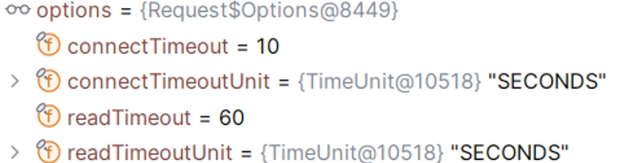
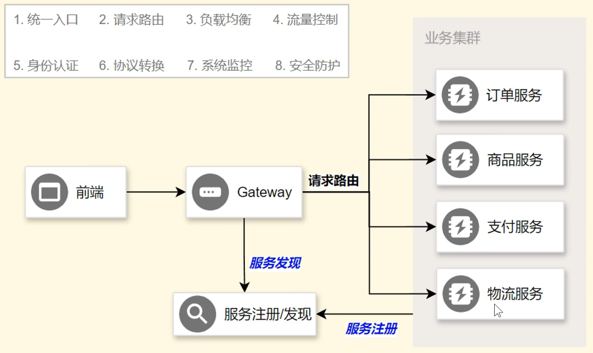
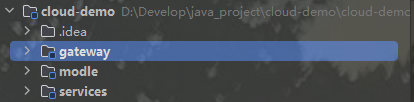

# Nacos

## Nacos注册中心

| 内容             | 核心                                          |
| ---------------- | --------------------------------------------- |
| 启动微服务       | SpringBoot 微服务web项目启动                  |
| 引入服务发现依赖 | spring-cloud-starter-alibaba-nacos-discovery  |
| 配置Nacos地址    | spring.cloud.nacos.server-addr=127.0.0.1:8848 |
| 查看注册中心效果 | 访问 http://localhost:8848/nacos              |
| 集群模式启动测试 | 单机情况下通过改变端口模拟微服务集群          |

一个更易于构建云原生应用的动态服务发现、配置管理和服务管理平台。

* 先进入nacos的安装目录，然后进入bin目录，进入cmd，输入指令

  ```cmd
  startup.cmd -m standalone
  ```

* 浏览器进入 localhost:8848/nacos 页面
* 项目要加上这些依赖项

* application.yml配置文件

  ```yml
  spring:
    application:
      name: service-product
    cloud:
      nacos:
        discovery:
          server-addr: 127.0.0.1:8848
  server:
    port: 9000
  ```

* 然后在localhost:8848/nacos就可以看到注册成功了

### 注册中心-服务发现

| 内容             | 核心                   |
| ---------------- | ---------------------- |
| 开启服务发现功能 | @EnableDiscoveryClient |
| 测试服务发现API  | DiscoveryClient        |
| 测试服务发现API  | NacosServiceDiscovery  |

```java
@EnableDiscoveryClient //开启服务发现功能
@SpringBootApplication
public class ProductMainApplication {
    public static void main(String[] args) {
        SpringApplication.run(ProductMainApplication.class, args);
    }
}
```

### 远程调用-基本流程

* 所有服务都会注册在注册中心
* 当**服务A**需要调用**服务B**时，**服务A**从注册中心获取**服务B**可访问的地址列表，选择一个服务地址，发送请求给**服务B**，**服务B**返回请求

下面程序可以实现负载均衡的发送请求给另一个服务

```java
 private Product getProductFromRemoteWithLoadBalance(Long productId){
        //1.获取到商品服务所在的所有机器IP+port(负载均衡的)
        ServiceInstance instance = loadBalancerClient.choose("service-product");
        //远程url地址
        String url = "http://" + instance.getHost() + ":" + instance.getPort() + 	"/product/" + productId;
        //给远程发送请求
        log.info("------------------远程请求路径：" + url);
        Product product = restTemplate.getForObject(url, Product.class);
        return product;
    }
```


### 远程调用-下单场景

用户发起下单请求给订单服务，订单服务向商品服务发送请求查询订单中的商品信息，然后生成订单，再给用户返回订单数据


这些步骤涉及到两个实体模型


### 远程调用-实现步骤（负载均衡）

| 内容             | 核心                              |
| ---------------- | --------------------------------- |
| 引入负载均衡依赖 | spring-cloud-starter-loadbalancer |
| 测试负载均衡API  | LoadBalancerClient                |
| 测试远程调用     | RestTemplate                      |
| 测试负载均衡调用 | @LoadBalanced                     |

### 更简单的负载均衡

Spring提供了一个注解 $@LoadBalanced$，只需要把这个注解标到远程客户端上，他就自带负载均衡功能

```java
@LoadBalanced //注解式负载均衡
@Bean
public RestTemplate createRestTemplate(){
	return new RestTemplate();
}
```

```java
private Product getProductFromRemoteWithLoadBalanceAnnotation(Long productId){
        String url = "http://service-product/product/" + productId;
        // service-product 会被动态替换
        Product product = restTemplate.getForObject(url, Product.class);
        return product;
    }
```

### 注册中心宕机，远程调用还能成功吗

**现在调用其他服务有两次请求**

* 请求注册中心获取微服务地址列表
* 给对方服务的某个地址发送请求

但是注册中心和服务之间有一个**实例缓存**，实例缓存实时同步更新注册中心的实例，一个服务调用其他服务就不用发两次请求


1. 调用过，远程调用不在依赖注册中心，可以通过
2. 没调用过，（第一次发起远程请求），不能通过

**详细扩充：**

1. **问题：**第一次调用是拉取“调用的服务”的健康实例，还是所有服务的健康实例？

* 只拉取“当前需要调用的服务目标”的健康实例，而非所有服务

2. **问题：**第一次初始化同步时依靠返回线程，还是把从注册中心查到的实例返回，再用另外的线程来实现同步？

* 首次初始化时“同步阻塞的”——由发起调用的线程直接向注册中心查询，拿到实例后先更新再返回实例用于本次调用，不存在“另起线程异步同步”的过程

3. **问题：**后续调用每次都会先判断是否超过更新时间，还是返回旧的实例再更新？

* 优先使用就缓存返回实例，同时在“后台异步更新缓存”（若已超过更新时间），即“先返回，在更新”，而非“先判断更新再返回”。

## nacos配置中心

* 启动nacos

* 引入依赖

  ```xml
  <dependency>
  	<groupId>com.alibaba.cloud</groupId>
      <artifactId>spring-cloud-starter-alibaba-nacos-config</artifactId>
  </dependency>
  ```

* application.yml配置

  ```yaml
  spring:
  	cloud:
  		nacos:
  			server-addr: 127.0.0.1:8848
  	config:
  		import: nacos:server-order.yml
  ```

* 创建 data-id（数据集）

```java
@RestController
@RefreshScope
public class OrderController {
    
    @Value("${order.timeout}")
    String orderTimeout;
    @Value("${order.auto-confirm}")
    String orderAutoConfig;

    @GetMapping("/config")
    public String config(){
        return "order.timeout:" + orderTimeout + ",order.auto-confirm:" + orderAutoConfig;
    }
}
```

* 通过使用**@Value**注解实现从配置文件中获取信息
* 通过**@RefreshScope**注解实现实时刷新

**注意：**添加了配置中心的依赖之后，就要配置spring.config.import

但是可以通过spring.cloud.nacos.config.import-check.enabled=false

### 配置中心-动态刷新

**使用步骤：**

* @Value("${xx}")获取配置 + @RefreshScope 实现自动刷新
* @ConfigurationProperties 无感自动刷新
* NacosConfigManager 监听配置变化

```java
@Component//启动就创建唯一实例交给IOC容器管理
@ConfigurationProperties(prefix = "order")//配置批量绑定在nacos下，可以无需@RefreshScope就能实现自动刷新，自带自动转化为驼峰命名
@Data
public class OrderYml {
    private String timeout;
    private String autoConfirm;
}
```

#### 使用NacosConfigManager监听指定数据集变化

```java
	@Bean
    ApplicationRunner applicationRunner(NacosConfigManager nacosConfigManager){
        return args -> {
            ConfigService configService = nacosConfigManager.getConfigService();
            configService.addListener("service-order.yml", "DEFAULT_GROUP", new Listener() {
                @Override
                public Executor getExecutor() {
                    return Executors.newFixedThreadPool(4);
                }

                @Override
                public void receiveConfigInfo(String s) {
                    System.out.println("变化的配置信息:" + s);
                    System.out.println(" ======================= ");
                }
            });
            System.out.println("=============");
        };
    }
```

**思考：**Nacos中的数据集和application.yml 有相同的配置项，哪个生效？

**答案：**引入配置中心的目的是为了集中管理多个服务的配置，所以当有相同配置时，配置中心的配置优先生效


**先导入优先、外部优先**


导入配置可以用逗号隔开，如果导入配置有重复的，先导入的优先

### 配置中心-数据隔离

* 需求描述
* * 项目有多套环境：dev， test， prod
  * 每个微服务，同一种配置，在每套环境的值都不一样
  * * 如：database.yml
    * 如：common.yml
  * 项目可以通过切换环境，加载本环境的配置
* 难点
* * 区分多套环境
  * 区分多种微服务
  * 区分多种配置
  * 按需加载配置


#### 在application.yml中配置要选择的配置文件

```yml
spring:
  application:
    name: service-order
  cloud:
    nacos:
      server-addr: 127.0.0.1:8848
      config:
        namespace: dev #配置命名空间为dev，后面导入的配置都是dev里的
  config:
    import:
      - nacos:service-order.yml?group=order #？后面的参数表示分组
      - nacos:datebase.yml?group=order
server:
  port: 8000

```

动态选择所激活环境的配置

```yaml
spring:
  profiles:
    active: dev
  application:
    name: service-order
  cloud:
    nacos:
      server-addr: 127.0.0.1:8848
      config:
        import-check:
          enabled: false
        namespace: ${spring.profiles.active:dev}
server:
  port: 8000

---
spring:
  config:
    import:
      - nacos:common.yml?group=order
      - nacos:datebase.yml?group=order
      - nacos:common.yml?group=product
    activate:
      on-profile: dev

---
spring:
  config:
    import:
      - nacos:common.yml?group=order
      - nacos:datebase.yml?group=order
      - nacos:common.yml?group=product
    activate:
      on-profile: pro

---
spring:
  config:
    import:
      - nacos:common.yml?group=order
      - nacos:datebase.yml?group=order
      - nacos:common.yml?group=product
    activate:
      on-profile: test
```

## Nacos总结

### 注册中心

1. 引入 spring-cloud-starter-alibaba-nacos-discovery 依赖，配置Naocs地址
2. @EnableDiscoveryClient 开启服务发现功能

**扩展：**

1. DiscoveryClient 获取服务实例列表
2. LoadBalancerClient 负载均衡选择一个实例（需引入spring-cloud-starter-loadbalancer）
3. RestTemplate 可以发起远程调用

### 配置中心

1. 引入spring-cloud-starter-alibaba-nacos-config 依赖，配置Nacos地址
2. 添加 **数据集** （data-id），使用 spring.config.import 导入数据集
3. @Value + @RefreshScope 取值 + 自动刷新
4. @ConfigurationProperties 批量绑定自动刷新
5. NacosConfigManager 监听配置变化

**扩展：**

配置优先级，namespace区分环境，group区分微服务，data-id区分配置，实现数据隔离 + 环境切换

# OpenFeign

**远程调用-声明式实现**


需要的依赖：

```xml
<dependency>
	<groupId>org.springframework.cloud</groupId>
    <artifactId>spring-cloud-starter-openfeign</artifactId>
</dependency>
```


**新建一个接口**

```java
@FeignClient(value = "service-product") //feign客户端，默认是负载均衡的
public interface ProductFeignClient {

    //mvc注解的两套使用逻辑
    //1.标注在Controller上，是接受这样的请求
    //2.标注在Feign上，是发送这种请求
    @GetMapping("/product/{id}")
    public Product getProductById(@PathVariable("id") Long id, @RequestHeader String token);
}
```

然后需要调用它时，用@Autowired注入，然后再调用

## 远程调用-第三方API


**通过@FeignClient构造远程调用第三方接口**

**具体参数依据第三方API文档**

```java
@FeignClient(value = "weather-client", url = "")
public interface WeatherFeignnClient {

    @PostMapping("")
    Object getWeather(@RequestHeader(value = "Authorization") String auth,
                      @RequestParam(value = "token") String token,
                      @RequestParam(value = "cityId") String cityId);
}
```

**小技巧：**

* 业务API：直接复制对方Controller签名即可
* 第三方API：根据接口文档确定请求如何发

### 面试题：

**客户端负载均衡和服务器负载均衡的区别**

客户端负载均衡：

服务端负载均衡：

## 进阶用法

### 进阶用法-日志

```yaml
logging:
	level:
		com.atguigu.order.feign: debug
```

```java
@Bean
Logger.Level feignLoggerLevel(){
    return Logger.level.FULL;
}
```

可以查看到debug级别的日志

### 进阶用法-超时控制

如果OpenFeign一直连接不上远程服务，或者服务很慢，会出现多个线程等待，时间一长就会积压很多线程耗尽服务器资源，所以需要超时控制


在OpenFeign里面引入了两种超时时间：

* connectTimeout 连接超时
* readTimeout 读取超时


connectTimeout 设置的就是第一步（建立连接）的时间

readTimeout 设置的就是第三步（处理业务）的时间

下面是 OpenFeign 的默认设置

#### 配置超时控制

1. 新建一个 yml 文件 application-feign.yml 

2. application-feign.yml 的内容

   ```yml
   spring:
     cloud:
       openfeign:
         client:
           config:
             default: # 这个代表的是默认配置
               logger-level: full
               connect-timeout: 3000
               read-timeout: 6000
             service-product: # 这个是给一个客户端的特定配置
               logger-level: full
               connect-timeout: 3000
               read-timeout: 3000
   ```

3. 在主配置文件中包含新建的 yml 文件

   ```yml
   spring:
     profiles:
       active: dev
       include: feign
   ```

### 进阶用法-重试机制

* 远程调用超时失败后，还可以进行多次尝试，如果某次成功则返回ok，如果多次依然失败则结束调用，返回错误


**但是 OpenFeign 在默认在底层使用的是 NEVER_RETRY （从不重试）的策略， 我们可以给他配置一个策略**


最多重试 5 次，第一次 100ms ，之后每次乘以 1.5 倍，但是最大重试间隔不会超过一秒

#### 配置流程

* 方法一：直接在 yml 文件中配置

  ```yml
  spring:
    cloud:
      openfeign:
        client:
          config:
            default:
              logger-level: full
              connect-timeout: 3000
              read-timeout: 6000
            service-product:
              logger-level: full
              connect-timeout: 3000
              read-timeout: 3000
              retryer: feign.retryer.Default
  ```

* 方法二：官方文档描述，会在 SpringIOC 容器中寻找相关组件

  ```java
  @Configuration
  public class OrderConfig {
  
      @Bean
      public Retryer retryer(){
          return new Retryer.Default();//默认的重试器，自定义直接传入参数就行了
      }
  }
  ```

**每次重试会通过 Ribbon 负载均衡器来重新选择实例**

### 进阶用法-拦截器

* 请求拦截器
* 响应拦截器


**请求拦截器比较常用，如：添加请求头Authorization**

```java
@Component//添加进IOC容器中，OpenFeign会自动在SpringIOC中寻找
public class XTokenRequestInterceptor implements RequestInterceptor {
    @Override
    public void apply(RequestTemplate requestTemplate) {
        requestTemplate.header("X-Token", UUID.randomUUID().toString());
    }
}
```

也可以在 yml 文件中，为指定服务添加拦截器

```yml
spring:
  cloud:
    openfeign:
      client:
        config:
          default:
            logger-level: full
            connect-timeout: 3000
            read-timeout: 6000
          service-product:
            logger-level: full
            connect-timeout: 3000
            read-timeout: 3000
            request-interceptors:
              - com.atguigu.order.interceptor.XTokenRequestInterceptor
```

### 进阶用法-Fallback

* Fallback：兜底返回
* * 注意：此功能需要整合 Sentinel 才能实现


这里有个远程调用的类

```java
package com.atguigu.order.feign;
@FeignClient(value = "service-product", fallback = ProductFeignClientFallback.class) //feign客户端,设置兜底返回的实现类
public interface ProductFeignClient {

    //mvc注解的两套使用逻辑
    //1.标注在Controller上，是接受这样的请求
    //2.标注在Feign上，是发送这种请求
    @GetMapping("/product/{id}")
    public Product getProductById(@PathVariable("id") Long id);
}
```

然后我们再编写一个这个接口的实现类

**如果远程调用失败，就会使用接口的实现类，返回的数据作为兜底数据**

```java
package com.atguigu.order.feign.fallback;
@Component//放入容器中
public class ProductFeignClientFallback implements ProductFeignClient {
    @Override
    public Product getProductById(Long id) {
        System.out.println("兜底回调-----------");
        return null;
    }
}
```

还需要导入 sentinel 依赖

```xml
<dependency>
    <groupId>com.alibaba.cloud</groupId>
    <artifactId>spring-cloud-starter-alibaba-sentinel</artifactId>
</dependency>
```

然后需要在 yml 文件中配置

```yaml
feign:
  sentinel:
    enabled: true
```

## OpenFeign-总结

1. 编写 OpenFeign 远程调用客户端
2. 配置 OpenFeign 客户端属性，连接超时，读取超时
3. 拦截器用法
4. Fallback 兜底返回机制 及 用法

# Sentinel

Spring-cloud-alibaba 提供的用来做**服务保护**的框架，服务保护的常见手段，**限流，熔断降级**


## 资源和规则

* 定义资源：
* * 主流框架自动适配（Web  Servlet、Dubbo、SpringCloud、gRPC、Spring WebFlux、Reacter），所有 Web 接口均为资源
  * 编程式：SphU API
  * 声明式：@SentinelResource
* 定义规则：
* * 流量控制（FlowRule）
  * 熔断降级（DegradeRule）
  * 系统保护（SystemRule）
  * 来源访问控制（AuthorityRule）
  * 热点参数（ParamFlowRule）

## sentinel 控制台

在官网下载一个 jar 包，然后运行这个 jar 包，在浏览器访问 localhost:8080（默认端口），账号密码默认都是 sentinel

然后在 yml 中配置，连接上 sentinel

```yaml
spring:
  cloud:
      sentinel:
      transport:
        dashboard: localhost:8080
      eager: true #提前加载，项目一启动脸上sentinel控制台
```

可以用 @SentinelResource 注解来定义资源

比如我把这个方法资源命名为 CreateOrder

```java
@SentinelResource(value = "createOrder")
    @Override
    public Order createOrder(Long userId, Long productId) {
        //Product product = getProductFromRemoteWithLoadBalanceAnnotation(productId);
        Product product = productFeignClient.getProductById(productId);
        Order order = new Order();
        order.setId(1L);
        //TODO 总金额
        order.setTotalAmount(product.getPrice().multiply(new BigDecimal(product.getNum())));
        order.setUserId(userId);
        order.setNickName("zouzixi");
        order.setAddress("尚硅谷");
        //TODO 远程查询商品列表
        order.setProductList(null);
        return order;
    }
```

## 异常处理


当给资源设定了规则后，违背某一种规则，就会抛出BlockException异常，但是这种异常会由于资源的不同，有不同的异常处理机制

### 异常处理-Web 接口

比如 Web 接口类的资源，是默认使用 SentinelWebInterceptor 机制，这个其实是 Spring MVC 里面的 Web 拦截器， Spring MVC 拦截器都要实现 HandlerInteceptor 接口

preHandle 方法里面，如果抛出异常，会先捕获，然后交给 DefaultBlockExceptionHandler ，DefaultBlockExceptioonHandler 又实现了 BlockExceptionHandler 接口的 handle 方法

在 Sentinel 对 Spring MVC Web 接口的异常处理机制中，当检测到 IOC 容器中有除了 DefaultBlockExceptionHandler（BlockExceptionHandler 实现类）之外的自定义实现类时，会优先调用自定义实现类

**所以，要自定义处理，我们只需要自定义一个实现了 BlockExceptionHandler 接口的类，只需要将他放在容器中就能生效 **

**BlockExceptionHandler 是 sentinel 定义的专门处理 Spring MVC Web 接口异常的接口**

```java
@Component
public class MyBlockExceptionHandler implements BlockExceptionHandler {
    @Override
    public void handle(HttpServletRequest httpServletRequest, HttpServletResponse httpServletResponse, String s, BlockException e) throws Exception {
        httpServletResponse.setContentType("application/json;charset=utf-8");
        PrintWriter writer = httpServletResponse.getWriter();
        R error = R.error(500, s + "被Sentinel限制了，原因：" + e.getClass());
        String jsonStr = JSONUtil.toJsonStr(error, new JSONConfig().setIgnoreNullValue(false));
        System.out.println(jsonStr);
        writer.println(jsonStr);
        writer.flush();
        writer.close();
    }
}
```

### 异常处理-@SentinelResource

为了处理@SentinelResource资源的异常，专门有一个SentinelResoourceAspect的切面

当方法资源调用失败或抛出异常时，会使用兜底回调的方法来返回

```java
@SentinelResource(value = "createOrder", blockHandler = "createOrderFallback")
@Override
public Order createOrder(Long userId, Long productId) {
    Order order = new Order();
    。。。。。。
    return order;
}


//兜底回调
public Order createOrderFallback(Long productId, Long userId, BlockException e){
    Order order = new Order();
    。。。。。。
    return order;
}
```

也可以不用任何一种回调和异常处理，然后把异常一直向上抛，最终由项目的全局异常处理器来处理

### 异常处理-OpenFeign

也是只需要指定一个 fallback 就行，没有 fallback 就找给全局异常处理器处理

### 异常处理-SphU

SphU 包含了 try-catch 风格的 API。用这种方式，当资源发生限流之后会抛出 BlockException。这个时候可以捕捉异常，进行限流之后的逻辑处理。

下面这段代码是直接写在被保护的资源里

```java
//资源名可以使用任意有业务语义的字符串
try(Entry entry = SphU.entry("resourceName")){
	// 被保护的业务逻辑
}catch (BlockException e){
	//资源访问阻止，被限流或被降级
	//在此处进行相应的处理操作
}
```

## 流控规则

限制多余的请求，从而保护系统资源不被耗尽


### 流控规则-阈值类型

**设置均摊阈值为 1**

* QPS：每秒通过 1 个请求
* 并发线程数：每秒通过 1 个线程
* 集群阈值模式
* * 单机均摊：每个服务器每秒通过 1 个请求
  * 总体阈值：一个集群每秒通过 1 个请求

### 流控规则-流控模式

* 直接


* 关联


给一个A资源加限流，关联上B资源，当B资源流量小时，A资源没有限流，当B资源流量大时，A资源限流

**其实像一个设置优先级的限流规则**

* 链路


```yaml
spring:
  cloud:
    sentinel:
      web-context-unify: false # 表示不统一 Web 上下文，分割请求链路
```

### 流控规则-流控效果

**注意：**只有**快速失败**支持流控模式（直接、关联、链路）的设置

* 快速失败（直接拒绝）
* Warm Up（预热/冷启动）


一开始的阈值会等于1/3设定阈值，当流量突然增大，再在预设时间内将阈值增长到预设阈值 

* 匀速排队


因为精度为ms，所以不支持 QPS > 1000

排队也有超时时间，如果检测到排队时间大于 timeout，就会丢弃

**Sentinel 匀速排队等待策略是 Leaky Bucket 算法结合虚拟队列等机制实现**

## 熔断规则

切断不稳定调用，快速返回不积压，避免雪崩效应


没有熔断的话，每次请求发出去，错误或者超时，再回来执行 fallback，浪费服务器资源

有熔断的话，每次请求直接失败，然后执行 fallback，非常的快，不会浪费服务器资源


## 热点规则

**相当于是流控规则的细节版，参数限流**


**热点规则可以用来实现以下需求**


**注意：**目前 Sentinel 自带的 adapter 仅 Dubbo 方法埋点带了热点参数，其他适配模块（如 Web）默认不支持热点规则，可通过自定义埋点方式指定新的资源名，并传入希望的参数。注意自定义埋点的资源名不要和设配模块生成的资源名重复，否则会导致重复统计。


**这个表示，第一个参数相同的每秒只能由一次请求，但是第一个参数为 6 时，不被限流**


**这个表示，当第二个参数为 666 时，不给通过**

## 补充-fallback 与 blockHandler

前面我们给 seckill-order 资源设置了 fallback，但是被**热点限流**之后，并没有触发**兜底回调**

@SentinelResource 注解处理异常的规则就是，有 blockHandler 用 blockHandler，没有采用 fallback

* blockHandler：可以专门处理被流控了的异常
* fallback：相比于 blockHandler 最大的好处就是，它还可以处理业务异常，比如：业务中出现 1/ 0 ，抛出异常，直接使用 fallback 兜底回调

**所以我们在使用 fallback 作为兜底回调时，一定要这样**

```java
@GetMapping("/seckill")
@SentinelResource(value = "seckill-order", fallback = "seckillFallback")
public Order seckill(@RequestParam("userId") Long userId,
                     @RequestParam("productId") Long productId){
    return new Order();
}

//下面一定要写Throwable，如果是BlockException只能使用blockHandler
public Order seckillFallback(Long userId, Long productId, Throwable e){
    System.out.println("seckillFallback-------------------");
    return new Order();
}
```

# Gateway



**网关**可以统一请求的入口，再分配给多个服务器

## 创建网关

在 services 模块的同一级别创建一个新的模块



引入**nacos注册中心**依赖和**gateway响应式网关**依赖

```xml
	<dependencies>
<!--nacos注册中心-->
        <dependency>
            <groupId>com.alibaba.cloud</groupId>
            <artifactId>spring-cloud-starter-alibaba-nacos-discovery</artifactId>
        </dependency>
<!--响应式网关-->
        <dependency>
            <groupId>org.springframework.cloud</groupId>
            <artifactId>spring-cloud-starter-gateway</artifactId>
        </dependency>
    </dependencies>
```

配置文件，设置端口，设置nacos

```yaml
spring:
  application:
    name: gateway
  cloud:
    nacos:
      server-addr: 127.0.0.1:8848
server:
  port: 8888
```

在启动类上加**@EnableDiscoveryClient**注解，使注册中心能发现它

```JAVA
@EnableDiscoveryClient
@SpringBootApplication
public class GatewayApplication {
    public static void main(String[] args){
        SpringApplication.run(GatewayApplication.class, args);
    }
}
```

## 路由

### 路由-规则配置

**在yml中配置**

创建一个 application-route,yml 文件

```yaml
spring:
  cloud:
    gateway:
      routes:
        # 订单规则
        - id: order-route
          uri: lb://service-order # lb代表负载均衡
          predicates:
            - Path=/api/order/** # 访问路径
        # 商品规则
        - id: product-route
          uri: lb://service-product 
          predicates:
            - Path=/api/product/**
```

然后在主 yml 文件中包含这个文件

```yaml
spring:
  profiles:
    include: route
```

**注意这里有一个坑点，就是要使用负载均衡需要先引入负载均衡依赖**

```xml
<!--负载均衡依赖-->
<dependency>
    <groupId>org.springframework.cloud</groupId>
    <artifactId>spring-cloud-starter-loadbalancer</artifactId>
</dependency>
```

然后再把原来业务所有请求的路径之前加上**/api/业务名**

### 路由-工作原理


像这样一个配置文件，他是从上到下有序进行匹配的，就是进来的请求，先匹配到了 order-route，就不会继续向下匹配了

```yaml
spring:
  cloud:
    gateway:
      routes:
        # 订单规则
        - id: order-route
          uri: lb://service-order # lb代表负载均衡
          predicates:
            - Path=/api/order/** # 访问路径
        # order: 2
        # 商品规则
        - id: product-route
          uri: lb://service-product 
          predicates:
            - Path=/api/product/**
         # order: 1
```

**当然，也可以手动配置以下 order ，向上面一样，就会先匹配 product-route**

## 断言

**predicates：**


### 断言-长短写法

**断言长写法**

```yaml
spring:
  cloud:
    gateway:
      routes:
        # 订单规则
        - id: order-route
          uri: lb://service-order # lb代表负载均衡
          predicates:
            - name: Path
              args:
                patterns: /api/order/**
                matchTrailingSlash: true
```

**断言短写法**

```yaml
spring:
  cloud:
    gateway:
      routes:
        # 订单规则
        - id: order-route
          uri: lb://service-order # lb代表负载均衡
          predicates:
            - Path=/api/order/**
```

断言有很多种，可以查看 RoutePredicateFactory 断言工厂的实现


实现类名去掉 RoutePredicateFactory 就是断言的名字了

### 断言-Query

下面的断言就是需要满足两个条件才会转给 bing

* Path：路径必须为 /search 
* Query：参数必须是 q 并且值必须为 haha

```yaml
spring:
  cloud:
    gateway:
      routes:
        - id: bing-route
          uri: https://cn.bing.com/
          predicates:
            - name: Path
              args:
                patterns: /search
            - name: Query
              args:
                param: q
                regexp: haha
```

### 断言-自定义断言工厂

Spring 内置的断言规则不能囊括所有的断言规则，所以需要自定义断言规则

比如，自定义一个断言，断言名为 Vip，如果是 vip 就转，不是就不转

所以就需要自己自定义一个断言工厂

```java
@Component //交给Spring IOC 管理
public class VipRoutePredicateFactory extends AbstractRoutePredicateFactory<VipRoutePredicateFactory.Config> {
    public VipRoutePredicateFactory(){
        super(Config.class);
    }
    /**
     * 自定义判断规则
     * */
    @Override
    public Predicate<ServerWebExchange> apply(Config config) {
        return new GatewayPredicate() {
            @Override
            public boolean test(ServerWebExchange serverWebExchange) {
                //localhost:8888/search?q=haha&user=zouzixi
                ServerHttpRequest request = serverWebExchange.getRequest();
                String first = request.getQueryParams().getFirst(config.param);
                return StringUtils.hasText(first) && first.equals(config.value);
            }
            /**
             * 匿名类新增的方法，不能直接调用*/
            public Object getConfig() {
                return config;
            }
            @Override
            public String toString() {
                return String.format("Vip: param=%s value=%s", config.getParam(), config.getValue());
            }

        };
    }
    /**
     * 断言短写法参数的顺序
     * */
    @Override
    public List<String> shortcutFieldOrder() {
        return Arrays.asList("param", "value");
    }
    /**
    * 可以配置的参数
     * */
    @Validated
    public static class Config {
        private @NotEmpty String param;
        private @NotEmpty String value;

        public @NotEmpty String getParam() {
            return this.param;
        }
        public @NotEmpty String getValue(){
            return this.value;
        }
        //返回自己，可以链式调用该
        public Config setParam(@NotEmpty String param){
            this.param = param;
            return this;
        }
        public Config setValue(@NotEmpty String value){
            this.value = value;
            return this;
        }
    }
}
```

上面自定义的断言的**短写法**和**长写法**

```yaml
# 短写法
spring:
  cloud:
    gateway:
      routes:
        - id: bing-route
          uri: https://cn.bing.com/
          predicates:
            - Vip=user,zouzixi
# 长写法           
spring:
  cloud:
    gateway:
      routes:
        - id: bing-route
          uri: https://cn.bing.com/
          predicates:     
          - name: Vip
            args:
              param: user
              value: zouzixi
```

## 过滤器

### 过滤器-基本使用

过滤器是以类似栈的方式堆叠的


使用路径重写过滤器

```yaml
spring:
  cloud:
    gateway:
      routes:
        # 订单规则
        - id: order-route
          uri: lb://service-order # lb代表负载均衡
          predicates:
          #  - Path=/api/order/** # 访问路径
            - name: Path
              args:
                patterns: /api/order/**
                matchTrailingSlash: true
          filters:
            - RewritePath=/api/order/?(?<segment>.*),/$\{segment}
            - AddResponseHeader=X-Response-Name,zouzixi #添加响应头key：Name，value：zouzixi
        # 商品规则
        - id: product-route
          uri: lb://service-product
          predicates:
            - Path=/api/product/**
          filters:
            - RewritePath=/api/order/?(?<segment>.*),/$\{segment} #重写路径
```

### 过滤器-默认filter

可以在 yml 文件种配置默认 filter 使其生效

```yaml
spring:
  cloud:
    gateway:
      default-filters:
        - AddResponseHeader=X-Response-Name,zouzixi
```

### 过滤器-GlobalFilters

**对所有请求都生效的filter**

下面是自定义的全局 filter

因为 gateway 是响应式编程，后置逻辑是经过了 filter 链之后执行的逻辑，而 filter 链又是异步执行，所以只能在doFinnally 方法中写后置逻辑

```java
@Component//加入到容器中进行生效
@Slf4j
public class RtGlobalFilter implements GlobalFilter, Ordered {
    @Override
    public Mono<Void> filter(ServerWebExchange exchange, GatewayFilterChain chain) {
        ServerHttpRequest request = exchange.getRequest();
        ServerHttpResponse response = exchange.getResponse();

        String uri = request.getURI().toString();
        long start = System.currentTimeMillis();
        log.info("请求【{}】开始：时间：{}", uri, start);
        ///============================前置逻辑==============================

        Mono<Void> filter = chain.filter(exchange)
                .doFinally((resulte) -> {
                    ///============================后置逻辑==============================
                    long end = System.currentTimeMillis();
                    log.info("请求【{}】结束：时间：{}，耗时：{}ms", uri, end, end - start);
                });///放行


        return filter;
    }

    @Override
    public int getOrder() {
        return 0;
    }
}
```

### 过滤器-自定义过滤器工厂

随便找一个过滤器工厂的源码，照着它写就完了


下面是自定义的过滤器

```java
@Component
public class OnceTokenGatewayFilterFactory extends AbstractNameValueGatewayFilterFactory {
    @Override
    public GatewayFilter apply(NameValueConfig config) {
        return new GatewayFilter() {
            @Override
            public Mono<Void> filter(ServerWebExchange exchange, GatewayFilterChain chain) {
                /// 响应式编程，传入的参数都是不可修改的，想要修改创建新的变量

                return chain.filter(exchange).then(Mono.fromRunnable(() -> OnceTokenGatewayFilterFactory.this.addOnceToken(exchange, config)));
            }

            public String toString(){
                return GatewayToStringStyler.filterToStringCreator(OnceTokenGatewayFilterFactory.this).append(config.getName(), config.getValue()).toString();
            }
        };
    }
    /// 每次响应之前，添加一个一次性令牌，支持UUID，JWT等各种格式
    private void addOnceToken(ServerWebExchange exchange, AbstractNameValueGatewayFilterFactory.NameValueConfig config) {
        String value = ServerWebExchangeUtils.expand(exchange, config.getValue());
        String token = "DEFAULT";
        if(value.equals("UUID")){
            token = generateUUID();
        }
        else if(value.equals("JWT")){
            token = generateJWT();
        }
        HttpHeaders headers = exchange.getResponse().getHeaders();
        if (!exchange.getResponse().isCommitted()) {
            headers.add(config.getName(), token);
        }

    }
    private String generateJWT(){
        Map<String, Object> dataMap = new HashMap<>();
        final String JWTCODE = "jwtcode-zouzixi";
        dataMap.put("id", 1);
        dataMap.put("username", "zouzixi");
        String jwt = Jwts.builder().signWith(SignatureAlgorithm.HS256, JWTCODE)
                .addClaims(dataMap)//添加自定义的信息
                .setExpiration(new Date(System.currentTimeMillis() + 3600*1000))//设定过期时间
                .compact();
        return jwt;
    }
    private String generateUUID(){
        return UUID.randomUUID().toString();
    }
}
```

# 补充

## 响应式编程

### 核心规则（设计原理

**不可变性**

* 规则：数据流中的数据对象一旦创建，其状态（内部成员）不可修改；任何 “修改” 都必须返回新的对象副本。
* 原因：
* * **避免多线程并发修改导致的线程安全问题（无需加锁）；**
  * 保证数据流的可追溯性（每个操作都是新对象，便于调试和日志）；
  * 符合函数式编程 “无副作用” 的特性。

**注意：**就算改变一个引用对象的内部成员没有造成问题，也应该每次进行**修改数据流中的变量**的时候，创建一个新的副本来进行传递。