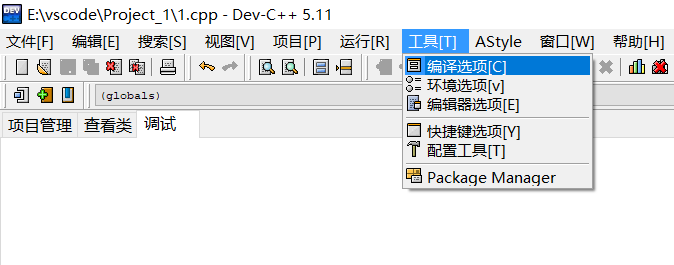
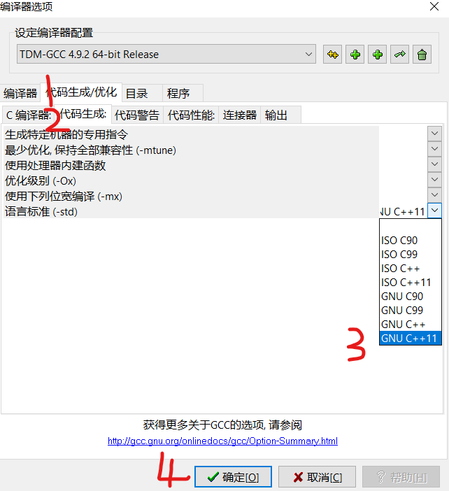
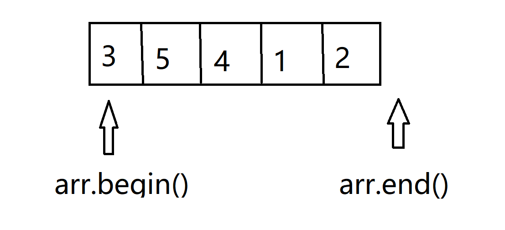
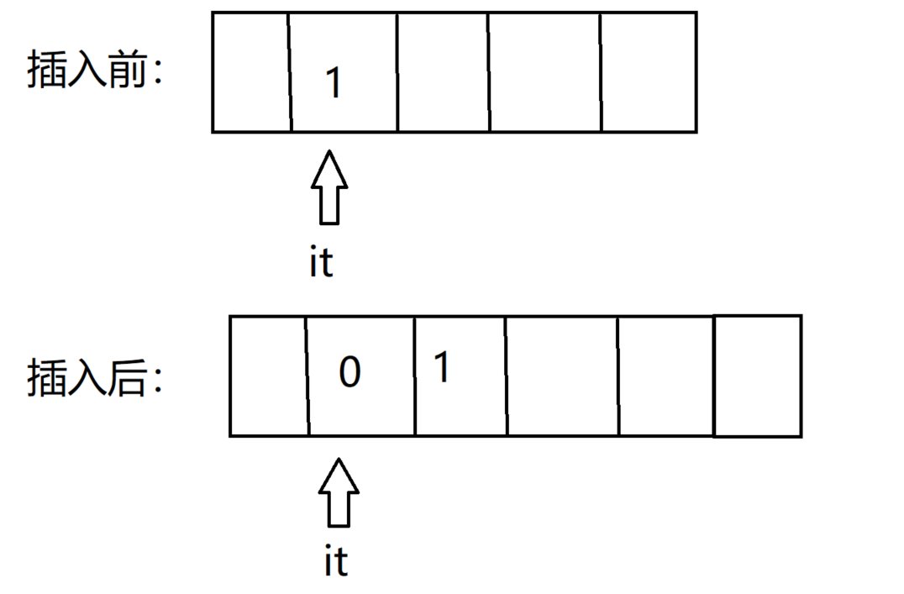
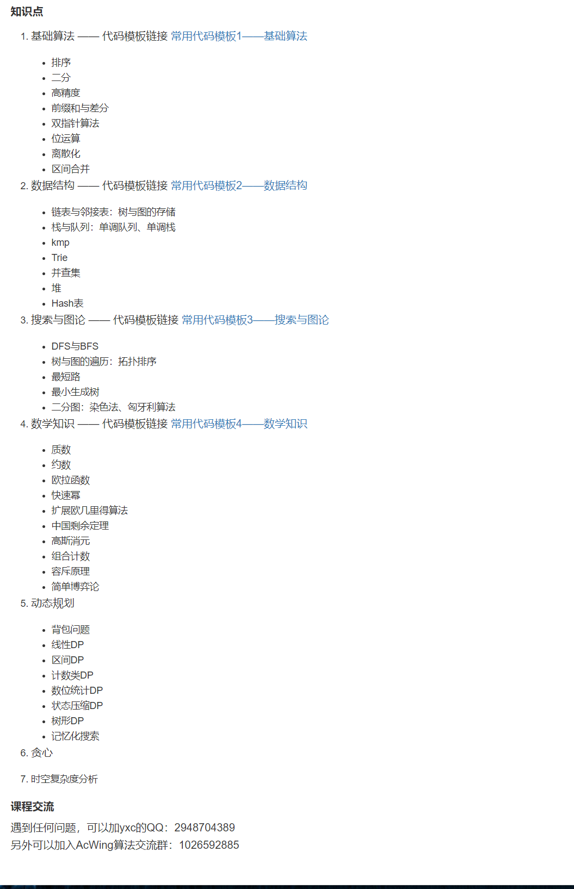
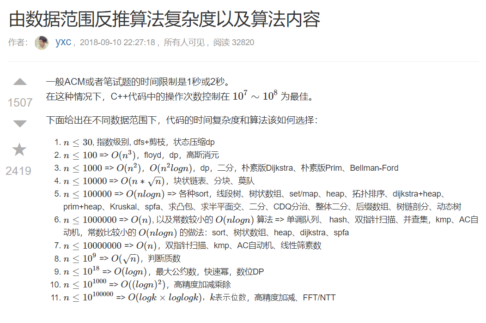

<h1>致大一新生的第一份资料</h1>

<h2>本资料仅供乐程软件工作室内部人员使用，禁止外传</h2>

<h2>目录：</h2>

[TOC]

# 零.作者的话


C语言学到链表之前(不包括链表)再看这个

链表那个学早了也不一定能用上


**以后做题都去用C++**，非常不建议用C语言做题(但C语言基础尽量扎实一些)

C++在大家能用到的范围内基本上是兼容C语言的


出这个C++文字教程是因为这个根据别的地方学习可能太慢了

其他地方容易学到一些暂时用不上的知识

所以我就整理了一份C++基础知识资料


这份资料最迟在ACM新生赛开始前学完

学完后就开始进行算法的学习，后记中有提到

新生赛前最好是把算法基础课的第一章基础部分学完，再不济双指针、前缀和、差分要会


**尽量每一个知识点都能亲手敲一下**吧


Typora这个软件基本上就是程序员记笔记必备的软件了

里面内置了markdown语法，自行上网学习一下

当然先看本教程也没问题，不会那个又不影响阅读


本文的全部代码均可在dev5.11编辑器运行，部分需要开启C++11的部分，中间也说明如何开启

不建议跳着学，建议从头往后按顺序看


**再说一遍，禁止将本资料外传，仅供我们乐程软件工作室使用，否则后果自负**


作者：万伏林

身份：2020级队长

QQ：1196160871

有什么问题先去问上一级的学长

**如果有什么出现问题的地方需要修改，根据实际情况自行更改**，也可以考虑先问一下我，没关系的


第一版完结于2022.04.09

v1.01于2022.6.6更新

v1.02于2022.10.31更新

v1.03于2022.11.18更新


# 一.C语言常用知识


这里讲一下做题中可能常用的东西

建议先把C语言那些基础知识都学了再看吧

这里列举一下哪些东西要提前知道

1. 输入输出：scanf、printf、puts、putchar、getchar、gets(建议不要用)
2. 数据类型：int、long long、double、char、bool
3. 运算符：`&&` `||` `!` `&` `|` `^` `~` `>>` ` >>=` `<<` `<<= `  `%` `/` `? :` `&=` `|=`
4. 控制语句：if else、switch、while、do{}while、for、break、continue
5. 数组：int数组，char数组(字符串),"string.h"头文件
6. 函数：递归
7. 指针：数组首地址、函数传指针、指针运算、malloc创建数组、函数传二维数组
8. 结构体：typedef
9. 其他：全局变量、宏定义、枚举等


至于链表，我不建议早学，我更建议先学数据结构中的栈和队列再来学链表


上面那些东西，哪个不会自己上网查，自己学，都是一查就会的东西


**全局变量的值自动初始化为0**

函数内不能创建过大的数组，要放在全局变量上，否则会爆内存


gets不建议用(PTA貌似不让用)，那想读取带空格的一行数据怎么办

```c
#include <stdio.h>

int main (void) {
	char c[100];
	scanf ("%[^\n]", c);
	printf (c);
	return 0;
}

```

scanf里面那个是用到了正则表达式，那段正则表达式表示读取到'\n'结束

正则表达式想了解的自己上网搜，看不懂或不想了解的同学，把这种东西背下来就行了(或者干脆用C++的getline()读取到string类型中)


## 1.空格


打空格！！！

逗号后面要打空格

```c
#include <stdio.h>

int main (void) {
    int a, b, c, d;
    scanf ("%d%d", &a, &b);
    printf ("%d %d", a, b);
    return 0;
}
```


运算符前后要打空格

```c
#include <stdio.h>

int main (void) {
    int a = 1, b = 2;
    if (a < b) {
		printf ("%d", a);
	} else {
		printf ("%d", b);
	}
    return 0;
}
```


for循环里的分号后面要打空格

```c
#include <stdio.h>

int main (void) {
	int i;
    int a[5] = {3, 5, 4, 1, 2};
    for (i = 0; i < 5; ++i) {
		printf ("%d ", a[i]);
	}
    return 0;
}
```


小括号和花括号之间要打空格

```c
#include <stdio.h>

int main (void) {
    int i;
    for (i = 0; i < 5; ++i) {
		
	}
    return 0;
}
```


双斜杠注释后面打空格

```C
// 双斜杠和这句话中间有空格
```


其他还有什么地方要打空格你自己意会

不打空格的，你不打空格我就打你-.-


## 2.memset


在C语言的"string.h"头文件中有一个函数叫memset

可以**为每一个字节赋上一个值**

一个字节有8位，所以能赋值的范围是 `-128~127`

示例代码如下：


```c
#include <stdio.h>
#include <string.h>

int main (void) {
	int i, l;
	char c[5] = "abcd";
	l = strlen (c);
	for (i = 0; i < l; ++i) {
		printf ("%c ", c[i]);
	}
	
	putchar('\n');
	
	memset (c, 65, sizeof(c) - 1);
	l = strlen (c);	
	for (i = 0; i < l; ++i) {
		printf ("%c ", c[i]);
	}
	
	putchar('\n');
	
	c[4] = '\0';
	memset (c+1, 66, sizeof(c) - 3);
	l = strlen (c);
	for (i = 0; i < l; ++i) {
		printf ("%c ", c[i]);
	}
	return 0;
}

```

输出如下：

```
a b c d 
A A A A 
A B B A 
```


能看出，memset函数有三个参数

第一个参数写指针，表示从当前指针位置开始赋值

第二个参数写你想赋的值

第三个参数写你想为后面多少个字节赋值


memset最常用的用途是**对int数组**赋值


```C
#include <stdio.h>
#include <string.h>

int main (void) {
	int i, arr[5];
	memset (arr, 0, 5*4); // 数组长度是5，每个int是4个字节，所以是5 * 4 或者干脆之间sizeof(arr)即可
	for (i = 0; i < 5; ++i) {
		printf ("%d ", arr[i]);
	}
	return 0;
}
```

输出如下：

```
0 0 0 0 0 
```


int类型在现在大家所能看到的基本上都是4字节

memset因为是对字节赋值，所以对int的每一个字节赋0和-1是可以的

1个字节的`0`如下：

```
00000000
```

1个字节的`-1`如下：

```
11111111
```


为int类型的四个字节赋上这样的值，最后的结果自然是想要的

比如为四个字节赋0就是这样的

```
00000000 00000000 00000000 00000000
```

为四个字节赋上-1是这样的

```
11111111 11111111 11111111 11111111
```


但是如果为四个字节赋上1，就是这样的

````
00000001 00000001 00000001 00000001
````

通过计算得出这个数字是

$2^{24}+2^{16}+2^8+2^0=16843009$

(看不到数学表达式的去网上找找怎么开启Typora的数学公式)

(左上角选文件，再点偏好设置，选markdown，再在markdown扩展语法中勾选内敛公式，重启typora)

那么运行一下看看

```C
#include <stdio.h>
#include <string.h>

int main (void) {
	int a[1];
	memset (a, 1, sizeof a);
	printf ("%d", a[0]);
	return 0;
}

```

输出如下：

```
16843009
```


所以其实**memset给int数组赋值一般就四种**

**0，-1，0x3f，-0x3f**


这个0x3f明显看出是16进制

计算可得转换成10进制的值为：$3*16+15=63$

转换成二进制如下：

```
00111111
```

所以给int赋上0x3f的结果如下

```
00111111 00111111 00111111 00111111
```

转换成十进制结果是$1061109567$


**给int数组都赋上这个值的意义是想让int里面的每个值都变成正无穷大**(相对于题目给的小范围来说)

但是如果赋成`11111111`结果是这样的

```
11111111 11111111 11111111 11111111
```

由于第一位是符号位，那么会赋的值会变成-1，就事与愿违了


问为什么不赋成0x7f，是因为有时候会让最大值加上最大值也是最大值

如果把int赋成0x7f7f7f7f，相加后会溢出，容易出问题

而如果是赋成0x3f3f3f3f，相加后可以做到最大值加上最大值还是最大值，而且加的次数少时不会溢出


赋成-0x3f是为了让int数组里面的所有数字变成负无穷大


至于想给int数组赋上真正意义上的最大，$2^{31}-1$，我觉得没太大必要

要是用循环一个一个赋，如果数组的容量很大，那么for循环的效率不如memset


## 3.C语言的bool


然后说一下C语言的bool类型

C语言没有自带bool类型，需要自己定义或者引用头文件

```C
typedef enum {false, true} bool;
```

自己定义用这种枚举定义很方便


```C
#include <stdbool.h>
```

不过其实用这个头文件是更方便的

不过C90标准没有这个头文件，使用VC++6.0那个编辑器的还是要用上面枚举那种方法去定义bool

C90过于古老，很多操作都不支持，甚至连long long类型都没有

所以还是建议早日放弃红绿蓝黄(VC++6.0)这个编辑器


咱们普遍用的dev5.11版本的C语言是C99标准，所以有些C11的操作还是要注意一下会不会编译报错

比如

```C
for (int i = 0; i < n; ++i)
```

在for循环的那个位置定义一个新的局部变量，在C99会报错


还有就是C和C++的区分，看文件后缀名

如果文件以`.c`结尾，就是C语言

如果文件以`.cpp`结尾，就是C++语言


## 4.随机数


随机数都是伪随机数，即可以通过计算得出的随机数

使用需要引用"stdlib.h"头文件

然后使用rand()函数取出随机数

```C
#include <stdio.h>
#include <stdlib.h>

int main (void) {
	int a = rand();
	printf ("%d", a);
	return 0;
}
```

多次测试，会发现貌似值不变，是这样的

要再加一个头文件和一行代码才行


```C
#include <stdio.h>
#include <stdlib.h>
#include <time.h>

int main (void) {
	srand((unsigned)time(NULL));
	int a = rand();
	printf ("%d", a);
	return 0;
}
```

srand是"stdlib.h"里的函数，time是"time.h"里的函数

这里的作用什么的自己上网查吧


随机数的范围一般来说认定为是0~32767之间的一个整数

要是想要某个范围的随机数，比如0~34之间的数字，要这么操作

```C
#include <stdio.h>
#include <stdlib.h>
#include <time.h>

int main (void) {
	srand((unsigned)time(NULL));
	int a = rand() % 35;
	printf ("%d", a);
	return 0;
}
```


要是想要2~17之间的随机数，要这么操作

```C
#include <stdio.h>
#include <stdlib.h>
#include <time.h>

int main (void) {
	srand((unsigned)time(NULL));
	int a = rand() % 15 + 2;
	printf ("%d", a);
	return 0;
}
```


讲随机数是为了之后有些题需要测试数据，可以自己写测试数据或者用随机数然后自己测

像ACM赛制的话，因为测试不到位导致罚时就有些难受了


## 5.math.h


该头文件有几个可能会用到的函数


这个头文件我**不做说明的都是返回double类型**

如果返回值是double类型，注意要考虑是否强转


pow(x, y)返回x的y次幂


sqrt(x)返回x的平方根


abs(x)返回int型x的绝对值

fabs(x)返回x的绝对值


log10(x)返回以10为底x的对数

log2(x)返回以2为底x的对数


ceil(x)返回大于等于x的最小double类型的整数

floor(x)返回小于等于x的最大double类型的整数


modf (double x, double* y)

返回x的小数部分，并将整数部分赋值给y

```c++
#include <stdio.h>
#include <math.h>

int main (void) {
	double a = 3.14;
	double b;
	double c;
	c = modf (a, &b);
	printf ("%lf %lf %lf", a, b, c);
    // 输出：3.140000 3.000000 0.140000
	return 0;
}

```


hypot(x, y)返回sqrt(pow(x, 2) + pow(y, 2))

其实就是把x和y当两条直角边，求斜边


fmax(x, y)返回x和y的最大值

fmin(x, y)返回x和y的最小值

这俩到后面C++有更好用的，这个如果对两个int型进行比较，返回值还要强转


还有一堆三角函数和一些其他函数，我觉得应该是用不上了


## 6.sprintf


按照格式将结果赋值给char数组

```c++
#include <stdio.h>

int main (void) {
	char c[100];
	sprintf (c, "%d %d %s\n%d", 3, 4, "hello world!", 5);
	printf (c);
	return 0;
}

```

输出如下：

```
3 4 hello world!
5
```


# 二.C++基础知识


## 1.介绍


在做题方面，C++提供了很多实用的数据结构和函数，十分的方便

而且C++还部分兼容C语言(没兼容的也遇不到)，所以做题转C++是必经之路


创建C++文件只需要将后缀的`.c`换成`.cpp`


大部分C语言的头文件直接用到C++中是可以的

但更推荐一种新的写法

比如"stdio.h"，把结尾的".h"去掉，然后在开头加上字母"c"

```C++
#include <cstdio>
```

这种适用于大部分(能用上的)C语言的头文件

少数不支持这种写法，比如"malloc.h"，写成"cmalloc"会报错

所以想用malloc函数要这么引用头文件：

```C++
#include <cstdlib>
```

想用memset函数要这么引用头文件：

```C++
#include <cstring>
```


然后代码正常像C语言那么写，就可以运行


## 2.iostream


C++的输入输出一般都是用 `cin` 和 `cout`

需要引用 `iostream` 头文件才可以

这里示范一下：

```c++
#include <iostream>

int main (void) {
	int a;
	std::cin >> a;
	std::cout << a;
	return 0;
}
```

cin是用来输入的，后面跟一个右移运算符，再后面写上一个变量，就表示输入一个值赋给后面的变量

cout用来输出的，后面跟一个左移运算符，再后面写上一个变量，就表示输出一个后面变量的值


自己复制代码运行测试一下即可


注意那个右移运算符和左移运算符，优先级要考虑好，有时候会默认那些位运算符优先执行导致编译错误


在cin和cout的前面有`std::`，这里不做深入介绍，想了解的自己查`命名空间`

我就大概解释一下


比如张三写了一个函数叫sort，李四也写了一个sort

我现在想调用张三写的sort，直接调用sort函数会报错，因为有两个sort，编译器不知道我想调用哪个sort

所以要为这些sort标记一下它是属于谁的函数，标记方法就是那个命名空间


而现在说的这个cin，咱们使用的都是`std`命名空间的cin，使用方法就是在cin前面写`std::`

而为了简便，有一种方法可以不用每次都在前面写`std::`

在代码开头写上这么一句话

```c++
using namespace std;
```

就行了


```c++
#include <iostream>
using namespace std;

int main (void) {
	int a;
	cin >> a;
	cout << a;
    return 0;
}
```


然后cin和cout可以连续输入和输出

```c++
#include <iostream>
using namespace std;

int main (void) {
	int a;
	double b;
	cin >> a >> b;
	cout << a << ' ' << b << endl;
    return 0;
}
```


endl相当于'\n'，**但是效率比'\n'慢**，所以不建议用endl，建议用'\n'，这里只是顺便说一下endl的作用

同样的，cin和cout虽然能输入输出，但是效率比scanf和printf慢

数据量大的话，差距很明显的

有一种方法可以让它俩的效率稍微快一些

```C++
ios::sync_with_stdio(0);
cin.tie(0); cout.tie(0);
```

在main函数里面的开头写上这两行代码，就能让cin和cout的速度快一些

但是有副作用，写上这两行代码后，C语言的那些输入输出不能使用，否则编译报错


加了这两行代码后，`cin` 和 `scanf` 这俩谁快，我也不知道，但我做过的题中都是`scanf` 要略胜一筹


有比scanf还要快的读入，俗称”快读“，一般来说没必要

目前咱们能接触到的绝大多数的读入用scanf足以应付，快读这个了解就行

快读的代码上网一搜就能搜到，这里不展示了


然后iostream这个头文件里面包含了cstdio里面的输入输出，所以不用两个头文件一起写


iostream头文件中还有max和min函数，在algorithm头文件中会讲这两个函数


## 3.引用


使用C语言的指针是比较恶心的

而且实际应用上很少直接对指针之间进行操作(也就是C语言指针的灵活性咱们并不长常用)

大部分都是对指针取内容这种操作


C++用引用，可以方便很多

引用是一个变量的别名，使用引用时当成那个变量用即可

```c++
#include <cstdio>

int main (void) {
	int a = 3;
	int &b = a;
	++b;
	printf ("%d %d\n", a, b); // 输出：4 4
	printf ("%p %p\n", &a, &b); // 输出：0064fec8 0064fec8
    return 0;
}
```

引用类型的定义，在原类型的后面加上一个`&`符号

通过 `%p` 输出地址后，可以看出确实用的同一个变量


这里的这个`&`符号是取地址还是引用要自己判断


在定义函数时，**函数的参数列表里面写&就是引用** (最常用的地方)

```c++
int f (int& a) {
	return a + 1;
}
```

创建引用变量时，数据类型后面的&是引用

```c++
int a = 3;
int &b = a;
```

调用函数时，传参数的参数上面的&是取地址

```c++
void f(int* a) {
	(*a) += 1;
}

int main (void) {
	int a = 3;
	f(&a);
	printf ("%d", a); // 输出4
    return 0;
}
```

在scanf里面的那个是取地址

```c++
int a;
scanf ("%d", &a);
```


引用**最重要的用途是定义函数时放到参数列表中**

```c++
#include <cstdio>

int f(int& t) {
	++t;
	printf ("%p %d\n", &t, t);
	return t;
}

int main (void) {
	int a = 2;
	printf ("%p %d\n", &a, a);
    
	printf ("%d\n", f(a));
	printf ("%d\n", a);
    return 0;
}

```

输出如下:

```
0064fecc 2
0064fecc 3
3
3
```


定义函数时，参数列表上面写引用要比写指针安全而且好用

不用使用*这种取内容的方式拿出里面的值

而是**直接可以把它当成那个变量**(因为引用就是变量的外号，用的时候就是当成那个变量去用)

而且底层函数传的是指针而不是值，这样节省内存

用的时候，用的是取完内容的变量，便于操作


注意调用函数时，不写&取地址，虽然底层传的是地址，但是会自动帮你把地址取出并传过去

如果你写上了&，会报错


## 4.函数重载


在C语言中，不允许出现两个函数名相同的函数

比如max函数，求两个数的最大值，并将该最大值返回

我现在希望往里面传两个int型数字进行比较，要写一个max函数

```C
int max (int a, int b) { return (a > b) ? a : b; }
```

但如果我又想往里面传两个double型数字进行比较，也要写一个max函数

```C
double max (double a, double b) { return (a > b) ? a : b; }
```

这两个函数因为名字相同，如果同时存在，那么在C语言中会报错

解决办法是将函数名字改一下，让这两个函数名不同，调用时调自己想用的即可


但是在C++中如果那么写，因为有函数重载，所以不会报错

函数重载，就是只要满足参数列表不同，就允许两个重名函数同时存在

参数列表不同是指：

1. 参数的个数不同
2. 参数的类型不同
3. 参数类型不同的前提下参数的顺序不同

满足条件，就能函数重载


## 5.类


类(class)是面向对象的东西

这里也只是粗略的讲一下，只是为了在讲后面的东西时便于理解


这个class可以当成结构体来用

在C++中结构体和类的区别这个暂时不用知道

目前当成同一种东西即可

以后的代码我不会用class，**我会全程使用结构体**


```c++
#include <cstdio>

struct test {
	int num1;
	int num2;
};

int main (void) {
	test a;
	a.num1 = 3;
	a.num2 = 4;
	printf ("%d %d", a.num1, a.num2);
    // 输出：3 4
    return 0;
}
```

在C语言中直接那么用是不允许的，要写struct test而不能直接写test，除非使用typedef去定义别名

但是在C++中，定义结构体类型时，struct后面的那个名字就是该结构体类型的类型名


使用结构体(类)创建的变量，一般称其为对象

结构体内部的那些变量，一般称其为成员变量

调用成员变量就  `对象.成员变量名`


C语言中的结构体里面不能写函数

但是在C++中可以

```c++
#include <cstdio>

struct test {
	int max (int x, int y) {
		return (x > y) ? x : y;
	}
};

int main (void) {
	test a;
	printf ("%d", a.max(3, 4));
    // 输出：4
    return 0;
}
```

结构体(类)里定义的函数一般称其为成员函数

调用成员函数就	`对象.成员函数名(参数...)`


如果我想让结构体里面的成员变量参与到函数中

比如这样一个结构体

```c++
struct test{
	int num;
}
```

我想写一个函数，函数里有一个参数x，我想返回这个x与我对象里成员变量num的和

```c++
#include <cstdio>

struct test{
	int num;
	
	int sum (int x) {
		return this->num + x;
	}
};

int main (void) {
	test a;
	a.num = 3;
	printf ("%d", a.sum(4));
    // 输出：7
    return 0;
}

```


这里说一下隐式参数和this的情况

使用对象去调用函数，那么这个对象它自己也会成为参数传到参数中

这个参数不是你主动传的，也没有放到函数后面的参数列表中，所以就是隐式参数

而我想去使用这个隐式参数，**this关键字就代表这个隐式参数的指针**

所以只要 `this->` 就能访问这个参数的成员变量了

而且大多数情况下这个this->可以省略

什么情况下不能省略？见下：

```c++
#include <cstdio>

struct test{
	int num;
	
	int sum (int num) {
		return this->num + num;
	}
};

int main (void) {
	test a;
	a.num = 3;
	printf ("%d", a.sum(4));
    return 0;
}

```

参数的名字和我成员变量名字相同时，如果我省略this，那么会辨别不出我想用的是参数列表中的变量还是类中的变量


然后说一下构造函数

```c++
#include <cstdio>

struct test{
	int num1;
	int num2;
};

int main (void) {
	test a;
	a.num1 = 3;
	a.num2 = 4;
	printf ("%d %d", a.num1, a.num2);
    // 输出3 4
    return 0;
}
```

每次都是`test a`这么创建对象，然后再`a.num1 = 3;` `a.num2 = 4;`去给这个对象赋值

这样是比较麻烦的

构造函数就是用来解决这个问题的

构造函数写法：

```c++
结构体名 (参数列表) {
	函数体
}
```

示范一下：

```c++
#include <cstdio>

struct test{
	int num1;
	int num2;
	
	test (int x, int y) {
		num1 = x;
		num2 = y;
	}
};

int main (void) {
	test a(3, 4);
	printf ("%d %d", a.num1, a.num2);
    // 输出：3 4
    return 0;
}

```

这样就会方便很多


这时，如果我再使用test b这样创建对象，会报错

```c++
#include <cstdio>

struct test{
	int num1;
	int num2;
	
	test (int x, int y) {
		num1 = x;
		num2 = y;
	}
};

int main (void) {
	test a(3, 4);
	test b;	// 报错了
	printf ("%d %d", a.num1, a.num2);
    return 0;
}

```

因为`test b`这么写，相当于是去调用一个没有参数的构造函数(简称无参构造)

你会问，之前这么写没问题，为什么我写了个 有两个参数的构造函数 后，再那么写会报错呢

因为当没写构造函数时，默认会提供一个无参构造，所以之前那么写没事

但如果写了一个有参构造，就不会为我们去提供无参构造了

(这个不是什么理解的事情，而是设计时就那么设计的，记住就行)


所以一般构造函数建议要把无参构造和有参构造同时写出来

```c++
#include <cstdio>

struct test{
	int num1;
	int num2;
	
	test () {}
	
	test (int x, int y) {
		num1 = x;
		num2 = y;
	}
};

int main (void) {
	test a(3, 4);
	test b;
	printf ("%d %d", a.num1, a.num2);
    return 0;
}

```

这样就不报错了


有参构造中，使用`num1 = x;`，`num2 = y;` 赋值可能还是比较麻烦

有更简便的方法

```c++
#include <cstdio>

struct test{
	int num1;
	int num2;
	
	test () {}
	
	test (int x, int y) : num1(x), num2(y) {}
};

int main (void) {
	test a(3, 4);
	printf ("%d %d", a.num1, a.num2);
    // 输出：3 4
    return 0;
}

```

看起来确实是更简便了，函数体里面空空如也


剩下的有关类的东西就不说了，说了也用不上

等之后学java的时候自然会学到的


## 6.重载运算符

讲这个不一定是要用，只是有些操作当理解了重载运算符后就懂了

而且一般尽量不要用这个，有时候会出现意想不到的问题，，，


有全局的重载运算符和局部的重载运算符


重载运算符，其实就是**一个operator函数**

全局重载运算符，就是把一个operator函数写在结构体外面

写法上，在operator后面跟上你想重载的运算符

这里我演示一下重载加号`+`运算符


```c++
#include <cstdio>

struct test{
	int num1;
	int num2;
};

test operator+ (test a, test b) {
	test t;
	t.num1 = a.num1 + b.num1;
	t.num2 = a.num2 + b.num2;
	return t;
}

int main (void) {
	test a, b, c;
	a.num1 = 3;
	a.num2 = 5;
	b.num1 = -1;
	b.num2 = 4;
	c = operator+(a, b);
	printf ("%d %d", c.num1, c.num2); // 输出：2 9
    return 0;
}
```

这么看，好像其实就像是写了一个函数

其实正是这样，只是与写普通函数相比，可以进行简写:

```c++
#include <cstdio>

struct test{
	int num1;
	int num2;
};

test operator+ (test a, test b) {
	test t;
	t.num1 = a.num1 + b.num1;
	t.num2 = a.num2 + b.num2;
	return t;
}

int main (void) {
	test a, b, c;
	a.num1 = 3;
	a.num2 = 5;
	b.num1 = -1;
	b.num2 = 4;
	c = a + b; // 这行简写了
	printf ("%d %d", c.num1, c.num2);// 输出：2 9
    return 0;
}
```


而局部重载运算符，其实就是写在结构体内部的operator函数

不过后面的参数只写一个，因为有一个隐式参数，即对象它自己

```c++
#include <cstdio>

struct test{
	int num1;
	int num2;
	
	test operator+ (test x) {
		test t;
		t.num1 = this->num1 + x.num1; // 这里用this只是帮大家回忆this这个知识点，，
		t.num2 = num2 + x.num2;
		return t;
	}
};

int main (void) {
	test a, b, c, d;
	a.num1 = 3;
	a.num2 = 5;
	b.num1 = -1;
	b.num2 = 4;
	c = a.operator+(b);
	d = a + b;
	printf ("%d %d", c.num1, c.num2);// 输出：2 9
	putchar('\n');
	printf ("%d %d", d.num1, d.num2);// 输出：2 9
    return 0;
}
```

效果跟刚才一样


注意，重载运算符**参数的类型不能是基本类型**，而且有一些运算符是不能重载的

哪些不能重载自己查吧，一般也不会对那些运算符进行重载的


## 7.pair


pair原本在utility头文件中，但实际上貌似只要写任何一个C++头文件就可以用pair(???)

pair用来**存储一对数据**

创建方法

`pair<数据类型1, 数据类型2> 变量名`

下面演示一下

```c++
#include <cstdio>
#include <utility>
using namespace std;

int main (void) {
	pair <int, int> p;
	p.first = 3;
	p.second = 4;
	printf ("%d %d", p.first, p.second);
    // 输出：3 4
    return 0;
}

```

p.first是访问第一个数据

p.second是访问第二个数据


它还有一个构造函数，可以在创建时把值赋好

```c++
#include <cstdio>
#include <utility>
using namespace std;

int main (void) {
	pair <int, int> p(3, 4);
	printf ("%d %d", p.first, p.second);
    // 输出：3 4
    return 0;
}

```


pair也可以去创建数组

```c++
#include <cstdio>
#include <utility>
using namespace std;

int main (void) {
	pair <int, int> p[5];
	for (int i = 0; i < 5; ++i) {
		p[i].first = i;
		p[i].second = i * 2;
	}
	for (int i = 0; i < 5; ++i) {
		printf ("%d %d\n", p[i].first, p[i].second);
	}
    return 0;
}

```

输出如下：

```
0 0
1 2
2 4
3 6
4 8

```


用sort对pair数组排序(sort下面会讲，不会的同学在学了sort之后再回来看)

```c++
#include <cstdio>
#include <algorithm>
using namespace std;

int main (void) {
	pair <int, int> p[5];
	
	p[0].first = 3; p[0].second = 3;
    p[1].first = 2; p[1].second = 3;
	p[2].first = 3; p[2].second = 1;
	p[3].first = 3; p[3].second = 4;
	p[4].first = 4; p[4].second = 1;
	
	sort (p, p+5);
	
	for (int i = 0; i < 5; ++i) {
		printf ("%d %d\n", p[i].first, p[i].second);
	}
    return 0;
}
```

输出如下：

```
2 3
3 1
3 3
3 4
4 1

```

可以看出，sort会**优先按照first从小到大排序，first相等时，再按照second从小到大排序**


## 8.增强型for循环


增强型for循环，是C++11的新内容，形式如下：

`for (元素的数据类型 变量 : 数组/容器)`

相当于变量代替每个元素的值

```c++
#include <cstdio>

int main (void) {
	int a[5] = {1, 2, 3, 4, 5};
	for (int i : a) {
		printf ("%d ", i);
	}	// 输出：1 2 3 4 5 
    return 0;
}
```


因为取的是值，所以不能对里面的数据改变

```c++
#include <cstdio>

int main (void) {
	int a[5] = {1, 2, 3, 4, 5};
	for (int i : a) {
		++i;
	}
	for (int i : a) {
		printf ("%d ", i);
	}	// 输出：1 2 3 4 5 
    return 0;
}
```

要想改变里面的内容，数据类型那里要加引用

```c++
#include <cstdio>
#include <algorithm>
using namespace std;

int main (void) {
	int a[5] = {1, 2, 3, 4, 5};
	for (int &i : a) {
		++i;
	}
	for (int i : a) {
		printf ("%d ", i);
	}	// 输出：2 3 4 5 6 
    return 0;
}
```


注意，增强型for循环的速度要比普通循环慢一些


auto关键字，会自动帮我们匹配类型

```c++
#include <cstdio>

int main (void) {
	int a[5] = {1, 2, 3, 4, 5};
	for (auto i : a) {
		printf ("%d ", i);
	}	// 输出：1 2 3 4 5 
    return 0;
}
```

如果想要用引用类型，写auto&

注意，auto也是C++11标准里的


Dev 5.11默认是C++98，开启C++11的方法：






# 三.C++STL


Standard Template Library标准模板库的简称

里面有很多好用的东西，用它们去做题比C语言方便太多


## 1.algorithm


algorithm翻译成中文是算法的意思

这个头文件里面有很多常用的函数

有些平常用不到的函数肯定就不说了


该头文件包含了"cstdlib"头文件，所以想用"cstdlib"里的函数不用再写那个头文件


### (1)max和min

T& max (T& a, T& b)

T& min (T& a, T& b)

取出两个参数中最大\最小值

传的时候，这两个参数的类型要求相同(因为参数列表写的两个类型都是T)

```c++
#include <cstdio>
#include <algorithm>
using namespace std;

int main (void) {
	int a = 2, b = 3;
	printf ("%d %d", max(a, b), min(a, b)); // 输出：3 2
    return 0;
}
```


如果想判断多个值的最大值或最小值，最朴素的方法就是max嵌套max

在algorithm头文件下的max有这样的使用方法(C++11)：

```c++
#include <iostream>
#include <algorithm>
using namespace std;

int main (void) {
	cout << max ({3, 5, 4, 1, 2}); // 输出：5
    return 0;
}

```

而**iostream下的max不支持这么用**


最后这种方法对数组和vector用均会报错，所以实际上相当不实用


值得注意的是，返回值和参数类型部分这里用的是T

 `T& max (T& a, T& b)`

在C++中有一个称之为“模板”的东西，感兴趣请自行了解

在使用方面，基本上理解为类型相同即可

就是这三个T要么都是int，要么都是double，要么都是结构体类型


### (2)abs

T abs(T x)

返回整数的绝对值

这里的T表示int、long、long long

如果是浮点数，还是要用"cmath"里的fabs函数(C++11之前，**C++11及之后可以传浮点数**)

```c++
#include <cstdio>
#include <algorithm>
using namespace std;

int main (void) {
	int a = -2;
	long b = -3;
	long long c = 4;
	
	printf ("%d %ld %lld", abs(a), abs(b), abs(c)); // 输出：2 3 4
    return 0;
}
```


### (3)swap

void swap (T& a, T& b)

交换两个变量内的数据

```c++
#include <cstdio>
#include <algorithm>
using namespace std;

int main (void) {
	int a = 2, b = 4;
	swap (a, b);
	printf ("%d %d", a, b); // 输出：4 2
    return 0;
}
```


### (4)reverse

void reverse (T *it1, T *it2)

将指定区间或迭代器范围内的元素反转(迭代器后面会讲)

数组的话，传两个指针，左闭右开（下面的这种形式的不做说明均为**左闭右开区间**）

```c++
#include <cstdio>
#include <algorithm>
using namespace std;

int main (void) {
	int a[5] = {1, 2, 3, 4, 5};
	reverse(a+1, a+4);
	for (int i : a) {
		printf ("%d ", i);
	}	// 输出：1 4 3 2 5 
    return 0;
}
```


迭代器的话

```c++
#include <cstdio>
#include <algorithm>
#include <vector>
using namespace std;

int main (void) {
	vector<int> a = {1, 2, 3, 4, 5};
	reverse(a.begin(), a.end());
	for (int i : a) {
		printf ("%d ", i);
	}	// 输出：5 4 3 2 1 
    return 0;
}
```


### (5)next_permutation 

bool next_permutation (T *it1, T *it2)

将区间内的元素变为下一个全排列序列，返回值意思为：是否还有下一个全排列

```c++
#include <cstdio>
#include <algorithm>
using namespace std;

int main (void) {
	int a[5] = {1, 1, 3, 2, 2};
	do {
		printf ("%d %d %d %d\n", a[1], a[2], a[3], a[4]);
	} while (next_permutation(a+1, a+5));
    return 0;
}
```

输出如下：

```
1 3 2 2
2 1 2 3
2 1 3 2
2 2 1 3
2 2 3 1
2 3 1 2
2 3 2 1
3 1 2 2
3 2 1 2
3 2 2 1

```


### (6)fill

void fill (T *it1, T *it2, val)

将区间内的值赋为val

```c++
#include <cstdio>
#include <algorithm>
using namespace std;

int main (void) {
	int a[5] = {1, 2, 3, 4, 5};
	fill (a+1, a+4, 233);
	for (auto i : a) {
		printf ("%d ", i);
	}	// 输出：1 233 233 233 5 
    return 0;
}
```


如果对二维数组填充

```c++
#include <cstdio>
#include <algorithm>
using namespace std;

int a[4][5];

int main (void) {
	fill (a[1], a[1]+12, 4);
	for (int i = 0; i < 4; ++i) {
		for (int j = 0; j < 5; ++j) {
			printf ("%d ", a[i][j]);
		}
		putchar ('\n');
	}
    return 0;
}
/*输出如下：
0 0 0 0 0 
4 4 4 4 4 
4 4 4 4 4 
4 4 0 0 0 

*/
```


对vector填充

```c++
#include <cstdio>
#include <algorithm>
#include <vector>
using namespace std;

vector<int> a(5, 1);

int main (void) {
	fill (a.begin(), a.begin() + 4, 3);
	for (int i = 0; i < a.size(); ++i) {
		printf ("%d ", a[i]);
	}	// 输出： 3 3 3 3 1  
    return 0;
}

```

应该是不能对二维vector使用，我反正是不会


### (7)sort

别的记不住也就算了，这个记不住小心我锤你嗷

学过C语言的qsort的同学，学了这个你肯定就会对C++留下好印象的

```c++
void sort (T *it1, T *it2)
void sort (T *it1, T *it2, bool (*func)(T, T))
```

使用优化过的快速排序将指定区间按照从小到大排序

第二个sort的第三个参数是函数，可以自定义比较规则

```c++
#include <cstdio>
#include <algorithm>
using namespace std;

bool cmp (int a, int b) {
	return a >= b;
}

int main (void) {
	int a[5] = {0, 4, 3, 2, 1};
	sort (a+1, a+4);
	for (int i : a) {
		printf ("%d ", i);
	}	// 输出：0 2 3 4 1 
	putchar('\n');
	sort (a, a+3, cmp);
	for (int i : a) {
		printf ("%d ", i);
	}	// 输出：3 2 0 4 1 
    return 0;
}
```

第三个参数要写一个能返回bool的函数(int也行，毕竟C语言以1和0表示bool)

这个比较函数怎么写就照葫芦画瓢我咋写你就咋写，这个可比C语言的qsort容易多了

大概就是，想按照从小到大排序就返回小于等于`<=` ，想按照从大到小排序就返回大于等于`>=` 


如果实在想理解第三个参数，看下面这一小段

比如C语言的冒泡排序，这里是按照从小到大排序

```c
#include <stdio.h>

int i, j, t;

void msort(int *a, int *b);

int main(void) {
	int a[5] = {3, 5, 4, 1, 2};
	msort(a, a + 5);
    for (i = 0; i < 5; ++i) printf ("%d ", a[i]);
    // 输出： 1 2 3 4 5 
	return 0;
}

void msort(int *a, int *b) {
	int n = b - a;
	for (i = 0; i < n-1; ++i) {
        for (j = 0; j < n-1-i; ++j) {
            if (a[j] > a[j+1]) {
                t = a[j];
                a[j] = a[j+1];
                a[j+1] = t;
            }
        }
    }
}
```


如果我写一个比较函数，放在冒泡排序的`if`判断位置

```C
#include <stdio.h>

int i, j, t;

void msort(int *a, int *b);

int cmp (int a, int b);

int main(void) {
	int a[5] = {3, 5, 4, 1, 2};
	msort(a, a + 5);
    for (i = 0; i < 5; ++i) printf ("%d ", a[i]);
    // 输出： 5 4 3 2 1 
	return 0;
}

int cmp (int a, int b) {
	return a <= b;
}

void msort(int *a, int *b) {
	int n = b - a;
	for (i = 0; i < n-1; ++i) {
        for (j = 0; j < n-1-i; ++j) {
            if (cmp(a[j], a[j+1])) { // 这句判断里用了cmp函数
                t = a[j];
                a[j] = a[j+1];
                a[j+1] = t;
            }
        }
    }
}
```

输出结果就是从大到小排列，貌似与平常用C++的sort结果相反

实际上是在if判断里加了一个非 `!`

也就是`if (!cmp(a[j], a[j+1]))`


```C
#include <stdio.h>

int i, j, t;

void msort(int *a, int *b);

int cmp (int a, int b);

int main(void) {
	int a[5] = {3, 5, 4, 1, 2};
	msort(a, a + 5);
    for (i = 0; i < 5; ++i) printf ("%d ", a[i]);
    // 输出： 1 2 3 4 5 
	return 0;
}

int cmp (int a, int b) {
	return a <= b;
}

void msort(int *a, int *b) {
	int n = b - a;
	for (i = 0; i < n-1; ++i) {
        for (j = 0; j < n-1-i; ++j) {
            if (!cmp(a[j], a[j+1])) { // 这句在cmp函数前加了一个 !
                t = a[j];
                a[j] = a[j+1];
                a[j+1] = t;
            }
        }
    }
}
```


然后再进行改造，我们将cmp这个函数作为参数传入msort作为参数

```C
#include <stdio.h>

int i, j, t;

void msort(int *a, int *b, int comp(int, int));

int cmp (int a, int b);

int main(void) {
	int a[5] = {3, 5, 4, 1, 2};
	msort(a, a + 5, cmp);
    for (i = 0; i < 5; ++i) printf ("%d ", a[i]);
    // 输出： 1 2 3 4 5 
	return 0;
}

int cmp (int a, int b) {
	return a <= b;
}

void msort(int *a, int *b, int comp(int, int)) {
	int n = b - a;
	for (i = 0; i < n-1; ++i) {
        for (j = 0; j < n-1-i; ++j) {
            if (!comp(a[j], a[j+1])) { // 这里使用了msort参数里的comp函数参数
                t = a[j];
                a[j] = a[j+1];
                a[j+1] = t;
            }
        }
    }
}
```

就完成了


第三个参数的位置还可以写lambda表达式(C++11)

```c++
#include <cstdio>
#include <vector>
#include <algorithm>
using namespace std;

int main (void) {
	int arr[5] = {3, 5, 4, 1, 2};
	sort (arr, arr+5, [](int a, int b)->bool{
		return a > b;
	});
	for (int i : arr) {
		printf ("%d ", i);
	}	// 输出：5 4 3 2 1 
    return 0;
}
```

lambda表达式自行了解，这里只做演示


如果只是基本数据类型，有自带的比较类`greater`和`less`

这俩是在functional头文件中的，一般不写

有的编译器只要写algorithm就能用

有的编译器要写iostream才能用

```c++
#include <cstdio>
#include <algorithm>
using namespace std;

int main (void) {
	int a[5] = {1, 2, 3, 4, 5};
	sort (a, a+5, greater<int>());
	for (int i : a) {
		printf ("%d ", i);
	}	// 输出：5 4 3 2 1 
	putchar('\n');
	sort (a, a+5, less<int>());
	for (int i : a) {
		printf ("%d ", i);
	}	// 输出：1 2 3 4 5 
    return 0;
}
```

注意，那两个是类，传类当函数参数的参数是不行的

但是底层是重载了括号运算符，所以后面写上括号就能当成函数传进去


```c++
#include <cstdio>
#include <algorithm>
using namespace std;

struct test{
	operator() (int a, int b) {
		return a >= b;
	}
};

int main (void) {
	int a[5] = {1, 2, 3, 4, 5};
	sort (a, a+5, test());
	for (int i : a) {
		printf ("%d ", i);
	}	// 输出：5 4 3 2 1 
    return 0;
}
```

我这个类和那个相比，没有尖括号指定类型

因为那个是C++的模板

下面简单演示一下模板

```C++
#include <cstdio>
#include <algorithm>
using namespace std;

template <typename T>
struct test{
	operator() (int a, int b) {
		return a >= b;
	}
}; // 此时test类其实就几乎等同于greater类了

int main (void) {
	int a[5] = {1, 2, 3, 4, 5};
	sort (a, a+5, test<int>());
	for (int i : a) {
		printf ("%d ", i);
	}	// 输出：5 4 3 2 1 
    return 0;
}
```


总之这部分了解就行，**自己写只要会写最基本的比较规则就行**，别的做了解即可


对结构体排序

比如这个结构体

```c++
struct test{
	int num1;
	int num2;
};
```

我想按照num1从小到大，如果num1相等则按照num2从大到小  排序

那么我要这么写比较规则

```c++
#include <cstdio>
#include <algorithm>
using namespace std;

struct test{
	int num1;
	int num2;
};

bool cmp (test a, test b) {
	if (a.num1 == b.num1) return a.num2 >= b.num2;
    // 如果num1相等，就按照num2从大到小排序
	return a.num1 <= b.num1;
    // 如果num1不相等，就按照num1从小到大排序
}

int main (void) {
	test a[5] = {{2, 3}, {4, 3}, {4, 5}, {4, 4}, {5, 1}};
	sort (a, a+5, cmp);
	for (test i : a) {
		printf ("%d %d\n", i.num1, i.num2);
	}
    return 0;
}
```

输出如下：

```
2 3
4 5
4 4
4 3
5 1

```


还有一种方法，sort第三个参数的比较函数，里面使用的是小于号`<`

所以我只要重载这个结构体的小于号运算符即可

```c++
#include <cstdio>
#include <algorithm>
using namespace std;

struct test{
	int num1;
	int num2;
	
	bool operator< (test x) {
		if (num1 == x.num1) return num2 >= x.num2;
		return num1 <= x.num1;
	}
};

int main (void) {
	test a[5] = {{2, 3}, {4, 3}, {4, 5}, {4, 4}, {5, 1}};
	sort (a, a+5);
	for (test i : a) {
		printf ("%d %d\n", i.num1, i.num2);
	}
    return 0;
}
```

输出如下：

```
2 3
4 5
4 4
4 3
5 1

```


### (8)max_element和min_element

T* max_element(T *it1, T *it2)

T* min_element(T *it1, T *it2)

返回区间内 最大值/最小值 的 指针/迭代器

```c++
#include <cstdio>
#include <algorithm>
using namespace std;

int main (void) {
	int a[5] = {3, 5, 4, 1, 2};
	printf ("%d %d", *(max_element(a, a+5)), *(min_element(a, a+5)));
    // 输出：5 1
    return 0;
}
```

如果并列最大/最小，则返回最靠前位置的 指针/迭代器

```c++
#include <cstdio>
#include <algorithm>
using namespace std;

int main (void) {
	int a[5] = {3, 5, 2, 5, 2};
	printf ("%d %d", (max_element(a, a+5) - a), (min_element(a, a+5) - a));
	// 输出：1 2 
    return 0;
}
```


### (9)find

T* find (T *it1, T *it2, val)

在指定区间内从左往右找第一个出现val的指针/迭代器并返回

如果没找到，返回it2(即区间的末尾)

```c++
#include <cstdio>
#include <algorithm>
using namespace std;


int main (void) {
	int a[5] = {3, 5, 1, 1, 2};
	printf ("%d", find(a, a+5, 1) - a);
    // 输出：2
    // 指针之间的相减可以获取到下标
    return 0;
}
```


有关find的函数还有一些，感兴趣的自行了解


### (10)lower_bound和upper_bound

T* lower_bound(T* it1, T* it2, E& val)

用二分查找取寻找区间内第一个大于等于val的指针/迭代器并返回

T* upper_bound(T* it1, T* it2, E& val)

用二分查找取寻找区间内第一个大于val的指针/迭代器并返回

注意这两个函数要求在**升序**数组或容器中才能顺利使用

```c++
#include <cstdio>
#include <algorithm>
using namespace std;

int main (void) {
	int a[5] = {1, 2, 2, 3, 3};
	printf ("%d", lower_bound(a, a+5, 2) - a);
	putchar(' ');
	printf ("%d", upper_bound(a, a+5, 2) - a);
    // 输出：1 3
    return 0;
}
```

这两个函数还有第四个参数(函数参数)，像sort一样，可以自定义查找规则，不过一般用不上

一般就是遇到结构体的时候才用，那时还可以去重载小于号`<`运算符的

遇到**降序**的时候，第四个参数加上`greater<int>()`即可

```c++
#include <iostream>
#include <algorithm>
using namespace std;

int main (void) {
	int a[5] = {4, 4, 1, 1, 0};
	printf ("%d ", lower_bound(a, a+5, 1, greater<int>()) - a);
	printf ("%d", upper_bound(a, a+5, 1, greater<int>()) - a);
    // lower_bound此时表示从左往右找第一个小于等于value的指针、迭代器
    // upper_bound此时表示从左往右找第一个小于value的指针、迭代器
	// 输出：2 4
	return 0;
}
```


使用这两个函数要比自己手写二分方便多了


### (11)unique

T* unique(T* it1, T* it2)

将**升序**数组/容器去重(把重复的元素挪到该数组的后面)，并**返回去重后的结尾指针/迭代器**

```c++
#include <cstdio>
#include <algorithm>
using namespace std;

int main (void) {
	int a[5] = {1, 1, 2, 3, 3};
	int i, len;
	printf ("%d\n", len = unique(a, a+5) - a);
	for (i = 0; i < len; ++i) {
		printf ("%d ", a[i]);
	}
    return 0;
}
```

输出如下：

```
3
1 2 3 
```


搭配erase函数后将vector容器去重效果极佳，之后介绍vector会演示


algorithm头文件还有很多函数都没介绍，不过那些可能之后都用不上

感兴趣的自行查阅


## 2.vector


vector容器，暂时可以当成可变长数组来理解


### (1)创建

该容器的创建有几种方式，下面一一介绍

```c++
#include <vector>
using namespace std;

int main (void) {
	vector<int> arr;
    return 0;
}
```

就创建好了，尖括号内写你想向容器中存的数据类型


```c++
vector<int> arr(10);
```

这样是定义了该容器的容量为10，值默认均为0(其他编译器可能会不同)

注意容量只是暂时定为10，如果需要再向容器中添加元素(指push_back)，它会自动扩容


```c++
vector<int> arr(10, 3);
```

这样是定义了该容器的容量为10，值均为3


```c++
vector<int> arr = {3, 5, 4, 1, 2};
vector<int> brr {3, 5, 4, 1, 2};
```

这样赋值在C++11标准才有


```c++
vector<int> brr {3, 5, 4, 1, 2};
vector<int> arr(brr);
```

将brr容器整体复制给arr容器


```c++
vector<int> brr {3, 5, 4, 1, 2};
vector<int> arr(brr.begin()+1, brr.begin()+3);
```

将brr容器指定区间复制给arr容器


arr.begin()是返回arr容器的起始迭代器，之后再说


```c++
int brr[5] = {3, 5, 4, 1, 2};
vector<int> arr(brr+1, brr+3);
```

将指定数组区间复制给arr容器


```c++
vector<vector<int> > a;
```

定义二维vector，取数据时可当作二维数组

```c++
vector<vector<int> > a(3, vector<int>(2, 4));
```

二维vector初始化，这句意思是，第一维长度为3，第二维长度为2，值均为4(其实就是创建了个三行两列的数组，且值均为4)


### (2)assign

```c++
vector<int> brr {3, 5, 4, 1, 2};
vector<int> arr;
arr.assign(brr.begin()+1, brr.begin()+3);
```

将向量brr指定区间的元素复制给arr容器

相当于清空arr容器(容量不变，超出会自动扩容)，再将指定区间赋值给arr容器


```c++
vector<int> arr = {3, 5, 4, 1, 2};
arr.assign(2, 3);
```

将arr清空(容量不变，超出会自动扩容)，然后赋上两个3


### (3)push_back、取出元素、容量

想要向容器中添加元素

```c++
arr.push_back(2);
```

就从容器的末尾插入了一个2


然后取出数据的时候，就像数组那样取出

```c++
#include <cstdio>
#include <vector>
using namespace std;

int main (void) {
	vector<int> arr;
	arr.push_back(2);
	printf ("%d", arr[0]); // 输出：2
    return 0;
}
```

因为只插入了一个数据，所以知道下标是0

也有一种方法访问，arr.at(下标)，但一般都是用arr[下标]，了解即可


如果想遍历vector

```c++
#include <cstdio>
#include <vector>
using namespace std;

int main (void) {
	vector<int> arr {3, 5, 4, 1, 2};
	for (int i = 0; i < arr.size(); ++i) {
		printf ("%d ", arr[i]);
	}	// 输出：3 5 4 1 2 
    return 0;
}
```

arr.size()是返回arr容器中的元素个数

注意，元素个数和容积不一样，当你删除元素时，容积不会跟着变


还要注意，不要在未使用正当赋值的下标位置上使用`arr[i] = x`这种方式赋值

所谓的正当方式，上面说的都是正当方式

(其实就是vector的容量还未开辟那么大，但在未开辟的位置上赋值了)


比如

```c++
vector<int> arr {3, 5, 4, 1, 2};
```

那么正当赋值的下标位置有0,1,2,3,4

这时用arr[0] = 233时可以的

但是如果arr[13] = 233就不行，因为容器的容量还没有自动扩容到那个位置

所以有时候在创建时提前指定好容量是很关键的事情


想查看容量

```c++
arr.capacity()
```

返回当前容器的容量数


想手动更改容量

```c++
arr.reserve(x)
```

将当前容器的容量改为x


### (4)front、back、clear、empty、pop_back、swap


```c++
#include <cstdio>
#include <vector>
using namespace std;

int main (void) {
	vector<int> arr {3, 5, 4, 1, 2};
	printf ("%d %d", arr.front(), arr.back());
    // 输出：3 2
    return 0;
}
```

arr.front()返回容器第一个元素

arr.back()返回容器最后一个元素


下面有些就不演示了

arr.clear()清空容器(但容量不变)

arr.empty()判断容器是否为空，为空则返回true，否则返回false


```c++
#include <cstdio>
#include <vector>
using namespace std;

int main (void) {
	vector<int> arr {3, 5, 4, 1, 2};
	arr.pop_back();
	printf ("%d", arr.back());
    // 输出：1
    return 0;
}
```

arr.pop_back()

删除最后一个元素


arr.swap(brr)

将两个同类型的vector容器交换


### (5)迭代器


下一个说说迭代器

迭代器是一个变量，内部比指针还要高级，但用的时候暂时当作指针去用

普通的迭代器的创建方式如下：

```
容器类型的名字::iterator 迭代器变量名
```

```c++
vector<int>::iterator it;
```

但现在只是创建了一个迭代器变量，它没有指向任何容器，所以要给它赋值


使用arr.begin()可以返回arr容器的初始迭代器，指向了第一个位置

使用arr.end()可以返回arr容器的末尾迭代器，指向了最后一个位置的下一个位置，见下图

一般将arr.begin()赋给迭代器，让迭代器指向初始位置，将arr.end()作为遍历容器的结束条件

```c++
#include <cstdio>
#include <vector>
using namespace std;

int main (void) {
	vector<int> arr {3, 5, 4, 1, 2};
	vector<int>::iterator it;
	for (it = arr.begin(); it != arr.end(); ++it) {
		printf ("%d ", *it);
	}	// 输出：3 5 4 1 2 
    return 0;
}
```





++it相当于让迭代器指向下一个元素的位置

迭代器之间可以进行`==` `!=` 比较

两个同类型(数据类型和迭代器类型)的迭代器之间可以相互赋值


前置++   `++it`   和后置++   `it++`   的区别和C语言的一样

前置++是先指向下一个元素，再返回自身

后置++是先用一个temp迭代器复制当前迭代器，然后让it指向下一个元素，然后返回复制的temp迭代器


迭代器还有反向迭代器，下面做一个演示

```c++
#include <cstdio>
#include <vector>
#include <algorithm>
using namespace std;

int main (void) {
	vector<int> arr {3, 5, 4, 1, 2};
	vector<int>::reverse_iterator it;
	for (it = arr.rbegin(); it != arr.rend(); ++it) {
		printf ("%d ", *it);
	}
    return 0;
}
```

反向迭代器的++it相当于往arr.rend()方向移动到下一个元素


迭代器还可以按功能分类，有五种，平常能用上的就下面表格中的三种


| 容器          | 迭代器功能 |
| ------------- | ---------- |
| vector        | 随机访问   |
| deque         | 随机访问   |
| list          | 双向       |
| set           | 双向       |
| map           | 双向       |
| unordered_set | 正向       |
| unordered_map | 正向       |


正向迭代器就是上面讲的操作都有


双向迭代器包含正向迭代器的功能，额外有--it和it--的操作，往++it和it++的反方向移动

双向迭代器使用prev()可以返回上一个迭代器

```c++
#include <cstdio>
#include <vector>
using namespace std;

int main (void) {
	vector <int> a = {3, 5, 4, 1, 2};
	vector <int> :: iterator it;
	it = prev (a.end());
	printf ("%d", *it);
    // 输出：2
    return 0;
}

```

可以在第二个参数写一个整数x，表示返回上x个迭代器

```c++
#include <cstdio>
#include <vector>
using namespace std;

int main (void) {
	vector <int> a = {3, 5, 4, 1, 2};
	vector <int> :: iterator it;
	it = prev (a.end(), 3);
	printf ("%d ", *it);	// 输出：4
	it = prev (it, -1);
	printf ("%d ", *it);	// 输出：1
    return 0;
}

```


随机访问迭代器包含双向迭代器的功能，它还能进行以下操作

若i是一个整型变量或常量

p + i	返回后面第i个元素的迭代器

p - i	返回前面第i个元素的迭代器

p += i	让p向后移动i个元素

p -= i	让p向前移动i个元素

p[i]		返回p后第i个元素的引用

还支持`<` `>` `<=` `>=` 运算符之间比较，是按照位置比较的

谁距离arr.end()末尾迭代器的距离近谁大

反向迭代器的话就是越靠近arr.rend()越大

还支持it2-it1，得到的是迭代器之间间隔几个数据


### (6)insert和erase


insert可以向容器中插入元素

```c++
#include <cstdio>
#include <vector>
using namespace std;

int main (void) {
	int t[10] = {10, 9, 8, 7, 6, 5, 4, 3, 2, 1};
	vector<int> arr{1, 2, 3, 4, 5};
	vector<int> brr{1, 2, 3, 4, 5};
	vector<int> crr{1, 2, 3, 4, 5};
	arr.insert(arr.begin()+1, 3);
	brr.insert(brr.begin()+2, 4, 1);
	crr.insert(crr.begin()+4, t+1, t+7);
	
	for (int i : arr) {
		printf ("%d ", i);
	}
	putchar('\n');
	for (int i : brr) {
		printf ("%d ", i);
	}
	putchar('\n');
	for (int i : crr) {
		printf ("%d ", i);
	}
	
    return 0;
}

```

输出如下：

```
1 3 2 3 4 5 
1 2 1 1 1 1 3 4 5 
1 2 3 4 9 8 7 6 5 4 5 
```

三个insert代表不同的用法

第一个是在迭代器指向的位置插入一个元素3

第二个是在迭代器指向的位置开始插入4个1

第三个是在迭代器指向的位置开始插入数组中从t+1到t+7区间的数

第三个insert后两个参数也可以是其他同类型的迭代器区间


使用erase可以删除容器的一个区间

```c++
#include <cstdio>
#include <vector>
using namespace std;

int main (void) {
	vector<int> arr{1, 2, 3, 4, 5};
	arr.erase(arr.begin()+1, arr.begin()+3);
	for (int i : arr) {
		printf ("%d ", i);
	}	// 输出：1 4 5 
    return 0;
}

```


在使用迭代器遍历时，使用erase可以删除某个迭代器指向的元素，并返回下一个迭代器的位置

这里我想删除容器中所有的1

```c++
#include <cstdio>
#include <vector>
using namespace std;

int main (void) {
	vector<int> arr{1, 2, 1, 4, 5};
	vector<int>::iterator it;
	for (it = arr.begin(); it != arr.end(); ++it) {
		printf ("%d ", *it);
		if (1 == *it) {
			it = arr.erase(it);
		}
	}
    return 0;
}

```

输出：1 1 5 

只输出了三个数，因为删除元素后，迭代器指向的下一位置赋值给了it

然后for循环第二个分号后面又++it，所以就少遍历了两个元素


```c++
#include <cstdio>
#include <vector>
using namespace std;

int main (void) {
	vector<int> arr{1, 2, 1, 4, 5};
	vector<int>::iterator it;
	for (it = arr.begin(); it != arr.end(); ++it) {
		printf ("%d ", *it);
		if (1 == *it) {
			arr.erase(it);
		}
	}
    return 0;
}

```

如果我不把erase的返回值赋给it

输出：1 1 5 

和上面一样

说明**erase函数在执行时，会自动把it指向下一位置**


要想成功遍历所有元素，要这么写

```c++
#include <cstdio>
#include <vector>
using namespace std;

int main (void) {
	vector<int> arr{1, 2, 1, 4, 5};
	vector<int>::iterator it;
	for (it = arr.begin(); it != arr.end(); ) {
		printf ("%d ", *it);
		if (1 == *it) {
			arr.erase(it);
		} else {
			++it;
		}
	}
    return 0;
}

```

输出：1 2 1 4 5 


使用erase与unique进行配合，可以很方便对vector容器去重

```c++
#include <cstdio>
#include <vector>
#include <algorithm>
using namespace std;

int main (void) {
	vector<int> arr{1, 1, 2, 3, 3};
	arr.erase(unique(arr.begin(), arr.end()), arr.end());
	for (unsigned i = 0; i < arr.size(); ++i) {
		printf ("%d ", arr[i]);
	}	// 输出：1 2 3 
    return 0;
}

```

注意，去重前一定要先保证vector是升序状态


原理不懂的先去复习unique是做什么的

unique先进行一波移动，把重复元素移动到后面，并返回无重复的右边界

然后使用erase对下界到end之间的元素删除


使用迭代器遍历时用insert中插入元素

这里我想在每个1前面添加一个0

```c++
#include <cstdio>
#include <vector>
using namespace std;

int main (void) {
	vector<int> arr{1, 2, 1, 4, 5};
	vector<int>::iterator it;
	for (it = arr.begin(); it != arr.end();) {
		if (1 == *it) {
			it = arr.insert(it, 0);
			++it;
			++it;
		} else {
			++it;
		}
	}
	for (it = arr.begin(); it != arr.end(); ++it) {
		printf ("%d ", *it);
	}	// 输出：0 1 2 0 1 4 5 
    return 0;
}

```

注意，insert那里插入元素后，会将迭代器移动到新插入元素的位置，并返回该位置

所以那里不赋值给it也行





两次++it的原因，自己模拟一下这个过程就明白了


## 3.string


先说一下，**string不是STL**，但是有些东西要先讲STL再说string会更好一些


string是C++的字符串，功能比C语言的char数组好用

一方面是不用考虑长度大小

另一方面是自带的一些函数也要比C语言方便


### (1)创建

```c++
#include <iostream>
#include <string>
using namespace std;

int main (void) {
	string str1 = "hello world!";
	string str2 ("hello world!");
	string str3 (str2);
	string str4 (5, 'c');
	string str5;	// 此时str5为空串 
	str5 = "hello world";
	
	cout << str1 << '\n';
	cout << str2 << '\n';
	cout << str3 << '\n';
	cout << str4 << '\n';
	cout << str5 << '\n';
    return 0;
}
```

输出如下：

```
hello world!
hello world!
hello world!
ccccc
hello world

```


注意，string类型由于是C++的数据类型，所以C语言的scanf和printf没办法对该类型输入输出

对string类型一般输入输出用cin和cout


使用cin读入string，遇到空白就会停止读入

如果我想读入带空格的字符串，使用getline读取

```c++
#include <iostream>
#include <string>
using namespace std;

int main (void) {
	string str;
	getline (cin, str);
	cout << str;
    return 0;
}
```

getline第一个参数写cin，固定写法，想了解的自己查

第二个参数写string类型的变量，表示把读入的字符串读给该变量


还有一个是对char数组的读入

用cin.getline()

```c++
#include <iostream>
#include <string>
using namespace std;

int main (void) {
	char c[100];
	cin.getline(c, 100);
	cout << c;
    return 0;
}
```

cin.getline第一个参数写char数组的变量名

第二个参数写你想读入的最大长度，默认遇到换行就停止读入

可以有第三个参数，写一个字符，表示遇到该字符就停止读入


注意不要把cin.getline和getline搞混了


### (2)访问


```c++
#include <iostream>
#include <string>
using namespace std;

int main (void) {
	string str = "hello world!";
	for (int i = 0; i < str.length(); ++i) {
		printf ("%c", str[i]);
	}	// 输出：hello world!
    return 0;
}
```

前面说不能用printf，是不能用printf将整个字符串一起输出，我这里是对每个char类型输出，不矛盾

str.length()可以获取该字符串的长度

str.size()也可以，和str.length()的效果一样


访问单个元素也可以是str.at(下标)，但一般都是用str[下标]


遍历一个字符串也可以用迭代器，可以但没必要


### (3)拼接


使用append拼接(不常用)

```c++
#include <iostream>
#include <string>
using namespace std;

int main (void) {
	string str1("hello");
	string str2(" world");
	char c[] = " 123";
	str1.append(str2.begin(), str2.end());
	str1.append(c);
    str1.append(c, 3);
	str1.append(str2);
    str1.append(str2, 3, 2);
	str1.append(3, 'R');
    str1.push_back('A');
	cout << str1;
    // hello world 123 12 worldrlRRRA
    return 0;
}
```

append有一堆重载

str1.append(str2.begin(), str2.end());这个是对区间进行截取并拼接到str1的后面

区间可以是迭代器之间的区间，也可以是char数组中指针的区间


str1.append(c);是直接把c数组中的字符串整个拼接到str1的后面

str1.append(c, 3);是把c数组从起始位置往后截取三个字符，拼接到str1的后面


str1.append(str2);把整个str2字符串拼接到str1的后面

str1.append(str2, 3, 2);对str2字符串从下标3开始往后截取两个字符拼接到str1的后面


str1.append(3, 'R');向str1字符串的后面拼接三个字符R

str1.push_back('A')，可以向后面拼接一个字符


可以使用str1.assign()对str1字符串进行重构，参数和append的那些参数基本相同，不演示了


虽然功能很多，但其实append并不常用

我们更喜欢用的是**string内置的重载运算符**

```c++
#include <iostream>
#include <string>
using namespace std;

int main (void) {
	string str;
	string str1("hello");
	string str2(" world");
	char c[] = " 123";
	str = str1 + str2 + c;
	str += " " + str1 + str2;
	cout << str;
    // 输出：hello world 123 hello world
    return 0;
}
```

简洁明了，非常方便


### (4)比较


```c++
#include <iostream>
#include <string>
using namespace std;

int main (void) {
	string str1("aab");
	string str2("abb");
	cout << str1.compare(str2);
    // 输出：-1
    return 0;
}
```

compare的返回值和c语言的strcmp相同

compare的那些重载的参数和上面那个append一样


当然我们更喜欢内置的重载运算符

```c++
#include <iostream>
#include <string>
using namespace std;

int main (void) {
	string str1("aab");
	string str2("abb");
	cout << (str1 <= str2);
    // 输出：1
    return 0;
}
```

注意cout << (str1 <= str2);这里我打了括号，因为不打括号会优先认为是进行`<<`左移运算符


当然肯定还可以进行`==` `!=` `>=` `<` `>` 这些运算符操作，不演示了


### (5)排序


```c++
#include <iostream>
#include <algorithm>
#include <string>
using namespace std;

int main (void) {
	string str("ghjkdshfdssadakgzxvgshjdtyjhdskg");
	sort (str.begin(), str.end());
	cout << str;
    // 输出：aadddddfgggghhhhjjjkkkssssstvxyz
    return 0;
}
```

按照字符从小到大进行排序


如果是string数组

```c++
#include <iostream>
#include <algorithm>
#include <string>
using namespace std;

int main (void) {
	string str[4];
	str[0] = "bb";
	str[1] = "abc";
	str[2] = "aac";
	str[3] = "aba";
	sort (str, str + 4);
	for (string i : str) {
		cout << i << '\n';
	}
    return 0;
}
```

输出如下：

```
aac
aba
abc
bb

```

是按照字典序对string数组进行排序


### (6)交换


```c++
#include <iostream>
#include <string>
using namespace std;

int main (void) {
	string str1("abc");
	string str2("qwe");
	swap (str1, str2);
	cout << str1 + "\t" + str2 << '\n';
	str1.swap(str2);
	cout << str1 + "\t" + str2;
    return 0;
}
```

输出如下：

```
qwe     abc
abc     qwe
```


### (7)插入和删除


```c++
#include <iostream>
#include <string>
using namespace std;

int main (void) {
	string str ("abcdefg");
	string str2 ("123");
	str.insert(3, str2);
	cout << str;
    // 输出：abc123defg
    return 0;
}
```

从下标3开始插入一个str2字符串


```c++
#include <iostream>
#include <string>
using namespace std;

int main (void) {
	string str ("abcdefg");
	str.erase(3, 2);
	cout << str;
    // 输出：abcfg
    return 0;
}
```

从下标3开始删除两个字符串


insert和erase还有一堆重载

比如erase参数写迭代器区间

想了解的自行查阅


### (7)截取


使用substr可以截取字符串

可以说这个是字符串最常用的函数之一了


```c++
#include <iostream>
#include <string>
using namespace std;

int main (void) {
	string str ("abcdefg");
	string str2 = str.substr(1, 3);
	cout << str2;
    // 输出：bcd
    return 0;
}
```

str.substr(1, 3)表示从下标1开始往后截取3个字符


### (8)寻找


```c++
#include <iostream>
#include <string>
using namespace std;

int main (void) {
	string str ("abcdabcdcba");
	cout << str.find("bcd");
    // 输出：1
    return 0;
}
```

str.find("bcd")返回从左到右第一次出现字符串"bcd"的下标

如果没找到，会返回一个常量string::npos

```c++
#include <iostream>
#include <string>
using namespace std;

int main (void) {
	string str ("abcdabcdcba");
	cout << (str.find("123") == string::npos);
    // 输出：1
    return 0;
}
```


```c++
#include <iostream>
#include <string>
using namespace std;

int main (void) {
	string str ("abcdabcdcba");
	cout << str.find("bcd", 4);
    // 输出：5
    return 0;
}
```

str.find("bcd", 4)表示从下标4开始寻找字符串"bcd"第一次出现的位置


```c++
#include <iostream>
#include <string>
using namespace std;

int main (void) {
	string str ("abcdabcdcba");
	cout << str.rfind("bcd");
    // 输出：5
    return 0;
}
```

str.rfind("bcd")从右往左找字符串"bcd"的位置，返回该字符串首字母所在的下标

可以写第二个参数，表示从第二个参数位置开始从右往左找


和find有关的还有一堆函数

比如find_first_of、find_last_not_of等

想了解的自行查阅


string的常用操作大概就这些，还有一些不常用的我就不说了


2022.6.6更新


### (9)原始字符串

如果我们想在字符串存储特殊字符，比如双引号`"`和反斜杠`\`，那么就要用转义字符

```c++
#include <iostream>
#include <string>
using namespace std;

int main (void) {
	string str = "\" \\n \\t \\";
	cout << str;
    // 输出：" \n \t \
	return 0;
}

```

可以说相当不美观（一般也不会这么写，但万一呢）

在C++11中，有这样的一种用法，使用`R"()"`去括住字符串，那么里面的字符串就不会转义

```c++
#include <iostream>
#include <string>
using namespace std;

int main (void) {
	string str = R"(" \n \t \)";
	cout << str;
    // 输出：" \n \t \
	return 0;
}

```

看起来貌似确实就直观多了


2022.10.31和2022.11.18更新

### (10) 数据类型转换(to_string，stoi，stoll，stof，stod)


C++11

to_string能将部分数据类型转化为字符串string


```c++
#include <iostream>
#include <algorithm>
#include <string>
using namespace std;

int main(void) {
	int a = 520;
	double b = 3.14;
	bool c = false;
	string str1 = to_string(a);
	string str2 = to_string(b);
	string str3 = to_string(c);
	cout << str1 << '\n' << str2 << '\n' << str3;
	return 0;
}
```

输出见下

```
520
3.140000
0
```


在C语言中，能用atoi将char数组转化为int类型

```C
#include <stdio.h>
#include <stdlib.h>

int main(void) {
	char str[10] = "123";
	int a = atoi(str);
	printf ("%d", a);
	return 0;
}
```

atoll转化为long long类型，atod转化为double类型 


同时，C++也有类似的将string字符串类型转为数字类型的函数

stoi将string类型转化为int

stoll将string类型转化为long long

stod将string类型转化为double

stold将string类型转化为long double

```C++
#include <iostream>
#include <string>
using namespace std;

int main(void) {
	string str1 = "123";
	string str2 = "3.14";
	int a = stoi(str1);
	long long b = stoi(str1);
	double c = stod(str2);
	long double d = stold(str2);
	printf ("%d %lld %.3lf %Lf\n", a, b, c, d);
	// 输出： 123 123 3.140 3.140000
	cout << a << ' ' << b << ' ' << c << ' ' << d;
	// 输出： 123 123 3.14 3.14 
	return 0;
}

```

甚至可以看出，cout不会把浮点数后面多余的0输出


## 4.map


存储键值对，一个key对应一个value


### (1)创建和存取数据


```c++
#include <iostream>
#include <map>
using namespace std;

int main (void) {
	map <int, int> mp;
    return 0;
}
```

map <int, int> mp就创建了一个int对应一个int的容器

这个对应关系可以不是int对应int，按照自己的需求来

map <string, bool> mp 这种其他对应关系也是可以的


一般管第一个数据称之为`key`，第二个数据称之为`value`

也就是映射，每个key映射一个value


往map里存取数据

```c++
#include <iostream>
#include <map>
using namespace std;

int main (void) {
	map <int, int> mp;
	
	mp.insert (pair<int, int> (4, 32));
	mp.insert (make_pair(2, 3));
	mp[5] = 11;
	
	for (pair<int, int> i : mp) {
		printf ("%d %d\n", i.first, i.second);
	}
    return 0;
}
```

输出如下：

```
2 3
4 32
5 11

```


最常用的还是像这种`mp[5] = 11`取存取数据


使用迭代器或增强型for循环进行遍历时，会发现已经按照key从小到大排好序了


具体这玩意有啥用，等以后看题解别人用这个的时候就懂了


### (2)size、empty、clear、count、erase、swap、find

map最重要的还是上面那部分，这节的这几个函数不一定能用上

所以就安排在一节里了


```c++
#include <iostream>
#include <map>
using namespace std;

int main (void) {
	map <int, int> mp;
	
	mp.insert (pair<int, int> (2, 3));
	mp.insert (make_pair(4, 32));
	mp[5] = 11;
	
	printf ("%d %d ", mp.size(), mp.count(5));
	mp.clear();
	printf ("%d", mp.empty());
    // 输出：3 1 1
    return 0;
}

```


mp.size()返回有效元素个数

mp.count(5)判断5这个key是否存在，存在返回1，没有则返回0

mp.clear()清空mp容器

mp.empty()判断mp容器是否为空，为空返回1，不为空返回0


```c++
#include <iostream>
#include <map>
using namespace std;

int main (void) {
	map <int, int> mp;
	mp[4] = 11;
	printf ("%d ", mp.count(4));
	mp.erase(4);
	printf ("%d", mp.count(4));
    // 输出：1 0
    return 0;
}

```

mp.erase(4)根据4这个key去删除一对元素


```c++
#include <iostream>
#include <map>
using namespace std;

int main (void) {
	map <int, int> mp1, mp2;
	mp1[4] = 17;
    mp2[4] = 71;
	printf ("%d %d\n", mp1[4], mp2[4]);
    // 输出：17 71
	mp1.swap (mp2);
	printf ("%d %d", mp1[4], mp2[4]);
    // 输出：71 17
    return 0;
}

```

mp1.swap (mp2)与同类型交换


```c++
#include <iostream>
#include <map>
using namespace std;

int main (void) {
	map <int, int> mp;
	mp[4] = 17;
	mp[1] = 2;
	mp[3] = 4;
	map <int, int> :: iterator it = mp.find(3);
	for (; it != mp.end(); ++it) {
		printf ("%d %d\n", it->first, it->second);
	}
    return 0;
}

```

mp.find(3)返回key为3的迭代器，如果不存在返回mp.end()


### (3)lower_bound 和 upper_bound


使用二分去查找键

```c++
#include <iostream>
#include <map>
using namespace std;

int main (void) {
	map <int, int> mp;
	
	mp[4] = 17;
	mp[1] = 2;
	mp[3] = 4;
	
	map <int, int> :: iterator it1 = mp.lower_bound(3);
	map <int, int> :: iterator it2 = mp.upper_bound(3);
	printf ("%d %d\n", it1->first, it1->second);
    // 输出：3 4
	printf ("%d %d", it2->first, it2->second);
    // 输出：4 17
    return 0;
}

```

mp.lower_bound(3)返回第一个大于等于key的迭代器

mp.upper_bound(3)返回第一个大于key的迭代器


下面讲的unordered_map肯定不支持这两个函数


### (4)unordered_map


unordered_map是C++11标准里的新头文件，可以创建unordered_map类型

unordered_map是一个无序的map

而前两节说的map，是有序的


这里的无序是指：按照插入顺序的进行存储

而那个有序是指：会按照key的大小排序

主要在遍历map时才能体现出这个的差异


```c++
#include <iostream>
#include <map>
#include <unordered_map>
using namespace std;

int main (void) {
	map <int, int> mp1;
	unordered_map <int, int> mp2;
	
	mp1[4] = 17;
	mp1[1] = 2;
	mp1[3] = 4;
	
	mp2[4] = 17;
	mp2[1] = 2;
	mp2[3] = 4;
	
	for (pair<int, int> i : mp1) {
		printf ("%d %d\n", i.first, i.second);
	}
	putchar ('\n');
	for (pair<int, int> i : mp2) {
		printf ("%d %d\n", i.first, i.second);
	}
    return 0;
}

```

输出如下：

```
1 2
3 4
4 17

3 4
1 2
4 17
```


如果只是单纯按照key去查询value的话，使用unordered_map的效率要高

map为了有序内部使用了红黑树，效率低一些

所以如果不准备用遍历map容器，建议都用unordered_map


还有一种map是multimap，是允许key重复的map，这个我觉得一般用不上，感兴趣的自行学习


## 5.stack、queue、set


数据结构中的栈和队列，没学过的可以先去看看并使用C语言实现一下，不难的

堆的难度比栈和队列高一丢丢，也不算难，有空也看一下和实现一下

这仨一定要会手写，以后有些题还是会用到的


### (1)stack


```c++
#include <stack>
using namespace std;

int main (void) {
	stack <int> st;
	
    return 0;
}
```

创建一个stack


```c++
#include <cstdio>
#include <stack>
using namespace std;

int main (void) {
	stack <int> st, st2;
	st.push(3);
	st.push(5);
	printf ("%d\n", st.top()); // 输出：5
	st.pop();
	printf ("%d %d\n", st.size(), st.empty()); // 输出：1 0
	st2.swap(st);
	printf ("%d\n", st2.top()); // 输出：3
    return 0;
}
```

st.push(3)     把3压栈

st.top()          返回栈顶元素

st.pop()		 弹出一个栈顶元素

st.size()		 返回栈当前有几个元素

st.empty()	 判断当前栈是否为空，为空返回1，不为空返回0

st2.swap(st)  交换栈(C++11标准)


### (2)queue


```c++
#include <queue>
using namespace std;

int main (void) {
	queue <int> q;
    
    return 0;
}
```

创建队列


```c++
#include <cstdio>
#include <queue>
using namespace std;

int main (void) {
	queue <int> q, q2;
	q.push(3);
	q.push(1);
	q.push(5);
	printf ("%d %d\n", q.front(), q.back()); // 输出：3 5
	q.pop();
	printf ("%d %d\n", q.size(), q.empty()); // 输出：2 0
	q2.swap(q);
	printf ("%d %d\n", q2.front(), q2.back()); // 输出：1 5
    return 0;
}

```

q.push(3)	将3入队

q.front()	  返回队首元素

q.back()       返回队尾元素

q.pop()		 将一个队首元素出队

q.size()		 返回队列中有多少元素

q.empty()	 判断当前队列是否为空，为空返回1，不为空返回0

q2.swap(q)   交换队列(C++11标准)


### (3)deque


双端队列，可以从两端入队出队，头文件是deque(实际上queue包含deque)

比vector功能多，但效率比vector慢一些

所以vector拥有的功能这里就不介绍了


```c++
#include <deque>
using namespace std;

int main (void) {
	deque <int> q;
    
    return 0;
}
```

创建双端队列


```c++
#include <cstdio>
#include <deque>
using namespace std;

int main (void) {
	deque <int> q, q2;
	
	q.push_back(3);
	q.push_back(1);
	q.push_front(5);

	printf ("%d %d\n", q.front(), q.back()); // 输出：5 1
	q.pop_back();
	q.pop_front();
	printf ("%d %d\n", q.size(), q.empty()); // 输出：1 0
	q2.swap(q);
	printf ("%d %d\n", q2.front(), q2.back()); // 输出：3 3
    return 0;
}

```

q.push_back(3)	将3入队尾

q.push_front(5)    将5入队首

q.front()	  			返回队首元素

q.back()       			返回队尾元素

q.pop_front()		  将一个队首元素出队

q.pop_back()		   将一个队尾元素出队

q.size()		 			返回队列中有多少元素

q.empty()	 			判断当前队列是否为空，为空返回1，不为空返回0

q2.swap(q)   			交换队列


### (4)priority_queue


优先队列，存入的时候会自动排好序，默认降序，底层实现是用堆实现的


```c++
#include <queue>
using namespace std;

int main (void) {
	priority_queue <int> q;
    
    return 0;
}
```

创建优先队列


```c++
#include <cstdio>
#include <queue>
using namespace std;

int main (void) {
	priority_queue <int> q, q2;
	q.push(3);
	q.push(1);
	q.push(5);
	printf ("%d\n", q.top());
	q.pop();
	printf ("%d %d\n", q.size(), q.empty());
	q2.swap(q);
	printf ("%d\n", q2.top());
    return 0;
}

```

q.push(3)		将3入队

q.top()			 返回队首元素

q.size()			 返回队列中有几个元素

q.empty()		 判断当前队列是否为空，为空返回1，不为空返回0

q2.swap(q)	  交换队列(C++11标准)


要想升序，这么创建

```c++
#include <queue>
using namespace std;

int main (void) {
	priority_queue <int, vector<int>, greater<int> > q;
    
    return 0;
}
```

注意不要让两个大于号`>`连在一起，否则有可能会识别成右移运算符报错

第一个参数写数据类型

第二个参数写容器类型

第三个参数写仿函数，即像函数的类

所以以后如果要自定义比较规则，就得先学学仿函数

总之这三个参数背下来就行


```c++
#include <cstdio>
#include <queue>
#include <vector>
using namespace std;

int main (void) {
	priority_queue <int, vector<int>, greater<int> > q, q2;
	q.push(3);
	q.push(1);
	q.push(5);
	printf ("%d\n", q.top()); // 输出：1
	q.pop();
	printf ("%d %d\n", q.size(), q.empty()); // 输出：2 0
	q2.swap(q);
	printf ("%d\n", q2.top()); // 输出：3
    return 0;
}

```


### (5)set


set容器底层是红黑树，存入时会自动去重和排序，默认是升序


```c++
#include <set>
using namespace std;

int main (void) {
	set <int> s;
	
    return 0;
}
```

set的创建


```c++
#include <cstdio>
#include <set>
using namespace std;

int main (void) {
	set <int> s;
	
	s.insert (3);
	s.insert (1);
	s.insert (5);
	
	set <int> :: iterator it;
	for (it = s.begin(); it != s.end(); ++it) {
		printf ("%d ", *it);
	}	// 输出：1 3 5 
    return 0;
}

```

set的基本使用


要想默认降序，要这么写

```c++
#include <cstdio>
#include <set>
using namespace std;

int main (void) {
	set <int, greater<int> > s;
	
	s.insert (3);
	s.insert (1);
	s.insert (5);
	
	set <int> :: iterator it;
	for (it = s.begin(); it != s.end(); ++it) {
		printf ("%d ", *it);
	}	// 输出：5 3 1 
    return 0;
}

```

第二个参数也是传一个仿函数


然后set里面的函数基本上和map里的相同，就不介绍了


unordered_set是C++98标准的，无序和unordered_map类似，一般用不上，也不介绍了


list容器可以看成双向链表，一般用不上，也不介绍了


# 四.后记


把以上的C++做题常用的东西记住后(记不住也没关系，忘了就再翻翻呗)

下一步就是学算法了(数据结构有时间可以先学，没时间的话放到假期学也没关系)


[算法基础课链接](https://www.acwing.com/activity/content/11/)


这个是付费的，三人拼团购买的话，是150元

在1024程序员节的时候可能会打折，就比150再便宜一丢丢吧


这个课愿意买的就买，不愿买的也不强求，但里面的知识点希望能掌握多少是多少

下面是这个课的知识点，没买课的建议自己去网上找相关知识点学习





<h2>这张表建议熟背</h2>





至于算法提高课，如果你觉得y总讲的不错，也可以考虑买来看看

但我**个人**不太喜欢y总讲课，像我这样的同学可以考虑去看目录，看一下有哪些知识点

然后根据知识点去专项学习和做题（这种方法我更为推荐）


